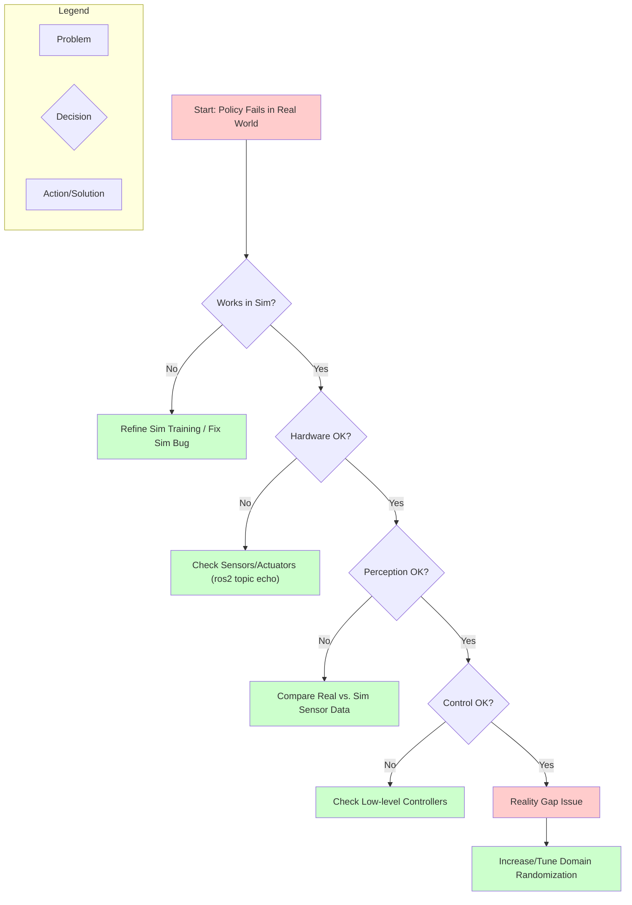

```mermaid
graph TD
    A[Start: Policy Fails in Real World] --> B{Works in Sim?};
    B -- No --> C[Refine Sim Training / Fix Sim Bug];
    B -- Yes --> D{Hardware OK?};
    D -- No --> E["Check Sensors/Actuators (ros2 topic echo)"];
    D -- Yes --> F{Perception OK?};
    F -- No --> G[Compare Real vs. Sim Sensor Data];
    F -- Yes --> H{Control OK?};
    H -- No --> I[Check Low-level Controllers];
    H -- Yes --> J[Reality Gap Issue];
    J --> K[Increase/Tune Domain Randomization];

    subgraph Legend
        direction LR
        L[Problem]
        M{Decision}
        N[Action/Solution]
    end

    style A fill:#ffcccc
    style C fill:#ccffcc
    style E fill:#ccffcc
    style G fill:#ccffcc
    style I fill:#ccffcc
    style K fill:#ccffcc
    style J fill:#ffcccc
```