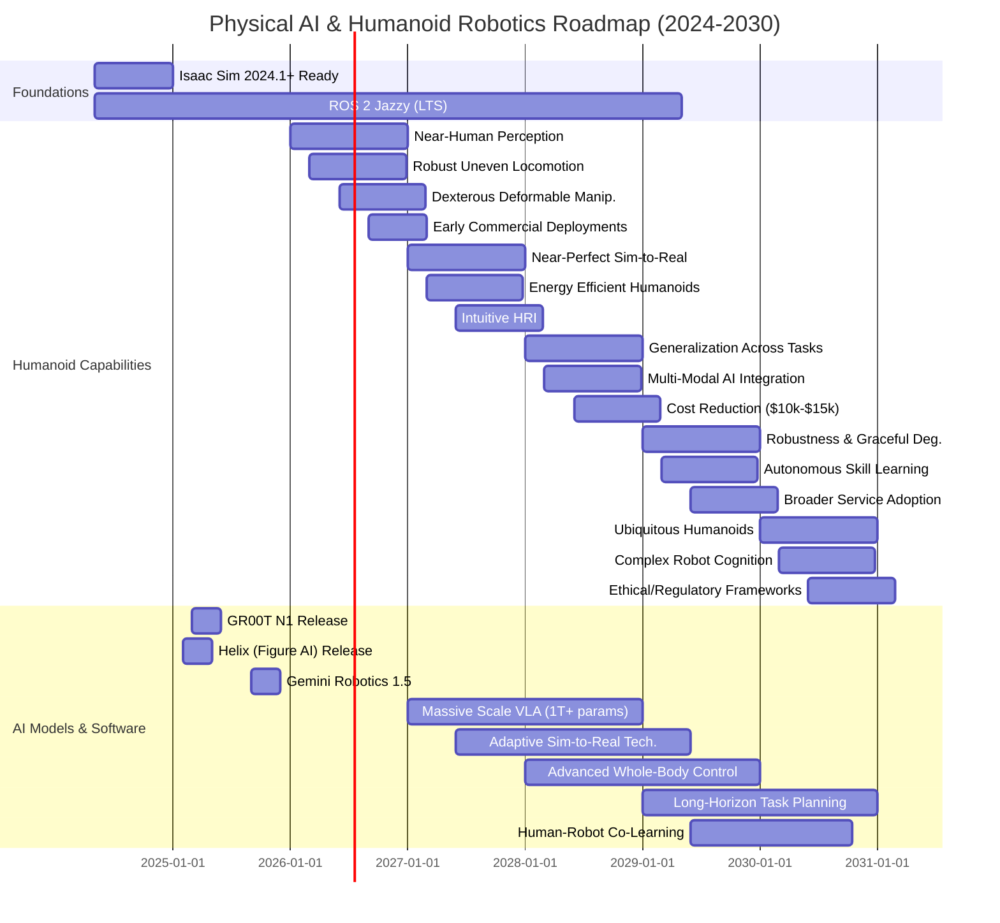

# Appendix C: Future Roadmap - The Horizon of Physical AI (2026-2030)

## Introduction

The field of Physical AI is evolving at an unprecedented pace. While this book equips you with state-of-the-art knowledge up to late 2025, it's essential to look ahead. This appendix provides a glimpse into the near future, outlining the projected roadmap for humanoid robotics, identifying key emerging research directions, and forecasting the evolution of the platform ecosystem from 2026 to 2030.

Staying current in this dynamic field requires continuous learning and adaptation. This roadmap will help you anticipate future trends, understand where research and development are headed, and make informed decisions about your ongoing involvement in Physical AI.

## 2026-2030 Humanoid Robotics Roadmap (T158)

The next five years will witness a dramatic acceleration in humanoid capabilities, driven by advances in AI, hardware, and manufacturing.

### Key Milestones & Projections:

*   **2026**:
    *   **Perception**: Humanoid robots achieve near-human-level object recognition and pose estimation in dynamic, unstructured environments.
    *   **Locomotion**: Robust bipedal locomotion over highly uneven and deformable terrains (e.g., stairs, gravel, dense foam).
    *   **Manipulation**: Dexterous manipulation of deformable and fragile objects (e.g., folding laundry, preparing food).
    *   **Early Commercial Deployments**: Humanoids begin initial deployments in highly structured logistics and industrial settings.
*   **2027**:
    *   **Sim-to-Real**: Near-perfect sim-to-real transfer for most manipulation and locomotion tasks, enabling rapid policy iteration.
    *   **Energy Efficiency**: Significant improvements in humanoid battery life and power management, enabling longer operational shifts.
    *   **Human-Robot Interaction (HRI)**: Intuitive natural language interaction, basic social cues, and collaborative task execution with humans.
*   **2028**:
    *   **Generalization**: Policies trained on one task generalize across a wider range of similar tasks and objects with minimal fine-tuning.
    *   **Multi-Modal AI**: Seamless integration of advanced VLA models with haptic feedback, proprioception, and auditory inputs.
    *   **Cost Reduction**: Entry-level research humanoids become more affordable (~$10,000-$15,000 range).
*   **2029**:
    *   **Robustness**: Humanoids demonstrate resilience to unexpected external disturbances and graceful degradation in failure scenarios.
    *   **Autonomous Learning**: Robots learn new skills and adapt to novel environments through self-supervision and fewer human demonstrations.
    *   **Broader Commercial Adoption**: Humanoids enter service roles in hospitality, retail, and healthcare.
*   **2030**:
    *   **Ubiquitous Humanoids**: Humanoid robots become a common sight in various professional and public settings.
    *   **Complex Cognition**: Advanced reasoning capabilities, long-term memory, and proactive problem-solving.
    *   **Ethical Frameworks**: Standardized ethical guidelines and regulatory frameworks for humanoid deployment widely adopted.

## Platform Ecosystem Evolution (T159)

The landscape of humanoid robot platforms is rapidly diversifying. Here's a comparison of key players and their projected evolution:

| Platform           | Key Strengths (2025)                                 | Projected Evolution (2026-2030)                              | Core Research Focus                           |
| :----------------- | :--------------------------------------------------- | :----------------------------------------------------------- | :-------------------------------------------- |
| **Unitree G1**     | Agile, open SDK, cost-effective research platform    | More compact, higher DoF, enhanced power efficiency. Wider adoption in academic research. | Dynamic balance, dexterous manipulation, HRI. |
| **Boston Dynamics Atlas** | Unparalleled dynamic locomotion, research-focused | Transition to more practical applications (e.g., disaster response). | Extreme mobility, robust autonomy.            |
| **Figure 01**      | Early commercial deployment, robust manipulation     | Scalable manufacturing, cost reduction, broader task domains. | Human-centric tasks, logistics, service.     |
| **Tesla Optimus**  | Mass production focus, integrated with Tesla AI      | Cost-effective humanoids for manufacturing, potentially domestic use. | General-purpose AI, low-cost production.      |
| **Sanctuary Phoenix** | General-purpose humanoid, advanced AI for cognition | Enhanced cognitive capabilities, adaptive learning, and safety. | AGI integration, complex decision-making.     |

**Key Trends in Platforms**:
*   **Modularity**: Increasing modularity of hardware and software components.
*   **Openness**: More open-source SDKs and research platforms.
*   **Cost Reduction**: Significant decrease in hardware costs due to economies of scale.
*   **Onboard Intelligence**: More powerful edge AI compute for real-time decision-making.

## Emerging Research Directions (T160)

The next wave of breakthroughs in Physical AI will likely come from these rapidly evolving research areas:

1.  **Massive Scale VLA Models**:
    *   **Focus**: Training VLA models with petabytes of diverse real-world and synthetic robot interaction data.
    *   **Impact**: Unprecedented generalization across tasks, robots, and environments, leading to truly general-purpose robotic intelligence.
2.  **Adaptive Sim-to-Real Transfer**:
    *   **Focus**: Moving beyond pure domain randomization to intelligent domain adaptation, where the robot learns to fine-tune its policies in the real world with minimal data.
    *   **Impact**: Faster deployment cycles, less reliance on perfect simulations, and more robust real-world performance.
3.  **Whole-Body Control & Compliance**:
    *   **Focus**: Developing control policies that leverage the full kinematics and dynamics of the humanoid body for agile, compliant, and safe interaction with its environment.
    *   **Impact**: Humanoids capable of pushing, pulling, lifting heavy objects, and safely interacting with humans.
4.  **Long-Horizon Task Planning & Reasoning**:
    *   **Focus**: Enabling humanoids to break down complex, multi-step tasks (e.g., "prepare breakfast") into executable sub-goals, with robust error recovery.
    *   **Impact**: Robots moving beyond simple reactive behaviors to true autonomous agents.
5.  **Human-Robot Co-Learning**:
    *   **Focus**: Robots learning new skills directly from human demonstrations, feedback, and collaboration, and humans adapting to robot capabilities.
    *   **Impact**: More intuitive and efficient human-robot teams in various settings.
6.  **Energy-Aware Robotics**:
    *   **Focus**: Optimizing robot movements and computation to maximize operational time on limited battery power.
    *   **Impact**: Extended autonomy and practical deployment in real-world scenarios without constant recharging.

## Technology Timeline Visualization (T161)

## Conclusion

The future of Physical AI is bright and transformative. By understanding the roadmap, focusing on emerging research, and staying updated with platform advancements, you will be well-positioned to contribute to this exciting field. The journey from current state-of-the-art to ubiquitous, intelligent humanoids is challenging but filled with immense potential.

### Quarterly Update Strategy (T163)

To ensure this Appendix remains a valuable and current resource, a quarterly update strategy will be implemented. This involves:

1.  **Monitoring**: Regularly tracking new research papers, platform announcements, and model releases from key players (e.g., Unitree, NVIDIA, Google DeepMind, Figure AI).
2.  **GitHub "updates" Page**: A dedicated "updates" page will be maintained on the book's GitHub repository. This page will document significant changes in the Physical AI landscape, including:
    *   New VLA model releases and benchmarks.
    *   Updates to robot hardware platforms.
    *   Major breakthroughs in research directions.
    *   Adjustments to roadmap projections.
3.  **Content Review**: Every three months, the content of this Appendix will be reviewed and updated to reflect the latest developments.

Readers are encouraged to check the GitHub "updates" page for the most recent information and contribute with suggestions for new content or corrections.
