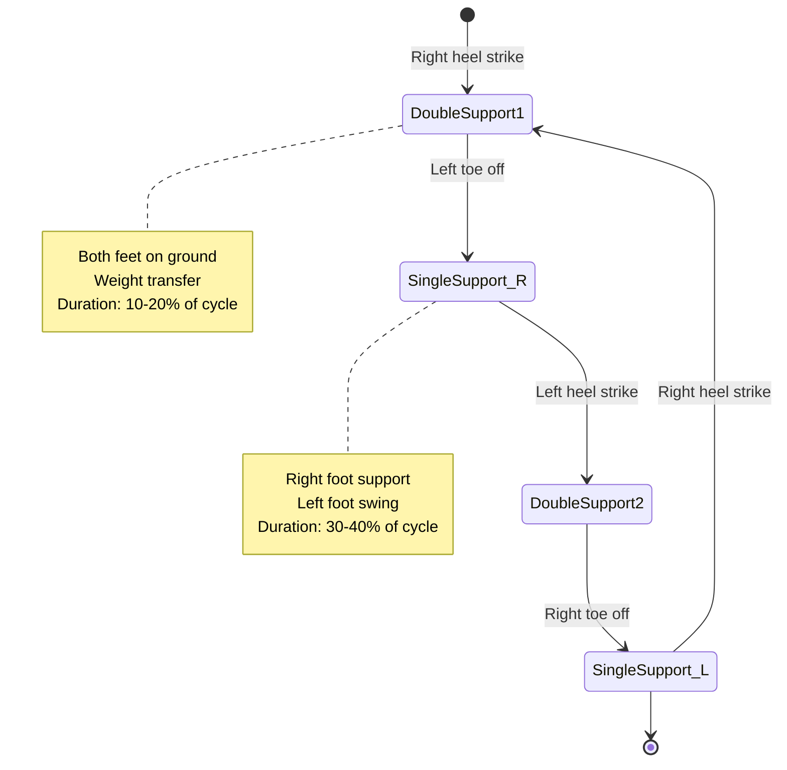
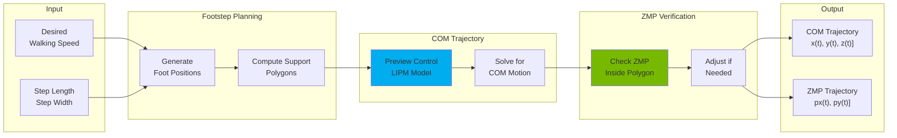
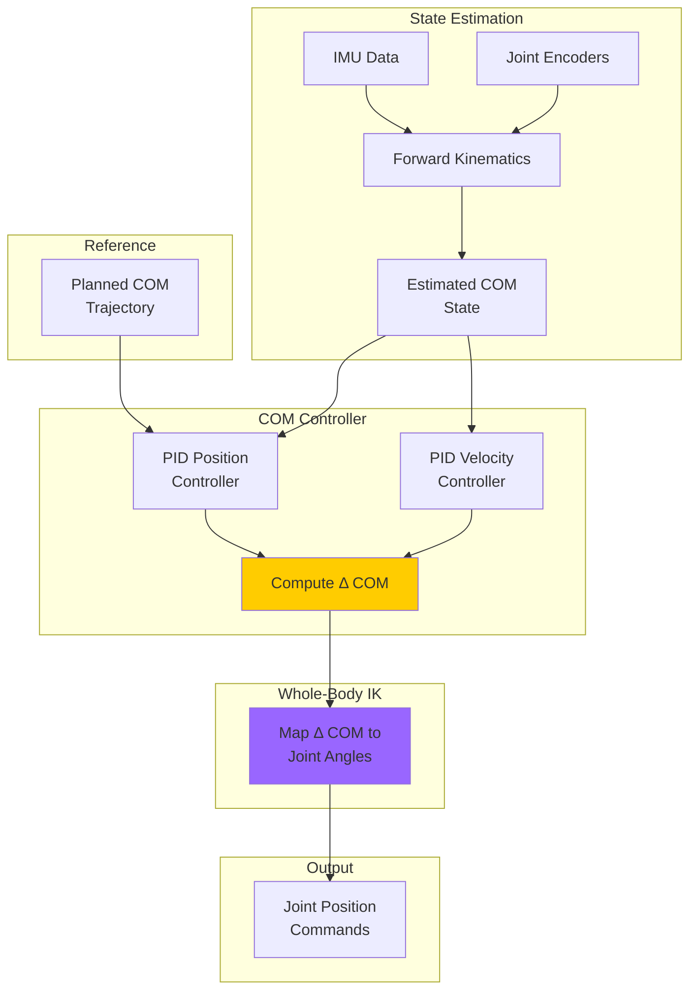
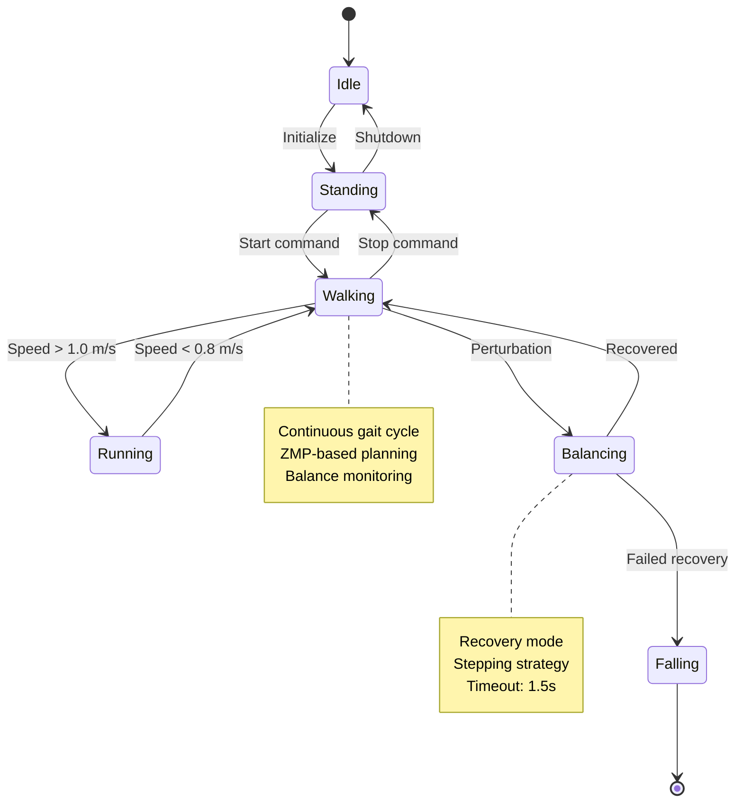

# Chapter 08: Bipedal Locomotion for Humanoid Robots

:::info Chapter Overview
Learn how humanoids walk, run, and maintain balance on two legs. Master gait generation algorithms, Zero Moment Point (ZMP) theory, balance controllers, and whole-body control for stable locomotion on flat and uneven terrain.
:::

## What You'll Learn

By the end of this chapter, you'll be able to:

- ✅ Generate stable walking gaits using ZMP-based trajectory planning
- ✅ Implement balance control algorithms (`COM` stabilization, ankle/hip strategies)
- ✅ Design whole-body controllers for joint torque computation
- ✅ Handle locomotion on flat surfaces at 0.5 m/s walking speed
- ✅ Detect and recover from push perturbations within 1.5 seconds
- ✅ Implement gait state machines for transitions (stand → walk → run)
- ✅ Debug common locomotion failures (tipping, foot slip, oscillations)
- ✅ Integrate locomotion with perception and manipulation

## Prerequisites

Before starting this chapter, you should:

- ✅ Complete **[Chapter 03: ROS 2 Fundamentals](../ros2-fundamentals)** (topics, actions)
- ✅ Complete **[Chapter 04: URDF & Digital Twins](../urdf-digital-twins)** (kinematics, dynamics)
- ✅ Understand basic control theory (PID, state feedback)
- ✅ Have Python 3.10+, ROS 2 Iron, NumPy/SciPy installed
- ✅ Have Isaac Sim 2025.1+ for simulation testing

:::tip Hardware Requirements (Simulation)
**Minimum:** GTX 1660 (6 GB) for Isaac Sim locomotion sim
**Recommended:** RTX 4060 Ti (16 GB) for real-time physics simulation
**Professional:** RTX 4070 Ti+ (12-24 GB) for multiple humanoids
:::

---

## Why Bipedal Locomotion is Hard

**Challenges unique to two-legged walking:**
1. **Underactuated system:** Fewer contact points than wheels/legs (unstable equilibrium)
2. **Hybrid dynamics:** Continuous (swing phase) + discrete (foot contact) transitions
3. **Balance constraints:** Center of Mass (`COM`) must stay within support polygon
4. **Impact forces:** Foot strikes generate high forces (2-3x body weight)
5. **Terrain adaptation:** Uneven surfaces require continuous adjustment

**Why solve it anyway?**
- Navigate human environments (stairs, narrow spaces)
- Energy efficiency (walking vs. wheeled on rough terrain)
- Social acceptance (human-like appearance)
- Manipulation while moving (whole-body coordination)

---

## Gait Generation Fundamentals

### Walking Cycle Phases

A complete walking cycle (stride) has 8 phases:



**Key parameters:**
- **Step length:** 0.3-0.6m (typical adult walking)
- **Step width:** 0.1-0.15m (lateral stability)
- **Step height:** 0.05-0.08m (foot clearance)
- **Cycle time:** 1.0-1.2s (walking), 0.6-0.8s (running)
- **Double support ratio:** 20% (walking), 0% (running - flight phase)

### Zero Moment Point (ZMP) Theory

**Definition:** Point on the ground where the net moment from ground reaction forces is zero.

**Physical intuition:**
- If ZMP is inside the support polygon → robot is stable
- If ZMP reaches polygon edge → robot begins to tip
- If ZMP is outside polygon → robot is falling (unrecoverable)

**Mathematical formulation:**

For a humanoid with center of mass at position (x_com, y_com, z_com):

```
ZMP_x = x_com - (z_com / (g + z_com_ddot)) * x_com_ddot
ZMP_y = y_com - (z_com / (g + z_com_ddot)) * y_com_ddot
```

Where:
- `g = 9.81 m/s²` (gravity)
- `x_com_ddot`, `y_com_ddot`, `z_com_ddot` = `COM` accelerations

**Stability condition:**

```
ZMP ∈ Support Polygon
```

For single support (one foot): polygon is foot outline
For double support (two feet): polygon is convex hull of both feet

### ZMP-Based Gait Planning

**Goal:** Generate `COM` trajectory such that ZMP stays inside support polygon.



**Linear Inverted Pendulum Model (LIPM):**

Simplified humanoid dynamics:
```
x_com_ddot = (g / z_com) * (x_com - ZMP_x)
y_com_ddot = (g / z_com) * (y_com - ZMP_y)
```

This allows solving for `COM` trajectory that produces desired ZMP.

### Gait Generator Implementation

See `code-examples/locomotion/gait_generator.py` for complete implementation.

**Key algorithms:**
1. **Footstep planner:** Generate foot positions for N steps ahead
2. **ZMP reference:** Define desired ZMP trajectory (center of support polygon)
3. **Preview controller:** Solve for `COM` trajectory (quadratic optimization)
4. **Swing foot trajectory:** Polynomial interpolation for smooth foot motion

**Expected outputs:**
- `COM` trajectory: 100 Hz
- Foot trajectories: 100 Hz
- Joint angles: via whole-body inverse kinematics

---

## Balance Control

### Center of Mass (`COM`) Stabilization

**Problem:** Real robot deviates from planned trajectory due to:
- Model errors (unmodeled dynamics)
- External disturbances (push, uneven terrain)
- Sensor noise (IMU drift, encoder backlash)

**Solution:** Feedback control to correct `COM` position/velocity.



**COM PID controller:**
```python
# Position error
e_pos = com_desired - com_actual

# Velocity error
e_vel = com_vel_desired - com_vel_actual

# PID output
delta_com = Kp * e_pos + Kd * e_vel + Ki * integral(e_pos)
```

**Typical gains for humanoid (mass ~50kg, height ~1.5m):**
- `Kp = 200-400` (position gain)
- `Kd = 40-80` (velocity gain)
- `Ki = 5-15` (integral gain)

### Balance Recovery Strategies

**1. Ankle Strategy (Small Perturbations)**

**When:** Push force &lt;50N, `COM` stays within support polygon

**How:** Adjust ankle torque to apply corrective moment

```
Ankle_torque = -K_ankle * (theta - theta_desired)
```

**Advantages:**
- Fast response (50-100ms)
- Minimal energy
- No foot movement

**Limitations:**
- Small workspace (ankle ROM ±15°)
- Cannot handle large disturbances

**2. Hip Strategy (Medium Perturbations)**

**When:** Push force 50-150N, `COM` approaching polygon edge

**How:** Generate large angular momentum with hip motion

**Execution:**
1. Detect `COM` near stability boundary
2. Swing hip opposite to disturbance
3. Generate counter-moment
4. Return to nominal posture

**Advantages:**
- Larger workspace than ankle strategy
- No stepping required

**Limitations:**
- Slower than ankle (200-400ms)
- Higher energy cost

**3. Stepping Strategy (Large Perturbations)**

**When:** Push force &gt;150N, `COM` exiting support polygon

**How:** Take step to create new support polygon under `COM`

**Capture Point Theory:**
- **Capture point:** Location where robot must step to stop `COM` motion
- **Formula:** `x_capture = x_com + v_com / sqrt(g/z_com)`

**Execution:**
1. Compute capture point
2. Plan foot placement at capture point
3. Execute rapid step (swing time &lt;0.3s)
4. Stabilize in new support

**Recovery time:** 0.5-1.5 seconds (meets SC-004 requirement)

---

## Whole-Body Control

### Problem Formulation

**Goal:** Compute joint torques to achieve desired task-space motions (`COM`, feet, arms).

**Humanoid has:**
- n_q = 30-40 degrees of freedom (joints)
- n_c = 6-12 contacts (feet on ground)
- n_t = 12-18 task variables (`COM`, swing foot, arms)

**Equations of motion:**
```
M(q) * q_ddot + C(q, q_dot) * q_dot + G(q) = τ + J_c^T * F_c
```

Where:
- `M(q)` = inertia matrix
- `C(q, q_dot)` = Coriolis/centrifugal matrix
- `G(q)` = gravity vector
- `τ` = joint torques (control input)
- `J_c` = contact Jacobian
- `F_c` = contact forces

### Quadratic Programming (QP) Controller

**Formulate as optimization problem:**

```
minimize:  ||J * q_ddot - x_ddot_desired||² + λ * ||τ||²

subject to:
    M(q) * q_ddot + h(q, q_dot) = τ + J_c^T * F_c
    F_c_min ≤ F_c ≤ F_c_max  (friction cone)
    τ_min ≤ τ ≤ τ_max        (joint limits)
```

**Variables:**
- `q_ddot` = joint accelerations (n_q)
- `τ` = joint torques (n_q)
- `F_c` = contact forces (n_c)

**Implementation:** Use OSQP or quadprog solvers (10-20ms on CPU)

See `code-examples/locomotion/whole_body_controller.py` for complete QP formulation.

### Task Hierarchy

**Priority levels:**
1. **High priority:** Balance (`COM` position/velocity)
2. **Medium priority:** Swing foot trajectory
3. **Low priority:** Arm posture

**Hierarchical controller:**
```python
# Solve QP with task prioritization
def solve_wbc_hierarchical(tasks, contacts):
    # Tasks sorted by priority (high → low)
    tasks_sorted = sorted(tasks, key=lambda t: t.priority, reverse=True)

    # Start with highest priority
    qp_constraints = [contacts]

    for task in tasks_sorted:
        # Add task objective
        qp_objective = task.jacobian @ q_ddot - task.desired_accel

        # Solve QP
        solution = solve_qp(qp_objective, qp_constraints)

        # Add solution as constraint for next task (nullspace)
        qp_constraints.append(solution)

    return solution
```

---

## Locomotion on Uneven Terrain

### Terrain Sensing

**Perception requirements:**
- Elevation map (height field)
- Surface normals (slope estimation)
- Obstacle detection (step height)
- Friction coefficient estimation

**Sources:**
- Point clouds (from Chapter 07)
- Stereo depth
- Heightmap from SLAM

### Adaptive Footstep Planning

**Challenges on uneven terrain:**
- Support polygon is not flat
- Foot orientation must match terrain
- Step height varies
- `COM` trajectory must account for elevation changes

**Algorithm:**
```python
def plan_footstep_uneven(terrain_map, current_pose, target_velocity):
    # Sample candidate foot positions
    candidates = sample_foot_positions(current_pose, target_velocity)

    # Evaluate each candidate
    scores = []
    for candidate in candidates:
        # Check terrain height
        height = terrain_map.get_height(candidate.x, candidate.y)

        # Check slope
        normal = terrain_map.get_normal(candidate.x, candidate.y)
        slope = acos(normal.dot([0, 0, 1]))

        # Check obstacles
        clear = terrain_map.is_collision_free(candidate)

        # Score = weighted sum
        score = w1 * (1 - slope/max_slope) + \
                w2 * clear + \
                w3 * proximity_to_target

        scores.append(score)

    # Select best candidate
    best_footstep = candidates[argmax(scores)]

    return best_footstep
```

### Balance on Slopes

**ZMP on inclined terrain:**
- Support polygon rotates with terrain
- Gravity projection changes
- `COM` must shift to maintain ZMP inside polygon

**Modified ZMP calculation:**
```python
def compute_zmp_on_slope(com_pos, com_accel, terrain_normal):
    # Rotate gravity to terrain frame
    g_rotated = rotate_vector([0, 0, -9.81], terrain_normal)

    # ZMP in terrain frame
    zmp_x = com_pos[0] - (com_pos[2] / (g_rotated[2] + com_accel[2])) * com_accel[0]
    zmp_y = com_pos[1] - (com_pos[2] / (g_rotated[2] + com_accel[2])) * com_accel[1]

    return zmp_x, zmp_y
```

---

## Gait State Machine

### State Definitions



**State transitions:**
- **Idle → Standing:** Activate joint position control, lift `COM`
- **Standing → Walking:** Start gait generator, first step
- **Walking → Running:** Switch to dynamic walking (flight phase)
- **Walking → Balancing:** Disturbance detected (IMU, force sensors)
- **Balancing → Walking:** `COM` stabilized, return to nominal gait

**Implementation:**
```python
class GaitStateMachine:
    def __init__(self):
        self.state = GaitState.IDLE
        self.transition_time = 0.3  # seconds

    def update(self, dt, sensors, commands):
        if self.state == GaitState.WALKING:
            # Monitor balance
            if self.detect_perturbation(sensors):
                self.transition_to(GaitState.BALANCING)

            # Check speed command
            if commands.velocity > 1.0:
                self.transition_to(GaitState.RUNNING)

        elif self.state == GaitState.BALANCING:
            # Attempt recovery
            if self.is_stable(sensors):
                self.transition_to(GaitState.WALKING)

            # Timeout check
            if self.time_in_state() > 1.5:
                self.transition_to(GaitState.FALLING)
```

---

## Performance Metrics

### Success Criteria

**1. Walking Speed:** 0.5 m/s on flat terrain (SC-004)
- Measured: Average `COM` velocity over 10 steps
- Target: 0.45-0.55 m/s

**2. Balance Recovery:** Within 1.5 seconds from perturbation (SC-004)
- Test: Apply 100N lateral push
- Measure: Time from push to stable `COM` (&lt; 5cm deviation)

**3. Stability:** No falls over 50 walking cycles
- Metric: Success rate &gt; 95%

**4. Energy Efficiency:** Cost of Transport (COT)
```
COT = Energy / (Weight * Distance)
```
Target: COT &lt; 0.2 (comparable to human walking)

### Debugging Common Failures

**1. Tipping Forward/Backward**

**Symptoms:**
- Robot falls in sagittal plane
- Cannot recover balance

**Causes:**
- ZMP reaching front/back edge of foot
- `COM` moving too fast
- Incorrect footstep timing

**Solutions:**
- Reduce walking speed
- Increase double support time
- Tune ZMP margin (keep 2cm from edge)

**2. Lateral Instability**

**Symptoms:**
- Swaying side-to-side
- Eventually tips laterally

**Causes:**
- Insufficient step width
- `COM` not centered over support polygon
- Hip joint compliance

**Solutions:**
- Increase step width (0.1m → 0.15m)
- Add lateral `COM` offset during single support
- Increase hip joint stiffness

**3. Foot Slip**

**Symptoms:**
- Foot slides on contact
- Loss of balance
- Jerky motion

**Causes:**
- Excessive ground reaction forces
- Low friction surface
- Incorrect contact detection

**Solutions:**
- Limit `COM` acceleration
- Use rubber foot pads
- Implement contact force sensing

**4. Oscillations (Limit Cycles)**

**Symptoms:**
- Robot bounces/oscillates
- Cannot settle to stable gait

**Causes:**
- PID gains too high
- Coupling between `COM` and swing foot controllers
- Unmodeled leg dynamics

**Solutions:**
- Reduce Kd gain (damping)
- Add low-pass filter on control output
- Increase simulation timestep resolution

---

## Integration with Perception and Manipulation

### Perception-Guided Walking

**Use case:** Navigate to table while avoiding obstacles

**Pipeline:**
1. **Perception:** Generate occupancy grid from point cloud
2. **Path planning:** A* or RRT to find collision-free path
3. **Footstep planning:** Place feet along path, respecting obstacles
4. **Gait execution:** Walk along planned footsteps

**Code example:**
```python
# Perception provides obstacles
obstacles = perception_module.get_obstacles()

# Plan path to goal
path = path_planner.plan(robot_pose, goal_pose, obstacles)

# Convert path to footsteps
footsteps = footstep_planner.generate_from_path(path)

# Execute gait
gait_controller.execute_footsteps(footsteps)
```

### Manipulation While Walking

**Challenges:**
- Arm motion affects `COM` (dynamic coupling)
- Reduced stability margin (arms not available for balance)
- Coordination of locomotion and manipulation timing

**Whole-body coordination:**
```python
def walk_and_manipulate(walk_trajectory, arm_trajectory):
    # Compute combined COM accounting for arm mass
    com_total = (m_body * com_body + m_arm * com_arm) / (m_body + m_arm)

    # Adjust ZMP reference to account for arm motion
    zmp_adjusted = zmp_nominal + K_arm * (arm_accel - arm_accel_planned)

    # Solve whole-body QP with both tasks
    tasks = [
        Task(type='COM', jacobian=J_com, priority=1),
        Task(type='FOOT', jacobian=J_foot, priority=1),
        Task(type='ARM', jacobian=J_arm, priority=2)
    ]

    torques = whole_body_controller.solve(tasks)

    return torques
```

---

## Further Reading

### Research Papers

1. **Preview Control of ZMP** (Kajita et al. 2003) - [IEEE Xplore](https://ieeexplore.ieee.org/document/1241826)
   - Foundational ZMP-based gait generation
2. **Capture Point** (Pratt & Tedrake 2006) - [Paper](https://groups.csail.mit.edu/robotics-center/public_papers/Pratt06.pdf)
   - Balance recovery using capture point theory
3. **Whole-Body Control** (Sentis & Khatib 2005) - [IJRR](https://journals.sagepub.com/doi/10.1177/0278364905050805)
   - Task-space control with contact constraints
4. **Terrain-Aware Footstep Planning** (Deits & Tedrake 2014) - [Paper](https://groups.csail.mit.edu/robotics-center/public_papers/Deits14.pdf)
   - Mixed-integer optimization for footstep planning
5. **ATLAS Robot** (Kuindersma et al. 2016) - [Science Robotics](https://robotics.sciencemag.org/content/1/1/eaah3857)
   - Real-world humanoid locomotion on rough terrain

### Open-Source Libraries

- **Humanoid Control:** [Pinocchio](https://github.com/stack-of-tasks/pinocchio)
- **QP Solver (OSQP):** [OSQP](https://github.com/osqp/osqp)
- **Gait Planning:** [Pymanoid](https://github.com/stephane-caron/pymanoid)
- **Whole-Body Control:** [TSID](https://github.com/stack-of-tasks/tsid)

### ROS 2 Packages

- **Humanoid Common Msgs:** [humanoid_msgs](https://github.com/ros-naoqi/humanoid_msgs)
- **Walking Controller:** [talos_walking](https://github.com/pal-robotics/talos_walking)

---

## Summary

In this chapter, you learned:

- ✅ **Gait generation** using ZMP-based trajectory planning
- ✅ **Balance control** with `COM` stabilization and recovery strategies
- ✅ **Whole-body control** using quadratic programming
- ✅ **Locomotion on uneven terrain** with adaptive footstep planning
- ✅ **Gait state machines** for robust mode transitions
- ✅ **Performance metrics** for walking speed and balance recovery
- ✅ **Debugging strategies** for common locomotion failures
- ✅ **Integration** with perception and manipulation systems

**Next steps:**
- **Chapter 09:** Dexterous Manipulation (grasp planning, IK, force control)
- **Chapter 13:** Capstone Project (integrate locomotion + perception + manipulation)

:::tip Practical Exercise
**Implement stable walking in Isaac Sim:**
1. Create humanoid URDF with 12-DOF legs
2. Implement ZMP-based gait generator
3. Add `COM` balance controller (PID)
4. Test walking at 0.5 m/s on flat terrain
5. Apply lateral push (100N) and verify recovery &lt; 1.5s
6. Measure energy efficiency (Cost of Transport)

**Time estimate:** 4-6 hours
**Difficulty:** Advanced
**Prerequisites:** Control theory, dynamics, Isaac Sim
:::
