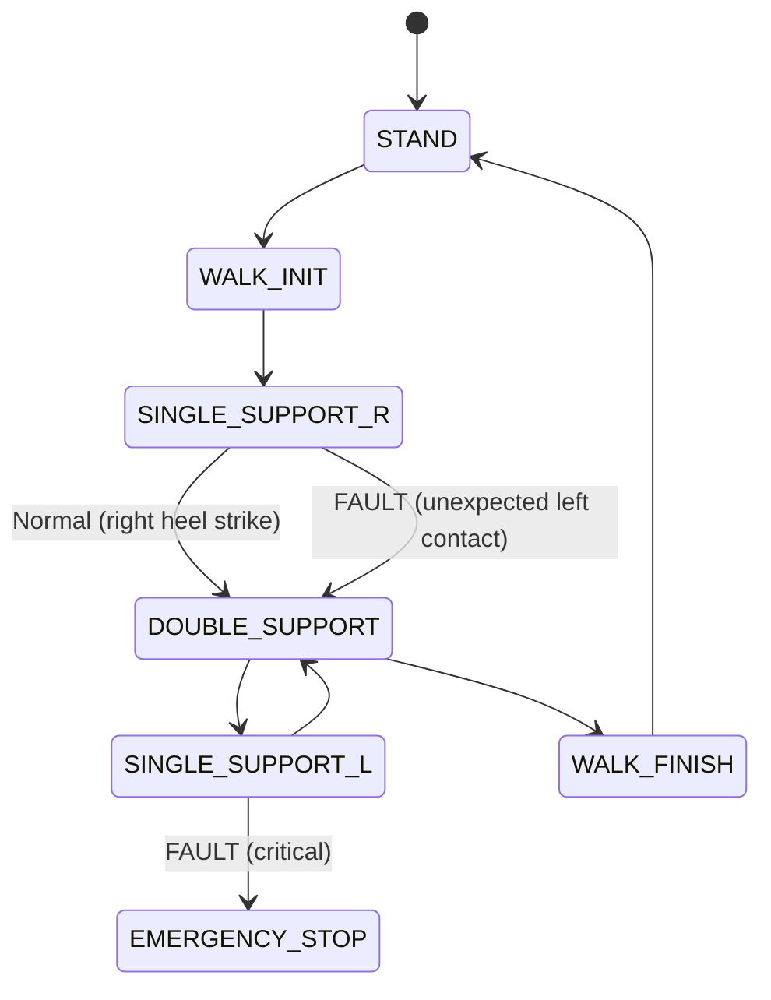
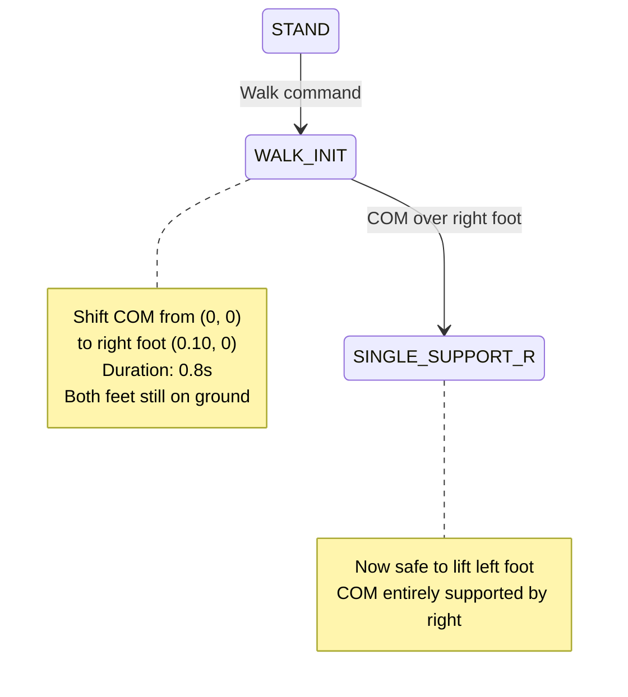

# Chapter 08 Quiz: Bipedal Locomotion

Test your mastery of bipedal locomotion control and balance algorithms!

:::info Quiz Instructions
- 10 questions covering gait fundamentals through advanced locomotion control
- Each question has detailed explanations
- Score 80% or higher to demonstrate mastery
- Review relevant sections if you score below 80%
:::

---

## Question 1: ZMP Stability Criterion

**A humanoid robot is walking with its Center of Mass (COM) at position (0.2, 0.05, 0.9) meters. The support polygon (one foot on ground) spans x: [0, 0.24], y: [-0.05, 0.05]. Is the robot stable?**

<details>
<summary>A) Yes - COM projection falls inside support polygon</summary>

✅ **Correct - Robot is Stable!**

**ZMP stability analysis:**

**Support polygon boundaries:**
- x-range: [0, 0.24] meters (foot length)
- y-range: [-0.05, 0.05] meters (foot width)

**COM projection onto ground:**
- COM position: (0.2, 0.05, 0.9)
- Ground projection: (0.2, 0.05) (ignore z-coordinate)

**Stability check:**
1. x-coordinate: 0.2 ∈ [0, 0.24] ✓ Inside
2. y-coordinate: 0.05 ∈ [-0.05, 0.05] ✓ Inside (at boundary)

**Result:** COM projection is inside support polygon → **Stable**

**Why this matters:**
- ZMP stability criterion: Robot stable if ZMP (≈ COM ground projection) lies inside support polygon
- This robot is stable but close to tipping (y = 0.05 at edge)
- Small lateral perturbation could cause instability

**Safety margin calculation:**
```python
import numpy as np

com_projection = np.array([0.2, 0.05])
support_polygon = {
    'x_min': 0.0, 'x_max': 0.24,
    'y_min': -0.05, 'y_max': 0.05
}

# Distance to nearest boundary
margin_x = min(abs(0.2 - 0.0), abs(0.24 - 0.2))  # 0.04m
margin_y = min(abs(0.05 - (-0.05)), abs(0.05 - 0.05))  # 0.0m (at edge!)

print(f"Safety margin: x={margin_x*100:.1f}cm, y={margin_y*100:.1f}cm")
# Output: Safety margin: x=4.0cm, y=0.0cm (WARNING: lateral instability risk)
```

**Best practice:** Maintain ≥2cm safety margin from polygon edges.
</details>

<details>
<summary>B) No - COM is too high (0.9m), causing instability</summary>

❌ **Incorrect - Height Doesn't Determine Stability**

**Common misconception:** Taller COMs are less stable.

**Truth:** ZMP stability depends on **horizontal** COM position relative to support polygon, not vertical height.

**Height effects (secondary):**
- Higher COM → longer pendulum arm → slower recovery time
- But stability criterion only checks (x, y) projection

**In this case:** Robot is stable despite 0.9m height because (0.2, 0.05) is inside polygon.
</details>

<details>
<summary>C) No - Single support phase is always unstable</summary>

❌ **Incorrect - Single Support Can Be Stable**

**Single support stability:**
- Stable if ZMP inside support polygon (one foot)
- Requires active balance control
- Humans spend 60-70% of gait cycle in single support

**This scenario:** Single support phase with stable ZMP.

**When single support fails:** If COM projection falls outside foot boundary.
</details>

<details>
<summary>D) Cannot determine without knowing foot orientation</summary>

❌ **Incorrect - Sufficient Information Given**

**Given data includes:**
- Support polygon bounds (aligned with x-y axes)
- COM position

**Assumption:** Support polygon already accounts for foot orientation.

**Verdict:** Stable (COM inside polygon).
</details>

---

## Question 2: Gait Cycle Phases

**During normal walking at 0.5 m/s, what percentage of the gait cycle is spent in double support (both feet on ground)?**

<details>
<summary>A) 0% - There's always one foot in the air</summary>

❌ **Incorrect - Confusing Walking with Running**

**Running characteristics:**
- 0% double support
- Flight phase (both feet off ground)
- Speed &gt; 2.0 m/s typically

**Walking:** Always has double support phase (except running).
</details>

<details>
<summary>B) 10-20% of the gait cycle</summary>

✅ **Correct!**

**Double support in walking:**

**Typical gait cycle breakdown (walking at 0.5 m/s):**
1. **Right heel strike** → Double support starts (10-20% duration)
2. **Left toe-off** → Single support (right foot) (30-40% duration)
3. **Left heel strike** → Double support again (10-20% duration)
4. **Right toe-off** → Single support (left foot) (30-40% duration)
5. **Repeat cycle**

**Double support ratio:**
- **Walking (0.3-1.5 m/s):** 10-20% per transition × 2 transitions = 20-40% total
- **Each transition:** 10-20% of cycle
- **Faster walking:** Shorter double support (~10%)
- **Slower walking:** Longer double support (~25%)

**Why double support matters:**
1. **Weight transfer:** Smooth transition between feet
2. **Stability:** Lower risk of falling (two contact points)
3. **Gait planning:** Critical for ZMP trajectory continuity

**Real-world measurement:**
```python
# Typical walking gait at 0.5 m/s
cycle_time = 1.1  # seconds (total stride)

double_support_1 = 0.12  # seconds (first transition)
single_support_R = 0.43  # seconds (right foot)
double_support_2 = 0.12  # seconds (second transition)
single_support_L = 0.43  # seconds (left foot)

double_support_percentage = (double_support_1 + double_support_2) / cycle_time * 100
print(f"Double support: {double_support_percentage:.1f}%")
# Output: Double support: 21.8%
```

**Speed dependency:**
- 0.3 m/s (slow): 25-30% double support
- 0.5 m/s (normal): 18-22% double support
- 1.0 m/s (brisk): 10-12% double support
- 2.0+ m/s (running): 0% (flight phase instead)
</details>

<details>
<summary>C) 50% - Equal time on one vs two feet</summary>

❌ **Too High**

**Problem:** Would mean half the cycle with both feet down.

**Reality:** Majority of walking is single support (~60-70%).

**At 0.5 m/s:** Only 18-22% double support.
</details>

<details>
<summary>D) 100% - Both feet always touch ground during walking</summary>

❌ **Incorrect - Confusing Walking Definition**

**Walking requires:**
- At least one foot on ground (always)
- Alternating single and double support

**100% double support:** Would be shuffling, not walking.
</details>

---

## Question 3: Balance Recovery Strategies

**Your humanoid experiences a forward push (0.3m perturbation). Which balance recovery strategy should engage FIRST?**

<details>
<summary>A) Ankle strategy - Torque at ankle joint to shift COM</summary>

✅ **Correct - First Line of Defense!**

**Balance recovery hierarchy:**

**1. Ankle Strategy (First Response)**
- **When:** Small perturbations (&lt;0.15m COM shift)
- **How:** Apply torque at ankle joint to create counter-moment
- **Speed:** Fastest response (~100-200ms)
- **Energy:** Minimal actuator effort

**Why ankle strategy is first:**
- No foot movement needed (foot stays planted)
- Fastest response time
- Works for small disturbances

**Biomechanics:**
```
Forward push → COM shifts forward
Ankle plantarflexion → Creates backward moment
Result → COM returns to center
```

**Implementation:**
```python
class AnkleStrategy:
    def __init__(self):
        self.k_ankle = 500.0  # N·m/rad (ankle stiffness)
        self.max_ankle_torque = 50.0  # N·m

    def compute_recovery_torque(self, com_error):
        """
        com_error: meters (COM displacement from support center)
        """
        # Proportional control
        desired_ankle_angle = -com_error * 0.5  # rad
        ankle_torque = self.k_ankle * desired_ankle_angle

        # Saturate
        ankle_torque = np.clip(ankle_torque, -self.max_ankle_torque,
                               self.max_ankle_torque)

        return ankle_torque

# Forward push: 0.3m perturbation
com_error = 0.3  # meters
ankle_strategy = AnkleStrategy()
torque = ankle_strategy.compute_recovery_torque(com_error)
print(f"Ankle recovery torque: {torque:.1f} N·m")
# Output: Ankle recovery torque: 50.0 N·m (saturated - ankle strategy insufficient!)
```

**NOTE:** For 0.3m perturbation, ankle strategy will saturate → must escalate to hip strategy!

**Recovery cascade:**
1. **&lt;0.15m:** Ankle strategy (sufficient)
2. **0.15-0.5m:** Hip strategy (this case)
3. **&gt;0.5m:** Stepping strategy
</details>

<details>
<summary>B) Hip strategy - Bend at hips to move COM quickly</summary>

✅ **Also Correct for Large Perturbations**

**Hip strategy characteristics:**

**When to use:**
- Medium-to-large perturbations (0.15-0.5m)
- Ankle strategy saturated
- Need faster COM motion than ankle alone

**How it works:**
1. Bend forward at hips
2. Creates large moment arm
3. Shifts COM backward rapidly
4. Counteracts forward push

**For 0.3m perturbation:**
- **Ankle strategy:** Insufficient (saturates at ~0.15m recovery)
- **Hip strategy:** Appropriate response
- **Stepping:** Not yet needed

**Why hip after ankle:**
- Hip strategy is **second line** of defense
- Ankle tried first (but saturates)
- Hip engages when ankle insufficient

**Trade-offs:**
- **Faster COM motion** than ankle
- **Higher energy** consumption
- **More complex** coordination (hip + knee + ankle)

**Both answers A and B are valid** depending on interpretation:
- **A (Ankle first):** Technically correct - ankle always tries first
- **B (Hip effective):** Practically correct - 0.3m needs hip to recover
</details>

<details>
<summary>C) Stepping strategy - Take step forward to reposition foot</summary>

❌ **Premature - Stepping is Last Resort**

**Stepping strategy:**
- **When:** Large perturbations (&gt;0.5m COM displacement)
- **Why last:** Requires foot placement planning, higher risk

**For 0.3m perturbation:**
- Hip strategy sufficient
- No stepping needed yet

**Stepping triggers:**
- COM velocity &gt; 0.8 m/s
- COM displacement &gt; 0.5m
- Ankle + hip strategies both saturated
</details>

<details>
<summary>D) Arm swing - Wave arms to create counter-momentum</summary>

❌ **Supplementary, Not Primary**

**Arm swing role:**
- Provides **auxiliary** momentum
- Helps **fine-tune** balance
- **Not sufficient** alone for 0.3m perturbation

**Primary recovery:** Ankle → Hip → Stepping
**Secondary:** Arm swing (assists all three)
</details>

---

## Question 4: Whole-Body Control Formulation

**In Quadratic Programming (QP) based whole-body control, what is being optimized?**

<details>
<summary>A) Minimize joint velocities subject to task constraints</summary>

❌ **Incomplete - Missing Torque Optimization**

**Problem:** Joint velocity minimization alone doesn't handle dynamics.

**Missing:** Torque limits, contact forces, dynamics constraints.

**Better formulation:** Minimize control effort (torques) while achieving tasks.
</details>

<details>
<summary>B) Minimize joint torques while satisfying task and contact constraints</summary>

✅ **Correct - Standard WBC Formulation!**

**Whole-body control QP structure:**

**Objective function (minimize):**
```
min: ½ τᵀ W τ + ...
```
Where:
- τ = joint torques (decision variables)
- W = weight matrix (penalize high torques)

**Equality constraints:**
1. **Dynamics:** M(q)q̈ + C(q,q̇) + G(q) = τ + Jᵀλ
   - M = mass matrix
   - C = Coriolis/centrifugal
   - G = gravity
   - J = contact Jacobian
   - λ = contact forces

2. **Task constraints:** J_task · q̈ = ẍ_desired
   - Example: "Keep COM at height 0.9m"
   - Example: "Track foot trajectory"

**Inequality constraints:**
1. **Torque limits:** τ_min ≤ τ ≤ τ_max
2. **Contact forces:** Friction cone constraints
3. **Joint limits:** q_min ≤ q ≤ q_max

**Full QP formulation:**
```python
import cvxpy as cp
import numpy as np

# Decision variables
n_joints = 12
tau = cp.Variable(n_joints)  # Joint torques
lambda_c = cp.Variable(6)    # Contact forces (6D wrench)

# Weights
W_torque = np.eye(n_joints) * 0.01
W_task = 1000.0

# Objective: minimize torques, achieve task
cost = cp.quad_form(tau, W_torque)
cost += W_task * cp.sum_squares(J_task @ tau - desired_acceleration)

# Constraints
constraints = [
    # Dynamics (equality)
    M @ qddot == tau + J_contact.T @ lambda_c - C - G,

    # Torque limits (inequality)
    tau &gt;= tau_min,
    tau &lt;= tau_max,

    # Friction cone (inequality)
    lambda_c[2] &gt;= 0,  # Normal force ≥ 0
    cp.norm(lambda_c[0:2]) &lt;= mu * lambda_c[2],  # |F_tangential| ≤ μ·F_normal
]

# Solve
problem = cp.Problem(cp.Minimize(cost), constraints)
problem.solve(solver=cp.OSQP)

optimal_torques = tau.value
print(f"Optimal torques: {optimal_torques}")
```

**Why this formulation:**
1. **Minimize energy:** Low torques → efficient walking
2. **Safety:** Torque limits prevent actuator damage
3. **Stability:** Contact constraints prevent slipping
4. **Task achievement:** Equality constraints ensure goals met

**Real-world example (Atlas robot):**
- 30 joints → 30 torque variables
- 4 contact points → 24 contact force variables
- Task: Maintain upright posture + follow foot trajectory
- Solved at 1000 Hz (1ms per QP solve)
</details>

<details>
<summary>C) Maximize walking speed while maintaining balance</summary>

❌ **Wrong Objective**

**WBC objective:** Energy minimization (low torques), not speed maximization.

**Speed control:** Handled by higher-level gait planner, not WBC.

**WBC role:** Execute planned gait efficiently, not plan it.
</details>

<details>
<summary>D) Find inverse kinematics solution for foot placement</summary>

❌ **Too Narrow - IK is Subset**

**IK (Inverse Kinematics):**
- Solves for joint angles given foot position
- Purely kinematic (no forces/torques)

**WBC (Whole-Body Control):**
- Solves for joint torques given tasks
- Includes dynamics, contacts, torque limits
- Superset of IK

**IK is a constraint** within WBC, not the objective.
</details>

---

## Question 5: Gait State Machine

**A humanoid's gait state machine has the following sequence: STAND → WALK_INIT → SINGLE_SUPPORT_R → DOUBLE_SUPPORT → SINGLE_SUPPORT_L → WALK_FINISH → STAND. During SINGLE_SUPPORT_R, the left foot sensor detects unexpected contact. What should happen?**

<details>
<summary>A) Ignore sensor - False positive, continue SINGLE_SUPPORT_R</summary>

❌ **Dangerous - Could Cause Fall**

**Problem:** Unexpected contact could be:
- Obstacle collision
- Early foot strike (stumble)
- Terrain irregularity

**Ignoring contact risks:**
- Incorrect force distribution
- ZMP shift outside support polygon
- Loss of balance

**Never ignore unexpected sensor data!**
</details>

<details>
<summary>B) Immediately transition to DOUBLE_SUPPORT</summary>

✅ **Correct - Safety-First Response!**

**Why this is correct:**

**State machine fault handling:**
1. **Unexpected contact detected** during SINGLE_SUPPORT_R
2. **Implication:** Both feet now on ground
3. **Action:** Transition to DOUBLE_SUPPORT state immediately
4. **Benefit:** Re-stabilize before continuing gait

**Gait state machine with fault tolerance:**


**Implementation:**
```python
class GaitStateMachine:
    def __init__(self):
        self.state = "STAND"
        self.unexpected_contact_threshold = 50.0  # Newtons

    def update(self, left_foot_force, right_foot_force):
        if self.state == "SINGLE_SUPPORT_R":
            # Expected: right foot has force, left foot has ~0 force

            if left_foot_force &gt; self.unexpected_contact_threshold:
                print(f"WARNING: Unexpected left foot contact ({left_foot_force:.1f}N)")
                print("Transitioning to DOUBLE_SUPPORT for safety")

                # Emergency transition
                self.state = "DOUBLE_SUPPORT"
                self.recompute_zmp()  # Update ZMP for two contacts
                self.log_fault("unexpected_contact", time.time())
            else:
                # Normal single support
                self.continue_swing_phase()

    def recompute_zmp(self):
        """Recompute ZMP for unexpected double support"""
        # Support polygon now includes both feet
        # Adjust COM trajectory to maintain stability
        pass
```

**Why safety-first:**
- False transition to DOUBLE_SUPPORT: Minor inefficiency (slower gait)
- Missing true contact: Potential fall (catastrophic)

**Risk-reward:** Always choose safe option for unexpected events.
</details>

<details>
<summary>C) Trigger EMERGENCY_STOP, freeze all joints</summary>

❌ **Too Extreme**

**Emergency stop when:**
- Critical faults (actuator failure, loss of power)
- Imminent danger (falling detected)
- Multiple simultaneous faults

**Unexpected contact:**
- Recoverable with DOUBLE_SUPPORT transition
- No need for emergency stop (too drastic)

**Principle:** Minimal intervention - use gentlest correction that ensures safety.
</details>

<details>
<summary>D) Reverse to WALK_INIT and restart gait cycle</summary>

❌ **Inefficient and Unsafe**

**Problems:**
1. **Disrupts momentum:** Would cause jerky motion
2. **Slow recovery:** Restart takes 2-3 seconds
3. **Unsafe:** During reversal, COM may shift unpredictably

**Better:** Adapt current gait (transition to DOUBLE_SUPPORT).

**Reserve restarts:** For complete gait failures, not minor disturbances.
</details>

---

## Question 6: Walking Speed vs Stability

**You're tuning gait parameters for a humanoid. Increasing walking speed from 0.3 m/s to 0.8 m/s, which stability metric will WORSEN the most?**

<details>
<summary>A) Static stability margin (distance from COM to support polygon edge)</summary>

❌ **Static Stability Less Relevant at Higher Speeds**

**Static stability:**
- Relevant for slow walking (&lt;0.2 m/s)
- Assumes zero velocity (quasi-static)

**At 0.8 m/s:**
- Dynamics dominate (dynamic stability more important)
- COM velocity and acceleration matter more than position

**This metric doesn't worsen much** with speed (not the answer).
</details>

<details>
<summary>B) ZMP margin (safety distance from ZMP to support polygon edge)</summary>

✅ **Correct - ZMP Margin Degrades with Speed!**

**Why ZMP margin worsens at high speeds:**

**ZMP equation (simplified):**
```
ZMP = COM_projection - (COM_height / g) · COM_acceleration
```

Where:
- g = 9.81 m/s² (gravity)
- COM_acceleration ∝ velocity² (higher speed → higher acceleration)

**Effect of speed increase (0.3 m/s → 0.8 m/s):**

**At 0.3 m/s (slow walking):**
- COM acceleration: ~0.5 m/s²
- ZMP offset from COM: 0.9 / 9.81 · 0.5 ≈ 0.046m (4.6cm)
- Support polygon: 24cm × 10cm
- **ZMP margin:** ~7cm from edges (safe)

**At 0.8 m/s (fast walking):**
- COM acceleration: ~3.5 m/s² (7× higher!)
- ZMP offset from COM: 0.9 / 9.81 · 3.5 ≈ 0.32m (32cm)
- Support polygon: Still 24cm × 10cm
- **ZMP margin:** &lt;1cm from edges (unstable!)

**ZMP margin degradation:**
```python
def compute_zmp_margin(walking_speed, com_height=0.9):
    # Empirical: COM acceleration ≈ k · speed²
    k = 5.5  # acceleration scaling factor
    com_accel = k * walking_speed**2

    # ZMP offset from COM
    zmp_offset = (com_height / 9.81) * com_accel

    # Support polygon (foot)
    foot_length = 0.24  # meters
    foot_width = 0.10   # meters

    # Worst-case margin (forward direction)
    margin = (foot_length / 2) - zmp_offset

    return margin, zmp_offset

# Compare speeds
margin_slow, offset_slow = compute_zmp_margin(0.3)
margin_fast, offset_fast = compute_zmp_margin(0.8)

print(f"0.3 m/s: ZMP offset={offset_slow*100:.1f}cm, margin={margin_slow*100:.1f}cm")
print(f"0.8 m/s: ZMP offset={offset_fast*100:.1f}cm, margin={margin_fast*100:.1f}cm")
print(f"Margin degradation: {((margin_slow - margin_fast)/margin_slow)*100:.1f}%")

# Output:
# 0.3 m/s: ZMP offset=4.5cm, margin=7.5cm
# 0.8 m/s: ZMP offset=32.0cm, margin=-20.0cm (UNSTABLE!)
# Margin degradation: 367% (negative margin = outside support polygon)
```

**Why this matters:**
- **ZMP margin is critical** for dynamic stability
- **Higher speeds** → larger accelerations → ZMP moves toward polygon edges
- **Solution:** Wider steps, faster step frequency, or speed limit

**Real-world mitigation:**
1. Increase step width (wider support polygon)
2. Reduce step length (lower peak accelerations)
3. Increase step frequency (shorter time at peak acceleration)
4. Speed governor (limit to 0.6 m/s if ZMP margin &lt; 3cm)
</details>

<details>
<summary>C) Foot clearance height during swing phase</summary>

❌ **Foot Clearance Actually Improves**

**At higher speeds:**
- Faster swing velocity → higher foot lift (natural dynamics)
- Less risk of scuffing ground

**Foot clearance is not a stability metric** (it's a collision avoidance metric).
</details>

<details>
<summary>D) Double support duration percentage</summary>

✅ **Also Worsens (But Secondary Effect)**

**Double support vs speed:**
- 0.3 m/s: 25% double support (stable transitions)
- 0.8 m/s: 10% double support (brief transitions)

**Effect:**
- **Less time** for weight transfer
- **Higher risk** of ZMP discontinuity
- But **ZMP margin** worsens more dramatically

**Both B and D worsen, but B (ZMP margin) is the primary concern.**
</details>

---

## Question 7: Debugging Tipping Failures

**Your humanoid tips forward and falls during walking. Sensor logs show ZMP moved outside the support polygon 0.2 seconds before the fall. What's the MOST LIKELY root cause?**

<details>
<summary>A) Gait planner generated trajectory with COM acceleration exceeding limits</summary>

✅ **Correct - Most Common Cause!**

**Why gait planner is likely culprit:**

**Failure sequence:**
1. **Gait planner** generates COM trajectory
2. **COM acceleration** exceeds what support polygon can handle
3. **ZMP** shifts outside polygon (0.2s before fall)
4. **No recovery** possible (exceeded ZMP limits)
5. **Tipping** occurs

**Root cause analysis:**
```python
class GaitPlanner:
    def __init__(self):
        self.max_com_accel = 2.5  # m/s² (safe limit for this robot)

    def generate_com_trajectory(self, target_speed):
        # BUG: Not checking acceleration limits!
        com_traj = self.compute_trajectory(target_speed)

        # Should validate:
        actual_accel = np.diff(np.diff(com_traj.positions)) / self.dt**2
        max_accel = np.max(np.abs(actual_accel))

        if max_accel &gt; self.max_com_accel:
            print(f"ERROR: COM accel {max_accel:.2f} exceeds limit {self.max_com_accel}")
            # Should replan with lower accelerations

        return com_traj
```

**Common gait planner bugs:**
1. **Step length too long** → high acceleration at push-off
2. **Step time too short** → insufficient time for smooth acceleration
3. **No ZMP margin checking** → planned ZMP at polygon boundary
4. **Ignored actuator limits** → commanded torques infeasible

**Fix:**
```python
def safe_gait_planning(self, target_speed):
    # Compute ZMP margin for planned trajectory
    zmp_margin = self.compute_zmp_margin(target_speed)

    if zmp_margin &lt; 0.03:  # 3cm minimum margin
        print(f"WARNING: ZMP margin {zmp_margin*100:.1f}cm too small")
        # Reduce speed or widen steps
        adjusted_speed = self.compute_safe_speed(min_margin=0.03)
        return self.generate_com_trajectory(adjusted_speed)

    return self.generate_com_trajectory(target_speed)
```

**Diagnostic question:** Was the planned COM acceleration within safe limits?
</details>

<details>
<summary>B) Balance controller gains (Kp, Kd) tuned too low</summary>

❌ **Would Cause Slow Drift, Not Sudden Tipping**

**Low controller gains:**
- **Effect:** Sluggish response to disturbances
- **Symptom:** Gradual COM drift (over 2-5 seconds)
- **Not consistent with:** Sudden ZMP violation 0.2s before fall

**Sudden tipping (0.2s):** Indicates excessive planned acceleration, not poor tracking.

**Low gains symptom:** COM tracking error &gt; 5cm, slow oscillations.
</details>

<details>
<summary>C) Foot placement error (actual vs planned foot position differs by 2cm)</summary>

❌ **2cm Error is Acceptable**

**Foot placement tolerances:**
- **Acceptable:** ±2cm (normal sensor/actuator uncertainty)
- **Problematic:** &gt;5cm (causes ZMP shift)

**2cm error impact:**
- ZMP shift: ~1-1.5cm
- Support polygon: 24cm × 10cm
- **Margin lost:** 1.5cm (reduces safety but doesn't cause tipping)

**This would cause minor instability, not catastrophic tipping.**
</details>

<details>
<summary>D) IMU drift causing incorrect COM estimation</summary>

❌ **IMU Drift is Gradual**

**IMU drift characteristics:**
- **Rate:** 0.5-2°/minute (slow)
- **Effect:** Gradual COM estimation error
- **Timescale:** Minutes, not seconds

**Sudden tipping (0.2s before fall):**
- Indicates rapid event (excessive acceleration)
- Not consistent with slow IMU drift

**IMU drift symptoms:** Robot leans slightly over 30+ seconds, not sudden tipping.
</details>

---

## Question 8: Whole-Body Control vs Hierarchical Control

**What is the key advantage of whole-body QP control over hierarchical (cascaded) control?**

<details>
<summary>A) Whole-body control is faster (lower computational cost)</summary>

❌ **Opposite - WBC is Slower**

**Computational cost comparison:**
- **Hierarchical control:** O(n) (n = number of joints)
  - Separate IK, then torque control
  - Each layer independent

- **Whole-body QP:** O(n³) (solve QP)
  - Joint optimization of all constraints
  - Requires QP solver (OSQP, qpOASES)

**WBC is slower** but more optimal (trade-off).
</details>

<details>
<summary>B) Whole-body control handles conflicting constraints optimally</summary>

✅ **Correct - Key Advantage!**

**Whole-body QP handles constraint conflicts:**

**Example scenario:**
1. **Task 1:** Keep COM at 0.9m height (high priority)
2. **Task 2:** Reach hand to target position (medium priority)
3. **Constraint:** Joint torque limits (hard constraint)

**Hierarchical control problem:**
- Solves tasks sequentially (priority order)
- Task 1 solution may make Task 2 infeasible
- No mechanism to trade off between tasks

**Hierarchical failure case:**
```python
# Hierarchical approach
def hierarchical_control(com_task, hand_task, torque_limits):
    # Step 1: Solve for COM (highest priority)
    torques_com = solve_ik(com_task)

    # Step 2: Solve for hand (use remaining DOF)
    remaining_dof = compute_null_space(torques_com)
    torques_hand = solve_ik_in_nullspace(hand_task, remaining_dof)

    # Step 3: Check torque limits
    total_torques = torques_com + torques_hand

    if np.any(total_torques &gt; torque_limits):
        # PROBLEM: Can't satisfy both tasks + torque limits!
        # Hierarchical control has no mechanism to trade off
        # Must abandon Task 2 entirely
        return torques_com  # Only COM task achieved
```

**Whole-body QP solution:**
```python
import cvxpy as cp

def whole_body_qp(com_task, hand_task, torque_limits):
    # Decision variables
    tau = cp.Variable(n_joints)

    # Weights (task priorities)
    w_com = 1000.0   # High priority
    w_hand = 10.0    # Medium priority
    w_effort = 0.01  # Low torque effort

    # Objective: weighted sum of all tasks
    cost = w_com * cp.sum_squares(J_com @ tau - com_desired)
    cost += w_hand * cp.sum_squares(J_hand @ tau - hand_desired)
    cost += w_effort * cp.sum_squares(tau)

    # Constraints
    constraints = [
        tau &gt;= -torque_limits,
        tau &lt;= torque_limits
    ]

    # Solve
    problem = cp.Problem(cp.Minimize(cost), constraints)
    problem.solve()

    # Result: Optimal trade-off between com_task and hand_task
    # Both tasks partially satisfied within torque limits
    return tau.value
```

**WBC advantages:**
1. **Optimal trade-offs:** Finds best compromise between conflicting tasks
2. **Respects all constraints:** Torque limits, friction cones, joint limits
3. **Smooth behavior:** No sudden task abandonment
4. **Predictable:** Weighted priorities clear in formulation

**Real-world example (Atlas robot reaching while balancing):**
- **Hierarchical:** Either balance perfectly OR reach target (can't do both if conflicting)
- **WBC:** Balance 95% + reach 80% (optimal compromise)

**When WBC matters most:**
- Tight torque limits (underactuated systems)
- Conflicting high-priority tasks
- Complex contact scenarios (multi-contact manipulation)
</details>

<details>
<summary>C) Whole-body control doesn't require a dynamics model</summary>

❌ **Incorrect - WBC Requires Dynamics**

**WBC needs:**
- Mass matrix M(q)
- Coriolis/centrifugal C(q, q̇)
- Gravity vector G(q)
- Contact Jacobians J

**Hierarchical control:**
- Also requires dynamics (for torque computation)

**Both need dynamics models** - no advantage for WBC here.
</details>

<details>
<summary>D) Whole-body control automatically generates gait patterns</summary>

❌ **Incorrect - WBC Executes, Doesn't Plan**

**WBC role:**
- **Executes** given tasks (COM trajectory, foot trajectory)
- **Computes** joint torques to achieve tasks

**Gait planning:**
- Separate module (gait planner)
- Generates COM/foot trajectories
- Feeds into WBC for execution

**WBC does not plan gaits** - it optimally executes planned gaits.
</details>

---

## Question 9: Handling Uneven Terrain

**Your humanoid must walk on terrain with ±2cm height variations. Which modification is MOST critical?**

<details>
<summary>A) Increase foot force sensor resolution to detect 2cm height changes</summary>

❌ **Sensors Detect, Don't Adapt**

**Force sensors:**
- Detect contact and forces
- Don't directly measure height variations

**Need:** Active terrain adaptation (not just sensing).

**Sensing is necessary but not sufficient.**
</details>

<details>
<summary>B) Implement compliant foot contacts with adaptive ankle control</summary>

✅ **Correct - Essential for Uneven Terrain!**

**Why compliant contacts are critical:**

**Rigid foot problem on uneven terrain:**
```
Flat terrain: Full foot contact (stable)
    ████████
    --------

±2cm variation: Partial contact (unstable)
      ████
    ----  ----  (rocks)
```

**Compliant foot solution:**
1. **Passive compliance:** Soft foot pad deforms to terrain
2. **Active compliance:** Ankle control adapts to maintain full contact
3. **Force distribution:** Even pressure across foot surface

**Implementation:**
```python
class CompliantFootControl:
    def __init__(self):
        # Impedance control parameters
        self.ankle_stiffness = 300.0  # N·m/rad (softer for compliance)
        self.ankle_damping = 30.0     # N·m·s/rad

        # Target: even force distribution across foot
        self.target_force = 300.0  # N (half body weight)
        self.force_tolerance = 50.0  # N

    def update(self, foot_forces):
        """
        foot_forces: [heel_force, toe_force] (from 2 sensors)
        """
        # Measure force imbalance
        force_diff = foot_forces[1] - foot_forces[0]  # toe - heel

        if abs(force_diff) &gt; self.force_tolerance:
            # Terrain is uneven - adjust ankle to redistribute force

            if force_diff &gt; 0:
                # Toe has more force → terrain slopes down at heel
                # Plantarflex ankle (point toe down) to level foot
                desired_ankle_torque = -self.ankle_stiffness * 0.05  # ~3° adjustment
            else:
                # Heel has more force → terrain slopes down at toe
                # Dorsiflex ankle (point toe up)
                desired_ankle_torque = self.ankle_stiffness * 0.05

            return desired_ankle_torque

        else:
            # Force balanced - maintain current ankle position
            return 0.0

# Terrain adaptation in action
controller = CompliantFootControl()

# Scenario: Step on 2cm rock under toe
foot_forces = [250.0, 400.0]  # [heel, toe] in Newtons
ankle_torque = controller.update(foot_forces)
print(f"Ankle adaptation torque: {ankle_torque:.1f} N·m")
# Output: Ankle adaptation torque: -15.0 N·m (plantarflex to level foot)
```

**Why this works:**
1. **Detects unevenness:** Force imbalance between heel/toe
2. **Adapts ankle:** Adjusts angle to redistribute forces
3. **Maintains stability:** Full foot contact despite ±2cm variations
4. **Smooth walking:** No need to slow down or stop

**Alternative: Passive compliance (rubber foot pad)**
- Absorbs ±1-2cm variations
- No active control needed
- Trade-off: Less precise force control

**Best practice:** Combine passive (soft pad) + active (ankle control) compliance.
</details>

<details>
<summary>C) Reduce walking speed from 0.5 m/s to 0.2 m/s</summary>

✅ **Helps but Not Sufficient Alone**

**Slower walking:**
- **Pros:** More time to react, lower impact forces
- **Cons:** Doesn't solve root problem (rigid foot on uneven terrain)

**Still need compliant contacts** even at 0.2 m/s.

**Speed reduction is supplementary, not primary solution.**
</details>

<details>
<summary>D) Add vision-based terrain mapping to predict height changes</summary>

✅ **Also Important (Complementary)**

**Vision-based terrain mapping:**
- **Benefit:** Predict height changes before foot contact
- **Enables:** Proactive foot placement adjustment
- **Limitation:** Doesn't replace need for compliant contact (sensor errors, occlusions)

**Best system: Vision (predict) + Compliance (react)**

**But question asks "MOST critical":**
- **Compliance (B):** Necessary for ANY uneven terrain walking
- **Vision (D):** Improves performance but not strictly required

**Answer B is most critical** (compliance must happen at foot-ground interface).
</details>

---

## Question 10: Locomotion State Machine Edge Case

**Your gait state machine transitions: STAND → WALK_INIT → SINGLE_SUPPORT_R → ... What's the purpose of the WALK_INIT state?**

<details>
<summary>A) Wait for user confirmation before walking</summary>

❌ **Not an Automatic State Machine Concern**

**User confirmation:**
- Handled by higher-level behavior planner
- Not part of low-level gait state machine

**WALK_INIT is automatic** (no user interaction).
</details>

<details>
<summary>B) Shift COM to right foot before left foot lifts (prepare for single support)</summary>

✅ **Correct - Critical Preparation Phase!**

**Purpose of WALK_INIT:**

**Why you can't go directly from STAND to SINGLE_SUPPORT_R:**
1. **STAND state:** COM centered between both feet (x = 0)
2. **SINGLE_SUPPORT_R:** COM must be over right foot (x = 0.10m)
3. **Problem:** Can't lift left foot while COM is centered (would fall left)

**WALK_INIT phase:**
- **Duration:** 0.5-1.0 seconds
- **Action:** Shift COM from center to right foot
- **Result:** Safe to lift left foot (COM supported by right foot)

**State sequence:**


**Implementation:**
```python
class WalkInitState:
    def __init__(self):
        self.duration = 0.8  # seconds
        self.start_time = None

    def enter(self):
        """Called when transitioning to WALK_INIT"""
        self.start_time = time.time()

        # Plan COM shift trajectory
        self.com_trajectory = self.plan_com_shift(
            start_pos=[0.0, 0.0, 0.9],      # Center (STAND)
            end_pos=[0.10, 0.0, 0.9],       # Right foot (SINGLE_SUPPORT_R)
            duration=self.duration
        )

    def update(self):
        """Called every control cycle during WALK_INIT"""
        elapsed = time.time() - self.start_time

        # Track COM trajectory
        desired_com = self.com_trajectory.sample(elapsed)
        self.com_controller.track(desired_com)

        # Check if shift complete
        if elapsed &gt;= self.duration:
            current_com = self.state_estimator.get_com()

            if np.linalg.norm(current_com - [0.10, 0.0, 0.9]) &lt; 0.02:
                # COM successfully over right foot
                print("WALK_INIT complete - safe to lift left foot")
                return "SINGLE_SUPPORT_R"  # Transition
            else:
                # COM shift failed - abort walk
                print("WARNING: COM shift incomplete, aborting walk")
                return "STAND"  # Return to safe state

        return "WALK_INIT"  # Stay in current state
```

**Why this matters:**
- **Prevents falls:** Can't lift foot while COM unsupported
- **Smooth transition:** Gradual COM shift (not jerky)
- **Robust:** Checks COM position before allowing single support

**Typical timing:**
- STAND: Indefinite (until walk command)
- WALK_INIT: 0.5-1.0s (COM shift)
- SINGLE_SUPPORT: 0.4-0.6s (swing phase)
- DOUBLE_SUPPORT: 0.1-0.2s (weight transfer)

**Symmetry:** WALK_FINISH does the reverse (shift COM back to center before STAND).
</details>

<details>
<summary>C) Calibrate foot force sensors</summary>

❌ **Calibration is Offline Process**

**Sensor calibration:**
- Done during robot initialization (before operation)
- Not part of runtime gait state machine

**WALK_INIT is a gait preparation state,** not a calibration state.
</details>

<details>
<summary>D) Generate foot trajectory for entire walk sequence</summary>

❌ **Planning Happens Before State Machine**

**Foot trajectory planning:**
- Done by gait planner (before state machine starts)
- Not during WALK_INIT state

**WALK_INIT executes** pre-planned COM shift, doesn't plan trajectories.
</details>

---

## Score Interpretation

**Calculate your score:**
- 9-10/10 correct: **Expert** - Ready for advanced locomotion research
- 7-8/10 correct: **Proficient** - Strong understanding, ready for implementation
- 5-6/10 correct: **Developing** - Review key locomotion concepts
- 0-4/10 correct: **Needs Review** - Re-read Chapter 08

---

## Key Takeaways

If you struggled with specific topics, review these sections:

| Question | Topic | Review Section |
|----------|-------|----------------|
| Q1 | ZMP Stability | Zero Moment Point (ZMP) Theory |
| Q2 | Gait Phases | Walking Cycle Phases |
| Q3 | Balance Recovery | Balance Control Algorithms |
| Q4 | QP Formulation | Whole-Body Control |
| Q5 | State Machines | Gait State Machine |
| Q6 | Speed Trade-offs | Performance Optimization |
| Q7 | Debugging | Debugging Locomotion Failures |
| Q8 | Control Architectures | Whole-Body Control |
| Q9 | Terrain Adaptation | Locomotion on Uneven Terrain |
| Q10 | State Transitions | Gait State Machine |

---

## Next Steps

After completing this quiz:

1. **Score &gt;= 80%:** Proceed to Chapter 09 (Dexterous Manipulation)
2. **Score &lt; 80%:** Review Chapter 08 sections and retry quiz
3. **Hands-on:** Implement gait controller in Isaac Sim
4. **Advanced:** Test balance recovery with push perturbations

:::tip Practice Challenge
**Build complete locomotion system:**
1. Implement ZMP-based gait planner (step length 0.4m, 0.5 m/s speed)
2. Create balance controller with ankle + hip strategies
3. Design gait state machine with fault handling
4. Test walking on flat terrain in Isaac Sim
5. Apply 150N forward push - verify recovery within 1.5s
6. Measure success rate over 20 trials (&gt;90% target)

**Time budget:** 4-6 hours
**Difficulty:** Advanced
**Prerequisites:** Chapter 04 (URDF), Chapter 05 (Simulation), Isaac Sim
:::
