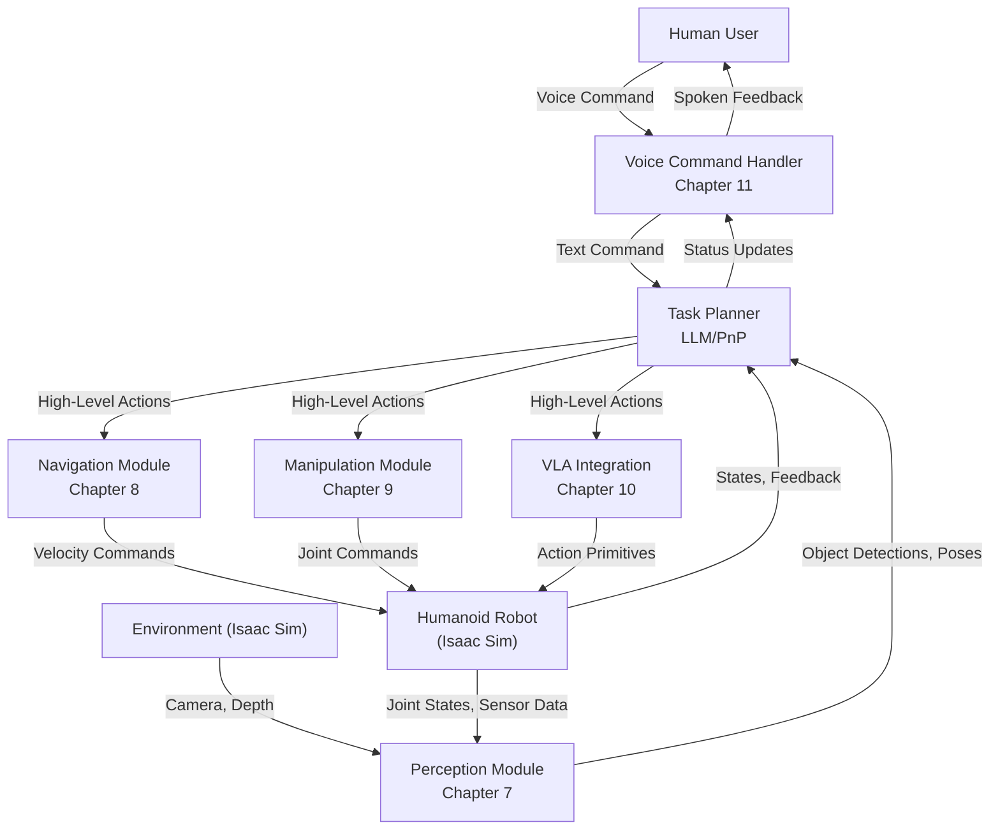

---

id: capstone-butler
title: Capstone Autonomous Butler Project
sidebar_position: 13
description: Synthesize all learned skills to build an autonomous humanoid butler for household tasks.
keywords: [capstone project, autonomous butler, humanoid robotics, ROS 2, Isaac Sim, VLA]
-----------------------------------------------------------------------------------------

# Capstone Autonomous Butler Project

## Introduction

Congratulations! You've journeyed through the foundational concepts of Physical AI, mastering workstation setup, robot simulation, vision-language-action pipelines, locomotion, manipulation, and sim-to-real transfer. Now, it's time to bring all these skills together in an exciting **Capstone Autonomous Butler Project**.

This chapter guides you through the process of integrating everything you've learned to create a humanoid butler capable of understanding natural language commands and performing multi-step household tasks in a simulated environment. This project is the ultimate test of your understanding and a showcase for your newly acquired Physical AI expertise.

## Project Overview

The goal of the Capstone Autonomous Butler Project is to develop a comprehensive system for a humanoid robot to:

1. **Perceive** its environment and identify objects.
2. **Understand** natural language commands given by a human.
3. **Plan** a sequence of actions to fulfill the command.
4. **Execute** locomotion and manipulation tasks to achieve the goal.
5. **Report** on its progress or completion.

### System Architecture

The autonomous butler system is a complex integration of multiple ROS 2 nodes, leveraging the concepts from previous chapters:



**Key Components**:

* **Voice Command Handler**: Transcribes spoken commands using Whisper and provides spoken feedback.
* **Perception Module**: Uses object detection, segmentation, and pose estimation to understand the environment.
* **Task Planner**: An LLM-based component that translates natural language into a sequence of executable robot actions.
* **Navigation Module**: Handles global and local path planning and execution for robot movement.
* **Manipulation Module**: Manages grasping, inverse kinematics, and force control for object interaction.
* **VLA Integration**: Utilizes a VLA model (e.g., GR00T N1) for complex skill execution.

### Butler Capabilities Checklist

Your autonomous butler project should aim to demonstrate at least 5 out of these 7 core capabilities:

1. **Object Identification & Localization**: Identify and locate specific objects in a dynamic environment (e.g., "Find the blue mug").
2. **Navigation to Target**: Move autonomously to a specified location while avoiding obstacles (e.g., "Go to the kitchen counter").
3. **Pick & Place**: Grasp an object from one location and place it at another (e.g., "Pick up the block and put it on the table").
4. **Spatial Reasoning**: Understand and execute commands involving relative spatial relationships (e.g., "Place the book next to the laptop").
5. **Multi-Step Task Execution**: Perform a sequence of actions to complete a more complex task (e.g., "Clean up the living room" → Find all scattered items → Pick them up → Place them in a designated bin).
6. **Human-Robot Interaction**: Respond to voice commands and provide spoken feedback or ask for clarification.
7. **Error Recovery**: Attempt to recover from simple failures (e.g., dropped object, failed grasp) or report failure gracefully.

## Capstone Project Implementation

The capstone project will be developed as a full ROS 2 workspace within `code-examples/capstone/`. This workspace will contain multiple packages for each of the core modules.

### Workspace Structure: `code-examples/capstone/`

```
code-examples/capstone/
├── src/                                   # ROS 2 packages
│   ├── capstone_description/              # Robot URDF, meshes, Gazebo/Isaac Sim descriptions
│   ├── capstone_navigation/               # Navigation module nodes (SLAM, path planning)
│   ├── capstone_perception/               # Perception module nodes (object detection, pose estimation)
│   ├── capstone_manipulation/             # Manipulation module nodes (grasp planning, IK solver)
│   ├── capstone_vla_integration/          # VLA model interfacing node
│   ├── capstone_voice_handler/            # Voice command handling (Whisper, TTS)
│   └── capstone_task_planner/             # LLM-based task planner
├── launch/                                # Launch files to start the entire system
│   └── capstone_butler.launch.py
├── config/                                # Configuration files (e.g., navigation parameters)
├── models/                                # Additional 3D models for the environment
└── README.md                              # Detailed setup and usage instructions
```

### Module Breakdown and Integration

#### 1. Capstone Description (`capstone_description`)

* **Purpose**: Define the humanoid robot's URDF, including all links, joints, sensors (cameras, LiDAR, IMU), and grippers. Also includes Isaac Sim scene descriptions.
* **Implementation**: Create an Xacro-based URDF for a simple humanoid with a mobile base and a manipulator arm. Ensure all sensors are correctly defined.
* **Integration**: Used by `robot_state_publisher` and Isaac Sim to spawn the robot.

#### 2. Capstone Navigation (`capstone_navigation`)

* **Purpose**: Enable the robot to move autonomously within the simulated environment.
* **Implementation**: Leverage ROS 2 Navigation 2 (Nav2) stack. Implement a simple global planner (e.g., A*) and a local planner (e.g., DWA). Incorporate obstacle avoidance.
* **Integration**: Subscribes to `/cmd_vel` from the Task Planner, publishes `/odom` and TF transforms.

#### 3. Capstone Perception (`capstone_perception`)

* **Purpose**: Detect objects in the environment and estimate their 3D poses.
* **Implementation**: Use an object detection model (e.g., YOLO from Chapter 7) on camera feeds. Implement a 3D pose estimation pipeline using depth data and detected 2D bounding boxes.
* **Integration**: Subscribes to camera (`/camera/rgb/image_raw`, `/camera/depth/image_raw`) topics, publishes object detection (`/perception/objects`) topics.

#### 4. Capstone Manipulation (`capstone_manipulation`)

* **Purpose**: Enable the robot to interact with objects (grasping, picking, placing).
* **Implementation**: Implement a grasp planner (e.g., using MoveIt 2 or a simpler custom approach). Integrate inverse kinematics (IK) solver for arm control.
* **Integration**: Receives target object poses from the Task Planner, publishes joint commands to the robot.

#### 5. Capstone VLA Integration (`capstone_vla_integration`)

* **Purpose**: Provide an interface to the VLA model (e.g., GR00T N1, OpenVLA) to execute action primitives.
* **Implementation**: Develop a ROS 2 node that wraps the VLA model. It receives processed sensor data and text commands, passes them to the VLA, and translates the VLA's output into ROS 2 action messages.
* **Integration**: Subscribes to sensor data, receives high-level actions from Task Planner, publishes low-level actions to robot.

#### 6. Capstone Voice Handler (`capstone_voice_handler`)

* **Purpose**: Process human voice commands and provide spoken feedback.
* **Implementation**: Integrate a speech-to-text (STT) service (e.g., Whisper) and a text-to-speech (TTS) service. Publishes text commands to the Task Planner and subscribes to spoken feedback.
* **Integration**: Uses microphone input, publishes `/voice/command_text`, subscribes to `/voice/feedback_text`.

#### 7. Capstone Task Planner (`capstone_task_planner`)

* **Purpose**: The "brain" of the butler. Translates natural language commands into a sequence of high-level robot actions.
* **Implementation**: Use a large language model (LLM) (e.g., local LLM or cloud API) for planning. The LLM takes the natural language command, current object detections, and robot state as input, and outputs a structured plan (e.g., a sequence of "go to", "pick", "place" actions).
* **Integration**: Subscribes to `/voice/command_text`, `/perception/objects`, and robot state. Publishes commands to Navigation, Manipulation, and VLA Integration modules, and `/voice/feedback_text`.

## Capstone Setup Instructions (T136)

This section provides a quick guide to setting up and launching your Capstone Autonomous Butler Project.

### Prerequisites

* **Operating System**: Ubuntu 22.04 LTS
* **ROS 2 Distribution**: Jazzy Jalisco
* **Simulation Environment**: NVIDIA Isaac Sim (with ROS 2 bridge)
* **Python Dependencies**: Ensure all necessary Python packages (PyTorch, transformers, etc.) are installed.

### 1. Clone the Repository

```bash
git clone https://github.com/your_username/ai_book.git
cd ai_book/code-examples/capstone
```

### 2. Install ROS 2 Dependencies

```bash
cd ~/ros2_ws/src # Or your preferred ROS 2 workspace source directory
git clone https://github.com/your_username/ai_book_capstone.git # Assuming capstone is a separate repo
cd ~/ros2_ws
rosdep install --from-paths src --ignore-src -r -y
```

### 3. Build the Workspace

```bash
cd ~/ros2_ws
colcon build --symlink-install
source install/setup.bash
```

### 4. Launch Isaac Sim

Start Isaac Sim (Chapter 6) ensuring the ROS 2 bridge is active. You might need to load a specific environment/robot first.

```bash
cd ~/.local/share/ov/pkg/isaac-sim-2024.1.1
./isaac-sim.sh --ros2-bridge
```

### 5. Launch the Capstone Butler System (T132)

Once Isaac Sim is running, open a new terminal, source your ROS 2 environment, and launch the capstone system:

```bash
source /opt/ros/jazzy/setup.bash
source ~/ros2_ws/install/setup.bash
export ROS_DOMAIN_ID=42 # Ensure this matches your Isaac Sim setup
ros2 launch capstone_butler capstone_butler.launch.py
```

This launch file should bring up all necessary ROS 2 nodes for the butler system.

## Capstone Project README.md (T139)

A comprehensive `README.md` will be provided within the `code-examples/capstone/` directory, detailing:

* **Project Goal**: A clear statement of what the butler achieves.
* **Features**: List of implemented capabilities.
* **Dependencies**: All software and hardware dependencies.
* **Setup**: Step-by-step instructions for getting the project running.
* **Usage**: How to interact with the butler (e.g., example voice commands).
* **File Structure**: Explanation of the ROS 2 packages and their roles.
* **Troubleshooting**: Common issues and fixes specific to the capstone.
* **Future Work**: Ideas for expanding the project.

## Conclusion

The Capstone Autonomous Butler Project synthesizes the entire learning journey of this book. It challenges you to integrate complex subsystems, debug multi-domain issues, and ultimately create an intelligent robotic agent. While it's a significant undertaking, successfully completing this project will solidify your understanding of Physical AI and leave you with a demonstrable portfolio piece.
