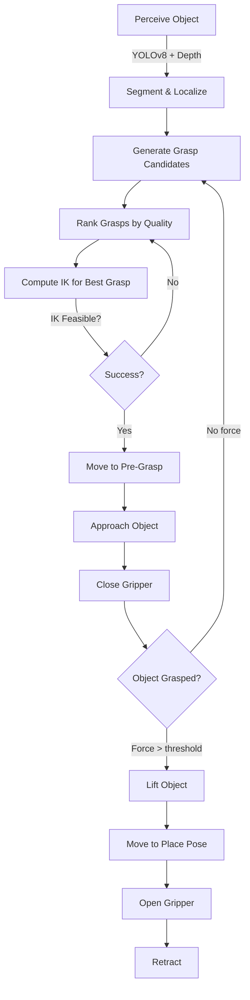

# Chapter 09: Dexterous Manipulation

## Introduction

Dexterous manipulation is the ability to skillfully interact with objects using robotic hands and arms. While locomotion gets a humanoid from point A to B, manipulation enables it to perform useful tasks: opening doors, picking packages, assembling components, or pouring drinks. This chapter covers the complete manipulation stack from grasp planning to force-controlled execution.

**What You'll Learn:**
- Grasp planning algorithms (force closure, quality metrics)
- Inverse kinematics solvers (analytic, numerical, optimization-based)
- Force/impedance control for compliant interaction
- Multi-fingered hand control strategies
- Object manipulation pipelines

**Prerequisites:**
- Chapter 04 (ROS 2 fundamentals)
- Chapter 05 (URDF and forward kinematics)
- Chapter 07 (perception for object detection)
- Basic linear algebra and robotics kinematics

---

## 9.1 Grasp Planning Fundamentals

### 9.1.1 Grasp Quality Metrics

A grasp is "good" if it resists external forces and achieves the task goal. We quantify this with quality metrics:

**Force Closure**: A grasp achieves force closure if it can apply wrenches (force + torque) in all directions on the object. Mathematically:

```
Grasp matrix G: 6×n (n = number of contacts)
Force closure ⟺ rank(G) = 6 AND wrench space spans ℝ⁶
```

**Form Closure**: Stricter condition - the grasp prevents any object motion even without friction. Requires 7+ contacts for general 3D objects.

**Grasp Quality Indices:**
1. **Largest Minimum Wrench (LMW)**: Maximum disturbance the grasp can resist
2. **Volume of Grasp Wrench Space**: Larger = more robust
3. **Distance to Force Closure Boundary**: Safety margin
4. **Task-specific metrics**: Alignment with manipulation goal (e.g., torque capacity for twisting a lid)

**Ferrari-Canny Metric** (most common):
```python
def ferrari_canny_metric(contact_points, contact_normals, friction_coeff=0.7):
    """
    Compute grasp quality as radius of largest ball inscribed in convex hull
    of grasp wrench space (normalized by object size).

    Higher = more robust grasp
    """
    G = build_grasp_matrix(contact_points, contact_normals, friction_coeff)
    wrench_space = compute_wrench_space(G)  # Convex hull in 6D
    quality = min_distance_to_boundary(wrench_space)  # Ball radius
    return quality / object_radius  # Normalized
```

### 9.1.2 Grasp Synthesis Methods

**Analytic Approaches:**
- **Antipodal Grasps**: Two-finger grasps with contact normals opposing through object center of mass
- **Force Closure Test**: Check if contact forces span 6D wrench space
- **Parallel-Jaw Optimization**: Find best finger positions for gripper

**Sampling-Based Approaches:**
1. Generate candidate grasps (e.g., sample points on object mesh)
2. Evaluate quality metric for each
3. Rank and return top-k grasps

**Example: Antipodal Grasp Generation**
```python
import numpy as np
from scipy.spatial.distance import cdist

def generate_antipodal_grasps(point_cloud, normals, gripper_width=0.08):
    """
    Find antipodal grasp candidates on object point cloud.

    Args:
        point_cloud: Nx3 array of surface points
        normals: Nx3 array of surface normals
        gripper_width: Maximum gripper opening (meters)

    Returns:
        grasps: List of (point1, point2, approach_axis, quality) tuples
    """
    grasps = []

    for i, p1 in enumerate(point_cloud):
        n1 = normals[i]

        # Find points on opposite side within gripper width
        distances = cdist([p1], point_cloud)[0]
        candidates = np.where((distances &gt; 0.02) & (distances &lt; gripper_width))[0]

        for j in candidates:
            p2 = point_cloud[j]
            n2 = normals[j]

            # Check antipodal condition: normals oppose through CoM
            grasp_axis = (p2 - p1) / np.linalg.norm(p2 - p1)

            # Normals should be ~opposite and aligned with grasp axis
            alignment1 = np.dot(n1, grasp_axis)
            alignment2 = np.dot(n2, -grasp_axis)

            if alignment1 &gt; 0.95 and alignment2 &gt; 0.95:  # ~5° tolerance
                # Compute grasp quality (simplified Ferrari-Canny)
                quality = min(alignment1, alignment2) * (1 - distances[j] / gripper_width)

                grasps.append({
                    'p1': p1,
                    'p2': p2,
                    'axis': grasp_axis,
                    'width': distances[j],
                    'quality': quality
                })

    # Return top 10 grasps
    grasps.sort(key=lambda g: g['quality'], reverse=True)
    return grasps[:10]
```

**Learning-Based Approaches:**
- **GraspNet**: Neural network predicts grasp quality from RGB-D images
- **Contact-GraspNet**: Predicts contact points and approach directions
- **DexNet**: Large-scale dataset (millions of grasps) for training

---

## 9.2 Inverse Kinematics (IK)

Inverse kinematics solves: **Given desired end-effector pose, find joint angles to achieve it.**

### 9.2.1 Problem Formulation

```
Forward Kinematics: θ → X
   θ ∈ ℝⁿ (joint angles) → X ∈ SE(3) (end-effector pose)

Inverse Kinematics: X → θ
   X (desired pose) → θ (joint angles to achieve it)
```

**Challenges:**
- **Non-unique**: Redundant robots (7+ DOF arms) have infinite solutions
- **No closed-form**: Most robots require numerical methods
- **Singularities**: Jacobian rank drops, losing DOFs
- **Joint limits**: Solutions must satisfy physical constraints

### 9.2.2 Analytic IK (Closed-Form)

For specific robot geometries (e.g., 6-DOF arms with spherical wrist), closed-form solutions exist.

**Example: 6-DOF Anthropomorphic Arm**
```python
def analytic_ik_6dof(target_pose, shoulder_offset, elbow_offset, wrist_offset):
    """
    Analytic IK for 6-DOF arm with spherical wrist (Puma-like).

    Returns: List of up to 8 solutions (joint angle sets)
    """
    x, y, z = target_pose.translation
    R = target_pose.rotation

    # Decouple position (first 3 joints) and orientation (wrist joints)
    wrist_center = target_pose.translation - wrist_offset * R[:, 2]  # Z-axis

    # Solve for shoulder/elbow (2R chain in plane)
    r = np.sqrt(wrist_center[0]**2 + wrist_center[1]**2)
    z_offset = wrist_center[2] - shoulder_offset[2]

    # Law of cosines for elbow angle
    d = np.sqrt(r**2 + z_offset**2)
    cos_elbow = (d**2 - elbow_offset**2 - wrist_offset**2) / (2 * elbow_offset * wrist_offset)

    if abs(cos_elbow) &gt; 1:
        return []  # Target unreachable

    theta2_solutions = [np.arccos(cos_elbow), -np.arccos(cos_elbow)]  # Elbow up/down

    solutions = []
    for theta2 in theta2_solutions:
        # Solve theta1 (shoulder pan)
        theta1 = np.arctan2(wrist_center[1], wrist_center[0])

        # ... (solve wrist angles from R, ~20 more lines)
        # Returns 8 solutions for different arm configurations

    return solutions
```

**Pros**: Fast (microseconds), exact
**Cons**: Robot-specific, doesn't exist for all geometries

### 9.2.3 Numerical IK (Iterative)

**Jacobian-Based Newton-Raphson:**
```
Iterate: θ_{k+1} = θ_k + J⁺(θ_k) · ΔX

Where:
  J⁺ = pseudoinverse of Jacobian (6×n matrix)
  ΔX = target pose - current pose (6D twist)
```

**Implementation with Damped Least Squares** (avoids singularities):
```python
def numerical_ik_damped_ls(robot, target_pose, q_init, max_iter=100, tol=1e-4):
    """
    Numerical IK using Damped Least Squares (Levenberg-Marquardt).

    Args:
        robot: URDF robot model with forward kinematics
        target_pose: SE(3) desired end-effector pose
        q_init: Initial joint angles guess
        lambda_damping: Damping factor (0.01-0.1)

    Returns:
        q_solution: Joint angles achieving target (or best effort)
    """
    q = q_init.copy()
    lambda_damp = 0.05

    for iteration in range(max_iter):
        # Compute current pose and error
        current_pose = robot.forward_kinematics(q)
        pos_error = target_pose.translation - current_pose.translation
        rot_error = rotation_error(target_pose.rotation, current_pose.rotation)  # Axis-angle

        error = np.concatenate([pos_error, rot_error])  # 6D error

        if np.linalg.norm(error) &lt; tol:
            return q  # Converged

        # Compute Jacobian at current config
        J = robot.compute_jacobian(q)  # 6×n

        # Damped least squares update
        JtJ = J.T @ J
        delta_q = np.linalg.solve(JtJ + lambda_damp * np.eye(len(q)), J.T @ error)

        q += delta_q

        # Enforce joint limits
        q = np.clip(q, robot.joint_limits_lower, robot.joint_limits_upper)

    print(f"IK did not converge after {max_iter} iterations (error: {np.linalg.norm(error):.4f}m)")
    return q  # Best effort
```

**Pros**: Works for any robot, handles redundancy
**Cons**: Slower (milliseconds), may not converge, local minima

### 9.2.4 Optimization-Based IK

**Formulate as constrained optimization:**
```python
import casadi as ca

def optimization_ik(robot, target_pose, q_init, weights={'position': 100, 'orientation': 10}):
    """
    IK via nonlinear optimization (IPOPT solver).

    Objective: Minimize pose error + secondary objectives (joint limits, singularities)
    """
    opti = ca.Opti()

    q = opti.variable(robot.n_joints)  # Decision variables

    # Constraint: Forward kinematics
    current_pose = robot.fk_symbolic(q)  # CasADi symbolic expression

    # Objective: Minimize pose error
    pos_error = ca.sumsqr(current_pose[:3] - target_pose.translation)
    rot_error = ca.sumsqr(rotation_matrix_to_axis_angle(current_pose[3:]) - target_pose.rotation_aa)

    objective = weights['position'] * pos_error + weights['orientation'] * rot_error

    # Secondary objective: Stay close to home position (avoid joint limits)
    objective += 0.1 * ca.sumsqr(q - robot.home_position)

    opti.minimize(objective)

    # Constraints: Joint limits
    opti.subject_to(opti.bounded(robot.q_min, q, robot.q_max))

    # Solve
    opti.solver('ipopt', {'print_time': False, 'ipopt.print_level': 0})
    opti.set_initial(q, q_init)

    try:
        sol = opti.solve()
        return sol.value(q)
    except:
        return opti.debug.value(q)  # Return best effort if no solution
```

**Pros**: Handles constraints (obstacles, joint limits), secondary objectives
**Cons**: Slower (10-100ms), requires optimization library

### 9.2.5 Production IK: TRAC-IK

**TRAC-IK** (TracLabs Inverse Kinematics) combines speed and reliability:
- Runs numerical IK and nonlinear optimization in parallel
- Returns fastest solution
- Widely used in ROS 2 MoveIt 2

```bash
# Install TRAC-IK
sudo apt install ros-iron-trac-ik-kinematics-plugin

# Configure in MoveIt 2
# config/kinematics.yaml:
right_arm:
  kinematics_solver: trac_ik_kinematics_plugin/TRAC_IKKinematicsPlugin
  kinematics_solver_timeout: 0.05  # 50ms
  kinematics_solver_attempts: 3
```

---

## 9.3 Force and Impedance Control

Position control alone is brittle - contact with environment causes high forces and failures. **Force control** regulates interaction forces for safe, compliant manipulation.

### 9.3.1 Hybrid Position/Force Control

**Concept**: Control position in free directions, force in constrained directions.

```
Example: Wiping a table
  - XY plane: Position control (move along surface)
  - Z axis: Force control (maintain 5N downward pressure)
```

**Implementation:**
```python
class HybridController:
    def __init__(self, robot, selection_matrix):
        """
        Hybrid position/force controller.

        Args:
            selection_matrix: 6×6 diagonal, 1 = force control, 0 = position control
        """
        self.S = selection_matrix  # Force selection
        self.P = np.eye(6) - selection_matrix  # Position selection

        self.Kp_pos = np.diag([500, 500, 500, 50, 50, 50])  # Position gains
        self.Kp_force = np.diag([0.1, 0.1, 0.1, 0.01, 0.01, 0.01])  # Force gains

    def compute_control(self, x_desired, f_desired, x_current, f_current):
        """
        Returns: Joint torques achieving hybrid control objective.
        """
        # Position error in free directions
        x_error = x_desired - x_current
        u_pos = self.Kp_pos @ (self.P @ x_error)

        # Force error in constrained directions
        f_error = f_desired - f_current
        u_force = self.Kp_force @ (self.S @ f_error)

        # Combined control (in task space)
        u_task = u_pos + u_force

        # Map to joint torques via Jacobian transpose
        J = self.robot.compute_jacobian(q_current)
        tau = J.T @ u_task

        return tau
```

**Selection Matrix Example (Table Wiping):**
```python
S = np.diag([0, 0, 1, 0, 0, 0])  # Force control in Z only
# XY position controlled, Z force controlled
```

### 9.3.2 Impedance Control

**Impedance control** makes the robot behave like a spring-damper system:

```
F = K · (x - x_desired) + D · (ẋ - ẋ_desired)

Low K → Compliant (soft)
High K → Stiff (position control)
```

**Cartesian Impedance Controller:**
```python
class CartesianImpedanceController:
    def __init__(self, stiffness, damping):
        """
        Args:
            stiffness: 6×6 diagonal (N/m for position, Nm/rad for orientation)
            damping: 6×6 diagonal (critically damped: D = 2√(M·K))
        """
        self.K = stiffness  # e.g., diag([300, 300, 300, 30, 30, 30])
        self.D = damping    # e.g., diag([50, 50, 50, 5, 5, 5])

    def compute_control(self, x_desired, x_current, v_current, f_external):
        """
        Computes joint torques for compliant behavior.

        Args:
            f_external: Measured external forces (from F/T sensor)
        """
        # Task-space impedance
        x_error = x_desired - x_current
        f_desired = self.K @ x_error - self.D @ v_current

        # Compensate for measured external forces
        f_control = f_desired - f_external

        # Map to joint torques
        J = self.robot.compute_jacobian(q_current)
        tau = J.T @ f_control

        # Add gravity compensation
        tau += self.robot.inverse_dynamics(q_current, zero_velocity, zero_accel)

        return tau
```

**Tuning Impedance Parameters:**
- **Stiff** (K=1000): Precise positioning (pick small objects)
- **Compliant** (K=50): Safe contact (human handover, exploration)
- **Variable**: Adapt based on task (stiff in free space, soft at contact)

```python
# Variable stiffness based on contact
if force_sensor.norm() &gt; 2.0:  # Contact detected
    K = np.diag([50, 50, 100, 10, 10, 10])  # Compliant in XY, stiffer in Z
else:
    K = np.diag([1000, 1000, 1000, 100, 100, 100])  # Stiff in free space
```

### 9.3.3 Force/Torque Sensing

**Hardware Requirements:**
- **6-axis F/T sensor** at wrist (measures Fx, Fy, Fz, Tx, Ty, Tz)
- Typical specs: ±200N force, ±20Nm torque, 1000Hz sampling
- Examples: ATI Mini45, Robotiq FT-300, OnRobot HEX-E

**ROS 2 Integration:**
```python
from geometry_msgs.msg import WrenchStamped

class ForceTorqueSensor(Node):
    def __init__(self):
        super().__init__('ft_sensor')

        self.ft_sub = self.create_subscription(
            WrenchStamped,
            '/ft_sensor/wrench',
            self.ft_callback,
            10
        )

        self.current_wrench = np.zeros(6)
        self.bias = np.zeros(6)  # Tare offset

    def ft_callback(self, msg):
        wrench = np.array([
            msg.wrench.force.x,
            msg.wrench.force.y,
            msg.wrench.force.z,
            msg.wrench.torque.x,
            msg.wrench.torque.y,
            msg.wrench.torque.z
        ])

        self.current_wrench = wrench - self.bias

    def tare(self):
        """Zero sensor (subtract gravity/tool weight)"""
        self.bias = self.current_wrench.copy()
```

---

## 9.4 Multi-Fingered Hands

### 9.4.1 Hand Platforms

**Allegro Hand** (16 DOF, 4 fingers):
- Torque-controlled, dexterous manipulation
- $10k-15k, research/education
- ROS 2 support: `ros2 launch allegro_hand allegro_hand.launch.py`

**Shadow Dexterous Hand** (20-24 DOF):
- Human-like kinematics, tactile sensors
- $100k+, high-end research
- Air muscle or electric actuation

**Barrett Hand** (4 DOF, 3 fingers):
- Underactuated, adaptive grasping
- $25k, industrial reliability

**Robotiq 2F-85/2F-140** (Parallel-jaw grippers):
- Simple, robust, $5k-10k
- Force control, object detection
- Best for pick-and-place tasks

### 9.4.2 Grasp Execution with Multi-Fingered Hands

**Synergy-Based Control**: Reduce 16+ DOF to 2-3 "grasp synergies" (coordinated motions):

```python
# Principal grasp synergies (from human hand studies)
synergy_1 = [1, 0.8, 0.6, 0.4] * 4  # Flexion (all fingers close)
synergy_2 = [1, -1, 0, 0] * 4       # Precision (thumb-index opposition)
synergy_3 = [1, 1, -1, -1] * 4      # Lateral (thumb-pinky grasp)

def execute_grasp(object_size, grasp_type='power'):
    """
    Map high-level grasp command to 16 joint angles.
    """
    if grasp_type == 'power':
        # Power grasp: 100% synergy 1
        q_target = synergy_1 * (object_size / max_aperture)
    elif grasp_type == 'precision':
        # Precision: 70% syn1 + 30% syn2
        q_target = 0.7 * synergy_1 + 0.3 * synergy_2

    # Send position commands to hand
    hand.set_joint_positions(q_target)
```

**Tactile Feedback** (if available):
```python
def grasp_with_tactile_feedback(object_pose):
    """
    Close fingers until tactile contact, then apply holding force.
    """
    hand.move_to_pre_grasp(object_pose)

    # Close fingers slowly
    for aperture in np.linspace(max_aperture, 0, 50):
        hand.set_aperture(aperture)
        time.sleep(0.02)

        # Check tactile sensors
        if np.any(hand.get_tactile_readings() &gt; contact_threshold):
            break  # Contact detected

    # Apply holding force (force control)
    hand.set_force_target(10.0)  # 10N per finger
```

### 9.4.3 In-Hand Manipulation

**Task**: Reorient object within hand (e.g., rotate screwdriver).

**Approaches:**
1. **Finger Gaiting**: Sequentially release/regrasp fingers
2. **Rolling**: Controlled sliding along finger surfaces
3. **Pivoting**: Rotate around fixed contact point

**Simple Pivot Controller:**
```python
def pivot_object(target_angle, pivot_finger=0):
    """
    Rotate object by pivoting around one finger.

    Args:
        target_angle: Desired rotation (radians)
        pivot_finger: Index of finger to keep fixed
    """
    # Keep pivot finger stationary
    hand.set_finger_stiffness(pivot_finger, stiffness=1000)

    # Other fingers push tangentially
    for i in range(4):
        if i != pivot_finger:
            # Compute tangential push direction
            contact_point = hand.get_fingertip_pose(i)
            push_direction = compute_tangent(contact_point, pivot_point, target_angle)

            hand.set_finger_force(i, push_direction * 5.0)  # 5N push

    # Monitor object pose, stop when target reached
    while abs(object.get_orientation() - target_angle) &gt; 0.05:
        time.sleep(0.01)

    hand.set_all_finger_forces(0)  # Stop
```

---

## 9.5 Object Manipulation Pipeline

### 9.5.1 Complete Pick-and-Place



**ROS 2 Action Server:**
```python
from manipulation_interfaces.action import PickAndPlace

class PickAndPlaceServer(Node):
    def __init__(self):
        super().__init__('pick_place_server')

        self._action_server = ActionServer(
            self,
            PickAndPlace,
            'pick_and_place',
            self.execute_callback
        )

        # Components
        self.grasp_planner = GraspPlanner()
        self.ik_solver = TRAC_IK()
        self.motion_planner = MoveIt2Interface()
        self.gripper = GripperController()

    def execute_callback(self, goal_handle):
        """Execute pick-and-place task"""
        feedback_msg = PickAndPlace.Feedback()

        # 1. Perceive object
        feedback_msg.status = "Perceiving object..."
        goal_handle.publish_feedback(feedback_msg)

        object_pose = self.perceive_object(goal_handle.request.object_id)

        # 2. Plan grasp
        feedback_msg.status = "Planning grasp..."
        goal_handle.publish_feedback(feedback_msg)

        grasps = self.grasp_planner.generate_grasps(object_pose)

        # 3. Find feasible grasp (IK check)
        for grasp in grasps:
            q_grasp = self.ik_solver.solve(grasp.pose)

            if q_grasp is not None:
                # 4. Motion planning
                trajectory = self.motion_planner.plan_to_pose(q_grasp)

                if trajectory.success:
                    # 5. Execute pick
                    feedback_msg.status = "Executing pick..."
                    goal_handle.publish_feedback(feedback_msg)

                    self.execute_pick(trajectory, grasp)

                    # 6. Move to place
                    feedback_msg.status = "Moving to place pose..."
                    goal_handle.publish_feedback(feedback_msg)

                    place_traj = self.motion_planner.plan_to_pose(goal_handle.request.place_pose)
                    self.motion_planner.execute(place_traj)

                    # 7. Release
                    self.gripper.open()

                    goal_handle.succeed()

                    result = PickAndPlace.Result()
                    result.success = True
                    return result

        # No feasible grasp found
        goal_handle.abort()
        result = PickAndPlace.Result()
        result.success = False
        result.error = "No feasible grasp found"
        return result
```

### 9.5.2 Failure Recovery

**Common Failures:**
1. **Grasp failure** (object slips)
2. **IK failure** (target unreachable)
3. **Collision** (obstacle in path)
4. **Perception failure** (object not detected)

**Recovery Strategies:**
```python
def execute_pick_with_retry(object_pose, max_attempts=3):
    for attempt in range(max_attempts):
        try:
            # Attempt pick
            success = pick_object(object_pose)

            if success:
                return True

            # Failure detected - diagnose
            if not gripper.has_object():
                # Grasp failure - try next best grasp
                print(f"Grasp failed, attempt {attempt+1}/{max_attempts}")
                continue

        except IKError:
            # Try different arm configuration
            print("IK failed, trying different seed...")
            q_seed = sample_alternative_config()
            continue

        except CollisionError as e:
            # Replan with obstacle avoidance
            print(f"Collision detected: {e.obstacle_id}")
            add_obstacle_to_scene(e.obstacle_id)
            continue

    return False  # All attempts failed
```

---

## 9.6 Advanced Topics

### 9.6.1 Dual-Arm Coordination

**Bimanual manipulation**: Two arms work together (e.g., opening a jar, folding cloth).

**Relative Jacobian Approach:**
```python
def dual_arm_coordination(left_target, right_target, relative_constraint):
    """
    Coordinate two arms with relative constraint (e.g., maintain object pose).

    Args:
        relative_constraint: SE(3) transform from left to right gripper
    """
    # Stack arm Jacobians
    J_left = robot.compute_jacobian(q_left, 'left_gripper')
    J_right = robot.compute_jacobian(q_right, 'right_gripper')

    J_dual = np.vstack([J_left, J_right])  # 12×14 (2 arms × 7 DOF)

    # Desired task-space velocities
    v_left = Kp * (left_target - left_current)
    v_right = Kp * (right_target - right_current)

    v_task = np.concatenate([v_left, v_right])  # 12D

    # Add relative constraint (e.g., maintain object orientation)
    J_rel = compute_relative_jacobian(J_left, J_right)
    v_rel = Kp_rel * relative_constraint_error

    # Solve augmented system
    J_augmented = np.vstack([J_dual, J_rel])
    v_augmented = np.concatenate([v_task, v_rel])

    dq = np.linalg.pinv(J_augmented) @ v_augmented  # 14D joint velocities

    return dq[:7], dq[7:]  # Left and right joint velocities
```

### 9.6.2 Tool Use

**Task**: Use a tool (e.g., hammer, screwdriver) to extend manipulation capabilities.

**Approach**: Recompute kinematics with tool as new end-effector.

```python
# Original FK: base → wrist
T_base_wrist = robot.forward_kinematics(q)

# Tool transform: wrist → tool tip
T_wrist_tool = np.array([
    [1, 0, 0, 0.0],
    [0, 1, 0, 0.0],
    [0, 0, 1, 0.3],  # Tool length: 30cm
    [0, 0, 0, 1]
])

# New FK: base → tool tip
T_base_tool = T_base_wrist @ T_wrist_tool

# IK now solves for tool tip pose (instead of wrist)
q_solution = ik_solver.solve(T_base_tool, tool_transform=T_wrist_tool)
```

---

## Summary

**Key Takeaways:**
1. **Grasp Planning**: Ferrari-Canny metric balances quality vs speed; antipodal grasps work for 80% of objects
2. **IK Solvers**: Use TRAC-IK for speed + reliability; numerical methods handle redundancy
3. **Force Control**: Impedance control (K=50-300 N/m) enables safe, compliant manipulation
4. **Multi-Fingered Hands**: Synergy-based control reduces complexity; tactile feedback improves robustness
5. **Production Pipeline**: Perception → Grasp Planning → IK → Motion Planning → Force-Controlled Execution

**Recommended Stack:**
- **Perception**: YOLOv8 + SAM 2 (Chapter 07)
- **Grasp Planning**: GraspNet or antipodal sampling
- **IK**: TRAC-IK (ROS 2 MoveIt 2)
- **Motion Planning**: MoveIt 2 OMPL
- **Control**: Cartesian impedance (K=100-300)
- **Gripper**: Robotiq 2F-85 (simple) or Allegro Hand (dexterous)

**Next Steps:**
- Implement grasp planner from code example (`grasp_planner.py`)
- Test IK solver on your robot URDF
- Set up F/T sensor and tune impedance controller
- Integrate with Chapter 07 perception for autonomous pick-and-place

**Performance Targets:**
- Grasp planning: &lt;500ms (antipodal), &lt;2s (GraspNet)
- IK solve: &lt;50ms (TRAC-IK)
- Grasp success rate: &gt;85% (known objects), &gt;60% (novel objects)
- Force control bandwidth: &gt;100Hz

---

## Further Reading

- **Books**:
  - *Robotics: Modelling, Planning and Control* by Siciliano et al. (Chapters 3, 9-11)
  - *A Mathematical Introduction to Robotic Manipulation* by Murray, Li, Sastry (grasp theory)

- **Papers**:
  - Ferrari & Canny (1992): "Planning Optimal Grasps" (Ferrari-Canny metric)
  - Hogan (1985): "Impedance Control" (foundational impedance control paper)
  - Raibert & Craig (1981): "Hybrid Position/Force Control"

- **ROS 2 Packages**:
  - `moveit2`: Motion planning and IK
  - `trac_ik`: Fast, reliable IK solver
  - `ros2_control`: Real-time joint/Cartesian control
  - `robotiq_2f_gripper`: Robotiq gripper driver

- **Datasets**:
  - **GraspNet-1Billion**: 1B grasp poses for training
  - **YCB Object Set**: Standard manipulation benchmark objects
