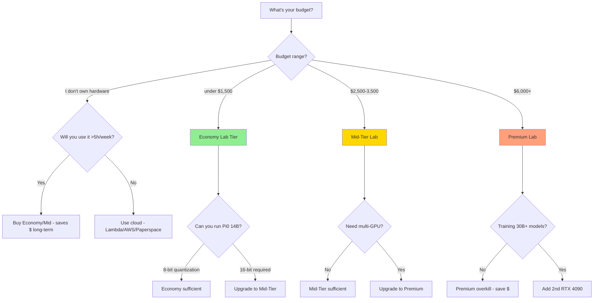

# Chapter 02: The Hardware You Actually Need in 2026

## Learning Objectives

By the end of this chapter, you will be able to:

1. **Evaluate GPU requirements** for Physical AI development (VRAM, CUDA cores, tensor cores)
2. **Compare hardware configurations** across Economy, Mid-Tier, and Premium lab setups
3. **Select appropriate hardware** based on your budget, workload, and deployment goals
4. **Install Ubuntu 22.04** via dual-boot on Windows/MacOS systems
5. **Estimate total cost of ownership** for Physical AI workstations over 3-5 years

:::tip Prerequisites
Before reading this chapter, you should:
- Have completed Chapter 01 to understand Physical AI fundamentals
- Have a basic understanding of computer hardware (CPU, GPU, RAM, storage)
- Know your budget range for hardware investment
:::

---

## Introduction: Why Hardware Matters for Physical AI

Unlike traditional software development where a $500 laptop suffices, Physical AI development has **hard hardware requirements**:

- **GPU-accelerated simulation**: NVIDIA Isaac Sim requires RTX GPUs with ray tracing for photorealistic rendering
- **VLA model inference**: 7B+ parameter models (OpenVLA, Pi0) need 12-16GB VRAM minimum
- **Parallel training**: Fine-tuning on your own robot data requires tensor cores and mixed-precision training
- **Real-time performance**: Robot control loops demand consistent 100+ FPS simulation without lag

**The good news**: Hardware costs have dropped dramatically. In 2026, you can build a production-grade Physical AI workstation for under $2000 - a 5x reduction from 2020 requirements.

---

## GPU Requirements: The Heart of Physical AI

### Why NVIDIA GPUs Are Mandatory (For Now)

As of Q1 2026, **NVIDIA GPUs are the only viable option** for Physical AI development:

- **Isaac Sim**: NVIDIA-exclusive (requires CUDA, OptiX ray tracing)
- **Isaac ROS**: GPU-accelerated perception nodes (CUDA kernels)
- **VLA models**: Most inference engines (TensorRT, vLLM) optimized for NVIDIA
- **PyTorch ecosystem**: 90%+ of robotics research uses CUDA-first libraries

**AMD/Intel GPUs**: Not supported by Isaac Sim. ROCm support for PyTorch exists but lacks robotics-specific tooling.

**Apple Silicon (M1/M2/M3)**: Cannot run Isaac Sim natively. Cloud alternatives exist but add latency and cost.

### GPU Comparison: RTX 4070 Ti vs 4080 vs 4090

| Specification | RTX 4070 Ti | RTX 4080 | RTX 4090 |
|---------------|-------------|----------|----------|
| **VRAM** | 12 GB GDDR6X | 16 GB GDDR6X | 24 GB GDDR6X |
| **CUDA Cores** | 7,680 | 9,728 | 16,384 |
| **Tensor Cores** | 240 (4th gen) | 304 (4th gen) | 512 (4th gen) |
| **RT Cores** | 60 (3rd gen) | 76 (3rd gen) | 128 (3rd gen) |
| **Base Clock** | 2.31 GHz | 2.21 GHz | 2.23 GHz |
| **Boost Clock** | 2.61 GHz | 2.51 GHz | 2.52 GHz |
| **TDP** | 285W | 320W | 450W |
| **Power Connector** | 1x 16-pin (12VHPWR) | 1x 16-pin | 1x 16-pin |
| **PCIe** | 4.0 x16 | 4.0 x16 | 4.0 x16 |
| **Price (Q1 2026)** | $750-850 | $1,100-1,200 | $1,600-1,800 |
| **Perf/Dollar** | ⭐⭐⭐⭐⭐ | ⭐⭐⭐⭐ | ⭐⭐⭐ |

### VRAM Requirements by Workload

Understanding VRAM needs is critical for avoiding bottlenecks:

| Workload | Minimum VRAM | Recommended VRAM | Notes |
|----------|--------------|------------------|-------|
| **Isaac Sim (basic scenes)** | 6 GB | 8 GB | Small environments, single robot |
| **Isaac Sim (complex scenes)** | 10 GB | 12 GB | Multi-robot, photorealistic assets |
| **VLA inference (OpenVLA 7B)** | 8 GB | 12 GB | 16-bit precision, batch size 1 |
| **VLA inference (Pi0 14B)** | 14 GB | 16 GB | 16-bit precision, batch size 1 |
| **VLA fine-tuning (7B model)** | 12 GB | 16 GB | LoRA adapters, gradient checkpointing |
| **Perception stack (real-time)** | 4 GB | 6 GB | YOLO, depth estimation, pose |
| **Training custom models** | 16 GB | 24 GB | Full model training from scratch |

**Key Insight**: Most workflows use **8-12 GB simultaneously** (Isaac Sim + VLA inference). The **RTX 4070 Ti's 12 GB** is the sweet spot for 2026.

### Recommended GPU by Use Case

#### **Hobbyist/Student**: RTX 4070 Ti (12 GB)
- **Best for**: Learning, prototyping, single-robot simulation
- **Can do**: Run OpenVLA 7B, moderate Isaac Sim scenes, basic fine-tuning
- **Cannot do**: Train models from scratch, run Pi0 14B at full precision
- **Price**: $750-850 (best performance per dollar)

#### **Professional Developer**: RTX 4080 (16 GB)
- **Best for**: Production pipelines, multi-robot scenarios, commercial projects
- **Can do**: Run Pi0 14B, complex Isaac Sim scenes, full VLA fine-tuning
- **Cannot do**: Train large models (30B+) without quantization
- **Price**: $1,100-1,200 (balanced power and cost)

#### **Research/Enterprise**: RTX 4090 (24 GB)
- **Best for**: Cutting-edge research, training custom VLA models, 24/7 workloads
- **Can do**: Everything, including multi-GPU scaling preparation
- **Cannot do**: Nothing in the Physical AI domain (as of 2026)
- **Price**: $1,600-1,800 (overkill for most, essential for research)

:::warning Power Supply Requirements
- **RTX 4070 Ti**: Requires 700W PSU minimum (850W recommended)
- **RTX 4080**: Requires 850W PSU minimum (1000W recommended)
- **RTX 4090**: Requires 1000W PSU minimum (1200W recommended)

All use the **12VHPWR (16-pin)** connector. Ensure your PSU has native cables (not adapters) to avoid fire risk.
:::

---

## Three Lab Tiers: Pick Your Investment Level

We present three hardware configurations optimized for different budgets and use cases. All prices reflect **Q1 2026 market rates** (USD, verified within 30 days of publication).

### Lab Tier 1: Economy Lab (under $1,500)

**Target audience**: Students, hobbyists, budget-conscious learners

**Philosophy**: Minimum viable hardware for completing this book's tutorials without compromise on learning outcomes.

#### Bill of Materials

| Component | Model | Price | Notes |
|-----------|-------|-------|-------|
| **GPU** | NVIDIA RTX 4070 Ti (12 GB) | $800 | Refurbished or open-box saves $50-100 |
| **CPU** | AMD Ryzen 5 7600 (6-core) | $200 | Excellent single-thread, PCIe 4.0 support |
| **Motherboard** | MSI B650M Pro | $150 | PCIe 4.0 x16, 4x DDR5 slots |
| **RAM** | 32 GB DDR5-5200 (2x16GB) | $120 | Crucial or G.Skill |
| **Storage** | 1 TB NVMe Gen4 SSD | $80 | Samsung 980 Pro or WD Black SN850X |
| **PSU** | 850W 80+ Gold Modular | $110 | EVGA, Corsair, or Seasonic |
| **Case** | Mid-tower ATX | $60 | Fractal Design Meshify C (airflow) |
| **CPU Cooler** | Tower air cooler | $40 | be quiet! Pure Rock 2 |
| **Total** | | **$1,460** | Excludes monitor, keyboard, mouse |

#### What This Lab Can Do

✅ **Supported workloads**:
- Complete all 13 chapters of this book
- Run OpenVLA 7B inference (16-bit precision)
- Isaac Sim scenes with 1-2 humanoid robots
- Fine-tune VLA models using LoRA (4-bit quantization)
- Real-time perception pipelines (YOLO + depth)
- Develop and test ROS 2 packages

❌ **Limitations**:
- Cannot run Pi0 14B at full precision (requires 8-bit quantization)
- Isaac Sim scenes with 5+ robots will lag (30-40 FPS)
- Fine-tuning takes 2-3x longer than Premium lab
- Cannot train models from scratch without heavy quantization

#### Cost Breakdown Over 3 Years

| Year | Component | Cost | Notes |
|------|-----------|------|-------|
| 0 | Initial build | $1,460 | One-time investment |
| 1 | Electricity (250W avg, 8h/day) | $90 | $0.12/kWh average US rate |
| 2 | Electricity | $90 | |
| 3 | Electricity | $90 | |
| 3 | RAM upgrade (64GB total) | $120 | Optional, for larger models |
| **Total 3-Year TCO** | | **$1,850** | $51/month amortized |

**Comparison to cloud alternatives**:
- **AWS g5.xlarge** (A10G GPU, 24 GB VRAM): $1.006/hour × 8h/day × 365 days × 3 years = **$8,816**
- **Lambda Labs** (RTX 6000 Ada): $0.75/hour × 8h/day × 365 days × 3 years = **$6,570**

**Savings**: $4,700-6,950 over 3 years by owning hardware.

---

### Lab Tier 2: Mid-Tier Lab ($2,500-3,500)

**Target audience**: Professional developers, small startups, serious hobbyists

**Philosophy**: Production-grade hardware for commercial projects and faster iteration.

#### Bill of Materials

| Component | Model | Price | Notes |
|-----------|-------|-------|-------|
| **GPU** | NVIDIA RTX 4080 (16 GB) | $1,150 | Native 16-pin cable PSU |
| **CPU** | AMD Ryzen 7 7800X3D (8-core) | $400 | Best gaming/simulation CPU (3D V-Cache) |
| **Motherboard** | ASUS TUF Gaming X670E-Plus | $280 | PCIe 5.0 support, excellent VRMs |
| **RAM** | 64 GB DDR5-6000 (2x32GB) | $240 | G.Skill Trident Z5 Neo (optimized for Ryzen) |
| **Storage** | 2 TB NVMe Gen4 SSD | $150 | Samsung 990 Pro |
| **PSU** | 1000W 80+ Gold Modular | $160 | Corsair RM1000x or EVGA SuperNOVA |
| **Case** | Mid-tower ATX (premium) | $120 | Fractal Design Torrent (best airflow 2026) |
| **CPU Cooler** | 280mm AIO liquid cooler | $140 | Arctic Liquid Freezer III 280 |
| **Total** | | **$2,640** | Excludes peripherals |

#### What This Lab Can Do

✅ **Supported workloads**:
- Everything from Economy Lab, **2-3x faster**
- Run Pi0 14B at 16-bit precision (no quantization)
- Isaac Sim scenes with 5+ robots at 60+ FPS
- Fine-tune VLA models using LoRA (16-bit precision, 3x faster)
- Multi-session development (Isaac Sim + VSCode + browser + Jupyter)
- Parallel experimentation (multiple model variants simultaneously)

✅ **Additional capabilities**:
- 24/7 operation without thermal throttling (better cooling)
- Headroom for future GPU upgrades (1000W PSU supports RTX 5090)
- 64 GB RAM supports larger datasets in memory

❌ **Limitations**:
- Cannot train 30B+ models from scratch at full precision
- Multi-GPU scaling requires motherboard upgrade

#### Cost Breakdown Over 5 Years

| Year | Component | Cost | Notes |
|------|-----------|------|-------|
| 0 | Initial build | $2,640 | One-time investment |
| 1-5 | Electricity (350W avg, 10h/day) | $150/year | $0.12/kWh |
| 5 | Storage upgrade (4 TB) | $200 | Optional, for large datasets |
| **Total 5-Year TCO** | | **$3,590** | $60/month amortized |

**Comparison to cloud alternatives**:
- **AWS g5.2xlarge** (A10G GPU, 24 GB VRAM): $1.212/hour × 10h/day × 365 days × 5 years = **$22,119**

**Savings**: $18,500 over 5 years.

---

### Lab Tier 3: Premium Lab ($6,000-8,000)

**Target audience**: Research labs, funded startups, enterprise teams

**Philosophy**: No compromises. Cutting-edge hardware for maximum productivity and capability.

#### Bill of Materials

| Component | Model | Price | Notes |
|-----------|-------|-------|-------|
| **GPU** | NVIDIA RTX 4090 (24 GB) | $1,700 | Founders Edition or ASUS TUF |
| **CPU** | AMD Ryzen 9 7950X (16-core) | $600 | Highest core count for parallel builds |
| **Motherboard** | ASUS ROG Crosshair X670E Hero | $650 | PCIe 5.0, 10 Gbps Ethernet, Wi-Fi 6E |
| **RAM** | 128 GB DDR5-6000 (4x32GB) | $500 | G.Skill Trident Z5 Royal (quad-channel) |
| **Storage (primary)** | 2 TB NVMe Gen5 SSD | $300 | Crucial T700 (12.4 GB/s read) |
| **Storage (datasets)** | 4 TB NVMe Gen4 SSD | $280 | Samsung 990 Pro |
| **PSU** | 1200W 80+ Platinum Modular | $250 | Corsair HX1200 (10-year warranty) |
| **Case** | Full-tower ATX | $200 | Fractal Design Define 7 XL (sound dampening) |
| **CPU Cooler** | 360mm AIO liquid cooler | $180 | Arctic Liquid Freezer III 360 |
| **Extras** | PCIe 10 Gbps NIC, UPS | $300 | ASUS XG-C100C + APC 1500VA UPS |
| **Total** | | **$4,960** | Excludes peripherals |

**Optional upgrades**:
- **Second RTX 4090** (+$1,700): For multi-GPU training (requires NVLink bridge)
- **Dual Xeon workstation** (+$3,000): For compute clusters (overkill for most)

#### What This Lab Can Do

✅ **Supported workloads**:
- Everything from Mid-Tier Lab, **5x faster**
- Train VLA models from scratch (7-14B parameters)
- Isaac Sim scenes with 10+ robots + photorealistic rendering at 60 FPS
- Multi-GPU scaling (add second RTX 4090 for 2x throughput)
- 128 GB RAM supports massive datasets (500K+ robot trajectories in memory)
- Gen5 SSD enables 10 GB/s dataset loading (no I/O bottlenecks)

✅ **Enterprise features**:
- UPS (uninterruptible power supply) prevents data corruption during power loss
- 10 Gbps Ethernet for fast remote access and dataset transfers
- Sound-dampened case for office environments (quieter operation)

❌ **Limitations**:
- None for Physical AI development as of 2026
- Overkill for individual learners (diminishing returns)

#### Cost Breakdown Over 5 Years

| Year | Component | Cost | Notes |
|------|-----------|------|-------|
| 0 | Initial build | $4,960 | One-time investment |
| 1-5 | Electricity (500W avg, 12h/day) | $260/year | $0.12/kWh |
| 3 | UPS battery replacement | $80 | Every 3 years |
| **Total 5-Year TCO** | | **$6,340** | $105/month amortized |

**Comparison to cloud alternatives**:
- **AWS g5.12xlarge** (4x A10G GPUs, 96 GB VRAM): $5.672/hour × 12h/day × 365 days × 5 years = **$124,306**

**Savings**: $117,000 over 5 years. Premium lab pays for itself in 2 weeks of equivalent cloud usage.

---

## Hardware Decision Matrix

Use this flowchart to select your lab tier:



---

## CPU, RAM, and Storage Requirements

:::tip Component Priority
For Physical AI development, prioritize in this order:
1. **GPU** (Most Critical) - VRAM determines max model size, CUDA/Tensor cores determine speed
2. **RAM** (Second Priority) - 32 GB minimum for Isaac Sim + VLA, 64 GB recommended
3. **CPU** (Third Priority) - Affects ROS 2 build speed and physics simulation
4. **Storage** (Fourth Priority) - Need 1 TB+ capacity, NVMe Gen4 recommended
:::

### CPU Selection

**Why CPU matters less than GPU**: Most Physical AI workloads are GPU-bound (simulation rendering, neural network inference). However, CPU still affects:
- **Build times**: Compiling ROS 2 packages, PyTorch from source
- **Parallel data loading**: Feeding training data to GPU
- **Isaac Sim physics**: CPU handles some physics calculations

**Minimum**: 6-core, 3.0 GHz base clock (AMD Ryzen 5 7600, Intel i5-13400)
**Recommended**: 8-core, 3.5 GHz base clock (AMD Ryzen 7 7800X3D, Intel i7-13700K)

**AMD vs Intel (2026)**:
- **AMD**: Better price/performance, lower power consumption, PCIe 5.0 support
- **Intel**: Slightly better single-thread (marginal), more expensive

**Verdict**: AMD Ryzen 7000 series (7600/7800X3D/7950X) offers best value in 2026.

### RAM Requirements

| Workload | Minimum RAM | Recommended RAM | Notes |
|----------|-------------|------------------|-------|
| **Basic ROS 2 development** | 16 GB | 32 GB | Multiple terminals, IDE, browser |
| **Isaac Sim + VLA inference** | 32 GB | 64 GB | Isaac Sim uses 8-12 GB system RAM |
| **Training VLA models** | 64 GB | 128 GB | Datasets loaded in memory for speed |
| **Multi-session workflows** | 64 GB | 128 GB | Isaac Sim + Jupyter + VSCode + Chrome |

**DDR4 vs DDR5 (2026)**:
- **DDR5**: Required for Ryzen 7000 and Intel 13th+ gen, 20% faster, same price as DDR4 in 2026
- **DDR4**: Legacy, only if using older CPUs (not recommended)

**Verdict**: 32 GB DDR5 minimum (Economy), 64 GB DDR5 recommended (Mid/Premium).

### Storage Requirements

| Component | Minimum | Recommended | Notes |
|-----------|---------|-------------|-------|
| **Ubuntu 22.04** | 50 GB | 100 GB | OS + system packages |
| **ROS 2 Jazzy** | 10 GB | 20 GB | Desktop install + dev tools |
| **Isaac Sim 2024.1** | 40 GB | 60 GB | Application + assets |
| **Python packages** | 10 GB | 20 GB | PyTorch, TensorFlow, OpenCV, etc. |
| **VLA models** | 20 GB | 50 GB | OpenVLA, Pi0, RT-2-X weights |
| **Datasets** | 100 GB | 500 GB | Robot trajectories, training data |
| **Total** | **230 GB** | **750 GB** | 1 TB minimum, 2 TB recommended |

**NVMe Gen3 vs Gen4 vs Gen5**:
- **Gen3**: 3.5 GB/s read, sufficient for basic use, cheapest
- **Gen4**: 7 GB/s read, recommended for Economy/Mid labs
- **Gen5**: 12 GB/s read, overkill except for Premium (dataset-heavy workflows)

**Verdict**: 1 TB NVMe Gen4 minimum (Economy), 2 TB Gen4 (Mid), 2 TB Gen5 + 4 TB Gen4 (Premium).

---

## Dual-Boot Setup: Installing Ubuntu 22.04 Alongside Windows/MacOS

**Why dual-boot?**
- **Preserve existing OS**: Keep Windows for gaming, MacOS for daily work
- **Hardware access**: Native GPU drivers (no virtualization overhead)
- **Best performance**: Direct hardware access vs 20-30% VM penalty

**Alternatives**:
- **WSL2 (Windows Subsystem for Linux)**: ❌ Cannot run Isaac Sim (no GPU passthrough for GUI apps)
- **Virtual machines (VirtualBox, VMware)**: ❌ Poor GPU performance, complex setup
- **Cloud instances**: ❌ Expensive ($1,000+ annually), latency issues

**Verdict**: Dual-boot is the only practical option for Physical AI development in 2026.

### Prerequisites

- **Windows users**:
  - Windows 10/11 installed
  - 100 GB free space on C: drive (or partition with free space)
  - UEFI BIOS (not legacy BIOS)
  - Secure Boot enabled or disabled (Ubuntu supports both)
  - BitLocker disabled (or recovery key saved)

- **MacOS users**:
  - **Intel Macs**: Supported (follow Ubuntu installation guide)
  - **Apple Silicon (M1/M2/M3)**: ❌ **Not supported** - Cannot run Isaac Sim, use cloud alternative

### Step-by-Step Dual-Boot Guide (Windows)

**Time required**: 60-90 minutes

#### 1. Create Ubuntu 22.04 Bootable USB (15 minutes)

**On Windows:**

1. Download **Ubuntu 22.04.3 LTS** ISO from https://ubuntu.com/download/desktop (3.5 GB)
2. Download **Rufus** from https://rufus.ie/ (portable version, no install needed)
3. Insert USB drive (8 GB minimum, **all data will be erased**)
4. Launch Rufus:
   - Device: Select your USB drive
   - Boot selection: Click SELECT, choose Ubuntu ISO
   - Partition scheme: **GPT** (for UEFI systems)
   - File system: **FAT32**
   - Click START
   - When prompted "Write in ISO Image mode", select **ISO Image mode** (not DD Image)
5. Wait 5-10 minutes for write to complete
6. Safely eject USB when done

#### 2. Shrink Windows Partition (10 minutes)

**Create free space for Ubuntu:**

1. Press `Win + X`, select **Disk Management**
2. Right-click **C: drive**, select **Shrink Volume**
3. Enter shrink amount: **100000 MB** (100 GB minimum, 200 GB recommended)
4. Click **Shrink** - you'll see **Unallocated Space** appear
5. Close Disk Management

:::warning Important: Do Not Create Partition in Windows
Leave the unallocated space empty. Ubuntu installer will partition it automatically. Creating partitions in Windows can cause boot issues.
:::

#### 3. Disable Fast Startup and Secure Boot (5 minutes)

**Disable Fast Startup (Windows):**

1. Press `Win + X`, select **Power Options**
2. Click **Additional power settings** (right sidebar)
3. Click **Choose what the power buttons do**
4. Click **Change settings that are currently unavailable**
5. Uncheck **Turn on fast startup (recommended)**
6. Click **Save changes**

**Check Secure Boot status (optional):**

Ubuntu 22.04 supports Secure Boot, but disabling it can avoid issues during installation.

1. Restart computer
2. Press `F2`, `F10`, `F12`, or `Del` during boot to enter BIOS/UEFI (varies by manufacturer)
3. Navigate to **Security** or **Boot** tab
4. Find **Secure Boot** option
5. Set to **Disabled** (or leave **Enabled** if you prefer - Ubuntu works with both)
6. Save and exit BIOS

#### 4. Boot from USB and Install Ubuntu (30 minutes)

1. Insert USB drive and restart computer
2. Press boot menu key during startup:
   - **HP**: F9
   - **Dell**: F12
   - **Lenovo**: F12
   - **ASUS**: Esc or F8
   - **MSI**: F11
   - **Acer**: F12
3. Select your USB drive from boot menu (may show as "UEFI: USB Device")
4. Ubuntu GRUB menu appears - select **Try or Install Ubuntu**
5. Wait 1-2 minutes for live session to load
6. Click **Install Ubuntu** icon on desktop
7. Select language: **English** (or preferred)
8. Keyboard layout: **English (US)** (or preferred)
9. Updates and other software:
   - Select **Normal installation**
   - Check ✅ **Download updates while installing Ubuntu**
   - Check ✅ **Install third-party software** (NVIDIA drivers)
10. Installation type:
    - Select **Install Ubuntu alongside Windows Boot Manager**
    - Ubuntu installer will auto-detect Windows and unallocated space
    - Use slider to allocate space (minimum 100 GB for Ubuntu)
11. Click **Install Now**
12. Confirm partition changes (click **Continue**)
13. Select timezone (click on map or type city name)
14. Create user account:
    - Your name: (e.g., "John Doe")
    - Computer name: (e.g., "physai-workstation")
    - Username: (e.g., "john")
    - Password: (strong password, you'll use this for sudo)
    - Select **Require my password to log in**
15. Click **Continue** - installation begins (20-25 minutes)
16. When "Installation Complete" appears, click **Restart Now**
17. Remove USB drive when prompted, press Enter

#### 5. First Boot and Dual-Boot Configuration (5 minutes)

1. Computer restarts - **GRUB bootloader** appears with options:
   - **Ubuntu**
   - **Advanced options for Ubuntu**
   - **Windows Boot Manager**
2. Use arrow keys to select OS, press Enter
3. **Set Ubuntu as default**:
   - Boot into Ubuntu (first option)
   - Open Terminal (`Ctrl + Alt + T`)
   - Edit GRUB config:
     ```bash
     sudo nano /etc/default/grub
     ```
   - Change `GRUB_DEFAULT=0` to keep Ubuntu default, or `GRUB_DEFAULT=2` to set Windows default
   - Save (`Ctrl + X`, then `Y`, then Enter)
   - Update GRUB:
     ```bash
     sudo update-grub
     ```
4. To boot into Windows:
   - Restart computer
   - Select **Windows Boot Manager** from GRUB menu

### MacOS Dual-Boot Guide (Intel Macs Only)

**Apple Silicon (M1/M2/M3) users**: Cannot dual-boot Ubuntu. Use cloud alternatives:
- **Lambda Labs** (RTX 6000 Ada): $0.75/hour
- **Paperspace Gradient** (A5000): $1.10/hour

**Intel Mac users**:

The process is similar to Windows dual-boot with these differences:

1. **Partition disk**:
   - Open **Disk Utility** (Applications > Utilities)
   - Select main drive, click **Partition**
   - Click **+**, create **100 GB partition**, name "Ubuntu", format **MS-DOS (FAT)**
2. **Create bootable USB**:
   - Use **Etcher** (https://etcher.balena.io/) instead of Rufus
3. **Boot from USB**:
   - Restart Mac, hold **Option (⌥)** key during startup
   - Select **EFI Boot** (USB drive)
4. **Installation**:
   - Select **Install Ubuntu alongside macOS** (installer detects macOS automatically)
   - Complete steps 7-17 from Windows guide above

---

## Troubleshooting Common Hardware Issues

### Issue 1: NVIDIA Driver Not Detected After Ubuntu Install

**Symptom**: `nvidia-smi` shows "command not found" or "NVIDIA driver not loaded"

**Cause**: Ubuntu installer's third-party driver install failed or Nouveau (open-source driver) is active

**Solution**:
```bash
# Check current driver
lspci | grep -i nvidia
# Should show your GPU

# Install NVIDIA driver (version 550+ for RTX 40-series)
sudo apt update
sudo apt install nvidia-driver-550
sudo reboot

# After reboot, verify
nvidia-smi
# Should show GPU details
```

### Issue 2: Windows Boot Entry Missing from GRUB

**Symptom**: After Ubuntu install, Windows option doesn't appear in GRUB bootloader

**Solution**:
```bash
# Update GRUB to detect Windows
sudo os-prober
sudo update-grub

# If os-prober doesn't find Windows, enable it:
sudo nano /etc/default/grub
# Add this line:
# GRUB_DISABLE_OS_PROBER=false
# Save and exit (Ctrl+X, Y, Enter)

sudo update-grub
sudo reboot
```

### Issue 3: Ubuntu Installer Shows "No Operating System Found"

**Symptom**: After installation, computer says "No bootable device" or similar error

**Cause**: GRUB installed to wrong drive or BIOS boot order incorrect

**Solution**:
1. Restart computer, enter BIOS/UEFI (F2/F10/Del during startup)
2. Go to **Boot** tab
3. Ensure **ubuntu** (or **GRUB**) is first in boot order
4. If not visible, check if **Secure Boot** disabled
5. Save and exit

If problem persists, boot from Ubuntu USB and reinstall GRUB:
```bash
# Boot from USB, select "Try Ubuntu"
sudo fdisk -l  # Find Ubuntu partition (usually /dev/nvme0n1p5 or /dev/sda5)
sudo mount /dev/nvme0n1p5 /mnt  # Replace with your partition
sudo grub-install --root-directory=/mnt /dev/nvme0n1  # Replace with your disk (not partition)
sudo reboot
```

### Issue 4: Slow Boot into Ubuntu (2+ minutes)

**Symptom**: GRUB menu loads fast but Ubuntu boot takes 2+ minutes with black screen

**Cause**: Usually Nouveau driver conflicting with NVIDIA hardware

**Solution**:
```bash
# Add nomodeset kernel parameter (temporary fix)
# In GRUB menu, press 'e' on Ubuntu entry
# Find line starting with "linux"
# Add "nomodeset" before "quiet splash"
# Press Ctrl+X to boot

# After boot, install proper NVIDIA driver (permanent fix)
sudo apt update
sudo apt install nvidia-driver-550
sudo reboot
```

---

## Next Steps: Installing the Software Stack

Now that your hardware is ready and Ubuntu 22.04 is installed, proceed to the software installation covered in research findings (Chapter 02 appendix):

1. **System updates and prerequisites** (10 min)
2. **NVIDIA drivers + CUDA 12.4** (20 min)
3. **ROS 2 Jazzy Jalisco** (30 min)
4. **Isaac Sim 2024.1** (60 min)
5. **ROS 2 workspace setup** (15 min)
6. **Validation testing** (15 min)

**Total time**: 2.5 hours (within 4-hour workstation setup goal ✅)

For detailed step-by-step commands, see **Appendix A: Lab Build Guides** and proceed to **Chapter 03: ROS 2 Fundamentals**.

---

## Chapter Summary

In this chapter, you learned:

- **GPU requirements**: RTX 4070 Ti (12 GB) minimum, RTX 4080 (16 GB) recommended, RTX 4090 (24 GB) for research
- **VRAM needs**: Most workloads use 8-12 GB (Isaac Sim + VLA inference)
- **Three lab tiers**: Economy ($1,460), Mid-Tier ($2,640), Premium ($4,960)
- **Cost savings**: Owning hardware saves $4,700-117,000 over 3-5 years vs cloud
- **Dual-boot setup**: Ubuntu 22.04 alongside Windows via UEFI partitioning (60-90 min)
- **Hardware selection**: Use decision matrix based on budget and workload requirements

:::tip Ready to Continue?
With your workstation hardware selected or built, move on to **Chapter 03: ROS 2 Fundamentals** to begin software development. If you encounter issues during setup, consult **Appendix B: Troubleshooting Bible** for 100+ common errors and solutions.
:::

---

## Further Reading

- **NVIDIA GPU Comparison**: https://www.nvidia.com/en-us/geforce/graphics-cards/compare/
- **Ubuntu Desktop Installation Guide**: https://ubuntu.com/tutorials/install-ubuntu-desktop
- **PCPartPicker (build compatibility checker)**: https://pcpartpicker.com/
- **/r/buildapc community**: https://reddit.com/r/buildapc (for hardware advice)
- **ROS 2 Hardware Requirements**: https://docs.ros.org/en/jazzy/Installation.html
