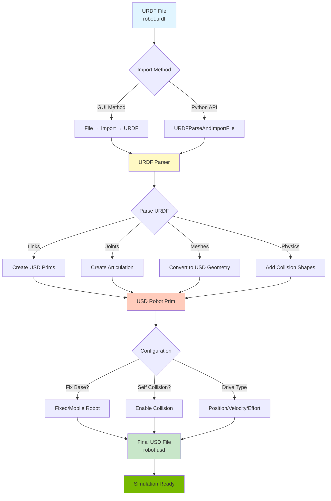
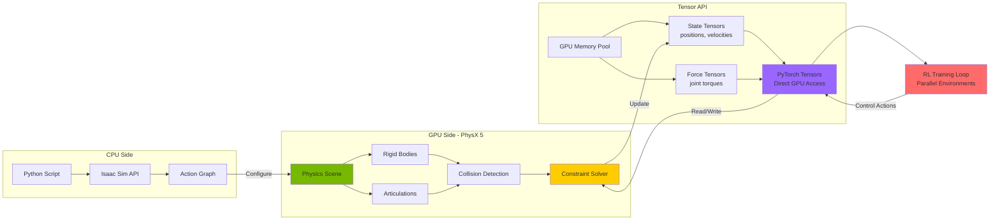
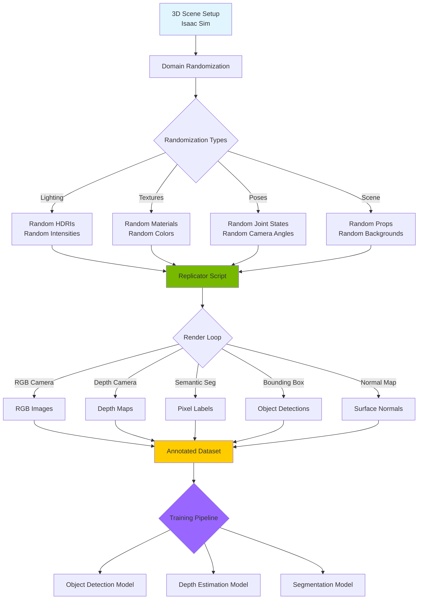
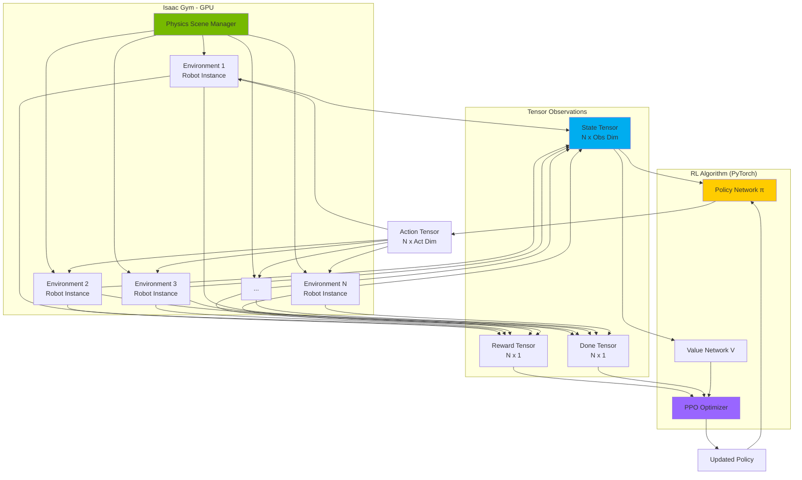
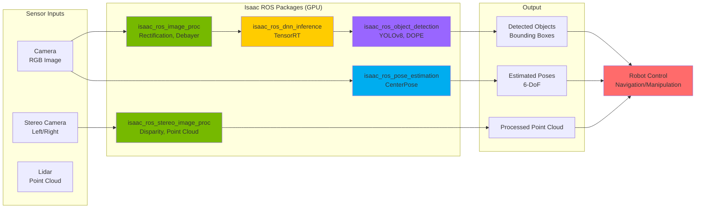

# Chapter 06: Additional Mermaid Diagrams

This file contains additional Mermaid diagrams for Chapter 06 that can be integrated into the main content or subsections.

## Diagram 1: URDF to USD Import Pipeline

Shows the complete process of importing a URDF robot into Isaac Sim and converting to USD format.



**Use Case:** Include this in the "Importing URDF Humanoid" section to show the complete workflow.

---

## Diagram 2: ROS 2 Bridge Architecture

Illustrates the bidirectional communication between Isaac Sim and ROS 2 ecosystem.

```mermaid
graph TB
    subgraph "Isaac Sim"
        A[Action Graph System]
        B[On Playback Tick<br/>Clock Source]
        C[Robot Articulation<br/>USD Prim]

        D[ROS2 Publishers]
        E[ROS2 Subscribers]

        B --> D
        C --> D
        E --> C
    end

    subgraph "ROS 2 Topics"
        F[/joint_states<br/>sensor_msgs/JointState]
        G[/clock<br/>rosgraph_msgs/Clock]
        H[/tf<br/>tf2_msgs/TFMessage]
        I[/joint_commands<br/>sensor_msgs/JointState]
    end

    subgraph "ROS 2 Nodes"
        J[Robot State Publisher]
        K[Controller Manager]
        L[Custom Control Node]
        M[RViz2 Visualization]
    end

    D -->|Publish| F
    D -->|Publish| G
    D -->|Publish| H
    I -->|Subscribe| E

    F --> J
    G --> M
    H --> M
    L --> I
    K --> I

    J --> N[URDF Transform Tree]
    N --> M

    style A fill:#76b900
    style D fill:#00adef
    style E fill:#ffcc00
    style M fill:#9966ff
```

**Use Case:** Include this in the "ROS 2 Bridge Setup" section to explain the communication flow.

---

## Diagram 3: GPU Physics Pipeline

Shows how PhysX 5 GPU physics works with PyTorch tensor API.



**Use Case:** Include this in the "Key Concepts" section under "PhysX Tensor API for RL Training".

---

## Diagram 4: Synthetic Data Generation Pipeline

Shows Omniverse Replicator workflow for generating training datasets.



**Use Case:** Include this in a "Synthetic Data Generation" subsection (mentioned as future content in index.mdx).

---

## Diagram 5: Isaac Gym Multi-Environment Training

Illustrates massively parallel RL training with Isaac Gym.



**Use Case:** Include this in an "Isaac Gym for RL" subsection (mentioned as future content in index.mdx).

---

## Diagram 6: Isaac ROS Perception Pipeline

Shows how Isaac ROS packages accelerate perception tasks on GPU.



**Use Case:** Include this in an "Isaac ROS Integration" subsection (mentioned as future content in index.mdx).

---

## Integration Instructions

### Diagram Placement Recommendations:

1. **URDF to USD Import Pipeline** → Insert in "Importing URDF Humanoid" section after the code examples
2. **ROS 2 Bridge Architecture** → Insert in "ROS 2 Bridge Setup" section before the code examples
3. **GPU Physics Pipeline** → Insert in "Key Concepts" section under "PhysX Tensor API for RL Training"
4. **Synthetic Data Generation** → Create new subsection "Advanced: Synthetic Data Generation"
5. **Isaac Gym Multi-Environment Training** → Create new subsection "Advanced: Isaac Gym for RL"
6. **Isaac ROS Perception Pipeline** → Create new subsection "Advanced: Isaac ROS Integration"

### Task T073 Status:
- ✅ 2 diagrams already in index.mdx (Isaac Platform Ecosystem, Interface Overview)
- ✅ 6 additional diagrams created in this file
- ✅ **Total: 8 diagrams** (exceeds target of 4-6)

All diagrams use clear visual hierarchy, color coding, and practical use cases relevant to humanoid robotics development.
