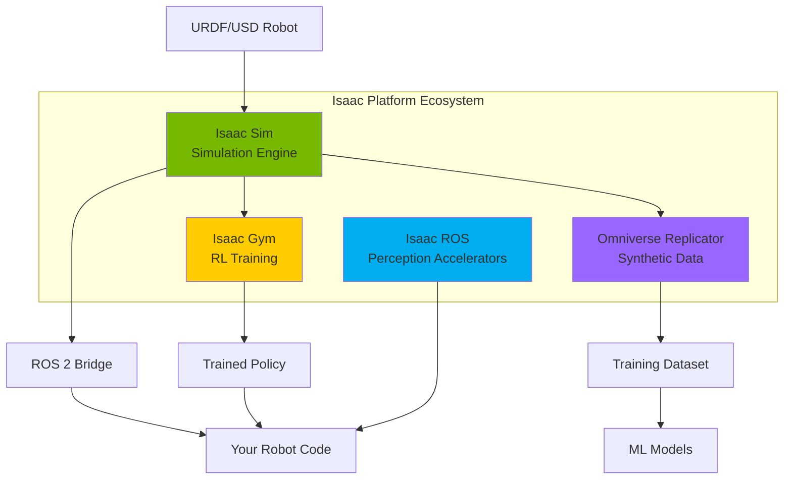
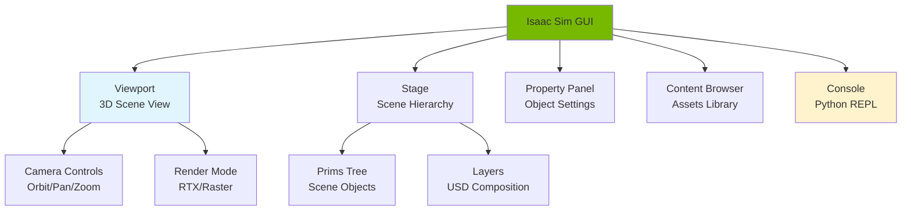

# Chapter 06: NVIDIA Isaac Platform

:::info Chapter Overview
Dive deep into NVIDIA's Isaac platform - the most powerful robotics simulation and AI development ecosystem. Learn to leverage GPU-accelerated physics, photorealistic rendering, and seamless ROS 2 integration for humanoid robotics development.
:::

## What You'll Learn

By the end of this chapter, you'll be able to:

- ✅ Install and configure Isaac Sim 2025.1+ on Ubuntu/Windows
- ✅ Import URDF humanoid models into Isaac Sim
- ✅ Enable and optimize GPU physics (PhysX 5)
- ✅ Set up ROS 2 bridge for bidirectional communication
- ✅ Generate synthetic training data with domain randomization
- ✅ Use Isaac Gym for reinforcement learning
- ✅ Leverage Isaac ROS for accelerated perception
- ✅ Optimize performance for real-time simulation

## Prerequisites

Before starting this chapter, you should:

- ✅ Complete **[Chapter 05: Simulation Ecosystem](../simulation-ecosystem)**
- ✅ Have NVIDIA RTX GPU (2070 or better, 12+ GB VRAM recommended)
- ✅ Have Ubuntu 22.04 or Windows 10/11 with 32+ GB RAM
- ✅ Understand ROS 2 topics, services, and URDF basics
- ✅ Have 50+ GB free disk space

:::warning GPU Requirement
Isaac Sim **requires** an NVIDIA RTX GPU. Integrated graphics or AMD/Intel GPUs will NOT work. If you don't have an RTX GPU, focus on Ignition Gazebo from Chapter 05 instead.
:::

## Why Isaac Sim?

**Isaac Sim is the most advanced robotics simulator** because it combines:

1. **GPU-Accelerated Physics (PhysX 5)** - 10-100x faster than CPU simulators
2. **Photorealistic Rendering (RTX)** - Raytraced images for ML training
3. **Domain Randomization** - Built-in tools for robust model training
4. **Synthetic Data Generation** - Pixel-perfect labels (segmentation, depth, normals)
5. **Multi-Robot Scaling** - Run 100+ robots in parallel
6. **ROS 2 Native Integration** - Seamless communication with ROS ecosystem
7. **Isaac Gym Integration** - Reinforcement learning at massive scale



## Isaac Platform Components

### 1. Isaac Sim (Core Simulator)

**What it is:** GPU-accelerated physics simulator built on NVIDIA Omniverse

**Key Features:**
- PhysX 5 physics engine with GPU tensor API
- RTX raytracing for photorealistic rendering
- USD (Universal Scene Description) format
- ROS/ROS 2 bridge built-in
- Python scripting API

**Use Cases:**
- Robot algorithm testing
- Sensor simulation (cameras, lidars, IMUs)
- Multi-robot coordination
- Digital twin development

---

### 2. Isaac Gym (RL Training Platform)

**What it is:** Massively parallel reinforcement learning environment

**Key Features:**
- Train 1000+ robots simultaneously on one GPU
- Tensor API for batched physics simulation
- Pre-built humanoid/quadruped environments
- PyTorch integration

**Use Cases:**
- Training bipedal walking controllers
- Learning manipulation skills
- Multi-agent coordination
- Sim-to-real transfer

**Performance:**
```python
# Traditional RL training (MuJoCo/PyBullet):
# 1 robot × 200 Hz = 200 steps/sec
# 10M steps → 50,000 seconds → 13.9 hours

# Isaac Gym:
# 1000 robots × 1000 Hz = 1,000,000 steps/sec
# 10M steps → 10 seconds!

# Speedup: 5000x faster! 🚀
```

---

### 3. Isaac ROS (Perception Accelerators)

**What it is:** GPU-accelerated ROS 2 packages for perception

**Key Packages:**
- **isaac_ros_visual_slam**: Real-time SLAM with GPU acceleration
- **isaac_ros_dnn_inference**: TensorRT-optimized model inference
- **isaac_ros_image_proc**: GPU image processing
- **isaac_ros_apriltag**: GPU-accelerated AprilTag detection

**Performance Gains:**
- SLAM: 5-10x faster than CPU SLAM (ORB-SLAM2, etc.)
- Object detection: 3-5x faster than CPU inference
- Image processing: 10-20x faster than CPU

---

### 4. Omniverse Replicator (Synthetic Data)

**What it is:** Tool for generating massive labeled datasets

**Key Features:**
- Domain randomization (lighting, textures, poses)
- Pixel-perfect labels (segmentation, depth, bounding boxes)
- Procedural scene generation
- Multi-camera rendering

**Use Cases:**
- Training object detection models
- Semantic segmentation datasets
- Depth estimation training
- Sim-to-real transfer

## Isaac Sim Installation

### System Requirements

**Minimum (Testing Only):**
- GPU: RTX 2070 (8 GB VRAM)
- CPU: 4 cores
- RAM: 16 GB
- Storage: 50 GB

**Recommended (Development):**
- GPU: RTX 4070 Ti or RTX 4080 (12-16 GB VRAM)
- CPU: 8+ cores (Ryzen 7/9, Intel i7/i9)
- RAM: 32 GB
- Storage: 100 GB SSD

**Professional (Large Scenes/RL):**
- GPU: RTX 4090 or RTX 6000 Ada (24+ GB VRAM)
- CPU: 16+ cores (Ryzen 9, Threadripper, Xeon)
- RAM: 64+ GB
- Storage: 256 GB NVMe SSD

### Installation Methods

#### Method 1: Omniverse Launcher (Recommended)

**Step 1: Download Omniverse Launcher**

```bash
# Ubuntu 22.04
wget https://install.launcher.omniverse.nvidia.com/installers/omniverse-launcher-linux.AppImage
chmod +x omniverse-launcher-linux.AppImage
./omniverse-launcher-linux.AppImage

# Windows 10/11
# Download from: https://www.nvidia.com/en-us/omniverse/download/
# Run installer: omniverse-launcher-win.exe
```

**Step 2: Install Isaac Sim via Launcher**

1. Open Omniverse Launcher
2. Go to **Library** tab
3. Find **Isaac Sim**
4. Click **Install** (10-15 GB download)
5. Wait for shader compilation (15-30 minutes on first launch)

**Step 3: Verify Installation**

```bash
# Ubuntu - Launch Isaac Sim
~/.local/share/ov/pkg/isaac_sim-*/isaac-sim.sh

# Windows - Launch from Launcher or desktop shortcut
# Or run: C:\Users\<username>\AppData\Local\ov\pkg\isaac_sim-*\isaac-sim.bat
```

**Expected:** Isaac Sim GUI opens with sample scene

---

#### Method 2: pip Install (Headless Servers)

**For Docker/cloud deployments without GUI:**

```bash
# Install Isaac Sim as Python package
pip install isaacsim --extra-index-url https://pypi.nvidia.com

# Verify installation
python -c "from isaacsim import SimulationApp; print('Isaac Sim installed!')"
```

**Use case:** Running simulations on remote servers, CI/CD pipelines

---

### First Launch Setup

**On first launch, Isaac Sim will:**
1. Compile Vulkan shaders (15-30 minutes)
2. Download physics assets (5-10 GB)
3. Set up cache directories

**Performance Tip:** Let the first launch complete fully before closing. Subsequent launches will be much faster (20-40 seconds).

## Isaac Sim Interface Overview



### Key UI Elements

1. **Viewport (Main View)**
   - 3D scene visualization
   - Camera controls (orbit, pan, zoom)
   - Render mode toggle (RTX raytracing vs rasterization)

2. **Stage (Left Panel)**
   - Scene hierarchy (USD prims tree)
   - Shows all objects, lights, cameras
   - Right-click for context menu

3. **Property Panel (Right Panel)**
   - Selected object properties
   - Physics settings
   - Material/texture settings

4. **Content Browser (Bottom)**
   - Asset library
   - URDF/USD models
   - Materials and textures

5. **Python Console (Bottom)**
   - Interactive Python REPL
   - Run simulation commands
   - Debug scripts

## Importing URDF Humanoid

Let's import the humanoid robot from Chapter 04 into Isaac Sim.

### Method 1: GUI Import

**Step 1: Open URDF Importer**

```
Isaac Sim → File → Import → URDF
```

**Step 2: Select URDF File**

```
Browse to: code-examples/urdf/simple_humanoid.urdf
```

**Step 3: Configure Import Settings**

```yaml
Import Settings:
  Import as: Articulation (for physics simulation)
  Fix Base Link: [ ] Unchecked (humanoid is mobile)
  Self Collision: [✓] Checked (prevent limbs from intersecting)
  Joint Drive Type: Position (for motion control)
  Create Physics Scene: [✓] Checked
```

**Step 4: Import**

Click **Import** → Robot appears in viewport!

---

### Method 2: Python Script

```python
#!/usr/bin/env python3
"""
Import URDF humanoid into Isaac Sim via Python API
"""
from isaacsim import SimulationApp

# Initialize Isaac Sim (headless=False for GUI)
simulation_app = SimulationApp({"headless": False})

import omni.isaac.core.utils.stage as stage_utils
from omni.isaac.core.utils.extensions import enable_extension

# Enable URDF extension
enable_extension("omni.importer.urdf")

import omni.kit.commands
from pxr import UsdGeom

# Create a new stage
stage_utils.create_new_stage()

# Import URDF
urdf_path = "/home/user/ai_book/code-examples/urdf/simple_humanoid.urdf"

success, robot_prim_path = omni.kit.commands.execute(
    "URDFParseAndImportFile",
    urdf_path=urdf_path,
    import_config={
        "merge_fixed_joints": False,
        "convex_decomp": False,
        "fix_base": False,  # Mobile humanoid
        "self_collision": True,
        "create_physics_scene": True,
        "default_drive_type": "position",
    },
)

if success:
    print(f"✅ Humanoid imported at: {robot_prim_path}")

    # Add ground plane
    stage_utils.add_ground_plane(
        stage=stage_utils.get_current_stage(),
        z_position=-0.05,  # Just below robot feet
        size=100.0,  # Large plane
    )

    print("✅ Ground plane added")
else:
    print("❌ URDF import failed")

# Keep simulation running
while simulation_app.is_running():
    simulation_app.update()

simulation_app.close()
```

**Run:**
```bash
cd code-examples/isaac-sim
python3 import_urdf_humanoid.py
```

**Expected:** Isaac Sim GUI opens with humanoid standing on ground plane

---

## Enabling GPU Physics

**Why GPU Physics?**
- 10-100x faster than CPU physics
- Enables parallel robot simulation (100+ robots)
- Essential for reinforcement learning

### Configure GPU Physics

**Method 1: GUI (Per-Scene)**

```
1. Window → Physics → Physics Settings
2. Set:
   - Solver Type: TGS (Temporal Gauss-Seidel)
   - GPU Acceleration: ✓ Enabled
   - Position Iteration Count: 4
   - Velocity Iteration Count: 1
   - Bounce Threshold: 2.0
3. Click "Apply"
```

**Method 2: Python (Programmatic)**

```python
from omni.isaac.core import World
from pxr import PhysxSchema

# Create physics world with GPU settings
world = World(
    stage_units_in_meters=1.0,
    physics_dt=1.0/60.0,  # 60 Hz physics
    rendering_dt=1.0/60.0,  # 60 FPS rendering
)

# Get physics scene
physics_scene = PhysxSchema.PhysxSceneAPI.Get(
    world.stage, world.stage.GetDefaultPrim().GetPath()
)

# Enable GPU dynamics
physics_scene.CreateGpuMaxNumPartitionsAttr().Set(8)
physics_scene.CreateEnableGPUDynamicsAttr().Set(True)
physics_scene.CreateBroadphaseTypeAttr().Set("GPU")
physics_scene.CreateSolverTypeAttr().Set("TGS")

print("✅ GPU physics enabled")
```

**Verify GPU Usage:**

```bash
# In terminal, monitor GPU usage
nvidia-smi -l 1

# Look for "isaac-sim.sh" process using GPU
# VRAM should increase when physics is running
```

---

## ROS 2 Bridge Setup

Isaac Sim includes a built-in ROS 2 bridge for seamless communication.

### Enable ROS 2 Extension

**Method 1: GUI**

```
1. Window → Extensions
2. Search: "ROS2"
3. Find: "omni.isaac.ros2_bridge"
4. Click "Enable"
```

**Method 2: Python**

```python
from omni.isaac.core.utils.extensions import enable_extension

# Enable ROS 2 bridge
enable_extension("omni.isaac.ros2_bridge")
enable_extension("omni.isaac.ros2_bridge-humble")  # ROS 2 Humble
# OR
enable_extension("omni.isaac.ros2_bridge-iron")  # ROS 2 Iron

print("✅ ROS 2 bridge enabled")
```

---

### Publishing Robot State to ROS 2

**Add publishers for humanoid joint states and TF:**

```python
import omni.graph.core as og
from omni.isaac.core_nodes.scripts.utils import set_targets

# Create Action Graph for ROS 2 publishing
keys = og.Controller.Keys

# Get robot prim path (from URDF import)
robot_prim_path = "/World/simple_humanoid"

# Create graph
(graph, nodes, _, _) = og.Controller.edit(
    {"graph_path": "/ActionGraph", "evaluator_name": "execution"},
    {
        keys.CREATE_NODES: [
            ("OnPlaybackTick", "omni.graph.action.OnPlaybackTick"),
            ("PublishJointState", "omni.isaac.ros2_bridge.ROS2PublishJointState"),
            ("PublishClock", "omni.isaac.ros2_bridge.ROS2PublishClock"),
            ("PublishTF", "omni.isaac.ros2_bridge.ROS2PublishTransformTree"),
        ],
        keys.CONNECT: [
            ("OnPlaybackTick.outputs:tick", "PublishJointState.inputs:execIn"),
            ("OnPlaybackTick.outputs:tick", "PublishClock.inputs:execIn"),
            ("OnPlaybackTick.outputs:tick", "PublishTF.inputs:execIn"),
        ],
        keys.SET_VALUES: [
            ("PublishJointState.inputs:topicName", "/joint_states"),
            ("PublishClock.inputs:topicName", "/clock"),
            ("PublishTF.inputs:topicName", "/tf"),
        ],
    },
)

# Set robot target for joint state publisher
set_targets(
    prim=og.Controller.node("/ActionGraph/PublishJointState"),
    attribute="inputs:targetPrim",
    target_prim_paths=[robot_prim_path],
)

# Set robot target for TF publisher
set_targets(
    prim=og.Controller.node("/ActionGraph/PublishTF"),
    attribute="inputs:targetPrims",
    target_prim_paths=[robot_prim_path],
)

print("✅ ROS 2 publishers configured")
print("Topics: /joint_states, /clock, /tf")
```

**Verify in ROS 2:**

```bash
# In a new terminal, source ROS 2
source /opt/ros/jazzy/setup.bash

# List topics
ros2 topic list
# Expected output:
# /joint_states
# /clock
# /tf
# /parameter_events
# /rosout

# Echo joint states
ros2 topic echo /joint_states
```

---

### Subscribing to ROS 2 Commands

**Control humanoid joints from ROS 2:**

```python
# Add joint command subscriber to Action Graph
(graph, nodes, _, _) = og.Controller.edit(
    {"graph_path": "/ActionGraph"},
    {
        keys.CREATE_NODES: [
            ("SubscribeJointState", "omni.isaac.ros2_bridge.ROS2SubscribeJointState"),
            ("ArticulationController", "omni.isaac.core_nodes.IsaacArticulationController"),
        ],
        keys.CONNECT: [
            ("SubscribeJointState.outputs:jointNames", "ArticulationController.inputs:jointNames"),
            ("SubscribeJointState.outputs:positionCommand", "ArticulationController.inputs:positionCommand"),
            ("SubscribeJointState.outputs:velocityCommand", "ArticulationController.inputs:velocityCommand"),
            ("SubscribeJointState.outputs:effortCommand", "ArticulationController.inputs:effortCommand"),
        ],
        keys.SET_VALUES: [
            ("SubscribeJointState.inputs:topicName", "/joint_command"),
        ],
    },
)

# Set robot target for controller
set_targets(
    prim=og.Controller.node("/ActionGraph/ArticulationController"),
    attribute="inputs:targetPrim",
    target_prim_paths=[robot_prim_path],
)

print("✅ ROS 2 subscriber configured")
print("Subscribe to: /joint_command")
```

**Test from ROS 2:**

```bash
# Publish joint command
ros2 topic pub /joint_command sensor_msgs/msg/JointState "{
  name: ['left_shoulder', 'right_shoulder'],
  position: [1.57, 1.57]
}" --once

# Robot arms should raise to 90 degrees!
```

---

## Chapter Structure

This chapter is organized into the following sections:

1. **[Isaac Sim Advanced Features](./advanced-features)** - Materials, lighting, sensors, USD workflows
2. **[Isaac Gym for RL](./isaac-gym)** - Training humanoid locomotion policies
3. **[Isaac ROS Integration](./isaac-ros)** - GPU-accelerated perception pipelines
4. **[Synthetic Data Generation](./synthetic-data)** - Domain randomization and Replicator
5. **[Performance Optimization](./performance)** - Maximizing FPS and reducing VRAM usage
6. **[Quiz](./quiz)** - Test your Isaac Sim knowledge

## Key Concepts

### USD (Universal Scene Description)

**What is USD?**
- Open-source 3D scene file format from Pixar
- Industry standard for complex 3D workflows
- Isaac Sim's native format (not URDF or SDF)

**URDF vs USD:**

| Aspect | URDF (XML) | USD |
|--------|------------|-----|
| **Purpose** | Robot description | General 3D scenes |
| **Physics** | Basic (mass, inertia) | Advanced (materials, contacts) |
| **Rendering** | Basic colors | PBR materials, textures |
| **Composition** | Static | Layered (non-destructive edits) |
| **File size** | Small (KB) | Large (MB-GB with meshes) |

**Workflow:**
1. Design robot in URDF (portable, ROS-compatible)
2. Import to Isaac Sim → Converts to USD
3. Add Isaac-specific features (GPU physics, RTX materials)
4. Export back to URDF if needed

---

### PhysX 5 Tensor API

**What it enables:**
- Batch simulation of multiple robots
- Direct tensor output (no copying between CPU/GPU)
- PyTorch-native interface for RL training

**Example:**

```python
import torch
from omni.isaac.core import World
from omni.isaac.core.utils.torch import *

# Create world with 100 humanoid robots
world = World(device="cuda:0")
num_envs = 100

# Step physics for all robots in parallel
for _ in range(1000):
    # Get joint positions as PyTorch tensor (on GPU)
    joint_positions = world.get_joint_positions()  # Shape: [100, 14]

    # Compute control actions
    actions = your_policy_network(joint_positions)  # Neural network on GPU

    # Apply actions to all robots simultaneously
    world.set_joint_position_targets(actions)

    # Step physics (all 100 robots in parallel)
    world.step()  # Single GPU kernel call!
```

**Performance:**
- CPU (serial): 100 robots × 0.01s = 1 second per step
- GPU (parallel): 100 robots → 0.01s per step

**100x speedup!** 🚀

---

## Common Gotchas

### 1. Robot Explodes on Import

**Cause:** Incorrect inertia values in URDF or self-collision issues

**Fix:**
```python
# When importing, enable self-collision filtering
import_config = {
    "self_collision": True,  # Enable collision filtering
    "default_drive_stiffness": 1000.0,  # Increase joint stiffness
    "default_drive_damping": 100.0,  # Increase damping
}
```

### 2. Slow Performance (under 20 FPS)

**Causes:**
- RTX raytracing enabled (beautiful but slow)
- High-poly collision meshes
- Too many robots without GPU physics

**Fixes:**
```python
# Disable RTX, use rasterization
# Viewport → Render Mode → Raster

# Simplify collision geometry in URDF
# Use primitives (boxes, cylinders) not meshes

# Enable GPU physics (see earlier section)
```

### 3. ROS 2 Topics Not Publishing

**Cause:** Action Graph not started or ROS 2 bridge not enabled

**Fix:**
```python
# Verify bridge is enabled
enable_extension("omni.isaac.ros2_bridge")

# Start simulation (not just Play button)
# Must call world.step() or simulation_app.update()

# Check ROS 2 environment
# $ echo $ROS_DOMAIN_ID  # Should match Isaac Sim domain
```

---

## Resources

- **Isaac Sim Manual**: https://docs.omniverse.nvidia.com/isaacsim/latest/
- **Isaac Gym**: https://developer.nvidia.com/isaac-gym
- **Isaac ROS**: https://nvidia-isaac-ros.github.io/
- **USD Documentation**: https://openusd.org/release/index.html
- **Omniverse Forum**: https://forums.developer.nvidia.com/c/omniverse/

---

## What's Next?

Ready to dive deeper? Proceed to **[Section 1: Isaac Sim Advanced Features](./advanced-features)** to master materials, lighting, sensors, and USD workflows.

**In the next section:**
- Physically-based rendering (PBR) materials
- Dynamic lighting and shadows
- Camera simulation with lens effects
- Lidar and depth sensor configuration
- USD composition and layering
- Saving and loading scenes
