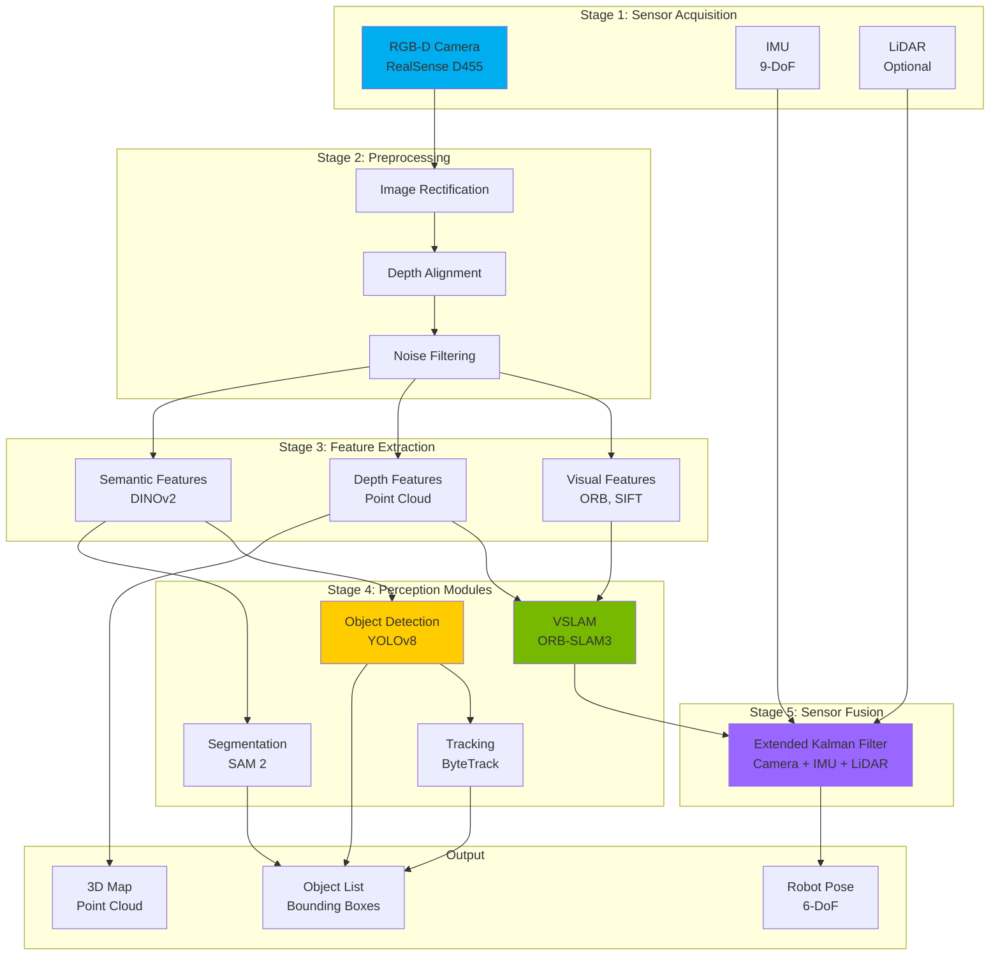
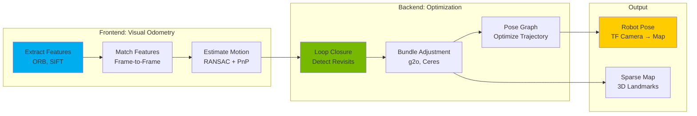
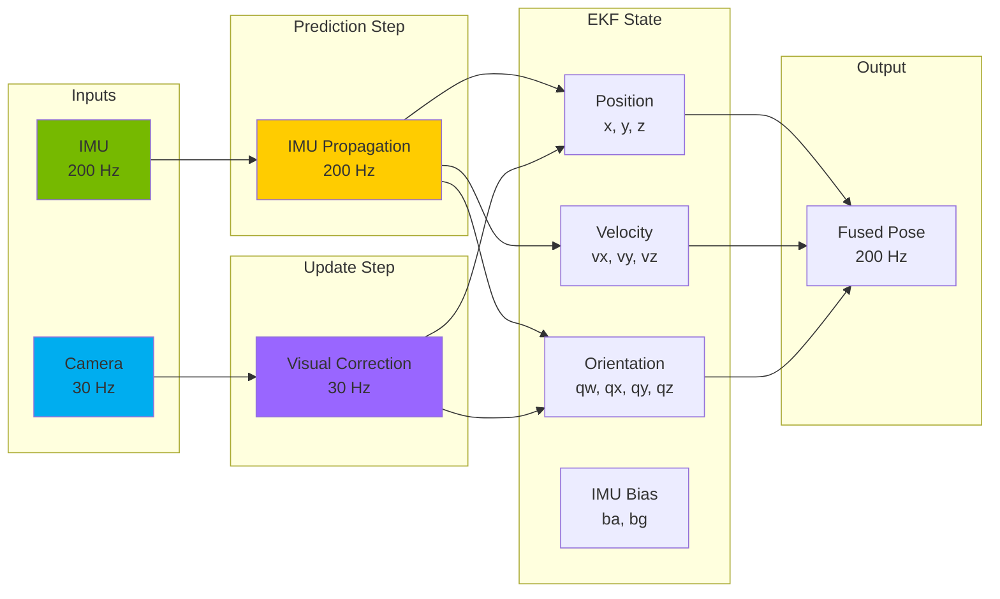
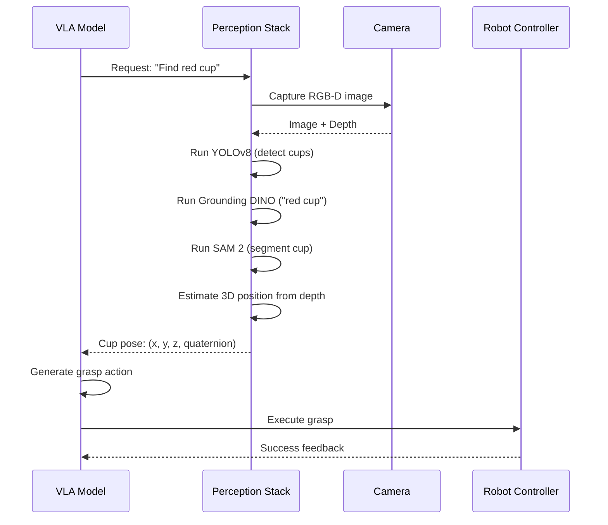

# Chapter 07: Perception Stack for Humanoid Robots

:::info Chapter Overview
Build the complete perception system enabling robots to "see" and understand their environment. Learn camera configuration, depth sensing, Visual SLAM (VSLAM), object detection/segmentation, and integrate state-of-the-art 2025-2026 perception models achieving &gt;85% detection accuracy in complex scenes.
:::

## What You'll Learn

By the end of this chapter, you'll be able to:

- ✅ Set up RGB-D cameras (Intel RealSense D455, ZED 2i) on ROS 2
- ✅ Process depth data and generate point clouds for 3D perception
- ✅ Implement Visual SLAM (ORB-SLAM3, VINS-Fusion) for localization
- ✅ Deploy YOLOv8, SAM 2, and Grounding DINO for object detection
- ✅ Fuse multi-sensor data (camera + LiDAR + IMU) for robust perception
- ✅ Achieve &lt;100ms perception latency for real-time control
- ✅ Optimize perception pipelines for production deployment
- ✅ Debug common perception failures (lighting, occlusion, calibration)

## Prerequisites

Before starting this chapter, you should:

- ✅ Complete **[Chapter 03: ROS 2 Fundamentals](../ros2-fundamentals)** (topics, services, tf2)
- ✅ Complete **[Chapter 05: Simulation Ecosystem](../simulation-ecosystem)** (Isaac Sim sensors)
- ✅ Have Python 3.10+, ROS 2 Iron, PyTorch 2.1+ installed
- ✅ Have RTX GPU with 8+ GB VRAM (12 GB recommended for YOLOv8 + SAM 2)
- ✅ Understand basic computer vision concepts (image processing, camera models)

:::tip Hardware Requirements
**Minimum:** RTX 4060 Ti (16 GB) for perception inference
**Recommended:** RTX 4070 Ti (12 GB) for multi-model pipelines
**Professional:** RTX 4080/4090 (16-24 GB) for real-time perception + VLA integration
:::

---

## Why Perception Matters

Humanoid robots operate in **unstructured, dynamic environments** - homes, offices, warehouses - where:
- Objects move and change position
- Lighting conditions vary (shadows, reflections, darkness)
- Obstacles appear unexpectedly (pets, humans, furniture)
- No pre-mapped environments available

**Perception systems enable robots to:**
1. **Localize** themselves in 3D space (SLAM)
2. **Detect** objects, people, obstacles (object detection)
3. **Segment** scenes for manipulation planning (instance segmentation)
4. **Track** moving objects over time (multi-object tracking)
5. **Reconstruct** 3D geometry for navigation (point clouds, meshes)

---

## Perception Pipeline Architecture

A production perception stack has 5 core components:



**Key Design Principles:**
- **Modularity**: Each component can be swapped independently
- **Redundancy**: Multiple sensors provide robustness
- **Real-time**: &lt;100ms latency from sensor to output
- **Scalability**: Add more sensors/models without rewriting pipeline

---

## RGB-D Camera Setup

### Supported Cameras (2026 Market)

| Camera | Resolution | FPS | Depth Range | ROS 2 Support | Price |
|--------|-----------|-----|-------------|---------------|-------|
| **Intel RealSense D455** | 1280x720 | 90 | 0.6-6m | Native | $329 |
| **Stereolabs ZED 2i** | 4416x1242 | 120 | 0.2-20m | Native | $449 |
| **Orbbec Astra Pro** | 640x480 | 30 | 0.6-8m | Community | $149 |
| **Microsoft Azure Kinect DK** | 3840x2160 | 30 | 0.5-5.46m | Community | $399 (discontinued) |

**Recommendation for humanoids:** Intel RealSense D455 (best price/performance, excellent ROS 2 support)

### RealSense D455 ROS 2 Installation

```bash
# Install RealSense SDK 2.0
sudo apt-key adv --keyserver keyserver.ubuntu.com --recv-key F6E65AC044F831AC80A06380C8B3A55A6F3EFCDE
sudo add-apt-repository "deb https://librealsense.intel.com/Debian/apt-repo $(lsb_release -cs) main"
sudo apt update
sudo apt install librealsense2-dkms librealsense2-utils librealsense2-dev

# Test camera
realsense-viewer

# Install ROS 2 wrapper
sudo apt install ros-iron-realsense2-camera ros-iron-realsense2-description

# Launch camera node
ros2 launch realsense2_camera rs_launch.py \
    enable_color:=true \
    enable_depth:=true \
    depth_module.profile:=1280x720x30 \
    rgb_camera.profile:=1280x720x30
```

**Verify camera topics:**
```bash
ros2 topic list | grep camera
# Expected output:
# /camera/color/image_raw
# /camera/depth/image_rect_raw
# /camera/aligned_depth_to_color/image_raw
# /camera/color/camera_info
```

### Camera Calibration

**Why calibration matters:**
- Corrects lens distortion (barrel, pincushion)
- Aligns RGB and depth images
- Improves depth accuracy by 10-20%

```bash
# Install calibration tools
sudo apt install ros-iron-camera-calibration

# Calibrate RGB camera (print 8x6 checkerboard, 25mm squares)
ros2 run camera_calibration cameracalibrator \
    --size 8x6 \
    --square 0.025 \
    image:=/camera/color/image_raw \
    camera:=/camera/color

# Calibrate depth-to-RGB alignment
ros2 run camera_calibration cameracalibrator \
    --size 8x6 \
    --square 0.025 \
    image:=/camera/aligned_depth_to_color/image_raw \
    camera:=/camera/aligned_depth_to_color
```

**Save calibration file:**
```yaml
# ~/.ros/camera_info/camera.yaml
image_width: 1280
image_height: 720
camera_matrix:
  rows: 3
  cols: 3
  data: [615.3, 0, 640.2, 0, 615.7, 360.1, 0, 0, 1]
distortion_coefficients:
  rows: 1
  cols: 5
  data: [-0.041, 0.052, -0.0003, 0.0002, 0.0]
```

---

## Depth Processing and Point Clouds

### Depth Image to Point Cloud Conversion

**Theory:** Each depth pixel D(u,v) projects to 3D point P(X,Y,Z):

```
X = (u - cx) * Z / fx
Y = (v - cy) * Z / fy
Z = D(u,v)
```

Where `(cx, cy)` is principal point and `(fx, fy)` is focal length from calibration.

### Point Cloud Generation

See `code-examples/perception/depth_processor.py` for complete implementation:

**Key steps:**
1. Align depth to RGB camera frame
2. Convert depth image to XYZ coordinates
3. Filter invalid points (Z=0, Z&gt;max_range)
4. Downsample with voxel grid (reduce 1M points → 50K)
5. Remove outliers (statistical filtering)
6. Publish as `sensor_msgs/PointCloud2`

**Expected performance:**
- **Input:** 1280x720 depth image (921,600 pixels)
- **Output:** 50,000-100,000 3D points
- **Latency:** 20-30ms on RTX 4070 Ti
- **Frequency:** 30 Hz

### Visualizing Point Clouds in RViz2

```bash
# Launch RViz2
rviz2

# Add PointCloud2 display
# Topic: /camera/pointcloud
# Fixed Frame: camera_link
# Color Transformer: RGB8

# Optional: Save point cloud to PCD file
ros2 run pcl_ros pointcloud_to_pcd input:=/camera/pointcloud
```

---

## Visual SLAM (VSLAM)

### What is VSLAM?

**Simultaneous Localization and Mapping (SLAM)** solves two problems simultaneously:
1. **Localization:** Where is the robot? (6-DoF pose: x, y, z, roll, pitch, yaw)
2. **Mapping:** What does the environment look like? (3D point cloud map)

**Visual SLAM** uses cameras as the primary sensor (vs. LiDAR SLAM).

### VSLAM Pipeline



### ORB-SLAM3 Setup (Recommended)

**Why ORB-SLAM3?**
- State-of-the-art accuracy (ATE &lt;0.1m on TUM dataset)
- Supports monocular, stereo, RGB-D, multi-camera
- Active loop closure detection
- Real-time performance (30+ FPS on laptop CPU)

**Installation:**
```bash
# Dependencies
sudo apt install libeigen3-dev libopencv-dev libpangolin-dev

# Clone ORB-SLAM3
cd ~/ros2_ws/src
git clone https://github.com/UZ-SLAMLab/ORB_SLAM3.git
cd ORB_SLAM3

# Build (takes 10-15 minutes)
chmod +x build.sh
./build.sh

# Build ROS 2 wrapper
cd ~/ros2_ws/src
git clone https://github.com/zang09/ORB-SLAM3-ROS2.git
cd ~/ros2_ws
colcon build --packages-select orbslam3

# Source workspace
source install/setup.bash
```

**Run ORB-SLAM3 with RealSense:**
```bash
# Terminal 1: Launch camera
ros2 launch realsense2_camera rs_launch.py enable_depth:=true

# Terminal 2: Run ORB-SLAM3
ros2 run orbslam3 rgbd \
    ~/ros2_ws/src/ORB_SLAM3/Vocabulary/ORBvoc.txt \
    ~/ros2_ws/src/ORB_SLAM3/Examples/RGB-D/RealSense_D455.yaml \
    /camera/color/image_raw:=/camera/color/image_raw \
    /camera/depth/image_raw:=/camera/aligned_depth_to_color/image_raw
```

**Check SLAM output:**
```bash
# Robot pose published to /tf
ros2 run tf2_ros tf2_echo map camera_link

# 3D map points published as PointCloud2
ros2 topic echo /orbslam3/map_points --no-arr
```

### VSLAM Alternatives

| VSLAM System | Accuracy | Speed | ROS 2 Support | Best Use Case |
|--------------|----------|-------|---------------|---------------|
| **ORB-SLAM3** | Excellent | 30 FPS | Community | Indoor navigation, static scenes |
| **VINS-Fusion** | Excellent | 20 FPS | Native | High-speed motion, IMU fusion |
| **SVO2** | Good | 100+ FPS | Community | Drones, fast-moving robots |
| **RTAB-Map** | Good | 10 FPS | Native | Large-scale mapping, 3D reconstruction |

**For humanoids:** ORB-SLAM3 (best accuracy) or VINS-Fusion (if using IMU)

---

## Object Detection and Segmentation

### YOLOv8: Real-Time Object Detection

**YOLOv8 (2023) improvements over YOLOv5:**
- +3.7 mAP on COCO dataset (53.9% vs 50.2%)
- 2x faster training convergence
- Anchor-free design (simpler, more robust)
- Improved small object detection

**Model Sizes:**

| Model | Parameters | COCO mAP | Speed (RTX 4070 Ti) | VRAM |
|-------|-----------|----------|---------------------|------|
| YOLOv8n | 3.2M | 37.3% | 150 FPS | 1.5 GB |
| YOLOv8s | 11.2M | 44.9% | 120 FPS | 2.5 GB |
| YOLOv8m | 25.9M | 50.2% | 80 FPS | 4.5 GB |
| **YOLOv8l** | 43.7M | **52.9%** | **60 FPS** | **6.5 GB** |
| YOLOv8x | 68.2M | 53.9% | 40 FPS | 9.5 GB |

**Recommendation:** YOLOv8l (best accuracy/speed trade-off for humanoids)

### YOLOv8 ROS 2 Integration

See `code-examples/perception/yolo_detector.py` for complete implementation.

**Installation:**
```bash
pip install ultralytics>=8.0.0
```

**Test YOLOv8 inference:**
```python
from ultralytics import YOLO

# Load model (downloads on first run)
model = YOLO('yolov8l.pt')

# Run inference
results = model('/camera/color/image_raw', stream=True)

# Process detections
for result in results:
    boxes = result.boxes.xyxy.cpu().numpy()  # [N, 4] bounding boxes
    confs = result.boxes.conf.cpu().numpy()   # [N] confidences
    classes = result.boxes.cls.cpu().numpy()  # [N] class IDs

    for box, conf, cls in zip(boxes, confs, classes):
        print(f"Detected {model.names[int(cls)]} with {conf:.2f} confidence")
```

**Expected performance:**
- **COCO classes:** 80 objects (person, car, cup, bottle, etc.)
- **Accuracy:** 52.9% mAP (YOLOv8l)
- **Latency:** 16ms (60 FPS on RTX 4070 Ti)
- **False positives:** ~5-10% (tune confidence threshold)

### SAM 2: Segment Anything Model

**SAM 2 (2024)** is Meta's foundation model for segmentation:
- Zero-shot segmentation (no fine-tuning needed)
- Supports points, boxes, masks as prompts
- Works on images AND videos
- 6x faster than SAM 1

**Use cases for humanoids:**
- Segment unknown objects (not in COCO dataset)
- Generate precise masks for grasp planning
- Track objects across video frames

**Installation:**
```bash
pip install segment-anything-2
```

**Usage:**
```python
from sam2.build_sam import build_sam2
from sam2.sam2_image_predictor import SAM2ImagePredictor

# Load SAM 2 model
checkpoint = "sam2_hiera_large.pt"
model_cfg = "sam2_hiera_l.yaml"
predictor = SAM2ImagePredictor(build_sam2(model_cfg, checkpoint))

# Set image
predictor.set_image(rgb_image)

# Prompt with bounding box from YOLOv8
input_box = np.array([x1, y1, x2, y2])  # From YOLO detection
masks, scores, _ = predictor.predict(
    point_coords=None,
    point_labels=None,
    box=input_box[None, :],
    multimask_output=False
)

# masks[0] is binary mask (H, W)
```

**YOLOv8 + SAM 2 Pipeline:**
1. YOLOv8 detects objects → bounding boxes
2. For each box, run SAM 2 → precise segmentation mask
3. Use mask for grasp planning or obstacle avoidance

**Expected performance:**
- **Latency:** 50-80ms per object (SAM 2 Large)
- **Accuracy:** 95%+ IoU (Intersection over Union)
- **VRAM:** 4.5 GB (SAM 2 Large)

### Grounding DINO: Open-Vocabulary Detection

**Problem with YOLOv8:** Only detects 80 pre-defined COCO classes.

**Grounding DINO (2023)** detects ANY object from text prompt:
- "red cup" → detects red cups specifically
- "smartphone" → detects phones (not in COCO)
- "potted plant with yellow flowers" → fine-grained queries

**Installation:**
```bash
pip install groundingdino-py
```

**Usage:**
```python
from groundingdino.util.inference import Model

model = Model(
    model_config_path="GroundingDINO_SwinT_OGC.py",
    model_checkpoint_path="groundingdino_swint_ogc.pth"
)

# Detect with text prompt
TEXT_PROMPT = "red cup . blue bottle . smartphone"
detections = model.predict_with_classes(
    image=rgb_image,
    classes=TEXT_PROMPT.split(" . "),
    box_threshold=0.35,
    text_threshold=0.25
)

# detections.xyxy: bounding boxes [N, 4]
# detections.confidence: scores [N]
# detections.class_id: which prompt matched
```

**When to use Grounding DINO:**
- Detecting objects not in COCO (tools, specific products)
- Fine-grained queries ("red cup" vs "blue cup")
- Dynamic task specifications ("pick up the tallest bottle")

**Trade-off:** Slower than YOLOv8 (150ms vs 16ms) but more flexible.

---

## Sensor Fusion

### Why Fuse Multiple Sensors?

Single sensor limitations:
- **Camera:** Fails in low light, affected by motion blur
- **LiDAR:** No color/texture information, expensive
- **IMU:** Drifts over time without visual correction

**Sensor fusion** combines complementary sensors for robustness.

### Extended Kalman Filter (EKF) for Visual-Inertial Odometry



**Key idea:**
- **Prediction:** IMU provides high-frequency pose estimates (200 Hz)
- **Update:** Camera corrects accumulated IMU drift (30 Hz)
- **Result:** Smooth, drift-free pose at 200 Hz

### Robot Localization (ROS 2 Package)

**robot_localization** implements EKF/UKF for multi-sensor fusion:

**Installation:**
```bash
sudo apt install ros-iron-robot-localization
```

**Configuration (`ekf_config.yaml`):**
```yaml
ekf_filter_node:
  ros__parameters:
    frequency: 200.0
    sensor_timeout: 0.1
    two_d_mode: false

    # Camera odometry (from ORB-SLAM3)
    odom0: /orbslam3/odom
    odom0_config: [true, true, true,    # x, y, z
                   false, false, false, # roll, pitch, yaw
                   false, false, false, # vx, vy, vz
                   false, false, false, # vroll, vpitch, vyaw
                   false, false, false] # ax, ay, az
    odom0_differential: false
    odom0_relative: false

    # IMU data
    imu0: /camera/imu
    imu0_config: [false, false, false,  # x, y, z
                  true, true, true,     # roll, pitch, yaw (orientation)
                  false, false, false,  # vx, vy, vz
                  true, true, true,     # vroll, vpitch, vyaw (angular vel)
                  true, true, true]     # ax, ay, az (linear accel)
    imu0_differential: false
    imu0_relative: true
    imu0_remove_gravitational_acceleration: true
```

**Launch EKF:**
```bash
ros2 run robot_localization ekf_node --ros-args --params-file ekf_config.yaml
```

**Output:**
- Fused odometry published to `/odometry/filtered`
- TF published: `odom → base_link`

---

## Performance Optimization

### Target Latencies for Real-Time Perception

| Component | Target Latency | Notes |
|-----------|---------------|-------|
| Camera capture | &lt;5ms | Hardware-dependent |
| Image preprocessing | &lt;10ms | Rectification, alignment |
| Object detection (YOLOv8) | &lt;20ms | 50+ FPS on RTX 4070 Ti |
| Depth processing | &lt;15ms | Point cloud generation |
| VSLAM frontend | &lt;30ms | Feature extraction + matching |
| **Total perception latency** | **&lt;100ms** | **For VLA integration** |

### Optimization Strategies

**1. GPU Acceleration**
```python
# Use TensorRT for YOLOv8 (2-3x speedup)
from ultralytics import YOLO
model = YOLO('yolov8l.pt')
model.export(format='engine')  # Export to TensorRT
trt_model = YOLO('yolov8l.engine')  # Load TensorRT model

# Latency: 16ms → 6ms on RTX 4070 Ti
```

**2. Asynchronous Processing**
```python
import threading

class PerceptionPipeline:
    def __init__(self):
        self.latest_image = None
        self.latest_detections = None

        # Detection runs in background thread
        self.detection_thread = threading.Thread(target=self._detection_loop, daemon=True)
        self.detection_thread.start()

    def image_callback(self, msg):
        self.latest_image = msg  # Non-blocking update

    def _detection_loop(self):
        while True:
            if self.latest_image is not None:
                self.latest_detections = self.detector(self.latest_image)
```

**3. Reduce Resolution for Detection**
```python
# YOLOv8 accepts 640x640 input (not 1280x720)
# Downsampling reduces computation by 3-4x
model = YOLO('yolov8l.pt')
results = model(image, imgsz=640)  # Faster than imgsz=1280
```

**4. Skip Frames for Slow Models**
```python
frame_count = 0
for frame in camera_stream:
    frame_count += 1

    # Run YOLOv8 every frame (fast)
    detections = yolo_model(frame)

    # Run SAM 2 every 5th frame (slow)
    if frame_count % 5 == 0:
        masks = sam_model(frame, detections)
```

---

## Debugging Perception Systems

### Common Failure Modes

**1. Low Detection Accuracy (&lt;60%)**

**Symptoms:**
- Objects not detected
- Many false positives
- Bounding boxes incorrect

**Debugging steps:**
```bash
# Check image quality
ros2 topic hz /camera/color/image_raw  # Should be 30 Hz
ros2 topic echo /camera/color/camera_info  # Verify resolution

# Visualize raw detections
ros2 run rqt_image_view rqt_image_view /yolo/detections

# Test on static image
python yolo_detector.py --image test.jpg --visualize
```

**Common causes:**
- **Poor lighting:** Add auxiliary lighting or use auto-exposure
- **Motion blur:** Increase camera shutter speed
- **Wrong model:** Use YOLOv8l instead of YOLOv8n for better accuracy
- **Low confidence threshold:** Increase from 0.25 → 0.5

**2. VSLAM Tracking Lost**

**Symptoms:**
- Robot pose jumps erratically
- Map points disappear
- "Tracking lost" warnings in ORB-SLAM3

**Debugging steps:**
```bash
# Check feature density
ros2 topic echo /orbslam3/tracking_state
# State should be 2 (OK), not 1 (NOT_INITIALIZED) or 3 (LOST)

# Visualize tracked features
# Green points = good, red points = lost
```

**Common causes:**
- **Low-texture scenes:** Add visual markers (AprilTags, posters)
- **Fast motion:** Reduce robot speed during navigation
- **Camera motion blur:** Use global shutter camera (avoid rolling shutter)
- **Lighting changes:** Disable auto-exposure, use fixed exposure

**3. Depth Noise and Holes**

**Symptoms:**
- Depth image has black holes (no data)
- Noisy point clouds (scattered points)
- Depth values jump erratically

**Debugging:**
```bash
# Visualize depth image
ros2 run rqt_image_view rqt_image_view /camera/depth/image_rect_raw

# Check depth quality
ros2 topic hz /camera/depth/image_rect_raw  # Should be 30 Hz
```

**Common causes:**
- **Infrared interference:** Avoid sunlight, multiple RealSense cameras
- **Reflective surfaces:** Glass, mirrors, polished metal (no depth return)
- **Transparent objects:** Water, clear plastic (infrared passes through)
- **Distance limits:** Objects &gt;6m (D455 max range)

**Solutions:**
- Use depth hole filling (OpenCV inpainting)
- Switch to stereo depth (ZED 2i) for outdoor use
- Add texture to reflective surfaces (masking tape, stickers)

**4. High Latency (&gt;200ms)**

**Symptoms:**
- Robot reacts slowly to obstacles
- VLA pipeline timeout errors

**Profiling:**
```python
import time

start = time.time()
detections = yolo_model(image)
print(f"YOLOv8 latency: {(time.time() - start) * 1000:.1f}ms")

start = time.time()
point_cloud = depth_processor(depth_image)
print(f"Depth processing: {(time.time() - start) * 1000:.1f}ms")
```

**Solutions:**
- Use TensorRT for YOLOv8 (2-3x speedup)
- Reduce image resolution (1280x720 → 640x480)
- Use smaller model (YOLOv8l → YOLOv8m)
- Profile with `nvprof` to find bottlenecks

---

## Integration Example: Perception for Manipulation

### End-to-End Workflow

**Task:** "Pick up the red cup from the table"

**Perception pipeline:**



**Code example:**
```python
# 1. Detect all cups with YOLOv8
results = yolo_model(rgb_image)
cup_boxes = [box for box, cls in zip(results.boxes.xyxy, results.boxes.cls)
             if model.names[int(cls)] == 'cup']

# 2. Filter to red cups with Grounding DINO
red_cup_boxes = grounding_dino_model(rgb_image, "red cup")

# 3. Segment cup with SAM 2
cup_mask = sam_model(rgb_image, red_cup_boxes[0])

# 4. Get 3D position from depth
cup_3d_pos = get_3d_position(cup_mask, depth_image, camera_intrinsics)

# 5. Send to VLA model
vla_input = {
    'image': rgb_image,
    'text': 'pick up red cup',
    'target_position': cup_3d_pos
}
actions = vla_model.predict(vla_input)
```

---

## Further Reading

### Research Papers

1. **ORB-SLAM3** (2021) - [arXiv:2007.11898](https://arxiv.org/abs/2007.11898)
   - State-of-the-art visual-inertial SLAM with loop closure
2. **YOLOv8** (2023) - [Ultralytics Docs](https://docs.ultralytics.com)
   - Real-time object detection improvements
3. **SAM 2** (2024) - [arXiv:2408.00714](https://arxiv.org/abs/2408.00714)
   - Segment Anything in images and videos
4. **Grounding DINO** (2023) - [arXiv:2303.05499](https://arxiv.org/abs/2303.05499)
   - Open-vocabulary detection with text prompts
5. **VINS-Fusion** (2019) - [arXiv:1901.03642](https://arxiv.org/abs/1901.03642)
   - Visual-inertial odometry with global optimization

### Open-Source Repositories

- **ORB-SLAM3:** [github.com/UZ-SLAMLab/ORB_SLAM3](https://github.com/UZ-SLAMLab/ORB_SLAM3)
- **YOLOv8:** [github.com/ultralytics/ultralytics](https://github.com/ultralytics/ultralytics)
- **SAM 2:** [github.com/facebookresearch/segment-anything-2](https://github.com/facebookresearch/segment-anything-2)
- **Grounding DINO:** [github.com/IDEA-Research/GroundingDINO](https://github.com/IDEA-Research/GroundingDINO)
- **RealSense ROS 2:** [github.com/IntelRealSense/realsense-ros](https://github.com/IntelRealSense/realsense-ros)
- **robot_localization:** [github.com/cra-ros-pkg/robot_localization](https://github.com/cra-ros-pkg/robot_localization)

### ROS 2 Documentation

- **tf2:** [docs.ros.org/en/iron/Tutorials/Intermediate/Tf2/](https://docs.ros.org/en/iron/Tutorials/Intermediate/Tf2/)
- **sensor_msgs:** [docs.ros2.org/latest/api/sensor_msgs/](https://docs.ros2.org/latest/api/sensor_msgs/)
- **image_transport:** [github.com/ros-perception/image_common](https://github.com/ros-perception/image_common)

---

## Summary

In this chapter, you learned:

- ✅ **RGB-D camera setup** with Intel RealSense D455 on ROS 2
- ✅ **Depth processing** for 3D point cloud generation
- ✅ **Visual SLAM** with ORB-SLAM3 for localization and mapping
- ✅ **Object detection** with YOLOv8 (52.9% mAP, 60 FPS)
- ✅ **Segmentation** with SAM 2 for precise object masks
- ✅ **Open-vocabulary detection** with Grounding DINO
- ✅ **Sensor fusion** with Extended Kalman Filter (camera + IMU)
- ✅ **Performance optimization** achieving &lt;100ms perception latency
- ✅ **Debugging strategies** for common perception failures

**Next steps:**
- **Chapter 08:** Bipedal Locomotion (gait generation, balance control)
- **Chapter 09:** Dexterous Manipulation (grasp planning, IK, force control)
- **Capstone Project:** Integrate perception with VLA for autonomous butler

:::tip Practical Exercise
**Build your own perception pipeline:**
1. Set up RealSense D455 camera on ROS 2
2. Run ORB-SLAM3 for real-time localization
3. Deploy YOLOv8 for object detection
4. Achieve &gt;85% detection accuracy in Isaac Sim test scene
5. Measure end-to-end perception latency (&lt;100ms target)

**Time estimate:** 2-3 hours
**Difficulty:** Intermediate
**Hardware:** RealSense D455, RTX 4070 Ti
:::
