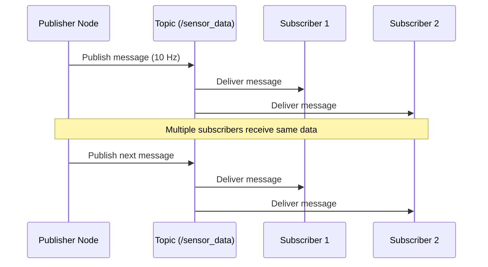

# Section 1: Nodes & Topics

## What is a ROS 2 Node?

A **node** is an independent executable process that performs computation. Think of it as a single-purpose program:

- **Camera node**: Publishes images from a camera
- **Object detection node**: Subscribes to images, publishes detected objects
- **Motor controller node**: Subscribes to velocity commands, controls motors
- **Path planner node**: Publishes navigation waypoints

**Key principle**: Each node should do **one thing well**. This modularity allows:
- **Reusability**: Camera node works with any subscriber
- **Debugging**: Isolate issues to specific nodes
- **Parallel development**: Teams work on different nodes simultaneously
- **Fault tolerance**: One node crash doesn't bring down the entire system

### Node Anatomy

```python
import rclpy
from rclpy.node import Node

class MinimalNode(Node):
    def __init__(self):
        super().__init__('minimal_node')  # Node name
        self.get_logger().info('Node started!')

def main():
    rclpy.init()           # Initialize ROS 2
    node = MinimalNode()   # Create node instance
    rclpy.spin(node)       # Keep node running
    node.destroy_node()    # Cleanup
    rclpy.shutdown()       # Shutdown ROS 2
```

**Lifecycle**:
1. `rclpy.init()` - Initialize ROS 2 context
2. Create node instance (inherits from `Node` class)
3. `rclpy.spin()` - Process callbacks (subscribers, timers, services)
4. Cleanup on exit (`destroy_node()`, `shutdown()`)

---

## What is a Topic?

A **topic** is a named communication channel. Nodes publish messages to topics, and other nodes subscribe to receive those messages.

**Analogy**: Topics are like radio frequencies:
- **Publisher** = Radio station broadcasting on 101.5 FM
- **Topic** = Frequency 101.5 FM
- **Subscriber** = Car radio tuned to 101.5 FM

### Topic Communication Flow



**Key properties**:
- **Many-to-many**: Multiple publishers can publish to one topic, multiple subscribers can subscribe
- **Anonymous**: Publishers don't know who's listening, subscribers don't know who's publishing
- **Asynchronous**: No waiting for acknowledgment (fire-and-forget)
- **Typed**: Each topic has a message type (e.g., `String`, `Image`, `Twist`)

---

## Publisher Node Example

Let's create a node that publishes a counter value every second:

```python
# File: simple_publisher.py
import rclpy
from rclpy.node import Node
from std_msgs.msg import String

class SimplePublisher(Node):
    def __init__(self):
        super().__init__('simple_publisher')

        # Create publisher: topic name, message type, queue size
        self.publisher_ = self.create_publisher(String, 'chatter', 10)

        # Create timer: period (seconds), callback function
        self.timer = self.create_timer(1.0, self.timer_callback)

        self.counter = 0
        self.get_logger().info('Publisher node started!')

    def timer_callback(self):
        msg = String()
        msg.data = f'Hello World: {self.counter}'
        self.publisher_.publish(msg)
        self.get_logger().info(f'Publishing: "{msg.data}"')
        self.counter += 1

def main(args=None):
    rclpy.init(args=args)
    node = SimplePublisher()
    rclpy.spin(node)
    node.destroy_node()
    rclpy.shutdown()

if __name__ == '__main__':
    main()
```

**Breakdown**:
- `create_publisher(message_type, topic_name, queue_size)`:
  - `String` - Message type from `std_msgs.msg`
  - `'chatter'` - Topic name (by convention, starts with `/`)
  - `10` - Queue size (buffer for slow subscribers)
- `create_timer(period, callback)` - Runs callback every 1.0 seconds
- `publisher_.publish(msg)` - Send message to topic

**Running the publisher**:
```bash
# Terminal 1: Source ROS 2 and run publisher
source /opt/ros/jazzy/setup.bash
python3 simple_publisher.py
```

---

## Subscriber Node Example

Now create a node that receives messages from the `/chatter` topic:

```python
# File: simple_subscriber.py
import rclpy
from rclpy.node import Node
from std_msgs.msg import String

class SimpleSubscriber(Node):
    def __init__(self):
        super().__init__('simple_subscriber')

        # Create subscriber: topic name, message type, callback function
        self.subscription = self.create_subscription(
            String,
            'chatter',
            self.listener_callback,
            10  # Queue size
        )
        self.get_logger().info('Subscriber node started!')

    def listener_callback(self, msg):
        self.get_logger().info(f'I heard: "{msg.data}"')

def main(args=None):
    rclpy.init(args=args)
    node = SimpleSubscriber()
    rclpy.spin(node)
    node.destroy_node()
    rclpy.shutdown()

if __name__ == '__main__':
    main()
```

**Breakdown**:
- `create_subscription(message_type, topic_name, callback, queue_size)`:
  - `String` - Must match publisher's message type
  - `'chatter'` - Must match publisher's topic name
  - `listener_callback` - Function called when message arrives
  - `10` - Queue size
- `listener_callback(self, msg)` - Receives message object, extracts data

**Running the subscriber**:
```bash
# Terminal 2: Source ROS 2 and run subscriber
source /opt/ros/jazzy/setup.bash
python3 simple_subscriber.py
```

**Expected output**:
```
[INFO] [simple_subscriber]: Subscriber node started!
[INFO] [simple_subscriber]: I heard: "Hello World: 0"
[INFO] [simple_subscriber]: I heard: "Hello World: 1"
[INFO] [simple_subscriber]: I heard: "Hello World: 2"
...
```

---

## Topic Introspection with CLI

While nodes are running, use these commands to inspect topics:

```bash
# List all active topics
ros2 topic list
# Output:
# /chatter
# /parameter_events
# /rosout

# Show topic info (type, publisher/subscriber count)
ros2 topic info /chatter
# Output:
# Type: std_msgs/msg/String
# Publisher count: 1
# Subscription count: 1

# Display messages in real-time (Ctrl+C to stop)
ros2 topic echo /chatter
# Output:
# data: 'Hello World: 5'
# ---
# data: 'Hello World: 6'
# ---

# Show message publishing rate
ros2 topic hz /chatter
# Output: average rate: 1.000

# Publish a message from command line (one-shot)
ros2 topic pub /chatter std_msgs/msg/String "data: 'Manual message'"
```

---

## Message Types

ROS 2 uses **strongly typed messages**. Common message packages:

### std_msgs (Standard Messages)

```python
from std_msgs.msg import String, Int32, Float64, Bool

# String message
msg = String()
msg.data = "Hello"

# Int32 message
count_msg = Int32()
count_msg.data = 42

# Float64 message
temp_msg = Float64()
temp_msg.data = 23.5

# Bool message
status_msg = Bool()
status_msg.data = True
```

### geometry_msgs (Robotics Messages)

```python
from geometry_msgs.msg import Twist, Point, Pose

# Twist - velocity command (linear + angular)
cmd_vel = Twist()
cmd_vel.linear.x = 0.5   # Move forward 0.5 m/s
cmd_vel.angular.z = 0.3  # Turn left 0.3 rad/s

# Point - 3D position
point = Point()
point.x = 1.0
point.y = 2.0
point.z = 0.5

# Pose - position + orientation (quaternion)
pose = Pose()
pose.position.x = 1.0
pose.position.y = 2.0
pose.orientation.w = 1.0  # No rotation
```

### sensor_msgs (Sensor Data)

```python
from sensor_msgs.msg import Image, LaserScan, Imu

# Image - camera frame
image_msg = Image()
image_msg.height = 480
image_msg.width = 640
image_msg.encoding = "rgb8"
# image_msg.data = [byte array]

# LaserScan - LiDAR data
scan_msg = LaserScan()
scan_msg.angle_min = -3.14  # Start angle
scan_msg.angle_max = 3.14   # End angle
scan_msg.ranges = [1.0, 1.5, 2.0, ...]  # Distance readings
```

**View message definition**:
```bash
ros2 interface show std_msgs/msg/String
# Output:
# string data

ros2 interface show geometry_msgs/msg/Twist
# Output shows full structure with linear/angular components
```

---

## Quality of Service (QoS)

QoS profiles control message delivery behavior. Key parameters:

### Reliability

- **RELIABLE** (default for services): Guaranteed delivery, retransmits lost packets
- **BEST_EFFORT**: No retransmission, lower latency (good for sensor data)

```python
from rclpy.qos import QoSProfile, ReliabilityPolicy

# Best effort QoS (for high-frequency sensor data)
qos_profile = QoSProfile(
    reliability=ReliabilityPolicy.BEST_EFFORT,
    depth=10
)

self.subscription = self.create_subscription(
    LaserScan,
    '/scan',
    self.scan_callback,
    qos_profile  # Use custom QoS
)
```

### Durability

- **VOLATILE** (default): Late subscribers only get new messages
- **TRANSIENT_LOCAL**: Late subscribers receive last published message

```python
from rclpy.qos import DurabilityPolicy

# Transient local - useful for configuration topics
qos_profile = QoSProfile(
    durability=DurabilityPolicy.TRANSIENT_LOCAL,
    depth=1
)
```

### History

- **KEEP_LAST**: Keep last N messages (depth parameter)
- **KEEP_ALL**: Keep all messages (until memory limit)

---

## Practical Example: Robot Velocity Controller

Let's create a realistic example: A node that publishes velocity commands to move a robot in a square pattern.

```python
# File: square_motion.py
import rclpy
from rclpy.node import Node
from geometry_msgs.msg import Twist
import math

class SquareMotion(Node):
    def __init__(self):
        super().__init__('square_motion')

        self.publisher = self.create_publisher(Twist, '/cmd_vel', 10)
        self.timer = self.create_timer(0.1, self.timer_callback)  # 10 Hz

        self.state = 'forward'  # forward, turn, forward, turn, ...
        self.elapsed_time = 0.0

        self.get_logger().info('Square motion node started!')

    def timer_callback(self):
        msg = Twist()

        if self.state == 'forward':
            msg.linear.x = 0.2  # Move forward 0.2 m/s
            msg.angular.z = 0.0

            if self.elapsed_time >= 5.0:  # Move for 5 seconds (1 meter)
                self.state = 'turn'
                self.elapsed_time = 0.0
                self.get_logger().info('Switching to turn')

        elif self.state == 'turn':
            msg.linear.x = 0.0
            msg.angular.z = math.pi / 4  # Turn 45 deg/s (90 deg in 2 sec)

            if self.elapsed_time >= 2.0:  # Turn for 2 seconds (90 degrees)
                self.state = 'forward'
                self.elapsed_time = 0.0
                self.get_logger().info('Switching to forward')

        self.publisher.publish(msg)
        self.elapsed_time += 0.1  # Timer period

def main():
    rclpy.init()
    node = SquareMotion()
    rclpy.spin(node)
    node.destroy_node()
    rclpy.shutdown()

if __name__ == '__main__':
    main()
```

**How it works**:
1. Publishes to `/cmd_vel` topic (standard velocity command topic)
2. State machine alternates between moving forward and turning
3. Moves forward 1 meter (5 seconds × 0.2 m/s)
4. Turns 90 degrees (2 seconds × 45 deg/s)
5. Repeats to trace a square

**Testing without a real robot**:
```bash
# Terminal 1: Run the motion node
python3 square_motion.py

# Terminal 2: Echo velocity commands to see the pattern
ros2 topic echo /cmd_vel
```

---

## Common Pitfalls and Solutions

### 1. "Node not publishing/receiving"

**Symptom**: Subscriber doesn't receive messages

**Debug steps**:
```bash
# Check if topic exists
ros2 topic list | grep chatter

# Check if publisher is active
ros2 topic info /chatter
# Should show: Publisher count: 1

# Check message type matches
ros2 topic info /chatter -v
# Verify publisher and subscriber use same type
```

**Common causes**:
- Topic name mismatch (typo, case-sensitive)
- Message type mismatch
- Subscriber started before publisher (wait 1 second for discovery)
- DDS discovery issues (firewall blocking multicast UDP)

### 2. "Messages arriving out of order"

**Cause**: Using BEST_EFFORT reliability with packet loss

**Solution**: Use RELIABLE QoS for critical data
```python
from rclpy.qos import QoSProfile, ReliabilityPolicy

qos = QoSProfile(reliability=ReliabilityPolicy.RELIABLE, depth=10)
self.subscription = self.create_subscription(String, 'topic', callback, qos)
```

### 3. "High CPU usage / slow performance"

**Cause**: Publishing too fast or processing heavy callbacks

**Solutions**:
- Reduce publishing rate: `self.create_timer(0.1, callback)` → `self.create_timer(1.0, callback)`
- Use QoS depth wisely: Large depth = more memory
- Process heavy work in separate thread (avoid blocking callback)

### 4. "Subscriber receives old messages"

**Cause**: TRANSIENT_LOCAL durability with stale data

**Solution**: Use VOLATILE durability for real-time data
```python
from rclpy.qos import DurabilityPolicy

qos = QoSProfile(durability=DurabilityPolicy.VOLATILE, depth=10)
```

---

## Key Takeaways

1. **Nodes** are independent processes, each with a single responsibility
2. **Topics** enable anonymous, asynchronous pub-sub communication
3. **Message types** must match between publisher and subscriber
4. **QoS profiles** control reliability, durability, and history
5. **CLI tools** (`ros2 topic list/echo/info/hz`) are essential for debugging

---

## Exercises

Try these hands-on challenges:

1. **Modify publisher**: Change `simple_publisher.py` to publish a random number instead of a counter
2. **Multi-subscriber**: Run two subscribers on the same topic, verify both receive messages
3. **Custom message**: Create a publisher that sends `geometry_msgs/Twist` with random velocities
4. **Frequency test**: Measure actual publishing rate with `ros2 topic hz` for different timer periods

---

## Next Section

Ready for more advanced communication patterns? Continue to **[Section 2: Services & Actions](./services-actions)** to learn request-response and goal-based interactions.

---

## Further Reading

- **ROS 2 Nodes**: https://docs.ros.org/en/jazzy/Tutorials/Beginner-CLI-Tools/Understanding-ROS2-Nodes.html
- **ROS 2 Topics**: https://docs.ros.org/en/jazzy/Tutorials/Beginner-CLI-Tools/Understanding-ROS2-Topics.html
- **QoS Policies**: https://docs.ros.org/en/jazzy/Concepts/About-Quality-of-Service-Settings.html
- **Message Types**: https://github.com/ros2/common_interfaces (source code for std_msgs, geometry_msgs, sensor_msgs)
