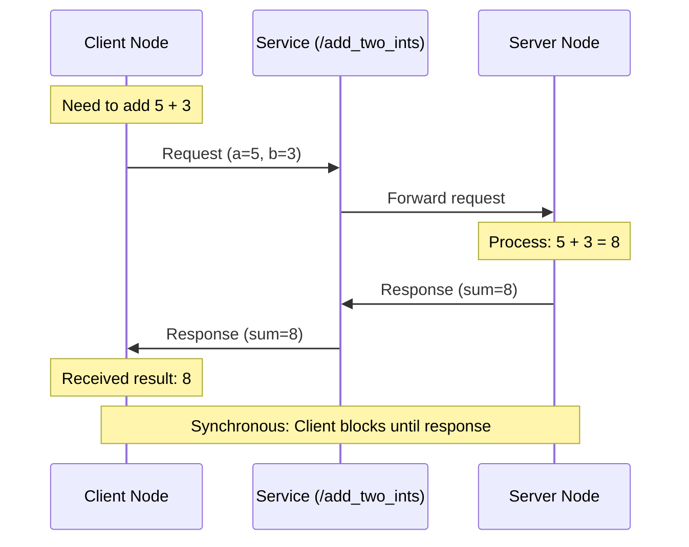
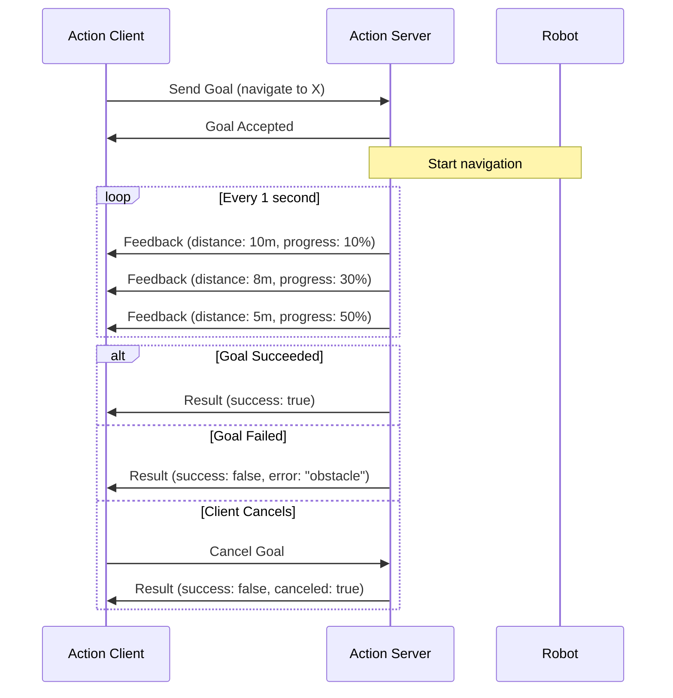
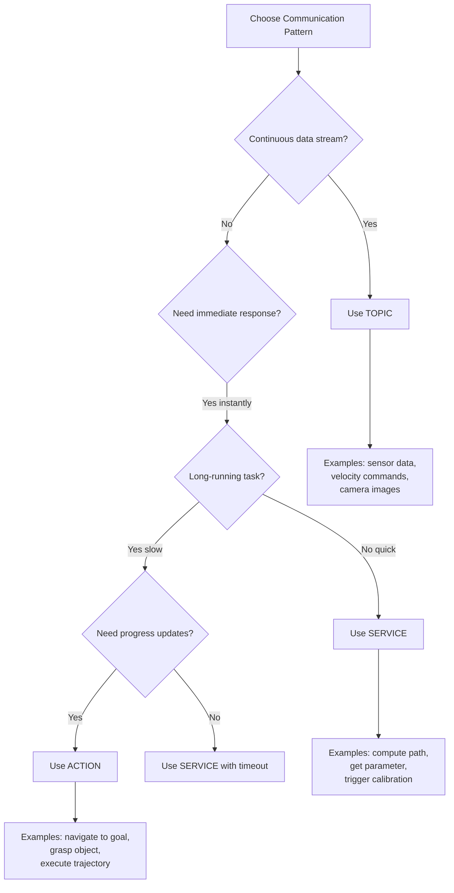

# Section 2: Services & Actions

## Introduction

While **topics** are ideal for continuous data streams (sensor readings, velocity commands), robotics applications also need:

- **Request-response interactions**: "Calculate inverse kinematics for this pose"
- **Long-running tasks with feedback**: "Navigate to waypoint X, report progress every second"

ROS 2 provides two additional communication patterns:

1. **Services**: Synchronous request-response (client waits for server's answer)
2. **Actions**: Asynchronous goal-based tasks with feedback and cancellation

---

## What is a Service?

A **service** is a one-to-one communication pattern where:
- **Client** sends a request and blocks until response arrives
- **Server** processes the request and sends back a response
- Communication is **synchronous**: Client waits for the result

**Analogy**: Services are like function calls over a network:
```python
# Local function call
result = calculate_inverse_kinematics(target_pose)

# ROS 2 service call (same conceptual flow)
result = client.call(request)
```

### Service vs Topic

| Feature | Topic (Pub-Sub) | Service (Request-Response) |
|---------|----------------|---------------------------|
| **Communication** | One-to-many (broadcast) | One-to-one (direct) |
| **Synchronicity** | Asynchronous (fire-and-forget) | Synchronous (waits for response) |
| **Frequency** | Continuous streaming | On-demand |
| **Use case** | Sensor data, commands | Computation, queries |
| **Example** | `/cmd_vel` (velocity) | `/calculate_ik` (kinematics) |

---

## Service Communication Flow



**Key properties**:
- **Blocking**: Client waits for response (or timeout)
- **Reliable**: Uses TCP-like transport (RELIABLE QoS)
- **Stateless**: Each request is independent
- **Typed**: Request and response have defined message types

---

## Service Server Example

Let's create a simple service that adds two integers:

```python
# File: add_two_ints_server.py
import rclpy
from rclpy.node import Node
from example_interfaces.srv import AddTwoInts


class AddTwoIntsServer(Node):
    def __init__(self):
        super().__init__('add_two_ints_server')

        # Create service: service type, service name, callback function
        self.srv = self.create_service(
            AddTwoInts,
            'add_two_ints',
            self.add_two_ints_callback
        )

        self.get_logger().info('Add Two Ints Server started!')

    def add_two_ints_callback(self, request, response):
        """Called when a client sends a request."""
        response.sum = request.a + request.b
        self.get_logger().info(f'Incoming request: {request.a} + {request.b}')
        self.get_logger().info(f'Sending response: {response.sum}')
        return response


def main(args=None):
    rclpy.init(args=args)
    node = AddTwoIntsServer()

    try:
        rclpy.spin(node)
    except KeyboardInterrupt:
        pass
    finally:
        node.destroy_node()
        rclpy.shutdown()


if __name__ == '__main__':
    main()
```

**Breakdown**:
- `create_service(service_type, service_name, callback)`
  - `AddTwoInts` - Service type from `example_interfaces.srv`
  - `'add_two_ints'` - Service name (by convention, no leading `/`)
  - `add_two_ints_callback` - Function that processes requests
- **Callback signature**: `def callback(self, request, response)`
  - `request` - Input from client (has fields `a`, `b`)
  - `response` - Output to client (has field `sum`)
  - **Must return** `response` object

**Running the server**:
```bash
# Terminal 1: Start the service server
source /opt/ros/jazzy/setup.bash
python3 add_two_ints_server.py
```

---

## Service Client Example

Now create a client that calls the service:

```python
# File: add_two_ints_client.py
import sys
import rclpy
from rclpy.node import Node
from example_interfaces.srv import AddTwoInts


class AddTwoIntsClient(Node):
    def __init__(self):
        super().__init__('add_two_ints_client')

        # Create client: service type, service name
        self.client = self.create_client(AddTwoInts, 'add_two_ints')

        # Wait for service to be available
        while not self.client.wait_for_service(timeout_sec=1.0):
            self.get_logger().info('Service not available, waiting...')

        self.get_logger().info('Connected to service!')

    def send_request(self, a, b):
        """Send a request and wait for response."""
        request = AddTwoInts.Request()
        request.a = a
        request.b = b

        self.get_logger().info(f'Sending request: {a} + {b}')

        # Call service (blocks until response or timeout)
        future = self.client.call_async(request)
        rclpy.spin_until_future_complete(self, future)

        if future.result() is not None:
            response = future.result()
            self.get_logger().info(f'Result: {a} + {b} = {response.sum}')
            return response.sum
        else:
            self.get_logger().error('Service call failed!')
            return None


def main(args=None):
    rclpy.init(args=args)

    if len(sys.argv) != 3:
        print('Usage: python3 add_two_ints_client.py <a> <b>')
        return

    node = AddTwoIntsClient()

    a = int(sys.argv[1])
    b = int(sys.argv[2])

    result = node.send_request(a, b)

    node.destroy_node()
    rclpy.shutdown()


if __name__ == '__main__':
    main()
```

**Breakdown**:
- `create_client(service_type, service_name)` - Creates client proxy
- `wait_for_service(timeout_sec)` - Blocks until server is available
- `call_async(request)` - Sends request, returns `Future` object
- `spin_until_future_complete()` - Waits for response to arrive

**Running the client**:
```bash
# Terminal 2: Call the service
source /opt/ros/jazzy/setup.bash
python3 add_two_ints_client.py 5 3
```

**Expected output**:
```
[INFO] [add_two_ints_client]: Connected to service!
[INFO] [add_two_ints_client]: Sending request: 5 + 3
[INFO] [add_two_ints_client]: Result: 5 + 3 = 8
```

---

## Service Introspection with CLI

While services are running, use these commands:

```bash
# List all active services
ros2 service list
# Output:
# /add_two_ints
# /node_name/describe_parameters
# /node_name/get_parameters
# ...

# Show service type
ros2 service type /add_two_ints
# Output: example_interfaces/srv/AddTwoInts

# Call service from command line
ros2 service call /add_two_ints example_interfaces/srv/AddTwoInts "{a: 10, b: 20}"
# Output: sum: 30

# View service definition
ros2 interface show example_interfaces/srv/AddTwoInts
# Output:
# int64 a
# int64 b
# ---
# int64 sum
```

**Note the `---` separator**: Above the line is the **request**, below is the **response**.

---

## What is an Action?

An **action** is a communication pattern for **long-running tasks** that need:
- **Goal**: Start a task (e.g., "Navigate to waypoint X")
- **Feedback**: Periodic progress updates (e.g., "50% complete, 10 meters remaining")
- **Result**: Final outcome (e.g., "Reached target successfully")
- **Cancellation**: Ability to abort mid-execution

**Analogy**: Actions are like async jobs with progress bars:
```python
# Start async job
job = start_navigation(target_waypoint)

# Check progress periodically
while not job.done():
    print(f"Progress: {job.get_progress()}%")

# Get final result
result = job.get_result()
```

### Action vs Service

| Feature | Service | Action |
|---------|---------|--------|
| **Duration** | Instant (under 1 second) | Long-running (seconds to minutes) |
| **Feedback** | None | Periodic progress updates |
| **Cancellation** | Not supported | Can cancel mid-execution |
| **Client behavior** | Blocks until done | Non-blocking, polls for updates |
| **Use case** | Computation, queries | Navigation, manipulation |
| **Example** | Calculate path | Execute path |

---

## Action Communication Flow



**Key properties**:
- **Asynchronous**: Client doesn't block waiting for result
- **Preemptable**: Client can cancel goal at any time
- **Stateful**: Server tracks goal status (accepted, executing, succeeded, aborted, canceled)
- **Typed**: Goal, feedback, and result have defined message types

---

## Action Server Example

Let's create an action server that simulates a robot moving to a target position:

```python
# File: move_to_target_server.py
import time
import rclpy
from rclpy.action import ActionServer
from rclpy.node import Node
from example_interfaces.action import Fibonacci  # Using Fibonacci as placeholder


class MoveToTargetServer(Node):
    def __init__(self):
        super().__init__('move_to_target_server')

        # Create action server: action type, action name, callback
        self._action_server = ActionServer(
            self,
            Fibonacci,  # Action type
            'move_to_target',  # Action name
            self.execute_callback
        )

        self.get_logger().info('Move To Target Action Server started!')

    def execute_callback(self, goal_handle):
        """Called when a goal is received."""
        self.get_logger().info('Executing goal...')

        # Get goal parameters
        target_distance = goal_handle.request.order  # Using 'order' as target distance

        # Feedback message
        feedback_msg = Fibonacci.Feedback()

        # Simulate movement with feedback
        for i in range(target_distance):
            # Check if goal was canceled
            if goal_handle.is_cancel_requested:
                goal_handle.canceled()
                self.get_logger().info('Goal canceled')
                return Fibonacci.Result()

            # Publish feedback (progress)
            feedback_msg.sequence.append(i)
            goal_handle.publish_feedback(feedback_msg)
            self.get_logger().info(f'Feedback: Progress {i}/{target_distance}')

            time.sleep(1)  # Simulate 1 second per meter

        # Goal succeeded
        goal_handle.succeed()

        # Build result message
        result = Fibonacci.Result()
        result.sequence = feedback_msg.sequence
        self.get_logger().info('Goal succeeded!')

        return result


def main(args=None):
    rclpy.init(args=args)
    node = MoveToTargetServer()

    try:
        rclpy.spin(node)
    except KeyboardInterrupt:
        pass
    finally:
        node.destroy_node()
        rclpy.shutdown()


if __name__ == '__main__':
    main()
```

**Breakdown**:
- `ActionServer(node, action_type, action_name, callback)`
- **Callback signature**: `def execute_callback(self, goal_handle)`
  - `goal_handle` - Object to control goal lifecycle
  - `goal_handle.request` - Goal parameters sent by client
  - `goal_handle.publish_feedback(msg)` - Send progress update
  - `goal_handle.is_cancel_requested` - Check if client canceled
  - `goal_handle.succeed()` / `goal_handle.canceled()` - Mark outcome
- **Must return** `Result` object

**Running the action server**:
```bash
# Terminal 1: Start action server
source /opt/ros/jazzy/setup.bash
python3 move_to_target_server.py
```

---

## Action Client Example

Now create a client that sends a goal and monitors progress:

```python
# File: move_to_target_client.py
import rclpy
from rclpy.action import ActionClient
from rclpy.node import Node
from example_interfaces.action import Fibonacci


class MoveToTargetClient(Node):
    def __init__(self):
        super().__init__('move_to_target_client')

        # Create action client: action type, action name
        self._action_client = ActionClient(self, Fibonacci, 'move_to_target')

        self.get_logger().info('Waiting for action server...')
        self._action_client.wait_for_server()
        self.get_logger().info('Action server available!')

    def send_goal(self, target_distance):
        """Send a goal to the action server."""
        goal_msg = Fibonacci.Goal()
        goal_msg.order = target_distance

        self.get_logger().info(f'Sending goal: Move {target_distance} meters')

        # Send goal asynchronously
        self._send_goal_future = self._action_client.send_goal_async(
            goal_msg,
            feedback_callback=self.feedback_callback
        )

        self._send_goal_future.add_done_callback(self.goal_response_callback)

    def goal_response_callback(self, future):
        """Called when server accepts or rejects goal."""
        goal_handle = future.result()

        if not goal_handle.accepted:
            self.get_logger().info('Goal rejected')
            return

        self.get_logger().info('Goal accepted')

        # Wait for result
        self._get_result_future = goal_handle.get_result_async()
        self._get_result_future.add_done_callback(self.get_result_callback)

    def get_result_callback(self, future):
        """Called when action is complete."""
        result = future.result().result
        self.get_logger().info(f'Result: {result.sequence}')
        rclpy.shutdown()

    def feedback_callback(self, feedback_msg):
        """Called when feedback is received."""
        feedback = feedback_msg.feedback
        self.get_logger().info(f'Feedback: {feedback.sequence}')


def main(args=None):
    rclpy.init(args=args)
    node = MoveToTargetClient()

    # Send goal to move 5 meters
    node.send_goal(5)

    rclpy.spin(node)


if __name__ == '__main__':
    main()
```

**Breakdown**:
- `ActionClient(node, action_type, action_name)` - Creates client
- `send_goal_async(goal, feedback_callback)` - Sends goal non-blocking
- **Callbacks**:
  - `goal_response_callback` - Server accepted/rejected goal
  - `feedback_callback` - Progress updates during execution
  - `get_result_callback` - Final result when action completes

**Running the action client**:
```bash
# Terminal 2: Send action goal
source /opt/ros/jazzy/setup.bash
python3 move_to_target_client.py
```

**Expected output**:
```
[INFO] [move_to_target_client]: Action server available!
[INFO] [move_to_target_client]: Sending goal: Move 5 meters
[INFO] [move_to_target_client]: Goal accepted
[INFO] [move_to_target_client]: Feedback: [0]
[INFO] [move_to_target_client]: Feedback: [0, 1]
[INFO] [move_to_target_client]: Feedback: [0, 1, 2]
[INFO] [move_to_target_client]: Feedback: [0, 1, 2, 3]
[INFO] [move_to_target_client]: Feedback: [0, 1, 2, 3, 4]
[INFO] [move_to_target_client]: Result: [0, 1, 2, 3, 4]
```

---

## Action Introspection with CLI

While actions are running, use these commands:

```bash
# List all active actions
ros2 action list
# Output:
# /move_to_target

# Show action type
ros2 action type /move_to_target
# Output: example_interfaces/action/Fibonacci

# Send action goal from command line
ros2 action send_goal /move_to_target example_interfaces/action/Fibonacci "{order: 3}" --feedback

# View action definition
ros2 interface show example_interfaces/action/Fibonacci
# Output:
# int32 order
# ---
# int32[] sequence
# ---
# int32[] sequence
```

**Note the three sections**:
1. **Goal** (above first `---`)
2. **Result** (between first and second `---`)
3. **Feedback** (below second `---`)

---

## When to Use Topics, Services, or Actions?



### Decision Matrix

| Use Case | Pattern | Rationale |
|----------|---------|-----------|
| Camera publishes images 30 Hz | **Topic** | Continuous stream, many subscribers |
| Query robot battery level | **Service** | One-time request, instant response |
| Navigate to waypoint (20 sec) | **Action** | Long-running, needs feedback, cancellable |
| Emergency stop command | **Topic** | Latency-critical, broadcast to all nodes |
| Calculate inverse kinematics | **Service** | Computation, deterministic result |
| Pick and place object (5 sec) | **Action** | Multi-step task, can fail midway |
| Lidar publishes scans 10 Hz | **Topic** | Continuous stream, multiple consumers |
| Reset localization module | **Service** | One-time trigger, quick operation |
| Execute trajectory (variable time) | **Action** | Long-running, feedback on joint positions |

---

## Practical Example: Robot Delivery System

Let's combine all three patterns in a realistic scenario:

```python
# File: delivery_robot.py
import rclpy
from rclpy.node import Node
from rclpy.action import ActionClient
from geometry_msgs.msg import Twist
from std_srvs.srv import Trigger
from example_interfaces.action import Fibonacci  # Placeholder for NavigateToGoal


class DeliveryRobot(Node):
    def __init__(self):
        super().__init__('delivery_robot')

        # TOPIC: Publish velocity commands
        self.cmd_vel_pub = self.create_publisher(Twist, '/cmd_vel', 10)

        # SERVICE: Check if cargo is loaded
        self.cargo_check_client = self.create_client(Trigger, '/check_cargo')

        # ACTION: Navigate to delivery location
        self.navigate_client = ActionClient(self, Fibonacci, '/navigate_to_goal')

        self.get_logger().info('Delivery robot initialized!')

    def start_delivery(self, target_location):
        """Main delivery workflow."""
        # Step 1: SERVICE - Verify cargo is loaded
        self.get_logger().info('Step 1: Checking cargo...')
        if not self.check_cargo():
            self.get_logger().error('No cargo loaded! Aborting.')
            return

        # Step 2: ACTION - Navigate to target (with feedback)
        self.get_logger().info(f'Step 2: Navigating to {target_location}...')
        self.navigate_to(target_location)

        # Step 3: TOPIC - Stop robot when arrived
        self.get_logger().info('Step 3: Stopping robot...')
        self.stop_robot()

        self.get_logger().info('Delivery complete!')

    def check_cargo(self):
        """Call service to check cargo status."""
        request = Trigger.Request()
        future = self.cargo_check_client.call_async(request)
        rclpy.spin_until_future_complete(self, future)

        if future.result() and future.result().success:
            self.get_logger().info('Cargo loaded: OK')
            return True
        else:
            return False

    def navigate_to(self, target):
        """Send action goal to navigate."""
        goal_msg = Fibonacci.Goal()
        goal_msg.order = target  # Using order as location ID

        goal_future = self.navigate_client.send_goal_async(
            goal_msg,
            feedback_callback=self.navigation_feedback
        )

        rclpy.spin_until_future_complete(self, goal_future)
        goal_handle = goal_future.result()

        if not goal_handle.accepted:
            self.get_logger().error('Navigation goal rejected')
            return

        result_future = goal_handle.get_result_async()
        rclpy.spin_until_future_complete(self, result_future)

    def navigation_feedback(self, feedback_msg):
        """Handle navigation progress updates."""
        progress = feedback_msg.feedback.sequence
        self.get_logger().info(f'Navigation progress: {len(progress)} waypoints')

    def stop_robot(self):
        """Publish zero velocity to stop."""
        stop_msg = Twist()  # All fields default to 0.0
        self.cmd_vel_pub.publish(stop_msg)
        self.get_logger().info('Published stop command')


def main(args=None):
    rclpy.init(args=args)
    robot = DeliveryRobot()

    # Start delivery to location 5
    robot.start_delivery(target_location=5)

    robot.destroy_node()
    rclpy.shutdown()


if __name__ == '__main__':
    main()
```

**Architecture breakdown**:
1. **Topic (`/cmd_vel`)**: Real-time velocity control (latency-critical)
2. **Service (`/check_cargo`)**: Quick status check before starting
3. **Action (`/navigate_to_goal`)**: Long navigation task with progress updates

---

## Common Pitfalls and Solutions

### 1. "Service call times out"

**Symptom**: `call_async()` never returns, or timeout error

**Debug steps**:
```bash
# Check if service exists
ros2 service list | grep my_service

# Check if server node is running
ros2 node list

# Test service from CLI
ros2 service call /my_service std_srvs/srv/Trigger
```

**Common causes**:
- Server node not running
- Service name mismatch (typo, case-sensitive)
- Server crashed during request processing
- Network issues (DDS discovery)

### 2. "Action feedback not received"

**Symptom**: Goal accepted, but no feedback callbacks triggered

**Cause**: Forgot to pass `feedback_callback` to `send_goal_async()`

**Solution**:
```python
# Wrong: No feedback callback
goal_future = client.send_goal_async(goal_msg)

# Correct: Specify feedback callback
goal_future = client.send_goal_async(goal_msg, feedback_callback=self.feedback_cb)
```

### 3. "Service response is None"

**Symptom**: `future.result()` returns `None`

**Cause**: Server callback didn't return the response object

**Solution**:
```python
def my_service_callback(self, request, response):
    response.success = True
    response.message = "Done"
    return response  # MUST return response object
```

### 4. "Action goal immediately rejected"

**Symptom**: `goal_handle.accepted` is `False`

**Debug steps**:
```bash
# Check action server status
ros2 action info /my_action

# See action definition
ros2 interface show my_package/action/MyAction
```

**Common causes**:
- Action server busy with another goal (if not multi-goal)
- Invalid goal parameters (type mismatch)
- Server validation logic rejected goal

---

## Key Takeaways

1. **Services** are for quick request-response interactions (compute, query, trigger)
2. **Actions** are for long-running tasks that need feedback and cancellation (navigate, manipulate)
3. **Topics** remain best for continuous data streams (sensors, commands)
4. Choose the right pattern based on **duration**, **feedback needs**, and **latency requirements**
5. Use CLI tools (`ros2 service`, `ros2 action`) for testing and debugging

---

## Exercises

Try these hands-on challenges:

1. **Service**: Create a service that converts Celsius to Fahrenheit
   - Define custom `.srv` file (or use `example_interfaces`)
   - Implement server that performs conversion
   - Test with CLI: `ros2 service call /convert_temp ...`

2. **Action**: Create an action that counts down from N to 0
   - Publish feedback every second with remaining count
   - Allow client to cancel countdown midway
   - Test cancellation with `Ctrl+C`

3. **Integration**: Build a "coffee maker" simulation
   - Service: Check if water tank is full (`/check_water`)
   - Action: Brew coffee with progress updates (`/brew_coffee`)
   - Topic: Publish temperature readings (`/temperature`)

4. **Error handling**: Modify service server to randomly fail 20% of requests
   - Client should retry up to 3 times with exponential backoff
   - Log success/failure statistics

---

## Next Section

Ready to configure your nodes? Continue to **[Section 3: Parameters & Launch Files](./parameters-launch)** to learn runtime configuration and multi-node orchestration.

---

## Further Reading

- **ROS 2 Services**: https://docs.ros.org/en/jazzy/Tutorials/Beginner-CLI-Tools/Understanding-ROS2-Services.html
- **ROS 2 Actions**: https://docs.ros.org/en/jazzy/Tutorials/Beginner-CLI-Tools/Understanding-ROS2-Actions.html
- **Custom Interfaces**: https://docs.ros.org/en/jazzy/Tutorials/Beginner-Client-Libraries/Custom-ROS2-Interfaces.html
- **Action Design Patterns**: https://design.ros2.org/articles/actions.html
