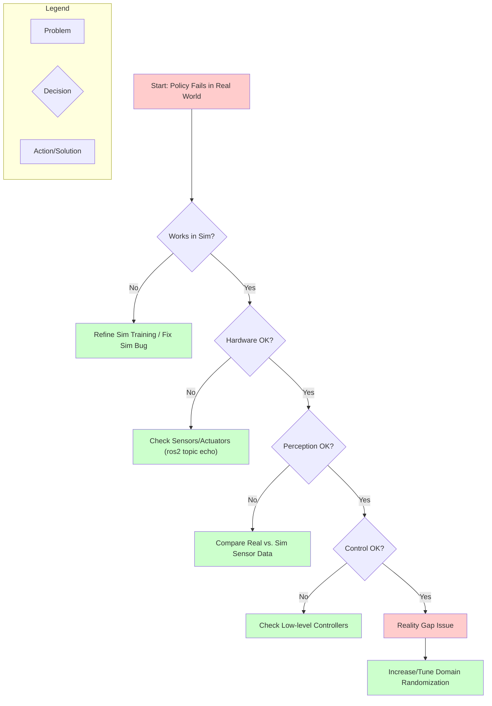

import CodeExample from '@site/src/components/CodeExample';

# Sim-to-Real Transfer and Hardware Deployment

## Introduction

The promise of robotics often begins in simulation – a controlled, safe, and cost-effective environment where algorithms can be developed and tested rapidly. However, the true challenge lies in transferring these simulated policies to the unpredictable and complex real world. This process, known as **Sim-to-Real Transfer**, is fraught with difficulties, collectively referred to as the **"reality gap"**.

This chapter will equip you with the knowledge and tools to effectively bridge this gap. We'll explore the fundamental challenges, delve into powerful techniques like **Domain Randomization (DR)**, and discuss strategies for system identification, reality gap analysis, and robust troubleshooting. By the end, you'll be able to systematically deploy your simulation-trained policies onto physical hardware with minimal performance degradation.

## The Reality Gap: Why Simulation Doesn't Always Translate

The reality gap arises from discrepancies between the simulated environment and the physical world. Even the most sophisticated physics engines and rendering pipelines cannot perfectly capture every nuance of reality. These discrepancies can be categorized into several key areas:

### 1. Sensor Discrepancies

-   **Noise and Bias**: Real-world sensors (cameras, LiDAR, IMUs) are inherently noisy and can exhibit biases not present or fully modeled in simulation.
-   **Latency**: Physical sensors have acquisition and processing delays.
-   **Calibration Errors**: Imperfect calibration can lead to misaligned data.
-   **Lighting & Appearance**: Simulation lighting models often simplify complex real-world illumination, reflections, and material properties.

### 2. Actuator Imperfections

-   **Friction and Backlash**: Real robot joints have mechanical friction, gear backlash, and compliance that are difficult to model accurately.
-   **Limited Bandwidth**: Physical motors have limited speed and torque capabilities, and their controllers have response delays.
-   **Non-linearities**: Actuators often exhibit non-linear behavior under varying loads.

### 3. Physics Discrepancies

-   **Mass and Inertia**: Imperfect knowledge of link masses, inertias, and center of mass locations.
-   **Contact Models**: Simplified contact physics in simulation (e.g., friction coefficients, restitution) can differ significantly from complex real-world interactions.
-   **Collision Detection**: Perfect collision detection in simulation versus subtle impacts and deformations in reality.
-   **Material Properties**: The exact stiffness, damping, and deformation of real objects are hard to replicate.

### 4. Environment Complexity

-   **Variability**: The real world is dynamic and highly variable (e.g., different surfaces, unpredictable obstacles, moving agents).
-   **Unmodeled Factors**: Air resistance, static electricity, temperature changes, and other subtle physical phenomena are often ignored in simulation.

### 5. Communication and Control Latency

-   **Network Delays**: ROS 2 communication over a network introduces latency.
-   **OS Scheduling**: Real-time performance can be affected by operating system scheduling and other processes.

## Bridging the Gap with Domain Randomization (DR)

Domain Randomization (DR) is a powerful technique that addresses the reality gap by making simulation environments *intentionally diverse and noisy*. Instead of trying to perfectly match simulation to reality (which is often impossible), DR trains a policy to be robust to a wide range of variations, effectively making it "agnostic" to specific domain parameters. When deployed in the real world, the real environment simply becomes one more variation the policy has seen and learned to handle.

### How Domain Randomization Works

DR involves randomizing various aspects of the simulation during policy training. This forces the policy to learn features that are invariant to these randomized parameters, rather than overfitting to specific simulated conditions.

#### Key Aspects to Randomize:

1.  **Physics Parameters**:
    *   **Friction Coefficients**: Randomize static and dynamic friction for all surfaces (robot, objects, ground).
    *   **Restitution**: Randomize how "bouncy" objects are during collisions.
    *   **Mass and Inertia**: Randomize the mass and inertia of objects and even robot links (within realistic bounds).
    *   **Damping**: Introduce random linear and angular damping.

2.  **Visuals**:
    *   **Textures and Colors**: Apply random textures and colors to objects and the environment.
    *   **Lighting**: Randomize light source positions, intensities, colors, and shadows.
    *   **Camera Intrinsics/Extrinsics**: Randomize camera focal length, field of view, and slight position/orientation changes.
    *   **Occlusions**: Introduce random obstacles that temporarily block the view of objects.

3.  **Object Properties**:
    *   **Spawn Positions**: Randomize initial positions and orientations of objects and the robot.
    *   **Shapes and Sizes**: Vary the dimensions of objects (e.g., small variations in a block's size).

4.  **Sensor Noise**:
    *   **Gaussian Noise**: Add random Gaussian noise to camera pixels, depth readings, IMU data, and joint encoder readings.
    *   **Dropout/Occlusion**: Simulate sensor failures or temporary occlusions.
    *   **Time Delays**: Introduce random delays in sensor readings.

5.  **Robot Properties**:
    *   **Joint Limits**: Slightly vary the joint limits or stiffness.
    *   **Actuator Noise**: Add noise to commanded joint efforts or velocities.

### Implementing Domain Randomization in Isaac Sim

Isaac Sim provides robust APIs for applying domain randomization. You can write Python scripts to:

1.  Access simulation entities (prims).
2.  Modify their properties (e.g., `physics_material`, `visual_material`).
3.  Randomize these properties within defined ranges during each simulation reset or epoch.

```python title="Example: Basic Domain Randomization in Isaac Sim"
# code-examples/sim-to-real/domain_randomization_example.py

import omni.isaac.core.utils.nucleus as nucleus_utils
from omni.isaac.kit import SimulationApp

# Start the simulation app
# Note: Ensure Isaac Sim is installed and configured.
# This script is meant to be run within the Isaac Sim environment or through `isaac-sim.sh python.sh`
simulation_app = SimulationApp({"headless": False})

import omni.isaac.core as ic
from omni.isaac.core.simulation_context import SimulationContext
import random
import numpy as np
import carb

class DomainRandomizationExample:
    def __init__(self):
        self._simulation_context = SimulationContext()
        self._scene = self._simulation_context.scene
        self._world = ic.World(stage_units_in_meters=1.0)
        self._world.scene.add_default_ground_plane()

        self._current_randomization_iteration = 0
        self._max_randomization_iterations = 100 # How many times to randomize and reset

    async def setup_scene(self):
        # Add a simple cube to the scene to observe physics
        self.cube = self._scene.add(
            ic.objects.DynamicCuboid(
                prim_path="/World/Cube",
                name="my_cube",
                position=np.array([0.0, 0.0, 1.0]),
                size=0.2,
                density=1000, # kg/m^3
                mass=1.0,
                color=np.array([1.0, 0.0, 0.0]),
            )
        )
        self._scene.add(self.cube)

        # Get the ground plane for friction randomization
        self.ground_prim = self._world.get_ground_plane().prim
        if not self.ground_prim:
            carb.log_error("Could not find ground plane prim.")

        # Get the default light for randomization (if exists)
        self.default_light_prim = self._scene.get_light() # Assumes a default light exists
        if not self.default_light_prim:
            carb.log_warn("No default light found, adding one.")
            # Add a default light if none exists
            self.default_light_prim = self._scene.add(
                ic.objects.SphereLight(
                    prim_path="/World/DefaultSphereLight",
                    name="default_sphere_light",
                    position=np.array([500.0, 200.0, 1000.0]),
                    radius=50.0,
                    intensity=3000000.0,
                    color=np.array([1.0, 1.0, 1.0]),
                )
            )

        await self._world.reset_async()

    def randomize_parameters(self):
        # Randomize ground friction
        static_friction = random.uniform(0.1, 1.0)
        dynamic_friction = random.uniform(0.1, 1.0)
        # Apply physics material properties directly to the ground plane
        if self.ground_prim:
            ic.core.utils.prims.set_prim_collision_properties(
                self.ground_prim,
                static_friction=static_friction,
                dynamic_friction=dynamic_friction,
                restitution=0.01 # Keep restitution low for stability
            )
            print(f"Randomized ground friction: Static={static_friction:.2f}, Dynamic={dynamic_friction:.2f}")

        # Randomize light intensity and color
        if self.default_light_prim:
            intensity = random.uniform(1_000_000.0, 5_000_000.0)
            color = np.array([random.uniform(0.5, 1.0), random.uniform(0.5, 1.0), random.uniform(0.5, 1.0)])
            self.default_light_prim.set_attribute("intensity", intensity)
            self.default_light_prim.set_attribute("color", carb.Float3(color[0], color[1], color[2]))
            print(f"Randomized light: Intensity={intensity:.2e}, Color={color}")

        # Randomize cube's mass
        new_mass = random.uniform(0.5, 2.0) # kg
        self.cube.set_mass(new_mass)
        self.cube.set_color(np.array([random.uniform(0.1, 1.0), random.uniform(0.1, 1.0), random.uniform(0.1, 1.0)]))
        print(f"Randomized cube: Mass={new_mass:.2f} kg, Color={self.cube.get_color()}")

    async def run_randomized_sim(self):
        await self._world.reset_async()
        self.randomize_parameters()
        print(f"--- Running iteration {self._current_randomization_iteration + 1} ---")
        # Simulate for a few steps to observe the effect
        for _ in range(200): # Simulate for ~3 seconds at 60 FPS
            await self._simulation_context.render_async()
            await self._simulation_context.step_async()
            if not self._simulation_context.is_playing():
                break

    def start_simulation(self):
        self._world.run_on_startup()
        self._simulation_context.play()

        while self._simulation_context.is_playing() and self._current_randomization_iteration < self._max_randomization_iterations:
            self.start_simulation_loop()
            self._current_randomization_iteration += 1

        self._simulation_context.stop()
        simulation_app.close()

    def start_simulation_loop(self):
        async def _loop():
            await self.run_randomized_sim()
            # After each randomized run, reset the cube's position to observe a fresh drop
            self.cube.set_world_pose(position=np.array([0.0, 0.0, 1.0]))
            await self._simulation_context.step_async()
            await self._simulation_context.render_async()

        self._simulation_context.app.update()
        self._simulation_context.app.add_update_callback(_loop)


async def main():
    dr_example = DomainRandomizationExample()
    await dr_example.setup_scene()
    dr_example.start_simulation()

if __name__ == "__main__":
    import asyncio
    asyncio.run(main())
```

## System Identification: Learning from Reality

While DR makes policies robust, sometimes a model of the real system's dynamics is necessary. **System Identification** involves using real-world data to estimate physical parameters (e.g., joint friction, link masses, sensor biases). This refined model can then be used to:

1.  Update the simulation parameters, making the simulation more accurate.
2.  Be directly incorporated into control policies.

### Techniques for System Identification:

-   **Least Squares Estimation**: Collect data (e.g., joint torques and accelerations) and solve for unknown dynamic parameters.
-   **Kalman Filtering**: Estimate state and parameters in real-time by combining sensor measurements with a dynamic model.
-   **Machine Learning**: Use neural networks to learn the forward and inverse dynamics of the robot from real data.

## Reality Gap Analysis: Quantifying the Difference

Quantifying the reality gap allows you to understand where the discrepancies lie and prioritize your efforts.

### Metrics for Quantifying the Reality Gap:

1.  **Task Success Rate**: The most direct metric. If a policy achieves 90% success in sim but only 30% in real, there's a significant gap.
2.  **Performance Degradation**: Measure specific KPIs (e.g., grasping force, walking speed, trajectory error) and compare their drop from sim to real.
3.  **State/Observation Distribution Mismatch**: Analyze statistical differences in sensor readings (e.g., camera images, joint positions) between real and simulated executions of the same task. Techniques like Maximum Mean Discrepancy (MMD) or comparing feature embeddings can be used.
4.  **Control Signal Discrepancy**: Compare the control commands issued by the policy in real vs. sim. Significant differences might indicate a reality gap.

## Sim-to-Real Transfer Guides for Hardware Tiers

### Jetson Economy Tier

For the Jetson Economy tier, which typically uses smaller mobile manipulators or custom robot arms, the focus of sim-to-real transfer is often on:

-   **Navigation Policies**: Deploying obstacle avoidance or path following policies.
-   **Simple Grasping**: Transferring basic pick-and-place skills.

```python title="Sim-to-Real Transfer Guide for Jetson Economy Tier"
# code-examples/sim-to-real/jetson_economy_transfer.py

# This script is a conceptual guide and needs to be adapted to a specific robot platform
# and simulation environment. It outlines the general steps for sim-to-real transfer
# for a simple navigation policy on a Jetson-based robot.

import os
import subprocess
import time

def print_section_header(title):
    print(f"\n{ '='*50}\n{title}\n{ '='*50}\n")

def run_command(command, description):
    print(f"Executing: {description} -> {command}")
    try:
        process = subprocess.run(command, shell=True, check=True, capture_output=True, text=True)
        print(f"STDOUT:\n{process.stdout}")
        if process.stderr:
            print(f"STDERR:\n{process.stderr}")
        return True
    except subprocess.CalledProcessError as e:
        print(f"ERROR: {description} failed.")
        print(f"STDOUT:\n{e.stdout}")
        print(f"STDERR:\n{e.stderr}")
        return False
    except Exception as e:
        print(f"An unexpected error occurred: {e}")
        return False

def main():
    print_section_header("Sim-to-Real Transfer Guide for Jetson Economy Tier")
    print("This guide assumes you have:")
    print("1. A navigation policy trained in Isaac Sim using Domain Randomization.")
    print("2. A Jetson-based mobile robot (e.g., Jetson Nano/Orin with a differential drive base, LiDAR/depth camera).")
    print("3. ROS 2 Jazzy installed on both the host (for training) and the Jetson robot.")
    print("4. Basic networking set up between your host machine and the Jetson robot (SSH, ROS_DOMAIN_ID).
")

    policy_model_path = "/path/to/your/trained_policy.pth" # Placeholder for your trained policy
    robot_ip = "192.168.1.100" # Placeholder for your robot's IP address
    jetson_user = "jetson" # Placeholder for your Jetson username

    if not os.path.exists(policy_model_path):
        print(f"WARNING: Policy model not found at {policy_model_path}. Please update 'policy_model_path' to a valid path.")
        # return

    print_section_header("Step 1: Export Trained Policy from Host")
    print("Assuming your policy is trained in PyTorch, TensorFlow, or ONNX.")
    print("For deployment on Jetson, you might convert it to ONNX or TensorRT for optimized inference.")
    print("Example (conceptual):")
    # if not run_command(f"python3 /path/to/export_script.py --model_path {policy_model_path} --output_format ONNX --output_path ./exported_policy.onnx", "Exporting policy to ONNX"):
    #     return

    print_section_header("Step 2: Transfer Policy to Jetson Robot")
    print(f"Using SCP to securely copy the exported policy to the Jetson at {robot_ip}.")
    if not run_command(f"scp ./exported_policy.onnx {jetson_user}@{robot_ip}:~/robot_ws/src/robot_nav/policies/", "Copying policy to Jetson"):
        print("Failed to transfer policy. Ensure SSH is configured and robot IP/user are correct.")
        # return

    print_section_header("Step 3: Build & Deploy ROS 2 Navigation Stack on Jetson")
    print("This assumes you have a ROS 2 workspace on your Jetson with a navigation package.")
    print("The navigation package should contain the ROS 2 node that loads your transferred policy.")
    print("Connecting to Jetson via SSH to build the workspace...")
    ssh_command_build = (
        f"ssh {jetson_user}@{robot_ip} \" "
        "source /opt/ros/jazzy/setup.bash && "
        "cd ~/robot_ws && "
        "colcon build --packages-select robot_nav --symlink-install && "
        "source install/setup.bash "
        " "
    )
    if not run_command(ssh_command_build, "Building ROS 2 navigation package on Jetson"):
        print("Failed to build navigation stack on Jetson.")
        # return

    print_section_header("Step 4: Launch Navigation Node on Jetson")
    print("Launching the ROS 2 navigation node on the Jetson that uses the policy.")
    print("This node should subscribe to sensor topics (LiDAR/depth camera) and publish velocity commands.")
    print("Opening a new SSH session to keep the launch command running...")
    # This command needs to run in a separate persistent session, e.g., using `nohup` or a screen/tmux session.
    # For demonstration, we'll just show the command.
    launch_command = (
        f"ssh {jetson_user}@{robot_ip} \" "
        "nohup bash -c ' "
        "source /opt/ros/jazzy/setup.bash && "
        "source ~/robot_ws/install/setup.bash && "
        "export ROS_DOMAIN_ID=42 && " # Ensure ROS_DOMAIN_ID matches your setup
        "ros2 launch robot_nav navigation.launch.py ' > ~/robot_nav_launch.log 2>&1 &"
        " "
    )
    print(f"Conceptual launch command for Jetson:\n{launch_command}")
    print("You would typically run this in a detached screen/tmux session or similar.")
    # if not run_command(launch_command, "Launching navigation node on Jetson"):
    #     return
    print("Waiting a few seconds for nodes to come up...")
    time.sleep(5)

    print_section_header("Step 5: Monitor Robot and Policy Performance")
    print("From your host machine, monitor the robot's status via ROS 2 topics.")
    print(f"Ensure your host and Jetson have the same ROS_DOMAIN_ID (e.g., export ROS_DOMAIN_ID=42).")
    print("Example monitoring commands (run on host):")
    run_command("ros2 topic list", "Listing active ROS 2 topics")
    run_command("ros2 node list", "Listing active ROS 2 nodes")
    run_command("ros2 topic echo /cmd_vel", "Echoing robot velocity commands")
    run_command("ros2 run rviz2 rviz2", "Launching Rviz2 to visualize robot state (if applicable)")

    print("\nSim-to-Real transfer guide complete. Observe robot performance in the real world.")
    print("Troubleshooting: Check robot_nav_launch.log on the Jetson for errors.")
    print("Consider adjusting ROS 2 QoS settings for real-time performance on constrained hardware.")

if __name__ == "__main__":
    main()
```

### Unitree Go2 Mid Tier

The Unitree Go2, a quadruped robot, presents challenges related to dynamic locomotion. Sim-to-real transfer will focus on:

-   **Dynamic Locomotion Policies**: Transferring walking, trotting, or even jumping gaits.
-   **Object Tracking Policies**: Using its onboard camera for visual servoing tasks.

```python title="Sim-to-Real Transfer Guide for Unitree Go2 Mid Tier"
# code-examples/sim-to-real/unitree_go2_mid_transfer.py

# This script is a conceptual guide and needs to be adapted to a specific Unitree Go2 SDK version
# and your trained object tracking policy. It outlines the general steps for sim-to-real transfer
# for an object tracking policy on a Unitree Go2 robot.

import os
import subprocess
import time

def print_section_header(title):
    print(f"\n{'='*50}\n{title}\n{'='*50}\n")

def run_command(command, description):
    print(f"Executing: {description} -> {command}")
    try:
        process = subprocess.run(command, shell=True, check=True, capture_output=True, text=True)
        print(f"STDOUT:\n{process.stdout}")
        if process.stderr:
            print(f"STDERR:\n{process.stderr}")
        return True
    except subprocess.CalledProcessError as e:
        print(f"ERROR: {description} failed.")
        print(f"STDOUT:\n{e.stdout}")
        print(f"STDERR:\n{e.stderr}")
        return False
    except Exception as e:
        print(f"An unexpected error occurred: {e}")
        return False

def main():
    print_section_header("Sim-to-Real Transfer Guide for Unitree Go2 Mid Tier")
    print("This guide assumes you have:")
    print("1. An object tracking policy trained in Isaac Sim (e.g., using Isaac ROS perception components and Reinforcement Learning).")
    print("2. A Unitree Go2 robot with its SDK configured.")
    print("3. ROS 2 Jazzy installed on both the host (for training) and the Go2's onboard computer.")
    print("4. Network connectivity between your host machine and the Go2.")

    policy_model_path = "/path/to/your/go2_tracking_policy.pth" # Placeholder for your trained policy
    go2_ip = "192.168.123.10" # Default IP for Go2's onboard computer (check your configuration)
    go2_user = "unitree" # Default user for Unitree's onboard computer

    if not os.path.exists(policy_model_path):
        print(f"WARNING: Policy model not found at {policy_model_path}. Please update 'policy_model_path' to a valid path.")
        # return

    print_section_header("Step 1: Export Trained Policy from Host")
    print("Similar to the Jetson guide, convert your policy to an optimized format like ONNX or TensorRT.")
    # if not run_command(f"python3 /path/to/export_script.py --model_path {policy_model_path} --output_format ONNX --output_path ./go2_tracking_policy.onnx", "Exporting policy for Go2"):
    #     return

    print_section_header("Step 2: Transfer Policy to Unitree Go2 Onboard Computer")
    print(f"Using SCP to copy the exported policy to the Go2's onboard computer at {go2_ip}.")
    if not run_command(f"scp ./go2_tracking_policy.onnx {go2_user}@{go2_ip}:~/unitree_ws/src/go2_tracking/policies/", "Copying policy to Go2"):
        print("Failed to transfer policy. Ensure SSH is configured and Go2 IP/user are correct.")
        # return

    print_section_header("Step 3: Build & Deploy ROS 2 Tracking Stack on Go2")
    print("This assumes you have a ROS 2 workspace on your Go2 with an object tracking package.")
    print("This package should contain the ROS 2 node that loads your transferred policy and interfaces with the Go2 SDK.")
    print("Connecting to Go2 via SSH to build the workspace...")
    ssh_command_build = (
        f"ssh {go2_user}@{go2_ip} \" "
        "source /opt/ros/jazzy/setup.bash && "
        "cd ~/unitree_ws && "
        "colcon build --packages-select go2_tracking --symlink-install && "
        "source install/setup.bash "
        ""
    )
    if not run_command(ssh_command_build, "Building ROS 2 tracking package on Go2"):
        print("Failed to build tracking stack on Go2.")
        # return

    print_section_header("Step 4: Launch Object Tracking Node on Go2")
    print("Launching the ROS 2 object tracking node on the Go2 that uses the policy.")
    print("This node will subscribe to the Go2's camera topic, run inference, and publish Go2 motor commands.")
    launch_command = (
        f"ssh {go2_user}@{go2_ip} \" "
        "nohup bash -c ' "
        "source /opt/ros/jazzy/setup.bash && "
        "source ~/unitree_ws/install/setup.bash && "
        "export ROS_DOMAIN_ID=42 && "
        "ros2 launch go2_tracking object_tracker.launch.py ' > ~/go2_tracking_launch.log 2>&1 &"
        ""
    )
    print(f"Conceptual launch command for Go2:\n{launch_command}")
    print("Remember to use `nohup` or `screen`/`tmux` for persistent launches.")
    # if not run_command(launch_command, "Launching object tracking node on Go2"):
    #     return
    print("Waiting a few seconds for nodes to come up...")
    time.sleep(5)

    print_section_header("Step 5: Monitor Go2 and Policy Performance (Host Machine)")
    print("From your host machine, monitor the Go2's status via ROS 2 topics.")
    print(f"Ensure your host and Go2 have the same ROS_DOMAIN_ID (e.g., export ROS_DOMAIN_ID=42).")
    print("Example monitoring commands (run on host):")
    run_command("ros2 topic list", "Listing active ROS 2 topics")
    run_command("ros2 node list", "Listing active ROS 2 nodes")
    run_command("ros2 topic echo /camera/image_raw", "Echoing Go2's camera feed")
    run_command("ros2 topic echo /go2_tracking/target_pose", "Echoing detected target pose")
    run_command("ros2 run rviz2 rviz2", "Launching Rviz2 to visualize Go2 state and target")

    print("\nSim-to-Real transfer guide complete for Unitree Go2. Observe robot performance in the real world.")
    print("Troubleshooting: Check go2_tracking_launch.log on the Go2 for errors.")
    print("Ensure correct camera topic and frame transformations are set up in your Go2 tracking package.")

if __name__ == "__main__":
    main()
```

## Troubleshooting Decision Tree for Sim-to-Real Failures

When a policy fails in the real world, systematically debugging is crucial.

1.  **Is it a simulation issue?**
    *   Does the policy work reliably in the simulated environment with varied parameters? If not, refine simulation training.
2.  **Is it a hardware issue?**
    *   Are all sensors and actuators working correctly? (e.g., check `ros2 topic echo` for sensor data, command individual joints).
3.  **Is it a perception issue?**
    *   Does the robot accurately perceive its environment (e.g., object detection, pose estimation)? Compare real sensor data to simulated inputs during training.
4.  **Is it a control issue?**
    *   Are the low-level controllers on the real robot executing commanded joint positions/velocities/torques accurately?
5.  **Is it a reality gap issue?**
    *   If all above pass, then analyze the differences. Use Domain Randomization in simulation to cover real-world variations.



## Conclusion

Sim-to-Real transfer is a critical, yet challenging, aspect of modern robotics. By understanding the sources of the reality gap and employing robust techniques like Domain Randomization, you can develop policies that generalize from the safety and efficiency of simulation to the complexities of the physical world. Remember to systematically analyze discrepancies, quantify the gap, and iterate on both your simulations and real-world deployments.