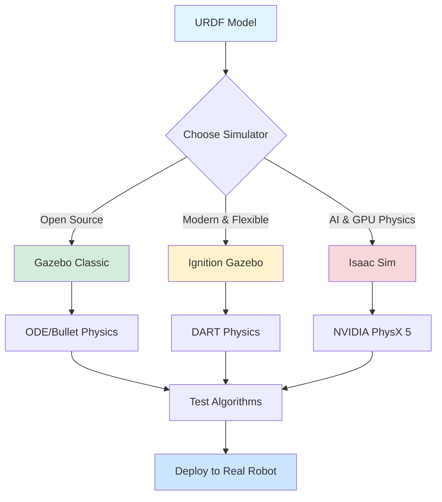
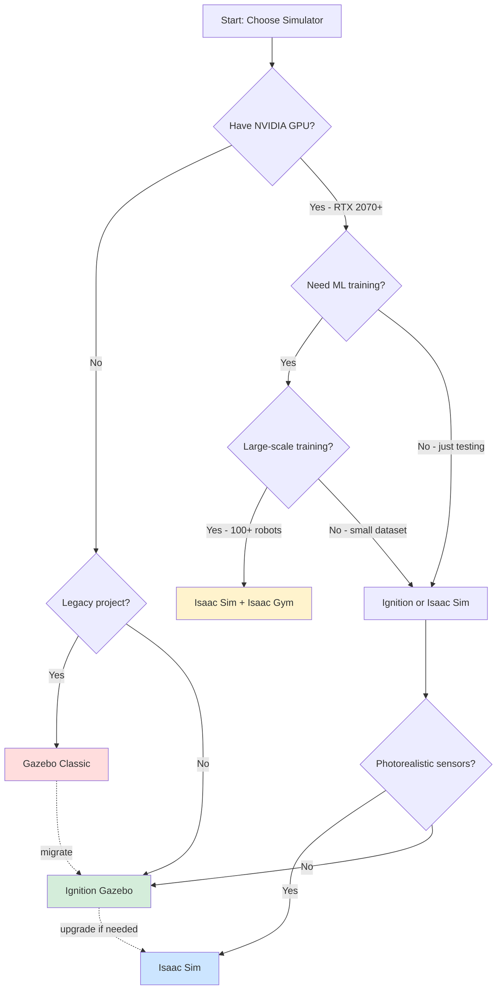
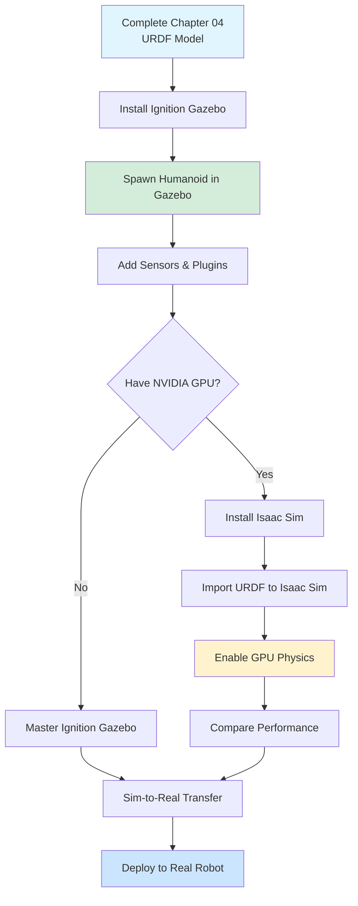

# Chapter 05: Simulation Ecosystem

:::info Chapter Overview
Learn to choose and use the right physics simulator for humanoid robotics. Compare Gazebo Classic, Ignition Gazebo, and NVIDIA Isaac Sim across performance, features, and ease of use. Understand when to use each simulator and how to transfer skills between them.
:::

## What You'll Learn

By the end of this chapter, you'll be able to:

- ✅ Compare Gazebo Classic, Ignition Gazebo, and Isaac Sim feature sets
- ✅ Choose the right simulator for your humanoid robot project
- ✅ Set up basic simulations in both Gazebo and Isaac Sim
- ✅ Understand physics engines (ODE, Bullet, DART, PhysX)
- ✅ Configure realistic sensors (cameras, lidars, IMUs)
- ✅ Measure simulation performance (FPS, physics accuracy)
- ✅ Apply sim-to-real transfer techniques

## Prerequisites

Before starting this chapter, you should:

- ✅ Complete **[Chapter 04: URDF & Digital Twins](../urdf-digital-twins)**
- ✅ Have a URDF robot model ready for simulation
- ✅ Understand ROS 2 topics and services
- ✅ Have Ubuntu 22.04 with ROS 2 Jazzy installed
- ✅ Meet hardware requirements (see below)

## Why Simulation Matters

**Simulation enables you to:**

1. **Develop without hardware** - Test algorithms before robot arrives
2. **Train safely** - Simulate falls, collisions, dangerous scenarios
3. **Generate data** - Create synthetic datasets for ML training
4. **Test at scale** - Run 100 robots in parallel (impossible physically)
5. **Debug faster** - Pause, rewind, visualize internal states
6. **Save costs** - Avoid hardware damage during testing



## The Three Major Simulators

### Gazebo Classic (Legacy)

**Status:** Deprecated, maintenance mode only (last release: Gazebo 11)

**Pros:**
- ✅ Mature ecosystem with extensive plugins
- ✅ Large community and documentation
- ✅ Well-integrated with ROS 1 and ROS 2
- ✅ Low system requirements

**Cons:**
- ❌ No longer actively developed
- ❌ Single-threaded rendering (performance bottleneck)
- ❌ ODE physics engine limitations (instability with complex contacts)
- ❌ No modern rendering (no PBR, raytracing)

**Verdict:** Use only for legacy projects. Migrate to Ignition or Isaac Sim.

---

### Ignition Gazebo (now "Gazebo")

**Status:** Active development, official successor to Gazebo Classic

**Pros:**
- ✅ Modern architecture (modular, multi-threaded)
- ✅ Multiple physics engines (DART, Bullet, TPE)
- ✅ Better rendering (Ogre2, PBR materials)
- ✅ Improved sensors (realistic cameras, GPU lidar)
- ✅ Better performance than Gazebo Classic
- ✅ ROS 2 native (`ros_gz_bridge`)

**Cons:**
- ❌ Smaller plugin ecosystem than Classic (still growing)
- ❌ Learning curve if migrating from Classic
- ❌ CPU-bound physics (no GPU acceleration)
- ❌ Less documentation than Classic

**Verdict:** Best for traditional robotics simulation without GPU requirements.

**System Requirements:**
- CPU: 4+ cores recommended
- RAM: 8 GB minimum, 16 GB recommended
- GPU: Integrated graphics OK, dedicated GPU better for visualization
- OS: Ubuntu 22.04 (Jammy)

---

### NVIDIA Isaac Sim

**Status:** Active development, optimized for AI and GPU computing

**Pros:**
- ✅ **GPU-accelerated physics** (PhysX 5) - 10-100x faster than CPU
- ✅ **Photorealistic rendering** (RTX raytracing, path tracing)
- ✅ **Domain randomization** for ML training
- ✅ **Synthetic data generation** (semantic segmentation, depth, normals)
- ✅ **Multi-robot scalability** (100+ robots in parallel)
- ✅ **Isaac Gym integration** for RL training
- ✅ ROS 2 bridge built-in

**Cons:**
- ❌ **Requires NVIDIA GPU** (RTX series recommended)
- ❌ Closed-source (free for non-commercial, license for commercial)
- ❌ Large download (10+ GB)
- ❌ Steeper learning curve (Omniverse platform)
- ❌ Higher system requirements

**Verdict:** Best for AI-focused projects, ML training, large-scale simulations, and projects with GPU resources.

**System Requirements:**
- **GPU**: RTX 2070 or better (12+ GB VRAM recommended)
- CPU: 8+ cores recommended
- RAM: 32 GB minimum, 64 GB for large scenes
- Storage: 50 GB for Isaac Sim + dependencies
- OS: Ubuntu 22.04 (native) or Windows 10/11

---

## Feature Comparison Matrix

| Feature | Gazebo Classic | Ignition Gazebo | Isaac Sim |
|---------|---------------|-----------------|-----------|
| **Status** | Deprecated | Active | Active |
| **Physics Engine** | ODE, Bullet | DART, Bullet, TPE | PhysX 5 (GPU) |
| **GPU Physics** | ❌ | ❌ | ✅ |
| **Rendering** | Ogre 1.x | Ogre2 (PBR) | RTX Raytracing |
| **ROS 2 Integration** | ros_gz_bridge | Native ros_gz | ROS 2 Bridge |
| **Multi-threading** | Limited | ✅ | ✅ |
| **Sensor Realism** | Basic | Good | Photorealistic |
| **Domain Randomization** | Manual | Limited | Built-in |
| **ML Training** | External | External | Isaac Gym |
| **License** | Apache 2.0 | Apache 2.0 | Proprietary (free non-commercial) |
| **System Requirements** | Low | Medium | **High (GPU required)** |
| **Learning Curve** | Easy | Moderate | Steep |
| **Community Size** | Large | Growing | Medium |

### Performance Benchmarks (Simple Humanoid, 14 joints)

| Metric | Gazebo Classic | Ignition Gazebo | Isaac Sim |
|--------|---------------|-----------------|-----------|
| **Physics FPS** | 60-120 Hz | 100-200 Hz | 500-2000 Hz (GPU) |
| **Render FPS** | 30-60 FPS | 60-120 FPS | 60-240 FPS (RTX) |
| **Real-time factor** | 0.8-1.0x | 1.0-1.5x | 5-20x |
| **Startup time** | 5-10s | 8-15s | 20-40s |
| **RAM usage** | 500 MB | 800 MB | 3-8 GB |
| **GPU VRAM** | 0 MB (CPU only) | 200-500 MB | 2-6 GB |

**Real-time factor:** How many simulation seconds per real second (2x = runs twice as fast as reality)

:::tip Benchmark Conditions
- Hardware: AMD Ryzen 9 5900X, RTX 4070 Ti (12 GB), 32 GB RAM
- Scenario: Single humanoid robot (15 links, 14 joints) walking on flat ground
- Sensors: 1 RGB camera (640×480), 1 IMU
- Physics: 1000 Hz update rate, default solver settings
:::

## Decision Tree: Which Simulator?



**Quick decision guide:**

1. **Student/Hobbyist without GPU** → Ignition Gazebo
2. **Student/Hobbyist with RTX GPU** → Isaac Sim (for learning AI tools)
3. **Traditional robotics research** → Ignition Gazebo
4. **AI/ML research with GPU** → Isaac Sim
5. **Large-scale RL training** → Isaac Sim + Isaac Gym
6. **Legacy ROS 1 project** → Gazebo Classic (then migrate)

## Physics Engines Deep Dive

### ODE (Open Dynamics Engine)

**Used in:** Gazebo Classic (default)

**Pros:**
- Fast for simple scenarios
- Stable for wheeled robots

**Cons:**
- Poor contact dynamics (humanoids fall through floor sometimes)
- Constraint solver instability with many joints
- No parallel computation

**Verdict:** Avoid for humanoid robots. Use DART or PhysX instead.

---

### DART (Dynamic Animation and Robotics Toolkit)

**Used in:** Ignition Gazebo (recommended), PyBullet

**Pros:**
- Excellent articulated body dynamics (good for humanoids)
- Stable constraint solver
- Fast inverse dynamics
- Good for manipulation tasks

**Cons:**
- CPU-only (no GPU acceleration)
- Slower than PhysX for large scenes

**Verdict:** Best CPU physics engine for humanoid simulation.

---

### Bullet

**Used in:** Gazebo Classic, Ignition Gazebo, PyBullet

**Pros:**
- Fast collision detection
- Good for rigid body dynamics
- Used in games (proven performance)

**Cons:**
- Contact friction less accurate than DART
- Articulated bodies can be unstable

**Verdict:** Good general-purpose, but DART is better for humanoids.

---

### NVIDIA PhysX 5

**Used in:** Isaac Sim exclusively

**Pros:**
- **GPU acceleration** - 10-100x faster than CPU engines
- Highly stable contact solver
- Supports articulated bodies (humanoids, quadrupeds)
- Tensor API for batch simulation (RL training)

**Cons:**
- NVIDIA GPU required
- Closed-source
- Not portable to other simulators

**Verdict:** Best performance, but requires NVIDIA hardware.

## Sensor Simulation Comparison

### RGB Cameras

| Simulator | Realism | Performance | Features |
|-----------|---------|-------------|----------|
| Gazebo Classic | Low (basic Ogre) | Good | Basic RGB only |
| Ignition Gazebo | Medium (PBR) | Good | PBR materials, better lighting |
| Isaac Sim | **Photorealistic (RTX)** | Excellent (GPU) | Raytracing, lens distortion, motion blur |

**Isaac Sim advantage:** Domain randomization (lighting, textures, camera intrinsics) for robust ML training.

### Depth Cameras

| Simulator | Noise Model | GPU Accelerated? | Pointcloud Output? |
|-----------|-------------|------------------|-------------------|
| Gazebo Classic | Simple Gaussian | ❌ | ✅ |
| Ignition Gazebo | Gaussian + outliers | ❌ | ✅ |
| Isaac Sim | Realistic (raytracing) | ✅ | ✅ |

### Lidar

| Simulator | Ray Count | GPU Accelerated? | Realistic Returns? |
|-----------|-----------|------------------|--------------------|
| Gazebo Classic | Up to 1000 | ❌ | No |
| Ignition Gazebo | Up to 10,000 | ✅ (GPU lidar) | Basic |
| Isaac Sim | Unlimited | ✅ | Photorealistic |

**Isaac Sim lidar:** Simulates actual laser physics (reflectivity, multi-bounce, atmospheric effects).

### IMU (Inertial Measurement Unit)

All three simulators provide:
- ✅ Accelerometer readings (linear acceleration)
- ✅ Gyroscope readings (angular velocity)
- ✅ Configurable noise models

**Difference:** Isaac Sim adds bias drift over time (more realistic for long-duration tests).

## Installation Quick Start

### Ignition Gazebo (Ubuntu 22.04)

```bash
# Install Ignition Gazebo Fortress (compatible with ROS 2 Jazzy)
sudo apt update
sudo apt install ignition-fortress

# Install ROS 2 bridge
sudo apt install ros-jazzy-ros-gz-bridge ros-jazzy-ros-gz-sim

# Test installation
ign gazebo shapes.sdf

# Expected: GUI opens with basic shapes scene
```

### Isaac Sim (Ubuntu 22.04 or Windows)

**Prerequisites:**
- NVIDIA GPU with RTX support (2070 or better)
- 32+ GB RAM
- 50 GB free disk space

**Installation:**

```bash
# Method 1: Omniverse Launcher (recommended)
# Download from: https://www.nvidia.com/en-us/omniverse/download/

# 1. Install Omniverse Launcher
# 2. Launch → Library → Install "Isaac Sim"
# 3. Wait for 10+ GB download

# Method 2: pip install (headless, for servers)
pip install isaacsim

# Test installation (after Launcher install)
~/.local/share/ov/pkg/isaac_sim-*/isaac-sim.sh

# Expected: Isaac Sim GUI opens with sample scene
```

**First-time setup:** Takes 20-40 minutes for shader compilation.

## Chapter Structure

This chapter is organized into the following sections:

1. **[Gazebo Setup & Basics](./gazebo-basics)** - Install Ignition, spawn URDF, sensor plugins
2. **[Isaac Sim Setup & Basics](./isaac-sim-basics)** - Install Isaac Sim, import URDF, GPU physics
3. **[Performance Optimization](./performance-optimization)** - Tuning physics solvers, reducing lag
4. **[Sim-to-Real Transfer](./sim-to-real)** - Domain randomization, reality gap, calibration
5. **[Quiz](./quiz)** - Test your simulation knowledge

## Key Concepts Preview

### Real-Time Factor (RTF)

**Definition:** How many simulation seconds pass per real second.

- **RTF = 1.0** → Simulation runs at real-time speed
- **RTF = 2.0** → Simulation runs 2x faster than reality (good!)
- **RTF = 0.5** → Simulation runs 2x slower than reality (bad - physics can't keep up)

**Example:**
```python
# Isaac Sim with GPU physics: RTF = 10x
# 10 minutes of robot testing = 1 minute of real time

# Gazebo Classic: RTF = 0.8x
# 10 minutes of robot testing = 12.5 minutes of real time
```

**Goal:** Maximize RTF while maintaining accuracy.

### Physics Time Step

**Trade-off:** Smaller timestep = more accurate, but slower

| Timestep | Accuracy | Speed | Use Case |
|----------|----------|-------|----------|
| 0.001s (1 kHz) | Excellent | Slow | Contact-rich (grasping, walking) |
| 0.01s (100 Hz) | Good | Fast | Wheeled robots, simple tasks |
| 0.1s (10 Hz) | Poor | Very fast | Not recommended |

**Default:** Most simulators use 0.001s (1 ms) for humanoid robots.

### Solver Iterations

**What it is:** How many times physics engine refines joint constraints per timestep

| Iterations | Stability | Speed | Use Case |
|------------|-----------|-------|----------|
| 10 | Poor | Fast | Simple robots |
| 50 | Good | Medium | Humanoids (default) |
| 100+ | Excellent | Slow | High-precision manipulation |

**Example (SDF for Gazebo):**
```xml
<physics name="default_physics">
  <max_step_size>0.001</max_step_size>  <!-- 1 ms timestep -->
  <real_time_factor>1.0</real_time_factor>
  <solver>
    <iterations>50</iterations>  <!-- 50 solver iterations -->
  </solver>
</physics>
```

## Common Simulation Gotchas

### 1. Robot Explodes on Spawn

**Cause:** Incorrect inertia values or overlapping collision geometries

**Fix:**
```xml
<!-- Add damping to all joints -->
<joint name="knee">
  ...
  <dynamics damping="1.0" friction="0.1"/>
</joint>
```

### 2. Robot Falls Through Floor

**Cause:** Physics timestep too large or ODE engine limitations

**Fix:**
- Use DART physics (Ignition) or PhysX (Isaac Sim)
- Reduce timestep to 0.001s
- Increase solver iterations to 50+

### 3. Simulation Runs Slower Than Real-Time (RTF under 1.0)

**Causes:**
- CPU too slow for physics complexity
- Too many contacts (high-poly collision meshes)
- Rendering bottleneck

**Fixes:**
- Simplify collision geometry (use primitives, not meshes)
- Reduce sensor update rates (30 Hz instead of 100 Hz)
- Disable GUI (headless mode) for faster physics
- Use GPU physics (Isaac Sim)

### 4. Sensors Return Unrealistic Data

**Causes:**
- No noise model configured
- Incorrect sensor placement in URDF
- Missing sensor plugin configuration

**Fix:**
```xml
<!-- Add realistic camera noise in Gazebo -->
<sensor name="camera" type="camera">
  <camera>
    <noise>
      <type>gaussian</type>
      <mean>0.0</mean>
      <stddev>0.007</stddev>
    </noise>
  </camera>
</sensor>
```

## Learning Path



**Recommended Approach:**
1. Start with Ignition Gazebo (works on any hardware)
2. Master basic simulation concepts
3. If you have RTX GPU, try Isaac Sim for comparison
4. Choose primary simulator based on project needs

## Resources

- **Gazebo Tutorials**: https://gazebosim.org/docs
- **Ignition Gazebo**: https://gazebosim.org/docs/fortress
- **Isaac Sim Docs**: https://docs.omniverse.nvidia.com/isaacsim/latest/
- **ROS 2 Gazebo Bridge**: https://github.com/gazebosim/ros_gz
- **Isaac ROS**: https://nvidia-isaac-ros.github.io/

---

## What's Next?

Ready to simulate? Proceed to **[Section 1: Gazebo Setup & Basics](./gazebo-basics)** to spawn your humanoid robot in Ignition Gazebo.

**In the next section:**
- Install Ignition Gazebo Fortress
- Spawn URDF robot with `ros_gz_bridge`
- Add sensor plugins (camera, IMU)
- Control joints via ROS 2 topics
- Debug common spawning issues
