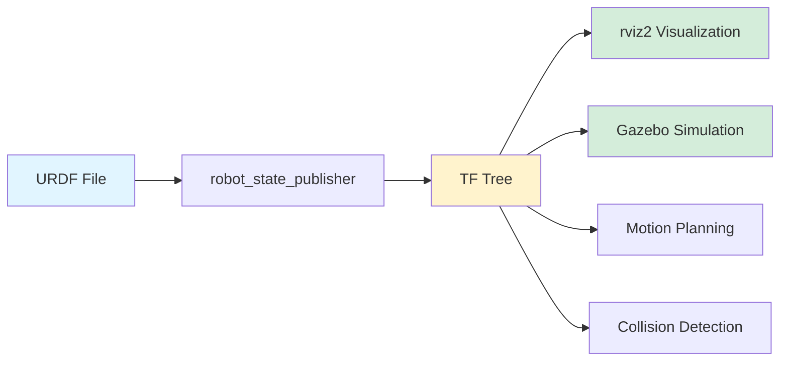
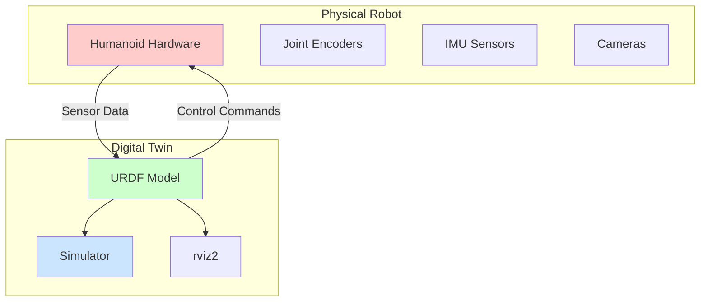
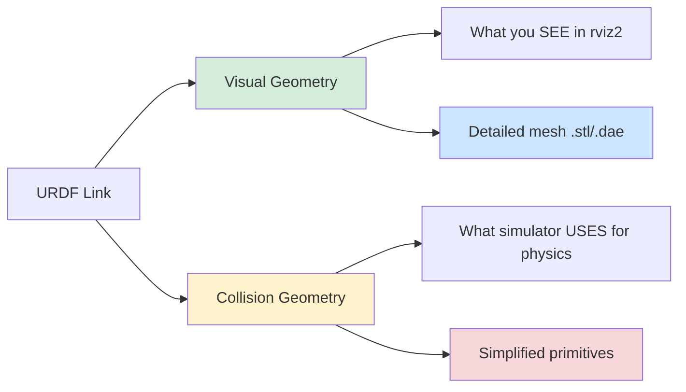
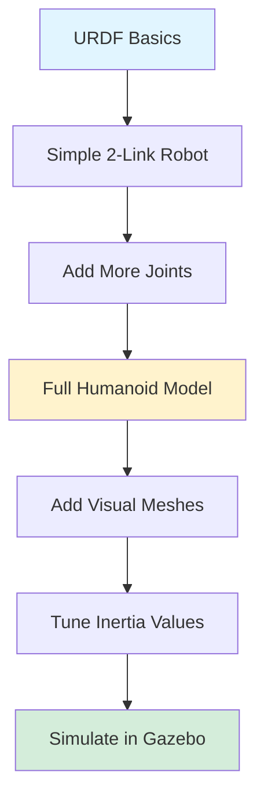

# Chapter 04: URDF & Digital Twins

:::info Chapter Overview
Learn to create accurate robot descriptions using URDF (Unified Robot Description Format) and build digital twins for simulation and visualization. This chapter focuses on humanoid robot modeling with practical examples.
:::

## What You'll Learn

By the end of this chapter, you'll be able to:

- ✅ Understand URDF XML structure and syntax
- ✅ Model humanoid robots with links and joints
- ✅ Differentiate between visual and collision geometry
- ✅ Create kinematic chains and TF (transform) trees
- ✅ Visualize robots in rviz2 and simulators
- ✅ Integrate URDF models with ROS 2 nodes
- ✅ Debug common URDF modeling errors

## Prerequisites

Before starting this chapter, you should:

- ✅ Complete **[Chapter 03: ROS 2 Fundamentals](../ros2-fundamentals)**
- ✅ Understand ROS 2 nodes, topics, and parameters
- ✅ Have ROS 2 Jazzy installed and working
- ✅ Be familiar with XML syntax basics
- ✅ Have basic understanding of 3D coordinates (x, y, z)

## What is URDF?

**URDF (Unified Robot Description Format)** is an XML-based format for describing robot kinematics, dynamics, and visual appearance. It's the standard way to represent robots in ROS 2.

### Why URDF Matters



A single URDF file enables:
- **Visualization**: See your robot in rviz2 and simulators
- **Simulation**: Test controllers without hardware
- **Motion Planning**: Calculate inverse kinematics and trajectories
- **Collision Detection**: Avoid self-collisions and obstacles
- **Documentation**: Share robot specifications with team members

## Digital Twin Concept

A **digital twin** is a virtual replica of a physical robot that mirrors its:
- **Geometry**: Exact dimensions and shapes
- **Kinematics**: Joint ranges and movement constraints
- **Dynamics**: Mass, inertia, friction properties
- **Sensors**: Camera, lidar, IMU placements



**Use Cases:**
- Develop and test algorithms before hardware arrives
- Simulate dangerous scenarios safely (falls, collisions)
- Train machine learning models in simulation
- Visualize robot state during debugging

## Quick Start: Viewing a Simple URDF

Let's visualize a basic humanoid URDF model using rviz2.

### Step 1: Install Required Tools

```bash
# Install URDF utilities and rviz2
sudo apt install ros-jazzy-urdf-tutorial \
                 ros-jazzy-joint-state-publisher-gui \
                 ros-jazzy-robot-state-publisher \
                 ros-jazzy-rviz2

# Source ROS 2 environment
source /opt/ros/jazzy/setup.bash
```

### Step 2: View Example URDF

```bash
# Launch rviz2 with a simple robot model
ros2 launch urdf_tutorial display.launch.py model:=urdf/01-myfirst.urdf

# This will open:
# 1. rviz2 window showing the robot
# 2. joint_state_publisher_gui with sliders to move joints
```

**What You'll See:**
- **rviz2**: 3D visualization of the robot
- **TF Tree**: Shows coordinate frame relationships
- **Joint Sliders**: Control robot joint angles interactively

### Step 3: Explore with CLI Tools

```bash
# In a new terminal, check the TF tree
ros2 run tf2_tools view_frames

# View the generated PDF
evince frames.pdf  # or open frames.pdf on your system

# Echo transform between two links
ros2 topic echo /tf
```

## Chapter Structure

This chapter is organized into the following sections:

1. **[URDF Basics](./urdf-basics)** - XML structure, links, joints, coordinate frames
2. **[Humanoid Modeling](./humanoid-modeling)** - Creating a simple bipedal robot from scratch
3. **[Visualization & Testing](./visualization-testing)** - rviz2, joint_state_publisher, debugging
4. **[Advanced Topics](./advanced-topics)** - Xacro macros, URDF composition, best practices
5. **[Quiz](./quiz)** - Test your URDF knowledge

## Key Concepts Preview

### Links (Rigid Bodies)

A **link** represents a rigid body in your robot:

```xml
<link name="head">
  <visual>
    <geometry>
      <box size="0.15 0.12 0.18"/>  <!-- width depth height in meters -->
    </geometry>
    <material name="skin_color"/>
  </visual>
  <collision>
    <geometry>
      <box size="0.15 0.12 0.18"/>
    </geometry>
  </collision>
  <inertial>
    <mass value="2.5"/>  <!-- kg -->
    <inertia ixx="0.01" ixy="0.0" ixz="0.0" iyy="0.01" iyz="0.0" izz="0.01"/>
  </inertial>
</link>
```

### Joints (Connections Between Links)

A **joint** connects two links and defines how they move relative to each other:

```xml
<joint name="neck_joint" type="revolute">
  <parent link="torso"/>
  <child link="head"/>
  <origin xyz="0 0 0.5" rpy="0 0 0"/>  <!-- x y z, roll pitch yaw -->
  <axis xyz="0 0 1"/>  <!-- rotation axis (z-axis = yaw) -->
  <limit lower="-0.785" upper="0.785" effort="10" velocity="1.0"/>
  <!-- +/- 45 degrees, 10 Nm torque, 1 rad/s max speed -->
</joint>
```

**Joint Types:**
- `revolute`: Rotating joint with limits (e.g., elbow, knee)
- `continuous`: Rotating joint without limits (e.g., wheel)
- `prismatic`: Sliding joint (e.g., telescoping arm)
- `fixed`: No movement (e.g., sensor mount)

### Visual vs Collision Geometry



**Visual Geometry:**
- Detailed meshes for realistic appearance
- Can be complex STL/DAE/OBJ files
- Only affects rendering, not physics

**Collision Geometry:**
- Simplified shapes (boxes, cylinders, spheres)
- Used by physics engine for collision detection
- Must be computationally efficient

**Best Practice:** Use detailed meshes for visual, simple primitives for collision.

## Humanoid Modeling Preview

In this chapter, we'll build a simple humanoid robot from scratch:

```
        [Head]
          |
       [Neck Joint]
          |
        [Torso]
       /     \
   [L Shoulder] [R Shoulder]
      |              |
   [L Elbow]      [R Elbow]
      |              |
   [L Hand]       [R Hand]

      [Torso]
       /    \
   [L Hip]  [R Hip]
      |        |
   [L Knee] [R Knee]
      |        |
   [L Ankle][R Ankle]
      |        |
   [L Foot] [R Foot]
```

**Components:**
- 15 links (head, torso, 2 arms × 3 segments, 2 legs × 3 segments, 2 feet)
- 14 joints (neck, shoulders, elbows, hips, knees, ankles)
- Material definitions for colors
- Proper mass and inertia values

## Tools You'll Use

### 1. robot_state_publisher

Publishes the robot's TF tree based on URDF and joint states:

```bash
ros2 run robot_state_publisher robot_state_publisher \
  --ros-args -p robot_description:="$(cat my_robot.urdf)"
```

### 2. joint_state_publisher_gui

GUI with sliders to control joint angles:

```bash
ros2 run joint_state_publisher_gui joint_state_publisher_gui
```

### 3. rviz2

3D visualization tool:

```bash
ros2 run rviz2 rviz2
```

**Add displays in rviz2:**
- `RobotModel`: Shows URDF visual geometry
- `TF`: Shows coordinate frames as axes
- `Axes`: Shows world origin

### 4. check_urdf (Validation Tool)

```bash
# Validate URDF syntax
check_urdf my_robot.urdf

# Output:
# robot name is: my_humanoid
# ---------- Successfully Parsed XML ---------------
# root Link: base_link has 2 child(ren)
#     child(1):  left_leg
#     child(2):  right_leg
```

### 5. urdf_to_graphviz (Visualization)

```bash
# Generate visual diagram of URDF structure
urdf_to_graphviz my_robot.urdf

# Opens PDF showing link-joint tree
```

## Common URDF Patterns

### Pattern 1: Symmetric Limbs

For humanoid robots, define one arm/leg, then mirror for the other side:

```xml
<!-- Left arm -->
<link name="left_upper_arm">...</link>
<joint name="left_shoulder" type="revolute">...</joint>

<!-- Right arm (mirrored) -->
<link name="right_upper_arm">...</link>
<joint name="right_shoulder" type="revolute">
  <origin xyz="0 -0.3 0" rpy="0 0 0"/>  <!-- Note negative y -->
  ...
</joint>
```

### Pattern 2: Coordinate Frame Convention

ROS 2 uses **REP 103** (ROS Enhancement Proposal) coordinate conventions:

- **x**: Forward (red axis)
- **y**: Left (green axis)
- **z**: Up (blue axis)

**For humanoid robots:**
- Base link at pelvis/hip center
- Z-axis points up (toward head)
- X-axis points forward (direction robot faces)
- Y-axis points to robot's left

## Learning Path



**Recommended Approach:**
1. Start with minimal URDF (2-3 links)
2. Validate with `check_urdf` after each change
3. Visualize in rviz2 frequently
4. Add complexity incrementally
5. Test in simulator before deploying to hardware

## Resources

- **ROS 2 URDF Tutorial**: https://docs.ros.org/en/jazzy/Tutorials/Intermediate/URDF/URDF-Main.html
- **URDF XML Spec**: http://wiki.ros.org/urdf/XML
- **REP 103 (Coordinate Frames)**: https://www.ros.org/reps/rep-0103.html
- **Xacro (URDF Macros)**: https://docs.ros.org/en/jazzy/Tutorials/Intermediate/URDF/Using-Xacro-to-Clean-Up-a-URDF-File.html

---

## What's Next?

Ready to start building? Proceed to **[Section 1: URDF Basics](./urdf-basics)** to learn the XML structure and create your first robot model.

**In the next section:**
- URDF XML syntax deep dive
- Creating links with visual geometry
- Connecting links with joints
- Understanding coordinate transforms
- Hands-on: Build a 3-link robot arm
