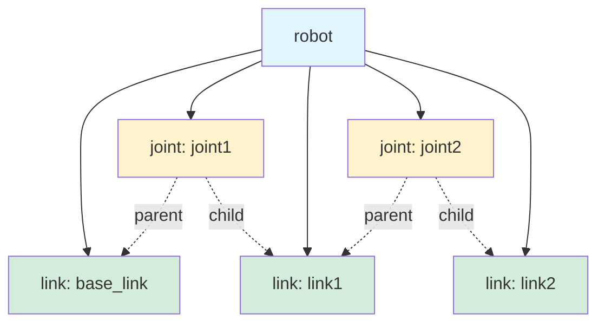
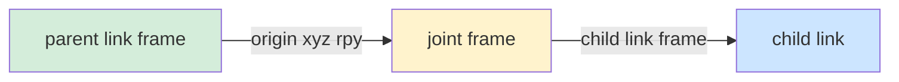

# Section 1: URDF Basics

:::info Learning Objectives
Master the foundational URDF concepts needed to build any robot model. By the end of this section, you'll understand XML structure, links, joints, materials, and coordinate transforms.
:::

## What is URDF?

**URDF (Unified Robot Description Format)** is an XML-based file format that describes:
- **Kinematics**: How robot parts connect and move
- **Dynamics**: Mass, inertia, friction properties
- **Visual appearance**: Shapes, colors, meshes
- **Collision geometry**: Simplified shapes for physics simulation

URDF is the **lingua franca** of ROS robotics - it's how you tell ROS "this is what my robot looks like and how it moves."

## Minimal URDF Example

Let's start with the simplest possible robot: a single box floating in space.

```xml
<?xml version="1.0"?>
<robot name="minimal_robot">

  <!-- A single link (rigid body) -->
  <link name="base_link">
    <visual>
      <geometry>
        <box size="0.5 0.3 0.1"/>  <!-- x=0.5m, y=0.3m, z=0.1m -->
      </geometry>
      <material name="blue">
        <color rgba="0 0 1 1"/>  <!-- Red Green Blue Alpha (0-1 range) -->
      </material>
    </visual>
  </link>

</robot>
```

**Key components:**
1. `<?xml version="1.0"?>` - Required XML declaration
2. `<robot name="...">` - Root element, contains entire robot
3. `<link>` - Represents a rigid body
4. `<visual><geometry>` - What you see in rviz2
5. `<material>` - Color or texture

### Visualizing This URDF

Save the above as `minimal_robot.urdf`, then:

```bash
# Method 1: Use check_urdf to validate
check_urdf minimal_robot.urdf

# Output:
# robot name is: minimal_robot
# ---------- Successfully Parsed XML ---------------
# root Link: base_link has 0 child(ren)

# Method 2: Visualize in rviz2
ros2 launch urdf_tutorial display.launch.py model:=minimal_robot.urdf
```

**What you'll see:** A blue box floating in rviz2. Use your mouse to rotate the view.

## URDF Structure: The Big Picture



**URDF is a tree structure:**
- **Root**: `<robot>` element
- **Nodes**: `<link>` elements (rigid bodies)
- **Edges**: `<joint>` elements (connections between links)

**Important rules:**
1. Every URDF has exactly **one root link** (no parents)
2. All other links are connected via joints
3. No cycles allowed (it's a tree, not a graph)

## Links: Rigid Bodies

A **link** represents a part of your robot that doesn't bend or deform. Think of links as LEGO bricks.

### Full Link Anatomy

```xml
<link name="torso">

  <!-- Visual geometry (what you see) -->
  <visual>
    <origin xyz="0 0 0" rpy="0 0 0"/>  <!-- offset from link frame -->
    <geometry>
      <box size="0.3 0.2 0.5"/>  <!-- 30cm × 20cm × 50cm -->
    </geometry>
    <material name="gray">
      <color rgba="0.5 0.5 0.5 1"/>
    </material>
  </visual>

  <!-- Collision geometry (what simulator uses for physics) -->
  <collision>
    <origin xyz="0 0 0" rpy="0 0 0"/>
    <geometry>
      <box size="0.3 0.2 0.5"/>  <!-- same as visual for simple cases -->
    </geometry>
  </collision>

  <!-- Inertial properties (mass, center of mass, inertia tensor) -->
  <inertial>
    <origin xyz="0 0 0" rpy="0 0 0"/>  <!-- center of mass offset -->
    <mass value="5.0"/>  <!-- kg -->
    <inertia ixx="0.1" ixy="0.0" ixz="0.0"
             iyy="0.1" iyz="0.0"
             izz="0.05"/>
  </inertial>

</link>
```

### Geometry Types

URDF supports five geometry primitives:

#### 1. Box
```xml
<geometry>
  <box size="x y z"/>  <!-- meters -->
</geometry>
```

#### 2. Cylinder
```xml
<geometry>
  <cylinder radius="0.05" length="0.3"/>  <!-- radius in meters, length along z-axis -->
</geometry>
```

#### 3. Sphere
```xml
<geometry>
  <sphere radius="0.1"/>  <!-- meters -->
</geometry>
```

#### 4. Mesh (for complex shapes)
```xml
<geometry>
  <mesh filename="package://my_package/meshes/hand.stl" scale="1.0 1.0 1.0"/>
</geometry>
```

**Mesh file formats:**
- `.stl` - Common for 3D printing, good for collision
- `.dae` (Collada) - Supports colors and textures, good for visual
- `.obj` - Wavefront format, widely supported

#### 5. Capsule (ROS 2 Jazzy and newer)
```xml
<geometry>
  <capsule radius="0.05" length="0.2"/>  <!-- cylinder with hemisphere endcaps -->
</geometry>
```

### Visual vs Collision Geometry

**Why separate visual and collision?**

| Aspect | Visual Geometry | Collision Geometry |
|--------|-----------------|-------------------|
| **Purpose** | Rendering in rviz2/simulators | Physics simulation |
| **Complexity** | Can be very detailed (high-poly meshes) | Should be simple |
| **Performance** | Only affects graphics | Affects simulation speed |
| **Example** | Detailed hand mesh (10,000 triangles) | Simple box or capsule |

**Best practice:**

```xml
<link name="robot_hand">
  <!-- Visual: detailed mesh for realistic appearance -->
  <visual>
    <geometry>
      <mesh filename="package://my_robot/meshes/hand_detailed.dae"/>
    </geometry>
  </visual>

  <!-- Collision: simplified primitive for fast physics -->
  <collision>
    <geometry>
      <box size="0.15 0.08 0.05"/>  <!-- approximate hand as a box -->
    </geometry>
  </collision>
</link>
```

**Why?** Physics engines (Gazebo, Isaac Sim) need to check for collisions thousands of times per second. Simple primitives (boxes, cylinders, spheres) are **10-100x faster** than complex meshes.

## Materials: Colors and Textures

### Inline Material Definition

```xml
<material name="red">
  <color rgba="1 0 0 1"/>  <!-- R G B Alpha (0.0-1.0) -->
</material>
```

**RGBA values:**
- `r="1" g="0" b="0"` = pure red
- `r="0" g="1" b="0"` = pure green
- `r="0" g="0" b="1"` = pure blue
- `r="1" g="1" b="1"` = white
- `r="0" g="0" b="0"` = black
- `a="1.0"` = fully opaque, `a="0.5"` = semi-transparent

### Texture Mapping

```xml
<material name="carbon_fiber">
  <texture filename="package://my_robot/textures/carbon.png"/>
</material>
```

**Note:** Textures work in Gazebo but may not render in rviz2 (use colors for rviz2).

### Reusing Materials

```xml
<robot name="my_robot">

  <!-- Define material once -->
  <material name="blue">
    <color rgba="0 0 1 1"/>
  </material>

  <link name="link1">
    <visual>
      <geometry><box size="0.1 0.1 0.1"/></geometry>
      <material name="blue"/>  <!-- reference by name -->
    </visual>
  </link>

  <link name="link2">
    <visual>
      <geometry><box size="0.2 0.2 0.2"/></geometry>
      <material name="blue"/>  <!-- same material -->
    </visual>
  </link>

</robot>
```

## Joints: Connecting Links

A **joint** defines how two links move relative to each other. Joints are the "hinges" and "sliders" of your robot.

### Joint Anatomy

```xml
<joint name="shoulder" type="revolute">

  <!-- Parent and child links -->
  <parent link="torso"/>
  <child link="upper_arm"/>

  <!-- Where the joint is located (relative to parent frame) -->
  <origin xyz="0 0.15 0.4" rpy="0 0 0"/>

  <!-- Rotation axis (which direction the joint rotates around) -->
  <axis xyz="0 1 0"/>  <!-- y-axis = pitch rotation -->

  <!-- Joint limits -->
  <limit lower="-1.57" upper="1.57" effort="100" velocity="2.0"/>
  <!--   -90° to +90°, 100 Nm torque, 2 rad/s max speed -->

  <!-- Damping and friction (optional) -->
  <dynamics damping="0.5" friction="0.1"/>

</joint>
```

### Joint Types

| Type | Description | Use Case | Has Limits? |
|------|-------------|----------|-------------|
| `revolute` | Hinge joint (rotation) | Elbows, knees, fingers | Yes |
| `continuous` | Unlimited rotation | Wheels | No |
| `prismatic` | Sliding joint | Telescoping arms, elevators | Yes |
| `fixed` | No movement | Camera mounts, sensors | N/A |
| `planar` | Moves in a plane | Not commonly used | No |
| `floating` | Moves freely in 3D | Not commonly used | No |

**Most common:** `revolute` (90% of humanoid joints) and `fixed` (sensors).

### Understanding `<origin>` Transform

The `<origin>` tag answers two questions:

1. **xyz**: Where is the joint? (position offset from parent link frame)
2. **rpy**: What orientation is the joint? (roll-pitch-yaw angles)

```xml
<origin xyz="x y z" rpy="roll pitch yaw"/>
```

**Coordinate system:**
- **x**: Forward (red axis)
- **y**: Left (green axis)
- **z**: Up (blue axis)

**rpy (roll-pitch-yaw):**
- **roll**: Rotation around x-axis (in radians)
- **pitch**: Rotation around y-axis
- **yaw**: Rotation around z-axis

**Example:** Elbow joint 30cm down the arm

```xml
<joint name="elbow" type="revolute">
  <parent link="upper_arm"/>
  <child link="forearm"/>
  <origin xyz="0 0 -0.3" rpy="0 0 0"/>  <!-- 30cm down (negative z) -->
  <axis xyz="0 1 0"/>  <!-- rotate around y-axis (pitch) -->
  <limit lower="0" upper="2.5" effort="50" velocity="2"/>  <!-- 0 to ~143° -->
</joint>
```

### Understanding `<axis>`

The `<axis>` tag specifies which direction the joint rotates around (for `revolute`) or slides along (for `prismatic`).

**Common axis directions:**

| Axis | Vector | Rotation Type | Example |
|------|--------|---------------|---------|
| `xyz="1 0 0"` | x-axis | Roll | Wrist twist |
| `xyz="0 1 0"` | y-axis | Pitch | Elbow, knee |
| `xyz="0 0 1"` | z-axis | Yaw | Neck turning |

**Visualization:**

```
        z (up)
        |
        |
        o------ y (left)
       /
      /
     x (forward)
```

For a humanoid standing upright:
- **Knee**: bends around y-axis (pitch)
- **Hip yaw**: rotates around z-axis (yaw)
- **Wrist**: twists around x-axis (roll)

## Building a 2-Link Robot Arm

Let's combine everything we've learned to build a simple robot arm.

```xml
<?xml version="1.0"?>
<robot name="simple_arm">

  <!-- Base (fixed to the world) -->
  <link name="base_link">
    <visual>
      <geometry>
        <cylinder radius="0.1" length="0.05"/>
      </geometry>
      <material name="gray">
        <color rgba="0.5 0.5 0.5 1"/>
      </material>
    </visual>
    <collision>
      <geometry>
        <cylinder radius="0.1" length="0.05"/>
      </geometry>
    </collision>
    <inertial>
      <mass value="1.0"/>
      <inertia ixx="0.001" ixy="0" ixz="0" iyy="0.001" iyz="0" izz="0.002"/>
    </inertial>
  </link>

  <!-- Upper arm segment -->
  <link name="upper_arm">
    <visual>
      <origin xyz="0 0 0.15" rpy="0 0 0"/>  <!-- center of 30cm cylinder -->
      <geometry>
        <cylinder radius="0.03" length="0.3"/>
      </geometry>
      <material name="blue">
        <color rgba="0 0.5 1 1"/>
      </material>
    </visual>
    <collision>
      <origin xyz="0 0 0.15" rpy="0 0 0"/>
      <geometry>
        <cylinder radius="0.03" length="0.3"/>
      </geometry>
    </collision>
    <inertial>
      <origin xyz="0 0 0.15" rpy="0 0 0"/>
      <mass value="0.5"/>
      <inertia ixx="0.004" ixy="0" ixz="0" iyy="0.004" iyz="0" izz="0.0001"/>
    </inertial>
  </link>

  <!-- Shoulder joint (connects base to upper arm) -->
  <joint name="shoulder" type="revolute">
    <parent link="base_link"/>
    <child link="upper_arm"/>
    <origin xyz="0 0 0.025" rpy="0 0 0"/>  <!-- top of base cylinder -->
    <axis xyz="0 1 0"/>  <!-- pitch rotation -->
    <limit lower="-1.57" upper="1.57" effort="10" velocity="1.0"/>
    <dynamics damping="0.5"/>
  </joint>

  <!-- Forearm segment -->
  <link name="forearm">
    <visual>
      <origin xyz="0 0 0.125" rpy="0 0 0"/>  <!-- center of 25cm cylinder -->
      <geometry>
        <cylinder radius="0.025" length="0.25"/>
      </geometry>
      <material name="green">
        <color rgba="0 1 0.5 1"/>
      </material>
    </visual>
    <collision>
      <origin xyz="0 0 0.125" rpy="0 0 0"/>
      <geometry>
        <cylinder radius="0.025" length="0.25"/>
      </geometry>
    </collision>
    <inertial>
      <origin xyz="0 0 0.125" rpy="0 0 0"/>
      <mass value="0.3"/>
      <inertia ixx="0.002" ixy="0" ixz="0" iyy="0.002" iyz="0" izz="0.0001"/>
    </inertial>
  </link>

  <!-- Elbow joint (connects upper arm to forearm) -->
  <joint name="elbow" type="revolute">
    <parent link="upper_arm"/>
    <child link="forearm"/>
    <origin xyz="0 0 0.3" rpy="0 0 0"/>  <!-- top of upper arm -->
    <axis xyz="0 1 0"/>  <!-- pitch rotation -->
    <limit lower="0" upper="2.5" effort="5" velocity="1.0"/>  <!-- 0 to ~143° -->
    <dynamics damping="0.3"/>
  </joint>

</robot>
```

### Kinematic Chain

```
base_link
    |
    | (shoulder joint)
    |
upper_arm
    |
    | (elbow joint)
    |
forearm
```

### Visualize and Test

```bash
# Save as simple_arm.urdf, then:
ros2 launch urdf_tutorial display.launch.py model:=simple_arm.urdf
```

**What you'll see:**
- Gray cylinder base
- Blue upper arm
- Green forearm
- GUI sliders to control shoulder and elbow angles

## Coordinate Transforms in Depth

### Link Frames

Every link has its own **coordinate frame** located at the link's origin (where the joint attaches).



**Transform chain:**
1. Start at parent link frame
2. Apply joint's `<origin xyz rpy>` to get joint frame
3. Child link frame = joint frame
4. Repeat for next joint

### Example: Computing End-Effector Position

Given our 2-link arm:

```
base_link (0, 0, 0)
    | shoulder at (0, 0, 0.025)
upper_arm frame = (0, 0, 0.025)
    | elbow at (0, 0, 0.3) relative to upper_arm
forearm frame = (0, 0, 0.325) in world

Forearm tip = (0, 0, 0.325 + 0.25) = (0, 0, 0.575) in world
```

When `shoulder = 45°`:
- Upper arm rotates 45° around y-axis
- End-effector position changes based on forward kinematics

**TF tree** (more in Section 3) shows these transforms in real-time.

## Calculating Inertia Tensors

For simulation, you need inertia values. Here are formulas for common shapes:

### Box (width w, depth d, height h, mass m)

```
Ixx = (1/12) * m * (d² + h²)
Iyy = (1/12) * m * (w² + h²)
Izz = (1/12) * m * (w² + d²)
Ixy = Ixz = Iyz = 0  (for symmetric boxes)
```

### Cylinder (radius r, height h, mass m)

**Z-axis along cylinder length:**

```
Ixx = Iyy = (1/12) * m * (3*r² + h²)
Izz = (1/2) * m * r²
Ixy = Ixz = Iyz = 0
```

### Sphere (radius r, mass m)

```
Ixx = Iyy = Izz = (2/5) * m * r²
Ixy = Ixz = Iyz = 0
```

### Online Calculator

For complex shapes, use: [https://amesweb.info/inertia/mass-moment-of-inertia-calculator.aspx](https://amesweb.info/inertia/mass-moment-of-inertia-calculator.aspx)

**Tip:** Incorrect inertia can cause simulation instability. Start with approximate values, tune if robot behaves strangely (e.g., explodes, vibrates).

## Common URDF Patterns

### Pattern 1: Dummy Links for Complex Joints

Sometimes you need a joint that rotates around multiple axes. URDF doesn't support multi-DOF joints directly, so use dummy links:

```xml
<!-- Hip joint with yaw + pitch (2 DOF) -->

<!-- Dummy link (zero mass) -->
<link name="hip_yaw_link">
  <inertial>
    <mass value="0.001"/>  <!-- near-zero mass -->
    <inertia ixx="0.0001" ixy="0" ixz="0" iyy="0.0001" iyz="0" izz="0.0001"/>
  </inertial>
</link>

<!-- Yaw joint -->
<joint name="hip_yaw" type="revolute">
  <parent link="pelvis"/>
  <child link="hip_yaw_link"/>
  <axis xyz="0 0 1"/>  <!-- yaw -->
  ...
</joint>

<!-- Pitch joint -->
<joint name="hip_pitch" type="revolute">
  <parent link="hip_yaw_link"/>
  <child link="thigh"/>
  <axis xyz="0 1 0"/>  <!-- pitch -->
  ...
</joint>
```

### Pattern 2: Fixed Sensors

Cameras and sensors don't move, so use `fixed` joints:

```xml
<link name="camera_link">
  <visual>
    <geometry><box size="0.05 0.02 0.02"/></geometry>
    <material name="black"><color rgba="0 0 0 1"/></material>
  </visual>
</link>

<joint name="camera_mount" type="fixed">
  <parent link="head"/>
  <child link="camera_link"/>
  <origin xyz="0.08 0 0.05" rpy="0 0 0"/>  <!-- front of head -->
</joint>
```

### Pattern 3: Mirrored Limbs

For bilateral symmetry (left/right arms or legs), define one side then mirror:

```xml
<!-- Left arm -->
<link name="left_upper_arm">...</link>
<joint name="left_shoulder" type="revolute">
  <parent link="torso"/>
  <child link="left_upper_arm"/>
  <origin xyz="0 0.2 0.4" rpy="0 0 0"/>  <!-- +y = left -->
  <axis xyz="0 1 0"/>
  ...
</joint>

<!-- Right arm (mirrored) -->
<link name="right_upper_arm">...</link>
<joint name="right_shoulder" type="revolute">
  <parent link="torso"/>
  <child link="right_upper_arm"/>
  <origin xyz="0 -0.2 0.4" rpy="0 0 0"/>  <!-- -y = right -->
  <axis xyz="0 1 0"/>  <!-- same axis -->
  ...
</joint>
```

## Troubleshooting URDF Errors

### Error 1: "Failed to parse URDF file"

**Cause:** XML syntax error (unclosed tag, typo, etc.)

**Fix:**
```bash
check_urdf my_robot.urdf
# Points to exact line number of error
```

### Error 2: "Joint parent/child link does not exist"

**Cause:** Typo in link name, or link defined after joint

**Fix:** Ensure all links are defined, check spelling

```xml
<!-- WRONG -->
<joint name="j1" type="revolute">
  <parent link="base_link"/>
  <child link="link1"/>  <!-- link1 not defined yet! -->
</joint>

<!-- CORRECT -->
<link name="link1">...</link>
<joint name="j1" type="revolute">
  <parent link="base_link"/>
  <child link="link1"/>  <!-- link1 exists -->
</joint>
```

### Error 3: "Tree structure is broken"

**Cause:** Cycle in link-joint graph, or multiple root links

**Fix:** URDF must be a **tree** (one root, no cycles)

```bash
urdf_to_graphviz my_robot.urdf
# Generates PDF showing link-joint tree
```

### Error 4: Robot explodes in simulation

**Cause:** Incorrect inertia values or colliding links at startup

**Fix:**
- Recalculate inertia using formulas above
- Check for overlapping collision geometries in initial pose
- Add damping to joints: `<dynamics damping="1.0"/>`

## Validation Workflow

**Before moving to simulation:**

1. **Validate XML**
   ```bash
   check_urdf my_robot.urdf
   ```

2. **Visualize structure**
   ```bash
   urdf_to_graphviz my_robot.urdf
   ```

3. **Test in rviz2**
   ```bash
   ros2 launch urdf_tutorial display.launch.py model:=my_robot.urdf
   ```

4. **Check TF tree**
   ```bash
   ros2 run tf2_tools view_frames
   evince frames.pdf
   ```

5. **Test joint limits**
   - Use GUI sliders to move each joint through full range
   - Check for self-collisions
   - Verify movement matches expectations

## Exercises

### Exercise 1: Build a 3-Link Arm

Extend the 2-link arm to add a wrist joint:
- Add `wrist` link (15cm long, radius 0.02m)
- Add `wrist_pitch` joint connecting forearm to wrist
- Joint limits: -1.57 to 1.57 rad
- Visualize in rviz2

### Exercise 2: Add a Gripper

Add a simple 2-finger gripper to the wrist:
- Two prismatic joints (sliding fingers)
- Each finger is a small box (0.08 × 0.02 × 0.01 m)
- Slide range: 0 to 0.05 m (5cm)

### Exercise 3: Calculate Inertia

Calculate exact inertia tensor for a cylinder with:
- Radius: 0.04 m
- Height: 0.25 m
- Mass: 1.5 kg

Verify with online calculator.

## Summary

**Key concepts:**
- URDF uses XML to describe robot kinematics and dynamics
- **Links** = rigid bodies with visual, collision, and inertial properties
- **Joints** = connections that define how links move
- **origin xyz rpy** = position and orientation transforms
- **axis xyz** = rotation/sliding direction for joints
- Visual geometry can be detailed, collision should be simple

**Next steps:**
- In **[Section 2: Humanoid Modeling](./humanoid-modeling)**, we'll build a complete 15-link humanoid robot from scratch
- You'll learn symmetry patterns, mass distribution, and realistic joint limits

---

## Additional Resources

- **URDF XML Specification**: http://wiki.ros.org/urdf/XML
- **URDF Tutorial (ROS 2)**: https://docs.ros.org/en/jazzy/Tutorials/Intermediate/URDF/URDF-Main.html
- **Inertia Calculator**: https://amesweb.info/inertia/mass-moment-of-inertia-calculator.aspx
- **Onshape to URDF**: https://github.com/Rhoban/onshape-to-robot (CAD to URDF converter)
