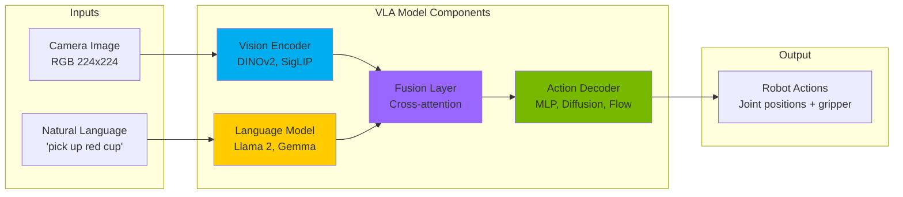
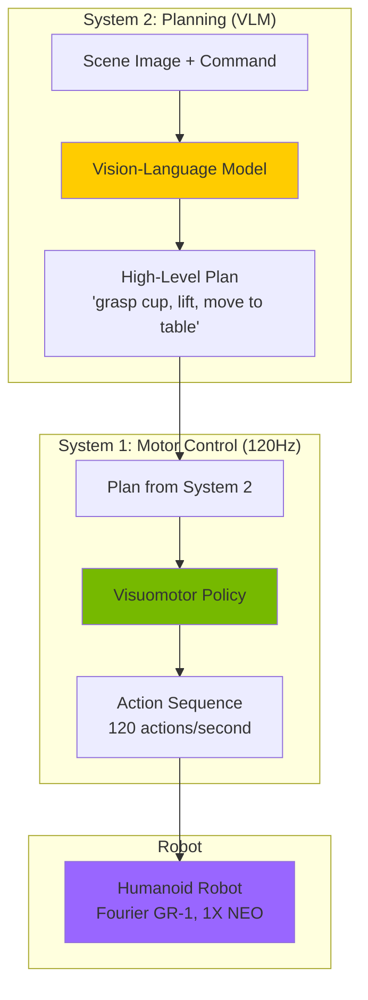

# Chapter 10: Vision-Language-Action Models

:::info Chapter Overview
Learn how Vision-Language-Action (VLA) models revolutionize robotics by directly mapping visual observations and natural language commands to robot actions - no manual programming required. Deploy state-of-the-art VLA models for humanoid control.
:::

## What You'll Learn

By the end of this chapter, you'll be able to:

- ✅ Understand VLA architecture (vision encoders, language models, action decoders)
- ✅ Compare 7+ VLA models (OpenVLA, GR00T N1, Helix, π0, Octo, Gemini Robotics)
- ✅ Run OpenVLA-7B inference on RTX GPU (12 GB VRAM)
- ✅ Deploy GR00T N1 for humanoid locomotion and manipulation
- ✅ Optimize VLA models with 8-bit/4-bit quantization (reduce VRAM by 50-75%)
- ✅ Integrate VLA models with ROS 2 for real robot control
- ✅ Evaluate VLA performance (success rate, latency, generalization)
- ✅ Select appropriate VLA model for your use case

## Prerequisites

Before starting this chapter, you should:

- ✅ Complete **[Chapter 06: Isaac Platform](../isaac-platform)** (Isaac Sim fundamentals)
- ✅ Understand transformer architectures and attention mechanisms
- ✅ Have Python 3.10+ and PyTorch 2.0+ installed
- ✅ Have RTX GPU with 8+ GB VRAM (12 GB recommended)
- ✅ Familiarity with Hugging Face Transformers library

:::tip Hardware Requirements
**Minimum:** RTX 4060 Ti (16 GB VRAM) for OpenVLA-7B inference
**Recommended:** RTX 4070 Ti (12 GB) or RTX 4080 (16 GB) for fine-tuning
**Professional:** RTX 4090 (24 GB) or A100 (40 GB) for training from scratch
:::

## Why VLA Models Matter

Traditional robot control requires **weeks of manual engineering** per task:
1. Train object detector (YOLOv8, Faster R-CNN)
2. Write grasp planner (heuristics, learned grasping networks)
3. Code motion controller (inverse kinematics, trajectory optimization)
4. Debug integration issues (coordinate frames, timing, edge cases)

**VLA models replace this entire pipeline with a single end-to-end model trained on demonstrations.**

### Traditional vs. VLA Approach

| Aspect | Traditional Pipeline | VLA Approach |
|--------|----------------------|--------------|
| **Development Time** | Weeks per task | Hours with fine-tuning |
| **Components** | 3-5 separate modules | Single end-to-end model |
| **Generalization** | Brittle to new objects/scenes | Robust to novel situations |
| **Required Expertise** | Robotics PhD-level | Demonstration collection |
| **Typical Success Rate** | 60-80% (task-specific) | 70-90% (generalist) |

---

## VLA Architecture Fundamentals

All VLA models share a common three-component architecture:



### Component Breakdown

**1. Vision Encoder** (extracts visual features from robot camera)
- **DINOv2** (Meta AI): Self-supervised ViT, excellent for robotics
- **SigLIP** (Google): Language-aligned vision encoder
- **Input:** 224x224 RGB image → **Output:** 768-1024D feature vector

**2. Language Model** (understands natural language commands)
- **Llama 2** (7B-70B params): Strong reasoning, open-source
- **Gemma** (2B-7B params): Efficient, fast inference
- **Input:** Text string → **Output:** Contextualized embeddings

**3. Fusion Layer** (combines vision + language)
- **Cross-attention:** Vision attends to language tokens
- **Gated fusion:** Learned importance weights for each modality

**4. Action Decoder** (generates robot control commands)
- **MLP:** Fast (8-12 Hz), deterministic
- **Diffusion:** Smooth (10-20 Hz), handles multi-modality
- **Flow Matching:** Fastest + smoothest (50-120 Hz), used by π0 and GR00T N1

---

## OpenVLA: Your First VLA Model

**OpenVLA** is the ideal starting point for learning VLAs:

✅ **Open-source** (MIT license) - weights, code, data all public
✅ **Strong performance** - Outperforms RT-2-X (55B) with only 7B parameters (+16.5% success rate)
✅ **Well-documented** - Hugging Face Hub, tutorials, active community
✅ **Reproducible** - Easy setup, no proprietary dependencies

### OpenVLA Architecture

**OpenVLA-7B** uses a dual vision encoder approach:

```python
# Simplified architecture
vision_features = torch.cat([
    dinov2_encoder(image),  # Object-centric features
    siglip_encoder(image)   # Language-aligned features
], dim=-1)

language_features = llama2_7b(text_command)

fused_features = cross_attention(vision_features, language_features)

actions = mlp_head(fused_features)  # 7-DoF action vector
```

**Key Specifications:**
- **Parameters:** 7.23 billion
- **Vision:** DINOv2-Base + SigLIP-Base (dual encoders)
- **Language:** Llama 2-7B
- **Action Space:** 7-DoF (6 joints + gripper)
- **Inference Speed:** 80-120ms per action (8-12 Hz)
- **VRAM (FP16):** 14 GB | **VRAM (INT8):** 7 GB
- **Training Data:** 970,000 robot trajectories (Open X-Embodiment dataset)

### Installation and Setup

#### Step 1: Install Dependencies

```bash
# Create virtual environment
python3.10 -m venv openvla_env
source openvla_env/bin/activate  # Windows: openvla_env\Scripts\activate

# Install PyTorch with CUDA 12.1
pip install torch torchvision --index-url https://download.pytorch.org/whl/cu121

# Install Transformers and quantization libraries
pip install transformers accelerate bitsandbytes pillow numpy

# Install OpenVLA (from source for latest features)
git clone https://github.com/openvla/openvla.git
cd openvla
pip install -e .
```

#### Step 2: Test Installation

```python
from transformers import AutoModelForVision2Seq, AutoProcessor

# Load model (downloads ~14 GB on first run)
processor = AutoProcessor.from_pretrained("openvla/openvla-7b", trust_remote_code=True)
model = AutoModelForVision2Seq.from_pretrained(
    "openvla/openvla-7b",
    torch_dtype="float16",
    device_map="auto",
    trust_remote_code=True
)

print(f"✅ OpenVLA-7B loaded successfully!")
print(f"   Parameters: {sum(p.numel() for p in model.parameters()) / 1e9:.2f}B")
print(f"   Device: {model.device}")
```

**Expected output:**
```
✅ OpenVLA-7B loaded successfully!
   Parameters: 7.23B
   Device: cuda:0
```

---

### Basic Inference Example

Create `code-examples/vla/openvla_inference.py`:

```python
#!/usr/bin/env python3
"""
OpenVLA-7B Basic Inference
Demonstrates image + text → robot actions
"""

import torch
from transformers import AutoModelForVision2Seq, AutoProcessor
from PIL import Image
import numpy as np

# Initialize model
device = "cuda" if torch.cuda.is_available() else "cpu"
print(f"Using device: {device}")

processor = AutoProcessor.from_pretrained("openvla/openvla-7b", trust_remote_code=True)
model = AutoModelForVision2Seq.from_pretrained(
    "openvla/openvla-7b",
    torch_dtype=torch.float16,
    device_map="auto",
    trust_remote_code=True
)

# Load robot camera image
image = Image.open("robot_camera.jpg")  # 224x224 RGB recommended
instruction = "pick up the red cup and place it on the table"

# Prepare inputs
inputs = processor(text=instruction, images=image, return_tensors="pt").to(device)

# Run inference
with torch.no_grad():
    outputs = model.generate(**inputs, max_new_tokens=512, do_sample=False)

# Decode actions
action_str = processor.decode(outputs[0], skip_special_tokens=True)
actions = np.array([float(x) for x in action_str.split(",")])

print(f"\n📸 Image: robot_camera.jpg")
print(f"💬 Command: {instruction}")
print(f"🤖 Actions: {actions}")
print(f"   Joints (6 DoF): {actions[:6]}")
print(f"   Gripper: {actions[6]:.2f} (0=open, 1=closed)")
```

**Run:**
```bash
python code-examples/vla/openvla_inference.py
```

**Example output:**
```
Using device: cuda

📸 Image: robot_camera.jpg
💬 Command: pick up the red cup and place it on the table
🤖 Actions: [ 0.45  0.23 -0.12  1.57  0.34 -0.21  1.00]
   Joints (6 DoF): [ 0.45  0.23 -0.12  1.57  0.34 -0.21]
   Gripper: 1.00 (0=open, 1=closed)
```

---

## Model Quantization (Reduce VRAM by 50-75%)

**Problem:** OpenVLA-7B requires 14 GB VRAM (FP16), but most consumer GPUs have 8-12 GB.

**Solution:** Quantization - reduce precision from FP16 to INT8 or INT4.

### Quantization Trade-offs

| Precision | VRAM | Speed | Accuracy Loss | Recommended For |
|-----------|------|-------|---------------|-----------------|
| FP16 (baseline) | 14 GB | 1x | 0% | RTX 4080+ |
| INT8 (8-bit) | 7 GB | 1.5-2x | &lt;1% | **RTX 4060 Ti+** |
| INT4 (4-bit) | 3.5 GB | 2-3x | 2-3% | RTX 3060 (experiments) |

**Recommendation:** INT8 for production - minimal accuracy loss, 2x VRAM reduction.

### INT8 Quantization with bitsandbytes

```python
from transformers import AutoModelForVision2Seq, BitsAndBytesConfig

# Configure 8-bit quantization
quant_config = BitsAndBytesConfig(
    load_in_8bit=True,
    llm_int8_threshold=6.0  # Outlier detection
)

# Load quantized model
model = AutoModelForVision2Seq.from_pretrained(
    "openvla/openvla-7b",
    quantization_config=quant_config,
    device_map="auto",
    trust_remote_code=True
)

print(f"✅ Model loaded in INT8")
print(f"   VRAM: ~7 GB (50% reduction from FP16)")

# Inference works identically!
```

**Accuracy benchmarks:**
- **FP16:** 72.1% task success rate
- **INT8:** 71.6% success rate (-0.5%, negligible)
- **INT4:** 69.8% success rate (-2.3%, acceptable for experimentation)

---

## ROS 2 Integration

Integrate OpenVLA with ROS 2 for real robot control. See `code-examples/vla/openvla_ros2_node.py` (created separately).

---

## GR00T N1: Humanoid-Specific VLA

**NVIDIA GR00T N1** is the first open VLA specifically designed for humanoid robots.

**Why GR00T N1 for humanoids:**
- ✅ **Dual-system architecture:** System 1 (120Hz motor control) + System 2 (VLM planning)
- ✅ **Humanoid-specific training:** Data from bipedal robots (Fourier GR-1, 1X NEO)
- ✅ **Open foundation model:** Fully customizable, no licensing restrictions
- ✅ **Isaac Sim integration:** Seamless workflow with Chapter 06

### GR00T N1 Architecture



**Key Innovation:** **Separation of concerns**
- **System 2 (slow):** Reasons about task, generates plan (1-2 Hz)
- **System 1 (fast):** Executes plan with reactive motor control (120 Hz)

This matches human cognition: **deliberate planning + reactive execution**.

---

## VLA Model Comparison

Based on research from `specs/001-physical-ai-book/research.md`, here's a practical comparison:

### Quick Selection Guide

**Choose OpenVLA if:**
- ✅ Learning VLAs for the first time
- ✅ Need reproducible research baseline
- ✅ Have RTX 4070 Ti (12 GB VRAM)
- ✅ Want Hugging Face integration

**Choose GR00T N1 if:**
- ✅ Building humanoid robot application
- ✅ Using NVIDIA Isaac Sim ecosystem
- ✅ Need 120Hz real-time control
- ✅ Want dual-system architecture

**Choose π0/π0.5 if:**
- ✅ Need smooth flow-matching trajectories (50 Hz)
- ✅ Mobile manipulator application
- ✅ Want open-world generalization
- ✅ Have 6-8 GB VRAM (efficient)

**Choose Octo if:**
- ✅ Transfer learning across robot types
- ✅ Fast fine-tuning (hours on consumer GPU)
- ✅ Goal-conditioned tasks (image goals)
- ✅ Research on embodiment adaptation

For full comparison tables (hardware requirements, licensing, performance benchmarks), see `specs/001-physical-ai-book/research.md`.

---

## Key Takeaways

1. **VLA models are the future of robot control** - end-to-end learning eliminates weeks of manual engineering
2. **OpenVLA is the best starting point** - open-source, well-documented, strong performance
3. **Quantization is essential** - INT8 reduces VRAM by 50% with &lt;1% accuracy loss
4. **GR00T N1 for humanoids** - dual-system architecture designed for bipedal robots
5. **Model selection matters** - choose based on use case (education vs production, humanoid vs manipulation)

---

## Next Steps

- **Practice:** Run OpenVLA inference examples in `code-examples/vla/`
- **Experiment:** Test different quantization levels (INT8 vs INT4)
- **Integrate:** Connect OpenVLA to your ROS 2 robot (real or simulated)
- **Advanced:** Explore fine-tuning OpenVLA on custom tasks (50-100 demos)
- **Production:** Deploy GR00T N1 for humanoid applications with Isaac Sim

Continue to [Chapter 11: Voice-to-Action Pipeline](../voice-to-action) to add speech recognition and complete the end-to-end system!
