# Chapter 11: Voice-to-Action Pipeline

:::info Chapter Overview
Build the complete voice-controlled robot system: speak commands → robot executes tasks. Integrate Whisper (speech recognition), LLM (command parsing), VLA models (action generation), and ROS 2 (robot control) into a &lt;3 second end-to-end pipeline.
:::

## What You'll Learn

By the end of this chapter, you'll be able to:

- ✅ Integrate Whisper for real-time speech recognition (&lt;500ms latency)
- ✅ Use LLMs (Llama 2, GPT-4) for natural language command parsing
- ✅ Connect voice → VLA → ROS 2 in complete end-to-end pipeline
- ✅ Achieve &lt;3 second latency (speech → robot action start)
- ✅ Handle error cases (speech recognition failures, ambiguous commands)
- ✅ Deploy on consumer hardware (RTX 4070 Ti + microphone)
- ✅ Test with 20 real voice commands and measure success rate
- ✅ Optimize pipeline for production deployment

## Prerequisites

Before starting this chapter, you should:

- ✅ Complete **[Chapter 10: VLA Models](../vla-models)** (OpenVLA, GR00T N1)
- ✅ Complete **[Chapter 06: Isaac Platform](../isaac-platform)** (ROS 2 integration)
- ✅ Have Python 3.10+, PyTorch 2.0+, ROS 2 Humble installed
- ✅ Have RTX GPU with 12+ GB VRAM (for VLA + Whisper)
- ✅ Have working microphone (USB or built-in)

:::tip Hardware Requirements
**Minimum:** RTX 4060 Ti (16 GB) + USB microphone
**Recommended:** RTX 4070 Ti (12 GB) + quality microphone
**Professional:** RTX 4080/4090 + professional audio interface
:::

## The Voice-to-Action Challenge

**Problem:** Traditional robot programming requires coding every command:

```python
# Traditional approach - manual programming
if user_says("pick up cup"):
    robot.move_to_object("cup")
    robot.grasp()
    robot.lift()
elif user_says("place on table"):
    robot.move_to_location("table")
    robot.release()
# ... hundreds of if-else statements
```

**VLA Solution:** End-to-end learning from voice to actions:

```python
# Modern approach - voice-to-action pipeline
audio = microphone.record()
text = whisper.transcribe(audio)  # "pick up the red cup"
actions = vla_model(camera_image, text)  # [joint positions]
robot.execute(actions)
```

---

## Voice-to-Action Pipeline Architecture

The complete pipeline has 5 stages:

```mermaid
flowchart LR
    subgraph "Stage 1: Audio Capture"
        A1[Microphone]
        A2[Audio Buffer<br/>16kHz WAV]
    end

    subgraph "Stage 2: Speech Recognition"
        S1[Whisper Model<br/>Base/Medium/Large]
        S2[Transcribed Text<br/>'pick up red cup']
    end

    subgraph "Stage 3: Command Parsing"
        L1[LLM<br/>Llama 2-7B / GPT-4]
        L2[Structured Command<br/>JSON format]
    end

    subgraph "Stage 4: Action Generation"
        V1[VLA Model<br/>OpenVLA / GR00T N1]
        V2[Robot Actions<br/>7-DoF vector]
    end

    subgraph "Stage 5: Robot Execution"
        R1[ROS 2 Publisher]
        R2[Robot Hardware]
    end

    A1 --> A2
    A2 --> S1
    S1 --> S2
    S2 --> L1
    L1 --> L2
    L2 --> V1
    V1 --> V2
    V2 --> R1
    R1 --> R2

    style S1 fill:#00adef
    style L1 fill:#ffcc00
    style V1 fill:#76b900
    style R2 fill:#9966ff
```



**Latency Budget (Target: &lt;3 seconds):**

| Stage | Component | Target Latency | Typical Latency |
|-------|-----------|----------------|-----------------|
| 1 | Audio Capture | Streaming | 50-100ms buffer |
| 2 | Whisper ASR | &lt;500ms | 200-400ms (base), 400-800ms (large) |
| 3 | LLM Parsing | &lt;1000ms | 500-1500ms (depends on model) |
| 4 | VLA Inference | &lt;500ms | 80-200ms (OpenVLA INT8) |
| 5 | ROS 2 Publish | &lt;50ms | 10-30ms |
| **Total** | **End-to-End** | **&lt;3000ms** | **840-2630ms** ✅ |

---

## Stage 1: Audio Capture

### Microphone Setup

**Requirements:**
- **Sample Rate:** 16 kHz (Whisper's native rate)
- **Channels:** Mono (single microphone)
- **Format:** 16-bit PCM WAV
- **Latency:** &lt;100ms buffering

**Hardware recommendations:**
- **Budget:** Built-in laptop mic or USB webcam
- **Mid-range:** Blue Yeti USB microphone ($100)
- **Professional:** Audio-Technica AT2020 + audio interface ($150-300)

### Python Audio Capture

```python
import pyaudio
import wave
import numpy as np

class AudioCapture:
    def __init__(self, rate=16000, channels=1, chunk=1024):
        self.rate = rate
        self.channels = channels
        self.chunk = chunk
        self.audio = pyaudio.PyAudio()

    def record(self, duration=5.0):
        """
        Record audio for specified duration

        Args:
            duration: Recording time in seconds

        Returns:
            audio_data: numpy array of audio samples
        """
        stream = self.audio.open(
            format=pyaudio.paInt16,
            channels=self.channels,
            rate=self.rate,
            input=True,
            frames_per_buffer=self.chunk
        )

        print(f"🎤 Recording for {duration} seconds...")

        frames = []
        for _ in range(int(self.rate / self.chunk * duration)):
            data = stream.read(self.chunk)
            frames.append(np.frombuffer(data, dtype=np.int16))

        stream.stop_stream()
        stream.close()

        audio_data = np.concatenate(frames)
        print(f"✅ Recorded {len(audio_data)} samples")

        return audio_data

    def save_wav(self, audio_data, filename="command.wav"):
        """Save audio to WAV file"""
        with wave.open(filename, 'wb') as wf:
            wf.setnchannels(self.channels)
            wf.setsampwidth(self.audio.get_sample_size(pyaudio.paInt16))
            wf.setframerate(self.rate)
            wf.writeframes(audio_data.tobytes())

        print(f"💾 Saved to {filename}")
```

**Usage:**
```python
mic = AudioCapture()
audio = mic.record(duration=3.0)
mic.save_wav(audio, "robot_command.wav")
```

---

## Stage 2: Speech Recognition with Whisper

**Whisper** (OpenAI) is the state-of-the-art speech recognition model.

### Why Whisper?

✅ **Multilingual:** Supports 99 languages (English, Urdu, Hindi, Arabic, etc.)
✅ **Robust:** Works in noisy environments
✅ **Fast:** Base model &lt;400ms on RTX GPU
✅ **Open-source:** MIT license, runs locally
✅ **Accurate:** 95%+ word accuracy on clear speech

### Whisper Model Sizes

| Model | Parameters | VRAM | Speed (RTX 4070 Ti) | Accuracy |
|-------|------------|------|---------------------|----------|
| Tiny | 39M | 1 GB | ~100ms | Good (88%) |
| Base | 74M | 1 GB | ~200ms | Better (92%) |
| Small | 244M | 2 GB | ~400ms | Great (95%) |
| Medium | 769M | 5 GB | ~800ms | Excellent (97%) |
| Large | 1.5B | 10 GB | ~1500ms | Best (98%) |

**Recommendation:** **Whisper Base** for robotics (200ms, 92% accuracy - best speed/accuracy trade-off).

### Whisper Implementation

```python
import whisper
import numpy as np

class WhisperASR:
    def __init__(self, model_size="base", device="cuda"):
        """
        Initialize Whisper ASR

        Args:
            model_size: "tiny", "base", "small", "medium", "large"
            device: "cuda" or "cpu"
        """
        print(f"[INFO] Loading Whisper {model_size} model...")
        self.model = whisper.load_model(model_size, device=device)
        self.device = device
        print(f"[SUCCESS] Whisper loaded on {device}")

    def transcribe(self, audio_path_or_array, language="en"):
        """
        Transcribe audio to text

        Args:
            audio_path_or_array: Path to WAV file or numpy array
            language: Language code ("en", "ur", "hi", etc.)

        Returns:
            text: Transcribed text string
            confidence: Confidence score (0-1)
        """
        result = self.model.transcribe(
            audio_path_or_array,
            language=language,
            fp16=(self.device == "cuda")  # Use FP16 on GPU
        )

        text = result["text"].strip()
        segments = result["segments"]

        # Calculate average confidence
        if segments:
            confidence = np.mean([seg.get("confidence", 0.0) for seg in segments if "confidence" in seg])
        else:
            confidence = 0.0

        return text, confidence
```

**Usage:**
```python
asr = WhisperASR(model_size="base")
text, conf = asr.transcribe("robot_command.wav")

print(f"📝 Transcription: '{text}'")
print(f"🎯 Confidence: {conf:.2%}")
```

**Example output:**
```
📝 Transcription: 'pick up the red cup and place it on the table'
🎯 Confidence: 94.3%
```

---

## Stage 3: Command Parsing with LLM

**Problem:** Raw transcription needs to be structured for robot execution.

**Raw:** `"pick up the red cup and place it on the table"`
**Structured:**
```json
{
  "action": "pick_and_place",
  "object": "cup",
  "object_properties": {"color": "red"},
  "destination": "table"
}
```

### LLM Parsing Options

**Option 1: Local LLM (Llama 2-7B)** - Fast, private, no API cost
**Option 2: Cloud API (GPT-4)** - More capable, API cost

### Llama 2-7B Parsing

```python
from transformers import AutoTokenizer, AutoModelForCausalLM
import json

class CommandParser:
    def __init__(self, model_name="meta-llama/Llama-2-7b-chat-hf"):
        print(f"[INFO] Loading {model_name}...")
        self.tokenizer = AutoTokenizer.from_pretrained(model_name)
        self.model = AutoModelForCausalLM.from_pretrained(
            model_name,
            torch_dtype="float16",
            device_map="auto"
        )
        print("[SUCCESS] LLM loaded")

    def parse_command(self, text):
        """
        Parse natural language command into structured JSON

        Args:
            text: Transcribed voice command

        Returns:
            command_dict: Structured command dictionary
        """
        prompt = f"""[INST] You are a robot command parser. Convert the user's natural language command into a JSON object with these fields:
- action: one of [pick_up, place, move, grasp, release, navigate]
- object: target object name
- object_properties: dict with color, size, etc.
- destination: target location (if applicable)

User command: "{text}"

Output only valid JSON, nothing else. [/INST]"""

        inputs = self.tokenizer(prompt, return_tensors="pt").to(self.model.device)

        outputs = self.model.generate(
            **inputs,
            max_new_tokens=256,
            temperature=0.1,  # Low temperature for deterministic parsing
            do_sample=False
        )

        response = self.tokenizer.decode(outputs[0], skip_special_tokens=True)

        # Extract JSON from response
        try:
            # Find JSON object in response
            json_start = response.find("{")
            json_end = response.rfind("}") + 1
            json_str = response[json_start:json_end]

            command_dict = json.loads(json_str)
            return command_dict
        except (json.JSONDecodeError, ValueError) as e:
            print(f"[ERROR] Failed to parse LLM output: {e}")
            return {"action": "unknown", "object": text}
```

**Usage:**
```python
parser = CommandParser()
command = parser.parse_command("pick up the red cup")

print(json.dumps(command, indent=2))
```

**Output:**
```json
{
  "action": "pick_up",
  "object": "cup",
  "object_properties": {"color": "red"},
  "destination": null
}
```

---

## Stage 4: VLA Action Generation

Connect parsed command to VLA model (from Chapter 10):

```python
from transformers import AutoModelForVision2Seq, AutoProcessor
import torch

class VLAActionGenerator:
    def __init__(self, model_name="openvla/openvla-7b", quantization="int8"):
        self.processor = AutoProcessor.from_pretrained(model_name, trust_remote_code=True)

        if quantization == "int8":
            from transformers import BitsAndBytesConfig
            quant_config = BitsAndBytesConfig(load_in_8bit=True)
            self.model = AutoModelForVision2Seq.from_pretrained(
                model_name,
                quantization_config=quant_config,
                device_map="auto",
                trust_remote_code=True
            )
        else:
            self.model = AutoModelForVision2Seq.from_pretrained(
                model_name,
                torch_dtype=torch.float16,
                device_map="auto",
                trust_remote_code=True
            )

    def generate_actions(self, image, parsed_command):
        """
        Generate robot actions from image + parsed command

        Args:
            image: PIL Image from robot camera
            parsed_command: Structured command dict from LLM

        Returns:
            actions: numpy array of 7-DoF actions
        """
        # Convert structured command back to natural language
        instruction = self._command_to_text(parsed_command)

        inputs = self.processor(
            text=instruction,
            images=image,
            return_tensors="pt"
        ).to(self.model.device)

        with torch.no_grad():
            outputs = self.model.generate(**inputs, max_new_tokens=512)

        action_str = self.processor.decode(outputs[0], skip_special_tokens=True)
        actions = np.array([float(x) for x in action_str.split(",")])

        return actions

    def _command_to_text(self, parsed_command):
        """Convert structured command back to natural language"""
        action = parsed_command.get("action", "")
        obj = parsed_command.get("object", "")
        props = parsed_command.get("object_properties", {})

        # Build instruction
        if action == "pick_up":
            color = props.get("color", "")
            return f"pick up the {color} {obj}".strip()
        elif action == "place":
            dest = parsed_command.get("destination", "table")
            return f"place the {obj} on the {dest}"
        else:
            return f"{action} {obj}"
```

---

## Stage 5: Complete End-to-End Pipeline

Integrate all stages into single pipeline:

```python
#!/usr/bin/env python3
"""
Complete Voice-to-Action Pipeline
Microphone → Whisper → LLM → VLA → ROS 2

End-to-end latency target: &lt;3 seconds
"""

import time
import numpy as np
from PIL import Image

# Import our pipeline components
from audio_capture import AudioCapture
from whisper_asr import WhisperASR
from command_parser import CommandParser
from vla_generator import VLAActionGenerator

# ROS 2 integration
import rclpy
from rclpy.node import Node
from sensor_msgs.msg import JointState, Image as ImageMsg
from cv_bridge import CvBridge

class VoiceControlledRobot(Node):
    def __init__(self):
        super().__init__('voice_controlled_robot')

        print("=" * 80)
        print("Voice-Controlled Humanoid Robot Pipeline")
        print("=" * 80)

        # Initialize pipeline components
        print("\n[1/5] Initializing audio capture...")
        self.audio = AudioCapture()

        print("\n[2/5] Loading Whisper ASR (base)...")
        self.asr = WhisperASR(model_size="base")

        print("\n[3/5] Loading LLM command parser...")
        self.parser = CommandParser()

        print("\n[4/5] Loading VLA model (OpenVLA-7B INT8)...")
        self.vla = VLAActionGenerator(quantization="int8")

        print("\n[5/5] Setting up ROS 2 publishers...")
        self.joint_pub = self.create_publisher(JointState, '/joint_commands', 10)
        self.bridge = CvBridge()

        # Subscribe to camera
        self.image_sub = self.create_subscription(
            ImageMsg, '/camera/image_raw', self.image_callback, 10
        )
        self.latest_image = None

        print("\n✅ Pipeline ready! Speak commands into microphone.\n")

    def image_callback(self, msg):
        """Store latest camera image"""
        cv_image = self.bridge.imgmsg_to_cv2(msg, desired_encoding='rgb8')
        self.latest_image = Image.fromarray(cv_image)

    def process_voice_command(self, duration=3.0):
        """
        Complete voice-to-action pipeline

        Args:
            duration: Recording duration in seconds

        Returns:
            success: Whether command was executed successfully
        """
        pipeline_start = time.time()

        # Stage 1: Audio Capture
        print("\n🎤 [Stage 1/5] Listening...")
        audio_data = self.audio.record(duration=duration)
        self.audio.save_wav(audio_data, "last_command.wav")

        # Stage 2: Speech Recognition
        print("📝 [Stage 2/5] Transcribing speech...")
        stage2_start = time.time()
        text, confidence = self.asr.transcribe("last_command.wav")
        stage2_time = time.time() - stage2_start

        print(f"    Text: '{text}'")
        print(f"    Confidence: {confidence:.1%}")
        print(f"    Time: {stage2_time*1000:.0f}ms")

        if confidence < 0.7:
            print("⚠️  Low confidence - please repeat command")
            return False

        # Stage 3: Command Parsing
        print("🧠 [Stage 3/5] Parsing command...")
        stage3_start = time.time()
        parsed_cmd = self.parser.parse_command(text)
        stage3_time = time.time() - stage3_start

        print(f"    Action: {parsed_cmd.get('action')}")
        print(f"    Object: {parsed_cmd.get('object')}")
        print(f"    Time: {stage3_time*1000:.0f}ms")

        # Stage 4: Action Generation
        if self.latest_image is None:
            print("⚠️  No camera image available")
            return False

        print("🤖 [Stage 4/5] Generating actions...")
        stage4_start = time.time()
        actions = self.vla.generate_actions(self.latest_image, parsed_cmd)
        stage4_time = time.time() - stage4_start

        print(f"    Actions: {actions}")
        print(f"    Time: {stage4_time*1000:.0f}ms")

        # Stage 5: ROS 2 Execution
        print("📡 [Stage 5/5] Publishing to robot...")
        stage5_start = time.time()

        joint_msg = JointState()
        joint_msg.header.stamp = self.get_clock().now().to_msg()
        joint_msg.name = ['joint1', 'joint2', 'joint3', 'joint4', 'joint5', 'joint6', 'gripper']
        joint_msg.position = actions.tolist()

        self.joint_pub.publish(joint_msg)
        stage5_time = time.time() - stage5_start

        print(f"    Published to /joint_commands")
        print(f"    Time: {stage5_time*1000:.0f}ms")

        # Total pipeline latency
        total_time = time.time() - pipeline_start

        print("\n" + "=" * 80)
        print(f"✅ PIPELINE COMPLETE")
        print(f"   Total Latency: {total_time:.2f}s")
        print(f"   Breakdown:")
        print(f"     - Audio Capture: {duration:.2f}s")
        print(f"     - Speech Recognition: {stage2_time:.3f}s")
        print(f"     - Command Parsing: {stage3_time:.3f}s")
        print(f"     - Action Generation: {stage4_time:.3f}s")
        print(f"     - ROS 2 Publish: {stage5_time:.3f}s")
        print(f"   Target: &lt;3.0s | Actual: {total_time:.2f}s | {'✅ PASS' if total_time < 3.0 else '❌ FAIL'}")
        print("=" * 80 + "\n")

        return total_time < 3.0

def main():
    rclpy.init()
    robot = VoiceControlledRobot()

    try:
        while True:
            input("\nPress ENTER to record command (or Ctrl+C to quit)...")
            robot.process_voice_command(duration=3.0)

    except KeyboardInterrupt:
        print("\n\n👋 Shutting down voice control...")

    robot.destroy_node()
    rclpy.shutdown()

if __name__ == '__main__':
    main()
```

---

## Testing & Evaluation

Test with 20 diverse voice commands:

**Pick & Place:**
1. "Pick up the red cup"
2. "Place the book on the table"
3. "Grab the blue block"
4. "Put the object on the shelf"

**Navigation:**
5. "Move to the kitchen"
6. "Go to the door"
7. "Navigate to the table"

**Manipulation:**
8. "Open the gripper"
9. "Close the hand"
10. "Rotate the object"

**Complex:**
11. "Pick up the red cup and place it on the table"
12. "Move the blue block to the left"
13. "Grasp the object carefully"
14. "Put down what you're holding"

**Error Cases:**
15. [Mumbled speech]
16. [Background noise]
17. "Uhhh... pick up... the thing"
18. [Silent - no speech]

**Success Criteria (SC-003):**
- ✅ **16/20 commands succeed** (80% success rate)
- ✅ **End-to-end latency &lt;3 seconds**
- ✅ **Graceful error handling** (low confidence, no camera, etc.)

---

## Key Takeaways

1. **Whisper Base is optimal** - 200ms latency, 92% accuracy for robotics
2. **LLM parsing adds robustness** - Structured commands easier for VLA
3. **INT8 quantization essential** - Fit Whisper + VLA on single GPU
4. **&lt;3 second latency achievable** - On consumer RTX 4070 Ti hardware
5. **Error handling critical** - Low confidence, ambiguous commands, no camera

---

## Next Steps

- **Practice:** Run `code-examples/voice-pipeline/voice_robot.py`
- **Test:** Record 20 commands, measure success rate
- **Optimize:** Reduce latency with model quantization
- **Deploy:** Integrate with real humanoid robot (Chapter 12)
- **Advanced:** Multi-turn dialogue, context awareness

Continue to **Chapter 12: Full Integration** to deploy your complete voice-controlled humanoid robot system!
