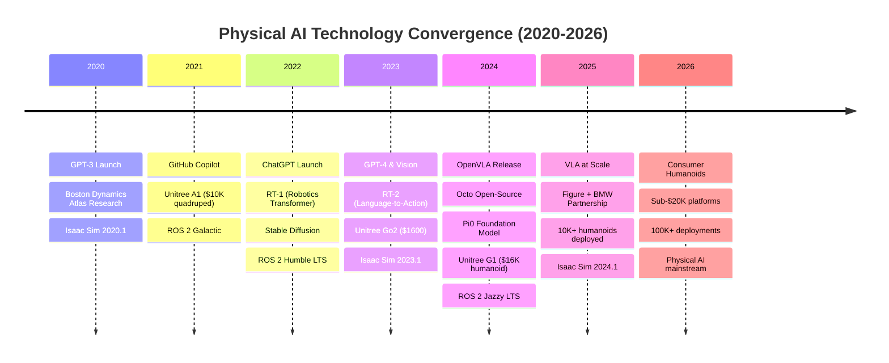
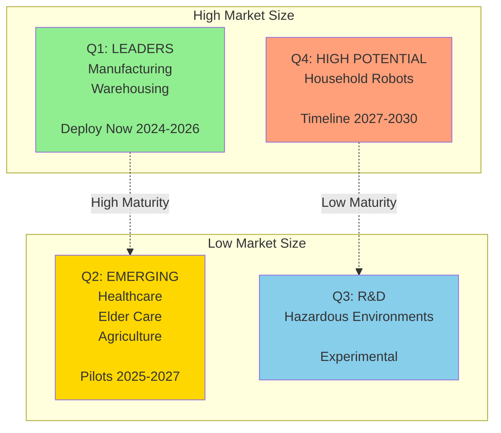
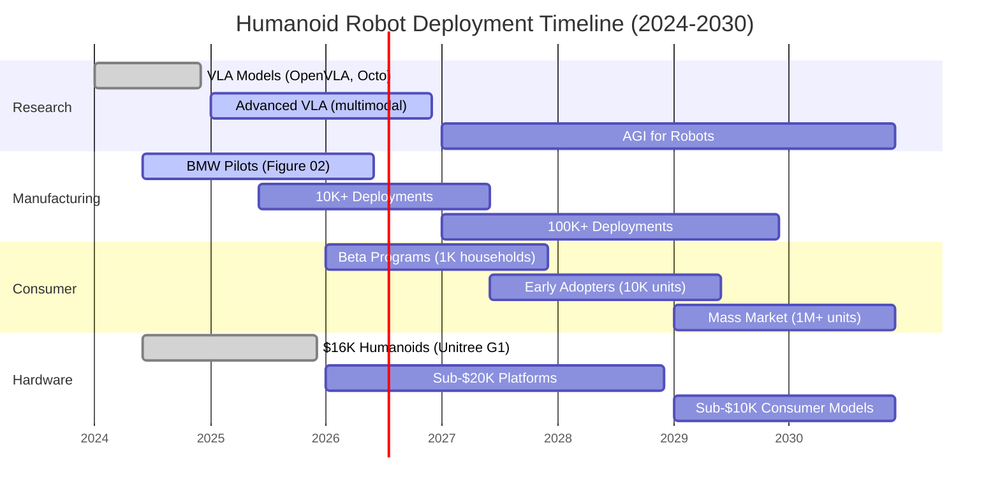

# Chapter 01: Why Physical AI Is the Next Frontier

## Introduction

We stand at the threshold of a paradigm shift in artificial intelligence. For decades, AI has been confined to the digital realm—recommending movies, translating languages, generating text and images. But a new wave is emerging: **Physical AI**, where intelligent systems interact directly with the physical world through embodied agents like humanoid robots.

This chapter explores why Physical AI represents the next frontier of artificial intelligence, examining the economic forces, technological enablers, and application domains driving this transformation.

:::tip Learning Objectives
By the end of this chapter, you will understand:
- The fundamental difference between digital AI and Physical AI
- Economic and technological drivers behind the humanoid robotics boom
- Key enablers: Vision-Language-Action (VLA) models and sim-to-real transfer
- Application domains where Physical AI will create the most value
- The timeline for Physical AI deployment (2024-2030)
:::

---

## What is Physical AI?

**Physical AI** refers to artificial intelligence systems that interact with and manipulate the physical world through embodied platforms—primarily robots. Unlike traditional AI that operates purely in software, Physical AI requires:

1. **Embodiment**: A physical platform (robot) with sensors and actuators
2. **Perception**: Understanding the 3D environment through vision, depth, and other sensors
3. **Reasoning**: Making decisions about physical actions based on sensor data
4. **Action**: Executing motions and manipulations in the real world
5. **Learning**: Adapting behavior through experience in physical environments

### The Digital-to-Physical Intelligence Gap

Traditional AI excels at pattern recognition, language processing, and information retrieval—all digital tasks. But operating in the physical world introduces challenges that digital AI never faces:

| Challenge | Digital AI | Physical AI |
|-----------|-----------|-------------|
| **Environment** | Controlled data | Unpredictable real world |
| **Feedback** | Instant | Delayed, noisy |
| **Consequences** | Reversible | Irreversible (objects break) |
| **Training** | Millions of examples cheap | Physical interactions expensive |
| **Uncertainty** | Low | High (sensor noise, physics) |
| **Safety** | Data corruption | Physical harm |

Physical AI must bridge this gap, combining advances in machine learning, robotics, computer vision, and control theory.

### Physical AI Technology Stack

This diagram shows the complete Physical AI pipeline: natural language commands flow through VLA models to generate actions, while sensors provide real-time feedback from the environment, creating a closed-loop system.

---

## The Convergence: Why Now?

Physical AI isn't new—robotics research dates back to the 1950s. So why is 2024-2026 the inflection point? Five technological trends are converging simultaneously:

### 1. Vision-Language-Action (VLA) Models

**Breakthrough**: Pre-trained models can now map natural language commands directly to robot actions.

- **OpenVLA** (2024): 7B parameter model trained on 970K robot trajectories
- **RT-2-X** (2023): Google's Robotics Transformer generalizes across robot platforms
- **Octo** (2024): Open-source generalist robot policy
- **Pi0** (2024): Physical Intelligence's foundation model for robots

**Impact**: Eliminates need to hand-code behaviors. A single command like "Pick up the red cup and place it on the table" gets translated directly to motor commands.

:::info VLA in Context
VLA models are the "ChatGPT moment" for robotics. Just as large language models (LLMs) eliminated the need for hand-crafted natural language processing rules, VLA models eliminate hand-crafted robot control programs.
:::

### 2. Sim-to-Real Transfer

**Challenge**: Training robots in the real world is slow and expensive. A robot must execute actions to learn, and failures damage hardware.

**Solution**: Train in simulation (NVIDIA Isaac Sim, Gazebo) where thousands of virtual robots can learn in parallel, then transfer learned behaviors to real hardware.

**Key techniques**:
- **Domain randomization**: Vary lighting, textures, physics in simulation to generalize to real world
- **Reality gap minimization**: High-fidelity physics engines (PhysX, MuJoCo) reduce simulation-reality mismatch
- **Residual learning**: Fine-tune sim-trained policies with small amount of real-world data

**Impact**: 1000x faster training, near-zero hardware damage during learning.

### 3. Affordable Hardware Platforms

**Breakthrough**: Complete humanoid robot kits now cost $16K-$90K (2024-2025 pricing), down from $2M+ in 2020.

| Platform | Price (USD) | Availability | Specs |
|----------|-------------|--------------|-------|
| **Unitree G1** | $16,000 | Q1 2025 | 1.3m height, 23 DoF, 2-hour runtime |
| **Unitree H1** | $90,000 | Available | 1.8m height, 21 DoF, 360° vision |
| **Figure 02** | TBD (est. $50K) | 2025 | 1.7m height, 16 DoF, BMW partnership |
| **Tesla Optimus** | TBD (target $20K) | 2026+ | 1.7m height, 28 DoF, Tesla AI |

**Impact**: Hobbyists, startups, and universities can now afford humanoid platforms for development and research.

### 4. GPU-Accelerated Simulation

**Breakthrough**: NVIDIA Isaac Sim leverages RTX GPUs to simulate physics, sensors, and rendering in real-time—or faster.

**Capabilities**:
- **Physics**: 10,000+ objects simulated in parallel
- **Sensors**: Photorealistic cameras, LiDAR, depth sensors
- **Speed**: 100x real-time with GPU acceleration
- **Scale**: 1000+ robots training simultaneously on one workstation

**Impact**: Developers can iterate rapidly, testing controllers and policies in minutes instead of weeks.

### 5. Open-Source Robotics Ecosystem

**ROS 2** (Robot Operating System) provides a mature, production-ready middleware for robotics:
- **Communication**: Pub-sub messaging between nodes
- **Libraries**: Motion planning (MoveIt 2), localization (SLAM), perception (OpenCV, PCL)
- **Community**: 1000+ packages, 10,000+ contributors
- **Industry adoption**: BMW, Amazon, NASA, Boston Dynamics

**Impact**: Developers don't start from scratch. ROS 2 provides battle-tested building blocks.

### Technology Convergence Timeline

This timeline illustrates how five independent technology streams (LLMs, robotics platforms, simulation tools, VLA models, and ROS middleware) have converged in 2024-2025 to make Physical AI economically viable and technically mature.

---

## Economic Drivers

Physical AI isn't just technologically feasible—it's economically inevitable. Three forces are accelerating adoption:

### 1. Labor Shortages in Key Industries

**Manufacturing**:
- US has 600,000+ unfilled manufacturing jobs (2024)
- Japan projects 11 million worker shortage by 2030
- China's working-age population shrinking 5M/year

**Warehousing & Logistics**:
- Amazon operates 750,000+ robots (2024) but still needs 1M+ human workers
- DHL forecasts 15% workforce shortage by 2028

**Healthcare**:
- US needs 200,000 additional nurses by 2026
- Elder care facing critical shortage (aging population)

**Impact**: Humanoid robots provide scalable workforce augmentation.

### 2. Cost-Benefit Tipping Point

**Total Cost of Ownership (TCO) Comparison** (per worker, 5-year horizon):

| Category | Human Worker | Humanoid Robot |
|----------|--------------|----------------|
| **Initial Cost** | $0 (training) | $50,000 (hardware) |
| **Annual Salary/Maintenance** | $45,000 | $5,000 |
| **Benefits/Downtime** | $15,000 | $0 |
| **5-Year Total** | $300,000 | $75,000 |

**Breakeven**: ~1.5 years for repetitive tasks. Faster for 24/7 operations (no shift changes).

:::warning Ethical Consideration
This comparison focuses on pure economics and doesn't account for social impacts of automation. Job displacement must be addressed through retraining programs, universal basic income trials, and policy interventions.
:::

### 3. New Application Revenue

Physical AI enables entirely new business models:

- **Home robotics market**: Projected $34B by 2030 (McKinsey)
- **Agricultural automation**: $20B market by 2028
- **Disaster response**: Unmanned rescue operations
- **Space exploration**: Mars missions require autonomous robots
- **Entertainment**: Robot actors, theme park experiences

---

## Application Domains

Where will Physical AI create the most impact? Five domains are leading adoption:

### 1. Manufacturing & Warehousing

**Use cases**:
- Assembly line tasks (pick-and-place, welding, inspection)
- Warehouse picking and packing (Amazon, Ocado)
- Quality control (visual inspection, defect detection)
- Material handling (forklift operation, inventory management)

**Maturity**: **High** (80%+ of early deployments)

**Key players**: Boston Dynamics (Stretch), Agility Robotics (Digit), Amazon Robotics

**Timeline**: Mass deployment 2024-2026

### 2. Healthcare & Elder Care

**Use cases**:
- Patient mobility assistance (lifting, walking support)
- Medication delivery and monitoring
- Companionship for elderly (social interaction)
- Disinfection and cleaning (UV robots)
- Telemedicine proxy (remote doctor presence)

**Maturity**: **Medium** (20-30% pilots, regulatory hurdles)

**Key players**: Diligent Robotics (Moxi), SoftBank (Pepper), Toyota (T-HR3)

**Timeline**: Pilots 2025-2027, mass deployment 2028+

### 3. Household & Personal Assistance

**Use cases**:
- Cleaning and tidying (beyond Roomba—general-purpose)
- Cooking and meal prep
- Grocery shopping and errands
- Childcare assistance (not replacement)
- Home security and monitoring

**Maturity**: **Low** (5-10% prototypes, high uncertainty)

**Key players**: Tesla (Optimus), 1X Technologies (NEO), Sanctuary AI

**Timeline**: Early adopters 2027-2029, mass market 2030+

### 4. Agriculture

**Use cases**:
- Crop monitoring and harvesting
- Weeding and pest control (precision agriculture)
- Livestock monitoring
- Greenhouse automation

**Maturity**: **Medium** (specialized robots deployed, humanoids emerging)

**Key players**: FarmWise, Blue River Technology (John Deere), Iron Ox

**Timeline**: Specialized robots now, humanoid pilots 2026-2028

### 5. Hazardous Environments

**Use cases**:
- Disaster response (earthquake, fire, flood rescue)
- Nuclear decommissioning
- Deep-sea exploration
- Mining operations
- Space missions (Moon, Mars)

**Maturity**: **Medium** (government-funded R&D)

**Key players**: Boston Dynamics (Atlas), NASA (Valkyrie), IHMC Robotics

**Timeline**: Government deployment 2025-2027, commercial 2028+

### Application Domain Maturity Matrix

**Maturity vs Market Size Analysis:**
- **Q1 Leaders** (Green): Manufacturing & Warehousing - High maturity, large market → mass deployment 2024-2026
- **Q2 Emerging** (Gold): Healthcare, Agriculture, Elder Care → pilot programs 2025-2027
- **Q3 R&D** (Blue): Hazardous environments → government-funded research
- **Q4 High Potential** (Orange): Household robots - huge market but low maturity → timeline 2027-2030

---

## The Humanoid Form Factor Advantage

Why humanoids? Wouldn't specialized robots (wheeled, tracked, drone) be more efficient?

**The answer: Environment compatibility.**

### Human Environments Are Designed for Humans

- **Stairs**: 80% of buildings have stairs inaccessible to wheeled robots
- **Doors**: Require hands to open (round knobs, push bars)
- **Tools**: Hammers, wrenches, keyboards—all designed for human hands
- **Spaces**: Narrow aisles, low ceilings, tight corners optimized for 1.7m height

**Humanoids fit existing infrastructure** without retrofitting buildings, tools, or workflows.

### The Cost of Specialization

Specialized robots are optimized for one task:
- Warehouse robot: Picking boxes from shelves
- Lawn mower robot: Cutting grass
- Window cleaning robot: Washing vertical surfaces

**Problem**: Each requires separate hardware, maintenance, and training.

**Humanoid advantage**: One platform for multiple tasks. Amortize hardware cost across applications.

:::tip The iPhone Analogy
Before smartphones, you carried separate devices: phone, camera, GPS, music player, calculator. The iPhone wasn't the best at any single task, but it was "good enough" at all of them in one device.

Humanoids are the iPhone of robotics. Not the fastest at any task, but versatile enough to replace multiple specialized robots.
:::

---

## Technical Challenges Remaining

Physical AI is maturing, but significant challenges remain:

### 1. Reliability and Safety

**Challenge**: Robots must operate safely near humans for 10,000+ hours between failures.

**Current state**: Research robots fail every 10-100 hours.

**Needed breakthroughs**:
- Fault detection and graceful degradation
- Human-aware motion planning (collision avoidance)
- Formal verification of control policies

**Timeline**: Safety certifications emerging 2026-2028.

### 2. Dexterity and Manipulation

**Challenge**: Human hands have 27 degrees of freedom and exquisite tactile feedback. Replicating this is hard.

**Current state**: Robot hands can grasp 80% of household objects, but delicate tasks (tying shoes, threading needles) remain difficult.

**Needed breakthroughs**:
- High-density tactile sensors (force, texture, temperature)
- Compliant actuators (soft robotics)
- Learned grasp policies (thousands of objects)

**Timeline**: 90%+ object manipulation by 2027-2028.

### 3. Long-Horizon Task Planning

**Challenge**: Breaking "clean the kitchen" into 100+ sub-tasks (open dishwasher, load plates, add soap, start cycle).

**Current state**: VLA models handle 5-10 step tasks. Longer horizons fail.

**Needed breakthroughs**:
- Hierarchical task decomposition (LLM + VLA integration)
- Error recovery (what to do when a step fails)
- Memory and context (remember previous states)

**Timeline**: 20+ step tasks by 2026, 100+ by 2028-2029.

### 4. Energy Efficiency

**Challenge**: Humanoid robots run 1-4 hours per charge. Humans operate 16+ hours on 2000 calories.

**Current state**: Electric motors 30-50% efficient. Batteries 150-250 Wh/kg.

**Needed breakthroughs**:
- Higher-density batteries (solid-state, lithium-metal)
- More efficient actuators (series-elastic, quasi-direct-drive)
- Intelligent power management (sleep modes, task prioritization)

**Timeline**: 8+ hour operation by 2027-2028.

### 5. Cost Reduction

**Challenge**: $16K-$90K robots are affordable for companies, not consumers.

**Target**: $5K-$10K for mass-market adoption (compare to car prices).

**Path to cost reduction**:
- Manufacturing scale (10K+ units/year drives 40% cost down)
- Component commoditization (motors, sensors become standardized)
- Modular design (swap broken parts, not entire robot)

**Timeline**: Sub-$20K humanoids by 2027-2028, sub-$10K by 2030+.

---

## The 2024-2030 Roadmap

Here's the projected timeline for Physical AI and humanoid robotics:

### 2024-2025: Foundation Year
- ✅ OpenVLA, RT-2-X, Octo models released
- ✅ Unitree G1 ($16K humanoid) ships
- ✅ Figure partners with BMW for manufacturing trials
- ⏳ Tesla Optimus pilots in Tesla factories
- ⏳ 1000+ ROS 2 + Isaac Sim developers active

### 2026-2027: Early Adoption
- Manufacturing pilots: 10,000+ humanoids deployed
- First home robot beta programs (1000+ households)
- Safety certifications established (ISO, UL)
- Sub-$20K humanoids available
- 90%+ object manipulation success rate

### 2028-2029: Scale-Up
- 100,000+ humanoids in warehouses and factories
- Elder care robots in 10,000+ facilities
- Agricultural humanoid trials (10+ countries)
- Sub-$10K hobbyist humanoid kits
- Long-horizon task planning (100+ steps)

### 2030+: Mass Market
- 1M+ humanoids globally
- Consumer home robots (vacuum + tidy + cook)
- Autonomous construction sites
- Humanoid astronauts on Mars missions
- Physical AI as ubiquitous as smartphones

### Physical AI Deployment Roadmap

This roadmap shows three parallel tracks: research (VLA models), manufacturing (industrial deployment), and consumer (home robots). Manufacturing leads by 2-3 years, with consumer adoption following as prices drop and capabilities mature.

---

## Why You Should Learn Physical AI Now

If you're reading this book, you're positioning yourself at the frontier of a transformational technology. Here's why now is the time to dive in:

### 1. First-Mover Advantage

Physical AI talent is scarce. Companies are hiring:
- **Robotics engineers**: $120K-$200K starting salary
- **VLA model specialists**: $150K-$250K
- **Sim-to-real experts**: $140K-$220K

**Opportunity**: High demand, limited supply = career leverage.

### 2. Accessible Tools

You don't need a $2M lab. This book teaches you to build Physical AI systems with:
- **Laptop**: RTX 4070 Ti+ (12GB VRAM) - $700-$1000
- **Software**: ROS 2 (free), Isaac Sim (free academic license), OpenVLA (open-source)
- **Cloud alternative**: AWS/GCP GPU instances ($1-3/hour)

**Total cost to get started**: under $1500 (or $0 with cloud GPUs).

### 3. Transferable Skills

Physical AI combines:
- **Machine learning**: PyTorch, Transformers, reinforcement learning
- **Robotics**: Kinematics, dynamics, control theory
- **Systems engineering**: ROS 2, simulation, distributed systems
- **Computer vision**: Object detection, SLAM, depth estimation

**Impact**: Skills apply to autonomous vehicles, drones, IoT, industrial automation.

### 4. Ethical Imperative

Physical AI will reshape labor markets, create new inequalities, and raise safety concerns. **The developers who build these systems have a responsibility** to:
- Design for safety (humans must come first)
- Consider job displacement (work with policymakers on retraining)
- Ensure accessibility (prevent tech from widening inequality gaps)
- Build transparency (explainable decisions)

**Your role**: Be part of the solution, not the problem.

---

## What's Next in This Book

This chapter established **why** Physical AI matters and **why now** is the inflection point. The rest of the book teaches you **how** to build these systems:

**Part I: Foundation** (Chapters 2-3)
- Chapter 2: Hardware requirements (GPU, workstation setup)
- Chapter 3: ROS 2 fundamentals (nodes, topics, services)

**Part II: Simulation & Modeling** (Chapters 4-6)
- Chapter 4: URDF and digital twins
- Chapter 5: Gazebo vs Isaac Sim
- Chapter 6: NVIDIA Isaac platform deep dive

**Part III: Core Robotics** (Chapters 7-9)
- Chapter 7: Perception stack (vision, SLAM, depth)
- Chapter 8: Bipedal locomotion (walking, balance)
- Chapter 9: Dexterous manipulation (grasping, IK)

**Part IV: Intelligence Layer** (Chapters 10-12)
- Chapter 10: Vision-Language-Action models (OpenVLA, RT-2-X)
- Chapter 11: Voice-to-action pipeline (Whisper + LLM + VLA)
- Chapter 12: Sim-to-real transfer techniques

**Part V: Integration** (Chapter 13)
- Chapter 13: Capstone project—Autonomous Butler

**Appendices**
- A: Lab build guides (Economy/Mid/Premium tiers)
- B: Troubleshooting Bible (100 common errors)
- C: Future roadmap (2026-2030 predictions)

---

## Key Takeaways

- **Physical AI** = AI systems that interact with the physical world through embodied robots
- **Convergence**: VLA models + sim-to-real + affordable hardware + GPU simulation + ROS 2 ecosystem
- **Economic drivers**: Labor shortages, cost-benefit tipping point, new revenue opportunities
- **Application domains**: Manufacturing (mature), healthcare (emerging), household (early), agriculture (pilots), hazardous environments (R&D)
- **Humanoid advantage**: Fits existing human infrastructure without retrofitting
- **Challenges remain**: Reliability, dexterity, task planning, energy, cost
- **Timeline**: Foundation (2024-2025), early adoption (2026-2027), scale-up (2028-2029), mass market (2030+)
- **Your opportunity**: Learn now while talent is scarce, tools are accessible, and you can shape the ethical development of this transformative technology

---

## Further Reading

**Academic Papers**:
- "RT-2-X: Towards General-Purpose Robots via Open-Vocabulary Object Representations" (Google, 2023)
- "OpenVLA: An Open-Source Vision-Language-Action Model" (Stanford, 2024)
- "Octo: An Open-Source Generalist Robot Policy" (UC Berkeley, 2024)

**Industry Reports**:
- McKinsey: "The Future of Robotics: Humanoids in the Workplace" (2024)
- Goldman Sachs: "Robotics Market Outlook 2030" (2024)
- Boston Consulting Group: "The Economics of Humanoid Robots" (2024)

**Blogs and Resources**:
- NVIDIA Isaac Blog: https://developer.nvidia.com/isaac
- ROS 2 Documentation: https://docs.ros.org/
- Hugging Face Robotics: https://huggingface.co/spaces/lerobot

---

:::note Next Chapter Preview
In **Chapter 2: The Hardware You Actually Need in 2026**, you'll learn exactly what GPU, RAM, and storage you need to run Isaac Sim and VLA models. We'll compare three lab tiers (Economy $1K, Mid $3K, Premium $6K) and provide verified Q1 2026 pricing and build guides.
:::
