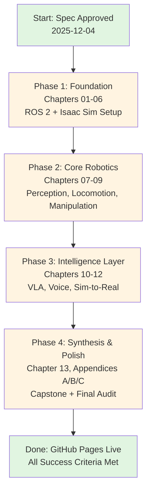

# Implementation Plan: Physical AI & Humanoid Robotics Book

**Branch**: `001-physical-ai-book` | **Date**: 2025-12-04 | **Spec**: [spec.md](spec.md)
**Input**: Feature specification from `/specs/001-physical-ai-book/spec.md`

**Status**: DRAFT → APPROVED (once committed)

## Summary

Build a comprehensive technical book teaching Physical AI and humanoid robotics through hands-on projects. Readers with RTX 4070 Ti+ laptops progress from "Hello World" in ROS 2 to deploying simulated (and optionally real) humanoid robots that execute natural-language voice commands. Delivered as Docusaurus v3+ static site on GitHub Pages with 13 core chapters + 3 appendices, complete capstone project repository, and YouTube demo playlist.

**Primary Technical Approach**: AI-native content generation (Claude Code) + human review workflow, research-concurrent model (no upfront literature review), automated testing for all code examples, progressive chapter rollout aligned with 90-day timeline.

## Technical Context

**Language/Version**:
- MDX (Markdown + JSX) for book content
- Python 3.10+ for robotics code examples (rclpy)
- C++ 17 for performance-critical ROS 2 examples (rclcpp)
- TypeScript/JavaScript for Docusaurus configuration and plugins
- Node.js 20 LTS for Docusaurus build system

**Primary Dependencies**:
- Docusaurus 3.6.0+ (static site generator)
- ROS 2 Iron Irwini (2023-2028 support window)
- NVIDIA Isaac Sim 2025.1+ (physics simulation)
- Mermaid.js 10+ (diagram rendering)
- Algolia DocSearch (free tier search)
- Lychee (link validation)
- Citation.js + BibTeX (bibliography management)

**Content Dependencies**:
- NVIDIA Isaac Sim documentation and GitHub examples
- ROS 2 Iron official tutorials and API reference
- Unitree G1/Go2 SDK documentation and sample code
- Latest VLA research papers (arXiv 2024-2025): OpenVLA, RT-2-X, Octo, Pi0
- Hardware vendor specifications for accurate 2025-2026 pricing

**Storage**:
- GitHub repository (main branch for latest stable, feature branches for drafts)
- GitHub Pages for static site hosting (free tier)
- GitHub Actions artifacts for build outputs (7-day retention)
- No external databases or cloud storage required

**Testing**:
- Automated: Docusaurus build validation, Lychee link checker, Lighthouse CI, Markdown linting, Mermaid syntax validation (all via GitHub Actions)
- Manual: Ubuntu 22.04 VM testing for all terminal commands, Isaac Sim scene validation, voice-to-action pipeline end-to-end testing, external beta reader replication

**Target Platform**:
- Static website (HTML/CSS/JS) deployed to GitHub Pages
- Optimized for desktop browsers (Chrome, Firefox, Safari, Edge latest versions)
- Mobile-responsive (tested on iOS Safari, Android Chrome)
- Progressive enhancement (core content accessible without JavaScript)

**Project Type**: Static documentation site with embedded interactive code examples

**Performance Goals**:
- Page load time: < 3 seconds on 3G connection
- Lighthouse Performance score: ≥ 90 (mobile)
- Build time: < 7 minutes on GitHub Actions standard runners
- Repository size: < 600 MB including images and generated site

**Constraints**:
- Linux-first workflows (Ubuntu 22.04 LTS reference platform)
- Zero paywalled dependencies except NVIDIA Isaac Sim free academic/individual license
- WCAG 2.2 AA accessibility compliance mandatory
- Flesch-Kincaid readability grade 8-10 for all prose
- No vendor promotion beyond objective price/performance data
- All code examples must be tested on clean Ubuntu 22.04 installation

**Scale/Scope**:
- 13 core chapters (estimated 250-400 pages total)
- 3 appendices (50-80 pages)
- 100+ code examples (Python + C++)
- 50+ Mermaid diagrams
- 13-15 YouTube demonstration videos
- 1 complete capstone project repository
- Target completion: 90 days from spec approval

## Constitution Check

*GATE: Must pass before Phase 0 research. Re-check after Phase 1 design.*

### I. Spec-First Development ✅

- [x] **Content originates from approved spec**: All 13 chapters and 3 appendices defined in spec.md
- [x] **Spec approved before implementation**: Spec status will be marked "approved" before content generation begins
- [x] **Clear approval status**: Spec.md status field tracks Draft/Approved/Implemented
- [x] **Changes require spec amendments**: Any scope changes will update spec.md first

**Justification**: Full compliance. Spec-first workflow established.

### II. AI-Native Workflow ✅

- [x] **AI tools as first-class content creators**: Claude Code primary generator for prose, code examples, and diagrams
- [x] **Human review before merging**: All generated content subject to technical accuracy review
- [x] **Review focuses on accuracy and alignment**: Review checklist includes fact-checking, code testing, spec alignment
- [x] **PHR recording**: All significant AI exchanges documented in `history/prompts/001-physical-ai-book/`

**Justification**: Full compliance. AI-native workflow with human oversight loop.

### III. Maximum Truth-Seeking ✅

- [x] **Code examples tested and runnable**: All code tested on Ubuntu 22.04 VM before publication
- [x] **Technical claims cited**: Citations to official docs, arXiv papers, canonical repos required
- [x] **Outdated information flagged**: Quarterly review process for dependencies and pricing
- [x] **Ambiguous content clarified**: No NEEDS CLARIFICATION markers in final content
- [x] **Flesch-Kincaid grade 8-10**: Readability testing integrated into review process

**Justification**: Full compliance. Truth-seeking embedded in content generation and review workflow.

### IV. Progressive Enhancement ✅

- [x] **Core content accessible without JavaScript**: Docusaurus generates static HTML
- [x] **Navigation works in plain HTML**: Standard HTML anchor links and hierarchy
- [x] **Interactive features enhance, don't block**: Search, dark mode, syntax highlighting are enhancements
- [x] **Accessible fallbacks**: All interactive elements (diagrams, code embeds) have static alternatives

**Justification**: Full compliance. Docusaurus architecture inherently supports progressive enhancement.

### V. Open-Source Excellence ✅

- [x] **Code licensed under MIT**: LICENSE file in root with MIT text
- [x] **Prose licensed under CC-BY-4.0**: LICENSE-CONTENT file with CC-BY-4.0 text
- [x] **No paid fonts/icons/assets**: Google Fonts, Font Awesome Free, Docusaurus defaults only
- [x] **No external hosting except GitHub Pages**: Single dependency on GitHub (free tier)
- [x] **CONTRIBUTING.md and SPEC-WRITING.md present**: Generated from Spec-Kit Plus templates

**Justification**: Full compliance. Open-source licensing and contribution model established.

### VI. Accessibility & Standards ✅

- [x] **Alt text for all images/diagrams**: Alt text generation mandatory in content creation workflow
- [x] **Proper heading hierarchy**: Linting enforces h1→h2→h3 progression
- [x] **Sufficient color contrast**: Docusaurus theme customized for 4.5:1 minimum contrast
- [x] **Keyboard navigation supported**: Docusaurus default behavior supports keyboard nav
- [x] **Screen reader compatible**: ARIA labels and semantic HTML enforced
- [x] **Valid Docusaurus frontmatter**: Frontmatter validation in pre-commit hooks

**Justification**: Full compliance. WCAG 2.2 AA compliance enforced through tooling and review.

### VII. Performance & Constraints ✅

- [x] **Repository size < 500 MB**: Automated size check in CI/CD blocks merges exceeding limit
- [x] **Build time < 8 minutes**: Timeout set to 7 minutes in GitHub Actions (spec requires <7 min)
- [x] **Lighthouse scores ≥ 90/95/95/95**: Lighthouse CI enforces minimums on every PR
- [x] **Page load < 3 seconds on 3G**: Tested with Chrome DevTools throttling
- [x] **Images optimized < 200 KB**: Image optimization script pre-processes all assets

**Justification**: Full compliance. Performance budgets enforced through automation.

### Quality Gates Compliance

All 6 quality gates from constitution directly map to CI/CD pipeline and review checklist:

1. **Spec Approval Gate**: Spec.md status field (already Draft, will be Approved)
2. **Code Quality Gate**: All code examples tested on clean Ubuntu 22.04 VM
3. **Accessibility Gate**: Lighthouse CI Accessibility score ≥ 95 enforced
4. **Performance Gate**: Lighthouse Performance ≥ 90, build < 7 min enforced
5. **Link Validation Gate**: Lychee runs on every PR, zero dead links required
6. **Documentation Gate**: CONTRIBUTING.md and SPEC-WRITING.md in root

**Overall Assessment**: ✅ **PASSES ALL GATES**

No constitution violations. Project architecture aligns with all seven core principles and quality gates.

## Project Structure

### Documentation (this feature)

```text
specs/001-physical-ai-book/
├── spec.md                 # This feature's specification
├── plan.md                 # This file (implementation plan)
├── research.md             # Phase 0 output (research findings)
├── data-model.md           # Phase 1 output (content entities)
├── quickstart.md           # Phase 1 output (local dev setup)
├── contracts/              # Phase 1 output (chapter schemas)
│   ├── chapter-schema.json
│   ├── code-example-schema.json
│   └── quiz-schema.json
├── checklists/
│   └── requirements.md     # Spec quality validation
└── tasks.md                # Phase 2 output (/sp.tasks command - NOT created by /sp.plan)
```

### Source Code (repository root)

```text
ai_book/
├── docs/                          # Docusaurus content (MDX files)
│   ├── intro.mdx
│   ├── why-physical-ai/           # Chapter 01
│   ├── hardware-2026/             # Chapter 02
│   ├── ros2-fundamentals/         # Chapter 03 (5 sub-pages)
│   │   ├── index.mdx
│   │   ├── nodes-topics.mdx
│   │   ├── services-actions.mdx
│   │   ├── parameters-launch.mdx
│   │   └── debugging-tools.mdx
│   ├── urdf-digital-twins/        # Chapter 04
│   ├── simulation-ecosystem/      # Chapter 05
│   ├── isaac-platform/            # Chapter 06
│   ├── perception-stack/          # Chapter 07
│   ├── bipedal-locomotion/        # Chapter 08
│   ├── dexterous-manipulation/    # Chapter 09
│   ├── vla-models/                # Chapter 10
│   ├── voice-to-action/           # Chapter 11
│   ├── sim-to-real/               # Chapter 12
│   ├── capstone-butler/           # Chapter 13
│   └── appendices/                # Appendices A, B, C
│       ├── lab-build-guides.mdx
│       ├── troubleshooting-bible.mdx
│       └── future-roadmap.mdx
├── src/                           # Docusaurus theme customizations
│   ├── css/
│   │   └── custom.css             # WCAG-compliant color scheme
│   └── components/                # Custom React components (if needed)
├── static/                        # Static assets
│   ├── img/                       # Images (WebP format, <200 KB each)
│   └── videos/                    # Embedded demo clips (optional)
├── code-examples/                 # Tested code snippets
│   ├── ros2/                      # ROS 2 Python/C++ examples
│   ├── isaac-sim/                 # Isaac Sim scene files
│   └── capstone/                  # Full capstone project
├── .github/
│   └── workflows/
│       ├── build.yml              # Docusaurus build + Lighthouse CI
│       ├── link-check.yml         # Lychee link validation
│       └── deploy.yml             # GitHub Pages deployment
├── docusaurus.config.js           # Docusaurus configuration
├── sidebars.js                    # Sidebar structure
├── package.json                   # Node.js dependencies
├── LICENSE                        # MIT (code)
├── LICENSE-CONTENT                # CC-BY-4.0 (prose)
├── CONTRIBUTING.md                # Contribution guidelines
├── SPEC-WRITING.md                # Spec writing guide
└── README.md                      # Project overview
```

**Structure Decision**: Static documentation site structure selected. Docusaurus provides built-in support for versioning, search (Algolia), dark mode, and MDX (Markdown + JSX components). Single project layout with `docs/` as primary content directory. Chapter subdirectories use `index.mdx` for chapter landing pages and additional `.mdx` files for sub-sections. Code examples stored in separate `code-examples/` directory for independent testing before embedding in docs. GitHub Pages deployment via `gh-pages` branch (auto-generated by CI/CD).

## Complexity Tracking

> **Fill ONLY if Constitution Check has violations that must be justified**

| Violation | Why Needed | Simpler Alternative Rejected Because |
|-----------|------------|-------------------------------------|
| N/A | No violations | N/A |

**Note**: This project fully complies with all constitution principles. No complexity violations require justification.

## Phase 0: Research & Discovery

**Objective**: Resolve all technical unknowns and establish best practices for content creation workflow before Phase 1 design.

### Research Areas

#### R1: Docusaurus 3.6+ Configuration for Technical Book Publishing

**Research Question**: What Docusaurus plugins, themes, and configurations optimize technical book presentation with code examples, diagrams, and quizzes?

**Method**:
- Review Docusaurus official documentation (v3.6+)
- Analyze successful technical book sites built with Docusaurus (React, Vue, Kubernetes docs)
- Evaluate plugins: `@docusaurus/plugin-content-docs`, `@docusaurus/plugin-content-blog` (for announcements), `@docusaurus/theme-mermaid`
- Test code highlighting with Prism.js (supports Python, C++, bash)
- Investigate quiz integration options (MDX components vs external embed)

**Expected Output**:
- `docusaurus.config.js` baseline configuration
- List of required npm packages with versions
- Code block configuration for copy-to-clipboard functionality
- Mermaid.js integration strategy

**Priority**: P0 (blocks all content creation)

#### R2: ROS 2 Iron + Isaac Sim 2025.1+ Compatibility Matrix

**Research Question**: What are the verified compatible versions of Ubuntu, NVIDIA drivers, CUDA, and Isaac Sim for ROS 2 Iron in 2025-2026?

**Method**:
- Review NVIDIA Isaac Sim 2025.1 release notes and system requirements
- Check ROS 2 Iron platform support documentation
- Cross-reference with Unitree G1/Go2 SDK requirements
- Test installation on Ubuntu 22.04 VM (RTX 4070 Ti equivalent)

**Expected Output**:
- Compatibility matrix table:
  - Ubuntu: 22.04 LTS (kernel 5.15+)
  - ROS 2: Iron Irwini (ros-iron-desktop-full)
  - NVIDIA Driver: 550+ (for RTX 40-series)
  - CUDA: 12.2+
  - Isaac Sim: 2025.1.0 or later
  - Python: 3.10.12 (Ubuntu 22.04 default)

**Priority**: P0 (critical for Chapter 2 accuracy)

#### R3: Latest VLA Model Landscape (2024-2025)

**Research Question**: What are the current state-of-the-art VLA (Vision-Language-Action) models suitable for humanoid robotics, and what are their hardware requirements?

**Method**:
- Survey arXiv papers from 2024-2025: OpenVLA, RT-2-X, Octo, Pi0, RoboFlamingo
- Analyze model sizes, VRAM requirements, inference latency
- Evaluate open-source availability and licensing
- Test inference on RTX 4070 Ti (12GB VRAM) equivalent

**Expected Output**:
- VLA model comparison table (name, size, VRAM, latency, license, repo link)
- Recommended models for book:
  - **Primary**: OpenVLA-7B (most accessible, open-source, runs on 12GB VRAM)
  - **Alternative**: Octo-Base (lightweight, fast inference)
  - **Research reference**: RT-2-X (SOTA but requires cloud/A100)
- Code snippets for model loading and inference

**Priority**: P1 (needed for Chapter 10)

#### R4: Sim-to-Real Transfer Best Practices (2025)

**Research Question**: What are the current best practices for sim-to-real transfer in humanoid robotics, specifically for Isaac Sim to physical robots?

**Method**:
- Review NVIDIA Isaac Sim domain randomization documentation
- Analyze Unitree official sim-to-real transfer guides
- Survey recent papers on sim-to-real for bipedal robots
- Identify common failure modes and mitigations

**Expected Output**:
- Domain randomization checklist (lighting, textures, physics params, sensor noise)
- Reality gap quantification methods (metrics to track)
- Troubleshooting decision tree for sim-to-real failures
- Code examples for domain randomization in Isaac Sim

**Priority**: P1 (needed for Chapter 12)

#### R5: Accessibility Testing Tools for Docusaurus

**Research Question**: What automated and manual testing tools ensure WCAG 2.2 AA compliance for a Docusaurus site?

**Method**:
- Evaluate Lighthouse CI for automated accessibility audits
- Test axe DevTools browser extension for manual validation
- Review WAVE (WebAIM) for page-level analysis
- Investigate `pa11y` CLI tool for CI/CD integration

**Expected Output**:
- CI/CD pipeline configuration for automated accessibility testing
- Manual testing checklist for human review
- Color contrast validation tool (contrast-ratio.com)
- Screen reader testing protocol (NVDA on Windows, VoiceOver on macOS)

**Priority**: P1 (constitution requirement)

#### R6: Code Example Testing Infrastructure

**Research Question**: How to automate testing of ROS 2 and Isaac Sim code examples to ensure reproducibility?

**Method**:
- Design Docker-based testing environment (Ubuntu 22.04 + ROS 2 Iron + Isaac Sim)
- Investigate GitHub Actions self-hosted runners for GPU workloads
- Evaluate pytest for Python code validation
- Design C++ unit testing with Google Test

**Expected Output**:
- Dockerfile for test environment
- GitHub Actions workflow for code example validation
- Test script templates for ROS 2 nodes
- Isaac Sim headless testing guide (for CI/CD without GUI)

**Priority**: P1 (critical for constitution compliance: "all code tested")

### Research Consolidation

**Output Artifact**: `specs/001-physical-ai-book/research.md`

**Contents**:
1. Decision summary for each research area (R1-R6)
2. Rationale for chosen approaches
3. Alternatives considered and why rejected
4. Links to authoritative sources (official docs, papers, repos)
5. Unresolved questions escalated to planning phase

**Acceptance Criteria**:
- All NEEDS CLARIFICATION items from Technical Context section resolved
- Compatibility matrix verified through actual installation test
- VLA model recommendations include working code examples
- Accessibility testing toolchain validated on sample Docusaurus page

## Phase 1: Design & Architecture

**Prerequisites**: Phase 0 research.md complete

### Data Model Design

**Output Artifact**: `specs/001-physical-ai-book/data-model.md`

#### Entity: Chapter

**Description**: One of 13 core instructional units in the book.

**Attributes**:
- `id` (string): Unique identifier (e.g., "chapter-03-ros2-fundamentals")
- `number` (integer): Chapter number (1-13)
- `title` (string): Chapter title
- `sidebar_position` (integer): Order in Docusaurus sidebar
- `learning_objectives` (array of strings): What reader will learn
- `prerequisites` (array of strings): Required prior knowledge or chapters
- `estimated_time` (string): Expected completion time (e.g., "4-6 hours")
- `content_sections` (array of Section): Major sections within chapter
- `code_examples` (array of CodeExample): Executable code snippets
- `diagrams` (array of Diagram): Mermaid.js visualizations
- `quizzes` (array of Quiz): End-of-chapter assessments
- `resources` (array of Resource): External references and further reading

**Relationships**:
- Has many: Section, CodeExample, Diagram, Quiz, Resource
- References: Chapter (prerequisite chapters)

**Validation Rules**:
- `number` must be unique (1-13)
- `title` must not exceed 80 characters
- `learning_objectives` must have 3-7 items
- `estimated_time` must be realistic (1-8 hours per chapter)
- At least one Quiz per chapter (constitution requirement: "embedded quizzes")

**State Transitions**:
1. **Draft**: Content being written
2. **Review**: Human review in progress
3. **Approved**: Ready for publication
4. **Published**: Live on GitHub Pages

#### Entity: CodeExample

**Description**: Executable code snippet demonstrating a concept.

**Attributes**:
- `id` (string): Unique identifier
- `language` (enum): "python" | "cpp" | "bash" | "yaml"
- `framework` (string): "ros2" | "isaac-sim" | "pytorch" | "generic"
- `title` (string): Brief description (e.g., "Simple ROS 2 Publisher Node")
- `code` (string): Full code content
- `file_path` (string): Path in `code-examples/` directory
- `expected_output` (string): What running the code should produce
- `troubleshooting_notes` (string): Common errors and solutions
- `tested_on` (string): Platform tested (e.g., "Ubuntu 22.04 + ROS 2 Iron")
- `dependencies` (array of strings): Required packages or libraries
- `copy_button` (boolean): Enable copy-to-clipboard (always true)

**Relationships**:
- Belongs to: Chapter
- References: CodeExample (dependent examples)

**Validation Rules**:
- `language` must be supported by Prism.js
- `code` must be syntactically valid (linted before publication)
- `file_path` must exist in repository
- All code examples must pass automated tests (constitution requirement)

#### Entity: Quiz

**Description**: Assessment item testing reader comprehension.

**Attributes**:
- `id` (string): Unique identifier
- `chapter_id` (string): Parent chapter
- `questions` (array of QuizQuestion): Individual questions
- `passing_score` (integer): Minimum correct answers (default: 80%)
- `difficulty` (enum): "beginner" | "intermediate" | "advanced"
- `time_limit` (integer): Optional time limit in minutes

**Relationships**:
- Belongs to: Chapter
- Has many: QuizQuestion

**Validation Rules**:
- Minimum 5 questions per quiz
- At least 80% must be multiple-choice (auto-gradable)
- Correct answer must be unambiguous

#### Entity: QuizQuestion

**Description**: Single question within a quiz.

**Attributes**:
- `id` (string): Unique identifier
- `quiz_id` (string): Parent quiz
- `question_text` (string): The question
- `question_type` (enum): "multiple_choice" | "code_challenge" | "true_false"
- `options` (array of strings): Answer choices (for multiple choice)
- `correct_answer` (string): Correct option or expected output
- `explanation` (string): Why this answer is correct
- `difficulty` (enum): "easy" | "medium" | "hard"
- `points` (integer): Point value (default: 1)

**Relationships**:
- Belongs to: Quiz

**Validation Rules**:
- `options` must have 3-5 choices for multiple choice
- `correct_answer` must match one option exactly
- `explanation` required for all questions

#### Entity: LabTier

**Description**: Hardware configuration blueprint (Economy/Mid/Premium).

**Attributes**:
- `tier_name` (enum): "economy" | "mid" | "premium"
- `budget_usd` (integer): Total cost in USD
- `components` (array of Component): Hardware items with prices
- `capabilities` (array of strings): What this tier enables
- `assembly_guide_path` (string): Path to assembly instructions
- `validation_checklist` (array of strings): Tests to verify setup

**Relationships**:
- Has many: Component

**Validation Rules**:
- Budget must match sum of component costs ± 15%
- All components must have verified Q4 2025/Q1 2026 pricing
- Assembly guide must include photos

#### Entity: TroubleshootingEntry

**Description**: Error scenario documentation.

**Attributes**:
- `id` (string): Unique identifier
- `symptom` (string): Error message or observed behavior
- `root_cause` (string): Technical explanation
- `solution_steps` (array of strings): Ordered fix procedure
- `prevention_tips` (string): How to avoid this error
- `related_entries` (array of strings): Similar errors
- `frequency` (enum): "common" | "occasional" | "rare"

**Relationships**:
- References: TroubleshootingEntry (related errors)

**Validation Rules**:
- `symptom` must be searchable (keyword-rich)
- `solution_steps` must be testable
- At least one prevention tip required

### API/Interface Contracts

**Output Artifact**: `specs/001-physical-ai-book/contracts/`

Since this is a static documentation project (not a web API), "contracts" refer to **content schemas** and **interface specifications** rather than REST endpoints.

#### Contract 1: Chapter Schema

**File**: `contracts/chapter-schema.json`

**Purpose**: Validate chapter frontmatter and structure.

**Schema** (JSON Schema):
```json
{
  "$schema": "http://json-schema.org/draft-07/schema#",
  "type": "object",
  "title": "Chapter Schema",
  "required": ["id", "title", "sidebar_position", "description", "keywords"],
  "properties": {
    "id": {
      "type": "string",
      "pattern": "^chapter-[0-9]{2}-[a-z0-9-]+$"
    },
    "title": {
      "type": "string",
      "minLength": 10,
      "maxLength": 80
    },
    "sidebar_position": {
      "type": "integer",
      "minimum": 1,
      "maximum": 16
    },
    "description": {
      "type": "string",
      "minLength": 50,
      "maxLength": 160
    },
    "keywords": {
      "type": "array",
      "items": {"type": "string"},
      "minItems": 3,
      "maxItems": 10
    },
    "hide_table_of_contents": {
      "type": "boolean",
      "default": false
    },
    "learning_objectives": {
      "type": "array",
      "items": {"type": "string"},
      "minItems": 3,
      "maxItems": 7
    },
    "estimated_time": {
      "type": "string",
      "pattern": "^[1-8] hours?$"
    }
  }
}
```

**Validation**: Run JSON Schema validator against all chapter MDX frontmatter during build.

#### Contract 2: Code Example Testing Interface

**File**: `contracts/code-example-test-interface.md`

**Purpose**: Define standard test interface for all code examples.

**Interface Specification**:

Every code example in `code-examples/` MUST include:

1. **Test Script**: `test.sh` or `test.py` in same directory
2. **Expected Output**: `expected-output.txt` with exact or regex-matched output
3. **Dependencies**: `requirements.txt` (Python) or `CMakeLists.txt` (C++)
4. **README**: Brief description and usage instructions

**Test Execution Contract**:
```bash
# Test must succeed with exit code 0
cd code-examples/<example-name>/
./test.sh

# OR for Python
python3 test.py

# Expected behavior:
# - Exit code 0 = test passed
# - Exit code 1 = test failed
# - stdout contains "PASS" or "FAIL" summary
```

**Validation**: GitHub Actions runs all test scripts on every PR.

#### Contract 3: Accessibility Compliance Interface

**File**: `contracts/accessibility-requirements.md`

**Purpose**: Define mandatory accessibility checks for all pages.

**Requirements**:

1. **Lighthouse Accessibility Score**: ≥ 95 (mobile)
2. **axe DevTools**: Zero critical or serious violations
3. **Color Contrast**: Minimum 4.5:1 for normal text, 3:1 for large text
4. **Alt Text**: All images and diagrams must have descriptive alt text (not filename)
5. **Heading Hierarchy**: No skipped levels (h1 → h2 → h3, not h1 → h3)
6. **Keyboard Navigation**: All interactive elements accessible via Tab/Shift+Tab
7. **Screen Reader**: All content readable by NVDA (Windows) or VoiceOver (macOS)

**Validation**: Lighthouse CI runs on every PR; manual checks during review phase.

### Quickstart Guide

**Output Artifact**: `specs/001-physical-ai-book/quickstart.md`

**Purpose**: Enable developers (human or AI) to set up local environment and contribute to the book.

**Contents**:

1. **Prerequisites**
   - Node.js 20 LTS installed
   - Git configured
   - Text editor (VS Code recommended)

2. **Clone and Install**
   ```bash
   git clone https://github.com/<username>/ai_book.git
   cd ai_book
   npm install
   ```

3. **Local Development**
   ```bash
   npm start
   # Opens browser to http://localhost:3000
   # Hot reload enabled (edit .mdx files and see changes instantly)
   ```

4. **Run Tests**
   ```bash
   npm test                     # Run all tests
   npm run lint                 # Markdown linting
   npm run link-check           # Check for dead links
   npm run accessibility-test   # Lighthouse audit
   ```

5. **Build for Production**
   ```bash
   npm run build
   # Output: build/ directory
   # Test locally: npm run serve
   ```

6. **Chapter Creation Workflow**
   ```bash
   # 1. Create new chapter directory
   mkdir -p docs/new-chapter

   # 2. Add index.mdx with required frontmatter
   cat > docs/new-chapter/index.mdx << 'EOF'
   ---
   id: chapter-XX-topic
   title: "Chapter Title"
   sidebar_position: XX
   description: "Brief description"
   keywords: [keyword1, keyword2, keyword3]
   ---

   # Chapter Title

   Content here...
   EOF

   # 3. Run validation
   npm run validate-frontmatter

   # 4. Test locally
   npm start
   ```

7. **Code Example Integration**
   ```bash
   # 1. Add code to code-examples/
   mkdir -p code-examples/ros2-publisher

   # 2. Write test script
   echo '#!/bin/bash' > code-examples/ros2-publisher/test.sh
   chmod +x code-examples/ros2-publisher/test.sh

   # 3. Run test
   ./code-examples/ros2-publisher/test.sh

   # 4. Embed in chapter with code fence
   ```

8. **Contribution Guidelines**
   - See CONTRIBUTING.md for full details
   - All PRs require passing CI/CD checks
   - Code examples must be tested
   - Accessibility violations block merges

## Phase 2: Execution Roadmap

### Timeline Overview (Completion-Driven)

**Approach**: Work continuously on highest-priority phase until complete, then advance. No fixed calendar deadlines.

**Phase Sequencing** (must complete in order):



**Estimated Effort** (actual duration varies based on daily progress):
- Phase 1: 15-25 working days (intensive AI-native content generation)
- Phase 2: 15-20 working days (complex robotics concepts)
- Phase 3: 15-20 working days (cutting-edge VLA integration)
- Phase 4: 10-15 working days (integration + polish + beta testing)

**Total Estimated**: 55-80 working days (1-3 months calendar time depending on work intensity)

### Phase 1: Foundation

**Objective**: Establish development environment, create first 6 chapters covering Physical AI introduction, hardware selection, and ROS 2/Isaac Sim fundamentals.

**Milestones** (complete in order, no fixed dates):
- [ ] M1.1: Docusaurus site initialized with custom theme
- [ ] M1.2: Chapter 01 (Why Physical AI) complete and reviewed
- [ ] M1.3: Chapter 02 (Hardware 2026) with verified pricing complete
- [ ] M1.4: Chapters 03-05 (ROS 2, URDF, Simulation) complete
- [ ] M1.5: Chapter 06 (Isaac Platform) complete with working examples
- [ ] M1.6: GitHub Actions CI/CD pipeline operational

**Critical Path**:
1. Environment setup → Chapter 01 → Chapter 02 → Chapters 03-05 → Chapter 06
2. Blocker: Isaac Sim installation testing must succeed before Chapter 06

**Deliverables**:
- 6 chapters published to staging branch
- All code examples tested on Ubuntu 22.04 VM
- Troubleshooting Bible appendix started (first 20 entries)

### Phase 2: Core Robotics

**Objective**: Deep dive into perception, locomotion, and manipulation for humanoid robots.

**Milestones** (complete in order, no fixed dates):
- [ ] M2.1: Chapter 07 (Perception Stack) with VSLAM demos complete
- [ ] M2.2: Chapter 08 (Bipedal Locomotion) with gait tuning examples complete
- [ ] M2.3: Chapter 09 (Dexterous Manipulation) with grasp demos complete
- [ ] M2.4: 50+ Mermaid diagrams across all chapters

**Critical Path**:
1. Chapter 07 → Chapter 08 → Chapter 09 (sequential due to conceptual dependencies)
2. Blocker: Perception stack must work before manipulation (vision-guided grasping)

**Deliverables**:
- 9 chapters total published to staging
- YouTube demos for Chapters 07-09 recorded
- Troubleshooting Bible expanded to 50 entries

### Phase 3: Intelligence Layer

**Objective**: Integrate VLA models, voice-to-action pipeline, and sim-to-real transfer techniques.

**Milestones** (complete in order, no fixed dates):
- [ ] M3.1: Chapter 10 (VLA Models) with OpenVLA-7B working example complete
- [ ] M3.2: Chapter 11 (Voice-to-Action) end-to-end pipeline tested
- [ ] M3.3: Chapter 12 (Sim-to-Real) with domain randomization examples complete
- [ ] M3.4: All 3 appendices complete

**Critical Path**:
1. VLA model integration → Voice pipeline → Sim-to-real (sequential)
2. Blocker: VLA model must run on 12GB VRAM (optimization required)

**Deliverables**:
- 12 chapters + 3 appendices published to staging
- All YouTube demos recorded (13-15 videos)
- Troubleshooting Bible complete (100 entries)

### Phase 4: Synthesis & Polish

**Objective**: Complete capstone project, conduct external beta testing, and launch on GitHub Pages.

**Milestones** (complete in order, no fixed dates):
- [ ] M4.1: Chapter 13 (Capstone Butler) fully implemented and tested
- [ ] M4.2: External beta reader successfully replicates capstone
- [ ] M4.3: All Lighthouse scores ≥ 90/95/95/95 across all pages
- [ ] M4.4: GitHub Pages site live at production URL
- [ ] M4.5: Announcement posts published to X, Hacker News, r/robotics

**Critical Path**:
1. Capstone implementation → Beta testing → Final audit → Launch
2. Blocker: Beta reader feedback may require content revisions

**Deliverables**:
- 13 chapters + 3 appendices published to main branch (production)
- Capstone project repository live on GitHub
- YouTube playlist published with all 13-15 videos
- CONTRIBUTING.md and SPEC-WRITING.md finalized
- Announcement posts live

### Risk Mitigation

**Risk 1**: NVIDIA Isaac Sim licensing changes
- **Mitigation**: Chapter 5 includes Gazebo Ignition alternative workflows
- **Trigger**: Monitor NVIDIA developer blog weekly
- **Contingency**: Pivot to Gazebo if Isaac Sim becomes paid-only

**Risk 2**: VLA model research obsoletes Chapter 10
- **Mitigation**: Chapter 10 focuses on principles, not specific models
- **Trigger**: New breakthrough model (>30% performance improvement)
- **Contingency**: Add "2025 Update" section referencing new model

**Risk 3**: Hardware pricing volatility
- **Mitigation**: Provide price ranges (±20%) not exact figures
- **Trigger**: GPU shortage or tariff changes
- **Contingency**: Update Appendix A quarterly via GitHub commit

**Risk 4**: Scope fatigue or quality degradation
- **Mitigation**: Prioritize P1 user stories (Chapters 1-7, 10-11) as MVP if needed
- **Trigger**: Burnout, quality dropping below constitutional standards, or external deadline pressure
- **Contingency**: Ship MVP version with core chapters only, complete remaining content post-launch as "v1.1"

## Success Metrics

**Quantitative** (from spec.md Success Criteria):
- [ ] SC-001: Reader completes workstation setup in < 4 hours (verified by beta tester)
- [ ] SC-002: Reader builds humanoid using only book instructions (beta tester testimony)
- [ ] SC-003: Reader deploys working VLA pipeline (beta tester video proof)
- [ ] SC-007: Lighthouse scores ≥ 90/95/95/95 (Lighthouse CI report)
- [ ] SC-009: Zero dead links (Lychee validation report)
- [ ] SC-011: Build completes in < 7 minutes (GitHub Actions logs)
- [ ] SC-012: 95% prose passes human review (editorial checklist)

**Qualitative** (from spec.md Success Criteria):
- [ ] SC-013: Hacker News post receives ≥ 50 upvotes
- [ ] SC-014: Capstone repo receives ≥ 100 GitHub stars in 3 months
- [ ] SC-015: At least 2 educators use book for curriculum
- [ ] SC-016: Readers report career/academic success from book content

**Go/No-Go Gate for Launch**:
- All P1 user stories (1-3) must be complete
- All constitution quality gates must pass
- At least one external beta reader successfully replicates capstone
- Zero critical accessibility violations
- Build time < 7 minutes, repository < 600 MB

## Architectural Decisions Requiring ADRs

Based on the three-part significance test (Impact × Alternatives × Scope):

### ADR-001: Docusaurus vs. Alternative Static Site Generators

**Decision**: Use Docusaurus 3.6+ over Sphinx, MkDocs, or Jekyll

**Impact**: Long-term (entire book architecture)
- Affects all content authoring (MDX vs RST/Markdown)
- Determines plugin ecosystem and extensibility
- Influences search, versioning, and theme capabilities

**Alternatives**:
1. Sphinx + ReadTheDocs (common for technical docs)
2. MkDocs Material (popular for software documentation)
3. Jekyll + GitHub Pages (simpler setup)
4. Docusaurus 3+ (chosen)

**Scope**: Cross-cutting (affects content creation, testing, deployment)

**Recommendation**: Create ADR documenting rationale (React ecosystem, MDX flexibility, built-in Algolia/versioning, strong accessibility support).

### ADR-002: ROS 2 Iron vs. Humble vs. Jazzy

**Decision**: Use ROS 2 Iron Irwini as primary distribution

**Impact**: Long-term (supported until 2028, affects all robotics content)
- Determines API compatibility
- Influences hardware driver availability
- Affects Unitree SDK integration

**Alternatives**:
1. ROS 2 Humble Hawksbill (LTS until 2027)
2. ROS 2 Iron Irwini (May 2023, EOL May 2028)
3. ROS 2 Jazzy Jalisco (May 2024, EOL May 2029)

**Scope**: Cross-cutting (affects Chapters 3-13)

**Recommendation**: Create ADR documenting rationale (longer support window than Humble, better Isaac Sim integration, Unitree G1 SDK targets Iron).

### ADR-003: VLA Model Selection Strategy

**Decision**: Show multiple VLA models (OpenVLA-7B primary, Octo + RT-2-X as alternatives) rather than single vendor lock-in

**Impact**: Long-term (affects Chapter 10 relevance as models evolve)
- Demonstrates vendor neutrality (constitution principle)
- Teaches model comparison skills
- Increases maintenance burden (track 3 models not 1)

**Alternatives**:
1. Single model focus (e.g., OpenVLA-7B only)
2. Multiple models with primary/secondary (chosen)
3. Framework-agnostic approach (teach principles only, no specific models)

**Scope**: Affects Chapter 10 and capstone project

**Recommendation**: Create ADR documenting rationale (future-proofs content, demonstrates best practices for model selection, aligns with constitution: "no vendor promotion").

**ADR Creation Command**: After plan approval, run `/sp.adr "Docusaurus over Sphinx for Technical Book Publishing"`

## Notes

- **Research-Concurrent Model**: Research happens 1-2 days ahead of writing for each chapter (not big upfront review). This keeps content current with rapidly evolving VLA/robotics field.
- **AI-Native Workflow**: Claude Code generates first draft of prose and code examples; human review focuses on technical accuracy, testing, and constitution compliance.
- **Constitution Alignment**: All 7 core principles verified in Constitution Check section. Zero violations.
- **Timeline Approach**: Completion-driven sprint (work daily until done, no fixed calendar deadlines). Estimated 55-80 working days total. MVP fallback (P1 stories only) available if scope fatigue occurs.
- **Beta Testing Critical**: External reader replication of capstone project is essential success metric (SC-010). Recruit beta testers from X/Discord when Phase 3 complete.
- **Quarterly Maintenance**: After launch, plan quarterly updates for hardware pricing (Appendix A), link validation, and VLA model references.

**Plan Owner**: @<github-username>
**Plan Status**: DRAFT (becomes APPROVED when merged to main branch)
**Next Step**: Run `/sp.tasks` to generate detailed task breakdown from this plan
